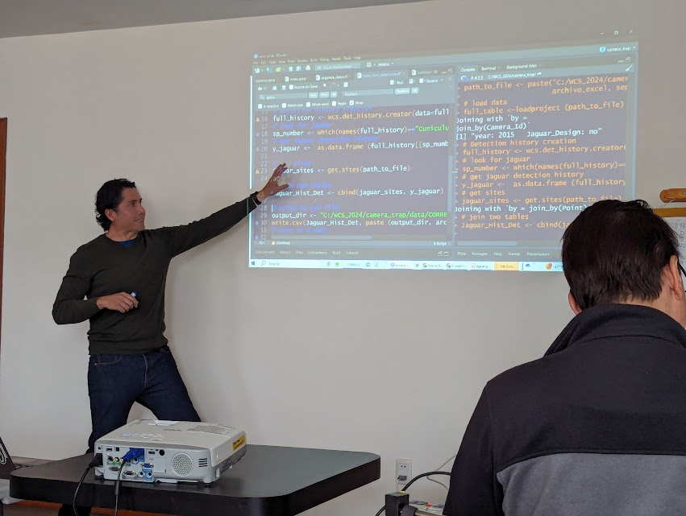

Hi, my name is Diego Lizcano. As a *wildlife ecologist*, the [R statistical computing language](https://www.r-project.org/) is an important part of my daily workflow. I mainly use R for data analysis, modelling, data manipulation and reporting.

## Current research

I am currently working as a data annalist for [WCS Andes-Amazon-Orinoco Region](http://www.wcs.org)

**Some research I am currently working on:**

- Jaguar detection and occupancy modeling

- WCS Strongholds analysis

**I am always looking for new collaborations.** Do not hesitate to contact me!

## Scientific interests (no specific order)

- Mammal ecology

- Camera trap data analysis

- Acoustics

- Ecological modeling

Back to top
