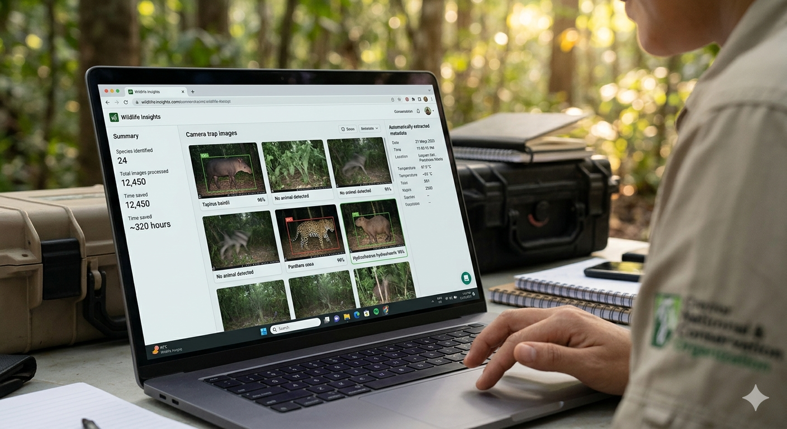
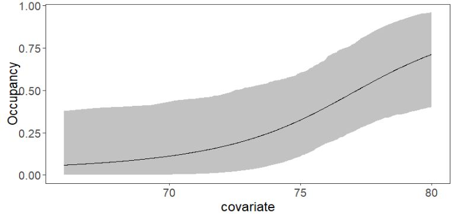
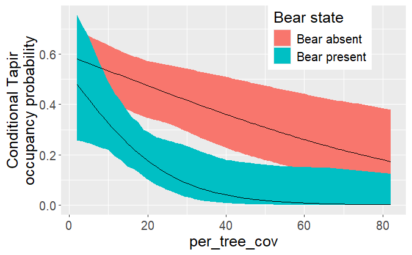
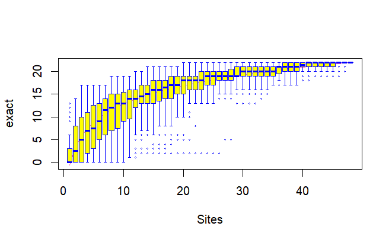
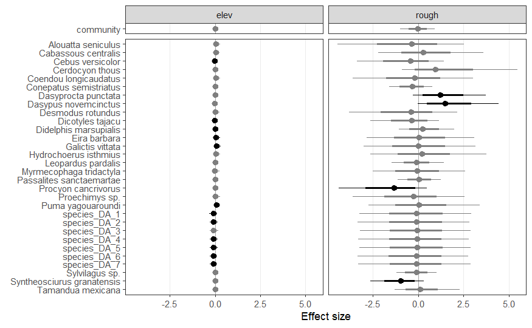

##### Shaping Wildlife Insights Data

My workflow from downloading Wildlife Insights data to extract the detection history of one species

Diego J. Lizcano

Feb 1, 2026

##### Spatial, single-species occupancy model

The package `spOccupancy` accommodate spatial autocorrelation efficiently in a workflow completely in R (no Bayesian programming languages necessary)

Diego J. Lizcano, José F. González-Maya

Jun 1, 2025

##### Esfuerzo de muestreo y RAI en Fototrampeo

Parte del Curso Introducción al Fototrampeo

Diego J. Lizcano, Lain E. Pardo, Angélica Diaz-Pulido

Dec 10, 2024

##### Single Season Occupancy Model

Fits the single season occupancy model of MacKenzie et al (2002) using camera trap data, `unmarked` and `ubms`

Diego J. Lizcano

Jul 27, 2024

##### “Stacked” Models

Suppose you have a dataset of repeated detections/non detections or counts that are collected over several years, but do not want to fit a dynamic model.

Diego J. Lizcano, José F. González-Maya

Jul 17, 2024

##### A multi-species (species interactions) occupancy model

A mountain tapir, puma and andean bear interacting model

Diego J. Lizcano

Jul 7, 2024

##### Species diversity

using packages `vegan` and `iNext` to analyze diversity on camera trap data

Diego J. Lizcano

Jun 25, 2024

##### Riqueza de especies

Uso de los paquetes `vegan` y `iNext` para analizar la diversidad con datos de fototrampeo

Diego J. Lizcano, Camilo Fernández-Rodríguez, Katherine Pérez-Gómez

Jun 25, 2024

##### Multispecies occupancy model

Multispecies occupancy models combines information from multiple species to estimate both individual and community-level responses to environmental variables

Diego J. Lizcano

Jun 23, 2024

##### A calendar to visualize camera trap data

Using several camera trap data campaingns from Galictis Biodiversidad

Diego J. Lizcano

Jun 15, 2024

Back to top
