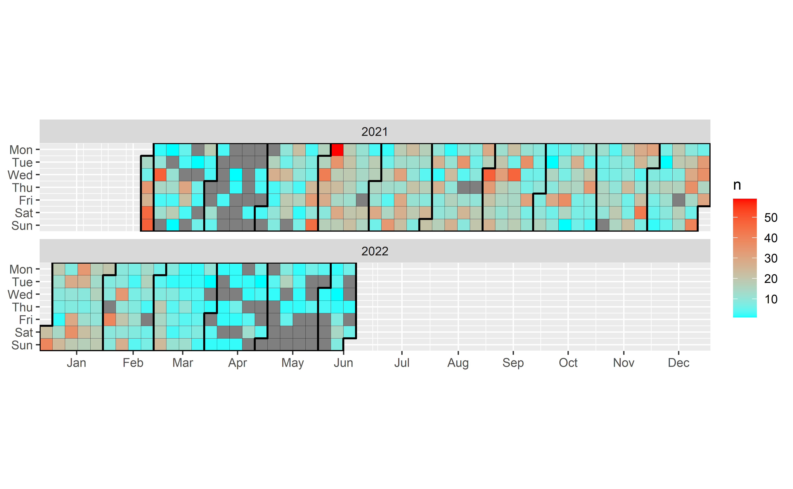
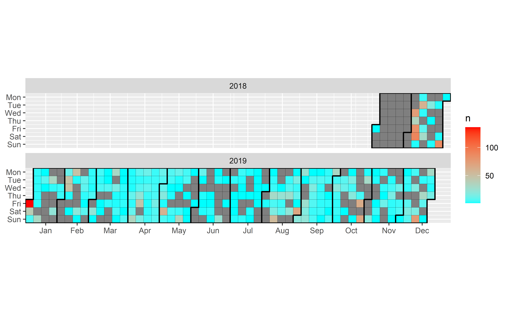
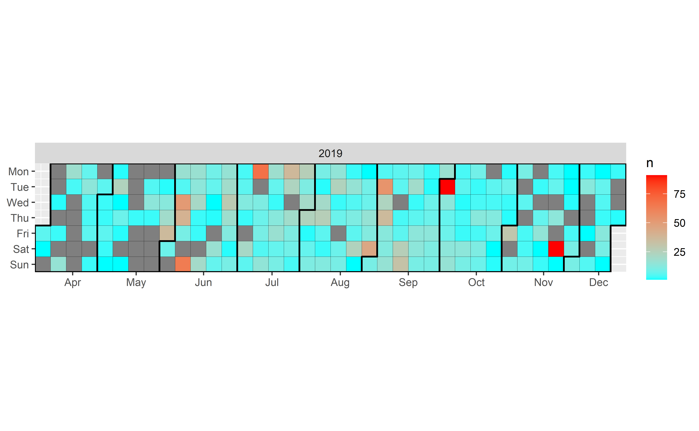
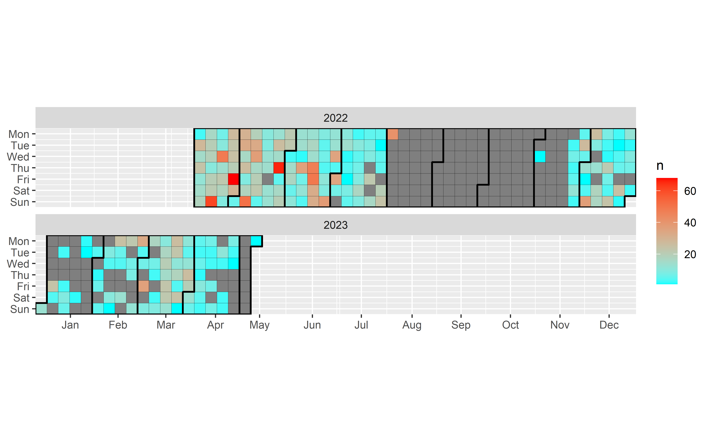
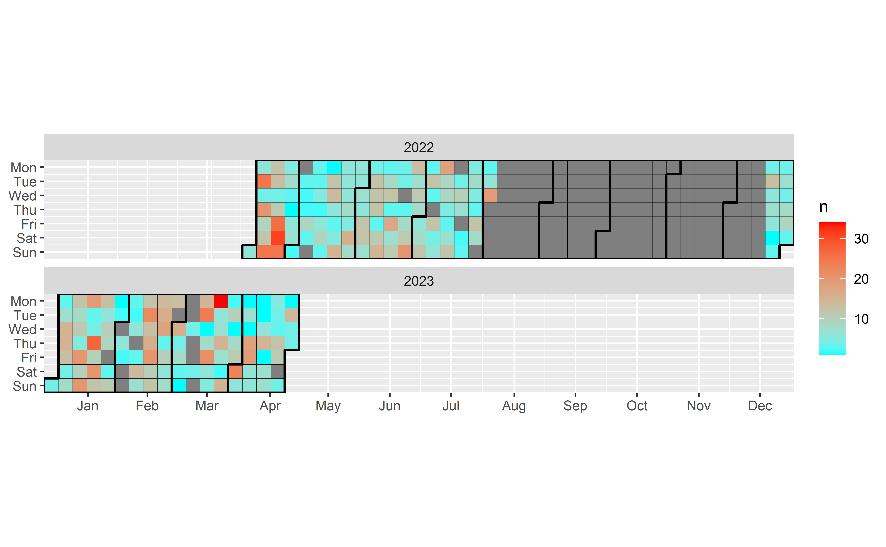
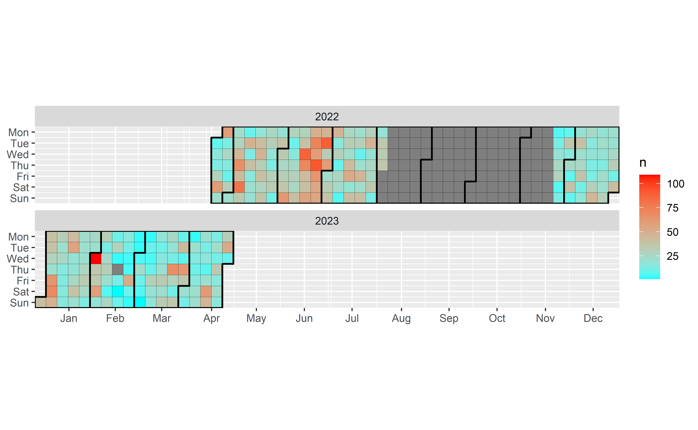
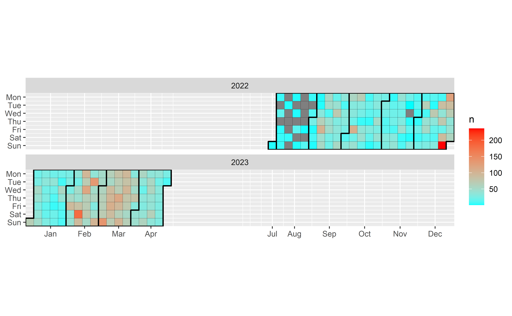
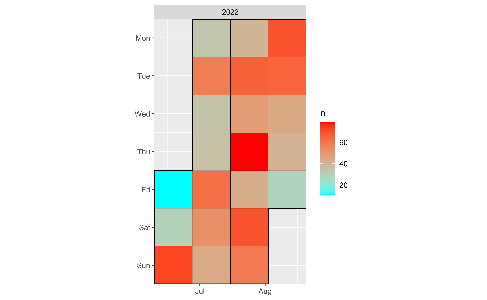
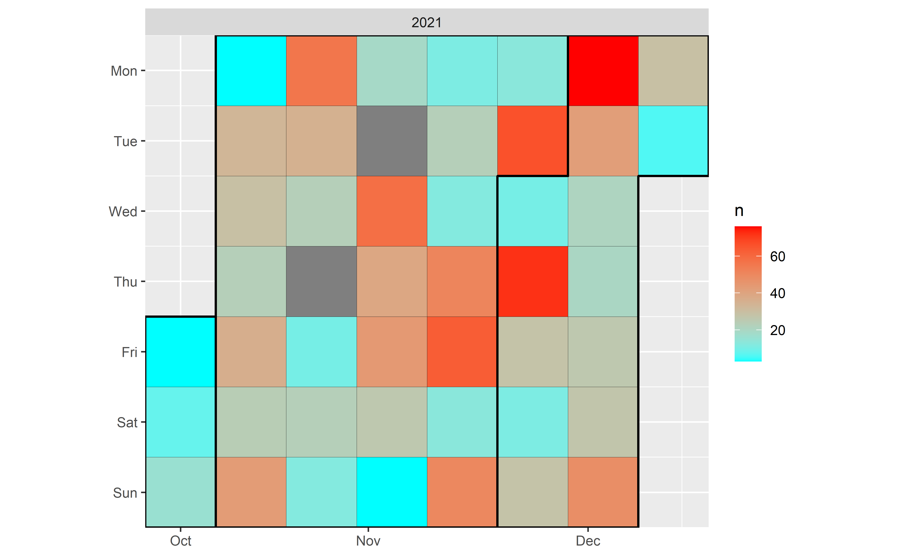
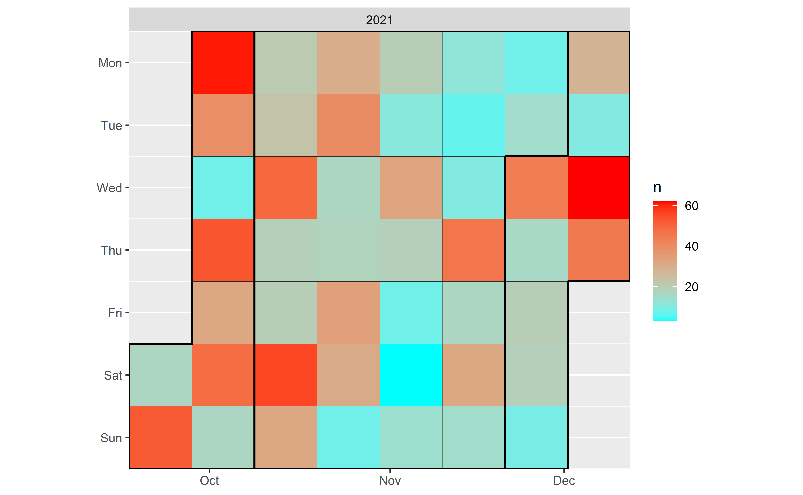

As a simple map and calendar

## Load packages

Code

``` downlit

# library(ggpmthemes)
library(glue) # Interpreted String Literals
library(curl) # A Modern and Flexible Web Client for R
library(patchwork) # The Composer of Plots
library(readxl) # Read Excel Files
library(sf) # Simple Features for R
library(mapview) # Interactive Viewing of Spatial Data in R
library(ggTimeSeries) # calendar
library(grateful) # Facilitate Citation of R Packages

library(knitr) # A General-Purpose Package for Dynamic Report Generation in R
# options(kableExtra.auto_format = FALSE)
library(kableExtra) # Construct Complex Table with 'kable' and Pipe Syntax
library(tidyverse) # Easily Install and Load the 'Tidyverse'
library(ggforce) # Accelerating 'ggplot2'

source("C:/CodigoR/CameraTrapCesar/R/organiza_datos.R")
```

## Load data

Code

``` downlit

datos <- read_excel("C:/CodigoR/CameraTrapCesar/data/CT_Cesar.xlsx")
```

## Convert to sf

Code

``` downlit

datos_distinct <- datos |> distinct(Longitude, Latitude, CT, Proyecto)

projlatlon <- "+proj=longlat +datum=WGS84 +no_defs +ellps=WGS84 +towgs84=0,0,0"

datos_sf <-  st_as_sf(x = datos_distinct,
                         coords = c("Longitude", 
                                    "Latitude"),
                         crs = projlatlon)
```

## Plot all

Code

``` downlit
mapview(datos_sf, zcol="Proyecto")
```

Code

``` downlit


calendario <- function(data=datos, Proyect=Proyecto){
  dtData<- datos |> filter(Proyecto==Proyect) |> #|> filter(Year=="2022")
  # becerril$Date_Time <- as_date(as.character(data$eventDate))
      mutate(Date_Time=as.Date(eventDate, "%d/%m/%Y")) |> 
      count(Date_Time) |> na.omit()
  
  # base plot
  p1 = ggplot_calendar_heatmap(
     dtData,
     'Date_Time',
     'n',
     dayBorderSize = 0.1,
     monthBorderSize = 0.7
  )
  
  # adding some formatting
  p1 +
     xlab(NULL) +
     ylab(NULL) +
     scale_fill_continuous(low = 'cyan', high = 'red') +
     facet_wrap(~Year, ncol = 1) # number of columns
} # end function
```

## See camera calendar per Proyecto

### Becerril

Code

``` downlit

calendario(data=datos, Proyect = "Becerril")
```

[](index_files/figure-html/unnamed-chunk-5-1.png)

Code

``` downlit

# species <- f.det_history.creator(data=becerril_2022)
# 
# 
# min(dmy(becerril_2022$Start))
# max(dmy(becerril_2022$Start))
# 
# min(dmy(becerril_2022$eventDate))
```

Las camaras en Becerril estuvieron activas año y medio.

### LaPaz_Manaure

Code

``` downlit

calendario(data=datos, Proyect = "LaPaz_Manaure")
```

[](index_files/figure-html/unnamed-chunk-6-1.png)

### PCF

Code

``` downlit
calendario(data=datos, Proyect = "PCF")
```

[](index_files/figure-html/unnamed-chunk-7-1.png)

### CL

Code

``` downlit
calendario(data=datos, Proyect = "CL")
```

[](index_files/figure-html/unnamed-chunk-8-1.png)

### EDN

Code

``` downlit
calendario(data=datos, Proyect = "EDN")
```

[](index_files/figure-html/unnamed-chunk-9-1.png)

### PB

Code

``` downlit
calendario(data=datos, Proyect = "PB" )
```

[](index_files/figure-html/unnamed-chunk-10-1.png)

### EDS

Code

``` downlit
calendario(data=datos, Proyect = "EDS" )
```

[](index_files/figure-html/unnamed-chunk-11-1.png)

### CCI

Code

``` downlit
calendario(data=datos, Proyect = "CCI" )
```

[](index_files/figure-html/unnamed-chunk-12-1.png)

### MLJ

Code

``` downlit
calendario(data=datos, Proyect = "MLJ" )
```

[](index_files/figure-html/unnamed-chunk-13-1.png)

### MCAL

Code

``` downlit
calendario(data=datos, Proyect = "MCAL" )
```

[](index_files/figure-html/unnamed-chunk-14-1.png)

## Package Citation

Code

``` downlit
pkgs <- cite_packages(output = "paragraph", out.dir = ".") #knitr::kable(pkgs)
pkgs
```

We used R version 4.3.2 ([R Core Team 2023](#ref-base)) and the following R packages: curl v. 5.2.0 ([Ooms 2023](#ref-curl)), devtools v. 2.4.5 ([Wickham et al. 2022](#ref-devtools)), ggforce v. 0.4.2 ([Pedersen 2024a](#ref-ggforce)), ggTimeSeries v. 1.0.2 ([Kothari 2022](#ref-ggTimeSeries)), glue v. 1.7.0 ([Hester and Bryan 2024](#ref-glue)), kableExtra v. 1.4.0 ([Zhu 2024](#ref-kableExtra)), knitr v. 1.46 ([Xie 2014](#ref-knitr2014), [2015](#ref-knitr2015), [2024](#ref-knitr2024)), mapview v. 2.11.2 ([Appelhans et al. 2023](#ref-mapview)), patchwork v. 1.2.0 ([Pedersen 2024b](#ref-patchwork)), quarto v. 1.4 ([Allaire and Dervieux 2024](#ref-quarto)), rmarkdown v. 2.27 ([Xie et al. 2018](#ref-rmarkdown2018), [2020](#ref-rmarkdown2020); [Allaire et al. 2024](#ref-rmarkdown2024)), sf v. 1.0.15 ([Pebesma 2018](#ref-sf2018); [Pebesma and Bivand 2023](#ref-sf2023)), styler v. 1.10.3 ([Müller and Walthert 2024](#ref-styler)), tidyverse v. 2.0.0 ([Wickham et al. 2019](#ref-tidyverse)).

## Sesion info

Session info

    #> ─ Session info ─────────────────────────────────────────────────────────────────────────────────────────────────────────────────────────────────────
    #>  setting  value
    #>  version  R version 4.3.2 (2023-10-31 ucrt)
    #>  os       Windows 10 x64 (build 19042)
    #>  system   x86_64, mingw32
    #>  ui       RTerm
    #>  language (EN)
    #>  collate  Spanish_Colombia.utf8
    #>  ctype    Spanish_Colombia.utf8
    #>  tz       America/Bogota
    #>  date     2024-06-23
    #>  pandoc   3.1.11 @ C:/Program Files/RStudio/resources/app/bin/quarto/bin/tools/ (via rmarkdown)
    #> 
    #> ─ Packages ─────────────────────────────────────────────────────────────────────────────────────────────────────────────────────────────────────────
    #>  package           * version date (UTC) lib source
    #>  base64enc           0.1-3   2015-07-28 [1] CRAN (R 4.3.1)
    #>  brew                1.0-10  2023-12-16 [1] CRAN (R 4.3.2)
    #>  cachem              1.0.8   2023-05-01 [1] CRAN (R 4.3.2)
    #>  cellranger          1.1.0   2016-07-27 [1] CRAN (R 4.3.2)
    #>  class               7.3-22  2023-05-03 [2] CRAN (R 4.3.2)
    #>  classInt            0.4-10  2023-09-05 [1] CRAN (R 4.3.2)
    #>  cli                 3.6.2   2023-12-11 [1] CRAN (R 4.3.2)
    #>  codetools           0.2-19  2023-02-01 [2] CRAN (R 4.3.2)
    #>  colorspace          2.1-0   2023-01-23 [1] CRAN (R 4.3.2)
    #>  crosstalk           1.2.1   2023-11-23 [1] CRAN (R 4.3.2)
    #>  curl              * 5.2.0   2023-12-08 [1] CRAN (R 4.3.2)
    #>  data.table          1.15.0  2024-01-30 [1] CRAN (R 4.3.2)
    #>  DBI                 1.2.2   2024-02-16 [1] CRAN (R 4.3.2)
    #>  devtools            2.4.5   2022-10-11 [1] CRAN (R 4.3.2)
    #>  digest              0.6.34  2024-01-11 [1] CRAN (R 4.3.2)
    #>  dplyr             * 1.1.4   2023-11-17 [1] CRAN (R 4.3.2)
    #>  e1071               1.7-14  2023-12-06 [1] CRAN (R 4.3.2)
    #>  ellipsis            0.3.2   2021-04-29 [1] CRAN (R 4.3.2)
    #>  evaluate            0.23    2023-11-01 [1] CRAN (R 4.3.2)
    #>  fansi               1.0.6   2023-12-08 [1] CRAN (R 4.3.2)
    #>  farver              2.1.1   2022-07-06 [1] CRAN (R 4.3.2)
    #>  fastmap             1.1.1   2023-02-24 [1] CRAN (R 4.3.2)
    #>  forcats           * 1.0.0   2023-01-29 [1] CRAN (R 4.3.2)
    #>  fs                  1.6.3   2023-07-20 [1] CRAN (R 4.3.2)
    #>  generics            0.1.3   2022-07-05 [1] CRAN (R 4.3.2)
    #>  ggforce           * 0.4.2   2024-02-19 [1] CRAN (R 4.3.3)
    #>  ggplot2           * 3.5.1   2024-04-23 [1] CRAN (R 4.3.3)
    #>  ggTimeSeries      * 1.0.2   2022-01-23 [1] CRAN (R 4.3.3)
    #>  glue              * 1.7.0   2024-01-09 [1] CRAN (R 4.3.2)
    #>  grateful          * 0.2.4   2023-10-22 [1] CRAN (R 4.3.3)
    #>  gtable              0.3.4   2023-08-21 [1] CRAN (R 4.3.2)
    #>  hms                 1.1.3   2023-03-21 [1] CRAN (R 4.3.2)
    #>  htmltools           0.5.7   2023-11-03 [1] CRAN (R 4.3.2)
    #>  htmlwidgets         1.6.4   2023-12-06 [1] CRAN (R 4.3.2)
    #>  httpuv              1.6.14  2024-01-26 [1] CRAN (R 4.3.2)
    #>  jquerylib           0.1.4   2021-04-26 [1] CRAN (R 4.3.2)
    #>  jsonlite            1.8.8   2023-12-04 [1] CRAN (R 4.3.2)
    #>  kableExtra        * 1.4.0   2024-01-24 [1] CRAN (R 4.3.3)
    #>  KernSmooth          2.23-22 2023-07-10 [2] CRAN (R 4.3.2)
    #>  knitr             * 1.46    2024-04-06 [1] CRAN (R 4.3.3)
    #>  labeling            0.4.3   2023-08-29 [1] CRAN (R 4.3.1)
    #>  later               1.3.2   2023-12-06 [1] CRAN (R 4.3.2)
    #>  lattice             0.22-5  2023-10-24 [1] CRAN (R 4.3.2)
    #>  leafem              0.2.3   2023-09-17 [1] CRAN (R 4.3.2)
    #>  leaflet             2.2.1   2023-11-13 [1] CRAN (R 4.3.2)
    #>  leaflet.providers   2.0.0   2023-10-17 [1] CRAN (R 4.3.2)
    #>  leafpop             0.1.0   2021-05-22 [1] CRAN (R 4.3.2)
    #>  lifecycle           1.0.4   2023-11-07 [1] CRAN (R 4.3.2)
    #>  lubridate         * 1.9.3   2023-09-27 [1] CRAN (R 4.3.2)
    #>  magrittr            2.0.3   2022-03-30 [1] CRAN (R 4.3.2)
    #>  mapview           * 2.11.2  2023-10-13 [1] CRAN (R 4.3.2)
    #>  MASS                7.3-60  2023-05-04 [2] CRAN (R 4.3.2)
    #>  memoise             2.0.1   2021-11-26 [1] CRAN (R 4.3.2)
    #>  mime                0.12    2021-09-28 [1] CRAN (R 4.3.1)
    #>  miniUI              0.1.1.1 2018-05-18 [1] CRAN (R 4.3.2)
    #>  munsell             0.5.0   2018-06-12 [1] CRAN (R 4.3.2)
    #>  patchwork         * 1.2.0   2024-01-08 [1] CRAN (R 4.3.3)
    #>  pillar              1.9.0   2023-03-22 [1] CRAN (R 4.3.2)
    #>  pkgbuild            1.4.4   2024-03-17 [1] CRAN (R 4.3.3)
    #>  pkgconfig           2.0.3   2019-09-22 [1] CRAN (R 4.3.2)
    #>  pkgload             1.3.4   2024-01-16 [1] CRAN (R 4.3.2)
    #>  png                 0.1-8   2022-11-29 [1] CRAN (R 4.3.1)
    #>  polyclip            1.10-6  2023-09-27 [1] CRAN (R 4.3.1)
    #>  processx            3.8.3   2023-12-10 [1] CRAN (R 4.3.2)
    #>  profvis             0.3.8   2023-05-02 [1] CRAN (R 4.3.2)
    #>  promises            1.2.1   2023-08-10 [1] CRAN (R 4.3.2)
    #>  proxy               0.4-27  2022-06-09 [1] CRAN (R 4.3.2)
    #>  ps                  1.7.6   2024-01-18 [1] CRAN (R 4.3.2)
    #>  purrr             * 1.0.2   2023-08-10 [1] CRAN (R 4.3.2)
    #>  quarto            * 1.4     2024-03-06 [1] CRAN (R 4.3.3)
    #>  R.cache             0.16.0  2022-07-21 [1] CRAN (R 4.3.3)
    #>  R.methodsS3         1.8.2   2022-06-13 [1] CRAN (R 4.3.3)
    #>  R.oo                1.26.0  2024-01-24 [1] CRAN (R 4.3.3)
    #>  R.utils             2.12.3  2023-11-18 [1] CRAN (R 4.3.3)
    #>  R6                  2.5.1   2021-08-19 [1] CRAN (R 4.3.2)
    #>  raster              3.6-26  2023-10-14 [1] CRAN (R 4.3.2)
    #>  Rcpp                1.0.12  2024-01-09 [1] CRAN (R 4.3.2)
    #>  readr             * 2.1.5   2024-01-10 [1] CRAN (R 4.3.2)
    #>  readxl            * 1.4.3   2023-07-06 [1] CRAN (R 4.3.2)
    #>  remotes             2.5.0   2024-03-17 [1] CRAN (R 4.3.3)
    #>  renv                1.0.3   2023-09-19 [1] CRAN (R 4.3.2)
    #>  rlang               1.1.3   2024-01-10 [1] CRAN (R 4.3.2)
    #>  rmarkdown           2.27    2024-05-17 [1] CRAN (R 4.3.3)
    #>  rstudioapi          0.16.0  2024-03-24 [1] CRAN (R 4.3.3)
    #>  satellite           1.0.5   2024-02-10 [1] CRAN (R 4.3.2)
    #>  scales              1.3.0   2023-11-28 [1] CRAN (R 4.3.3)
    #>  sessioninfo         1.2.2   2021-12-06 [1] CRAN (R 4.3.2)
    #>  sf                * 1.0-15  2023-12-18 [1] CRAN (R 4.3.2)
    #>  shiny               1.8.0   2023-11-17 [1] CRAN (R 4.3.2)
    #>  sp                  2.1-3   2024-01-30 [1] CRAN (R 4.3.2)
    #>  stringi             1.8.3   2023-12-11 [1] CRAN (R 4.3.2)
    #>  stringr           * 1.5.1   2023-11-14 [1] CRAN (R 4.3.2)
    #>  styler            * 1.10.3  2024-04-07 [1] CRAN (R 4.3.3)
    #>  svglite             2.1.3   2023-12-08 [1] CRAN (R 4.3.2)
    #>  systemfonts         1.0.5   2023-10-09 [1] CRAN (R 4.3.2)
    #>  terra               1.7-71  2024-01-31 [1] CRAN (R 4.3.2)
    #>  tibble            * 3.2.1   2023-03-20 [1] CRAN (R 4.3.2)
    #>  tidyr             * 1.3.1   2024-01-24 [1] CRAN (R 4.3.2)
    #>  tidyselect          1.2.1   2024-03-11 [1] CRAN (R 4.3.3)
    #>  tidyverse         * 2.0.0   2023-02-22 [1] CRAN (R 4.3.2)
    #>  timechange          0.3.0   2024-01-18 [1] CRAN (R 4.3.2)
    #>  tweenr              2.0.3   2024-02-26 [1] CRAN (R 4.3.3)
    #>  tzdb                0.4.0   2023-05-12 [1] CRAN (R 4.3.2)
    #>  units               0.8-5   2023-11-28 [1] CRAN (R 4.3.2)
    #>  urlchecker          1.0.1   2021-11-30 [1] CRAN (R 4.3.2)
    #>  usethis             2.2.3   2024-02-19 [1] CRAN (R 4.3.2)
    #>  utf8                1.2.4   2023-10-22 [1] CRAN (R 4.3.2)
    #>  uuid                1.2-0   2024-01-14 [1] CRAN (R 4.3.2)
    #>  vctrs               0.6.5   2023-12-01 [1] CRAN (R 4.3.2)
    #>  viridisLite         0.4.2   2023-05-02 [1] CRAN (R 4.3.2)
    #>  withr               3.0.0   2024-01-16 [1] CRAN (R 4.3.2)
    #>  xfun                0.44    2024-05-15 [1] CRAN (R 4.3.3)
    #>  xml2                1.3.6   2023-12-04 [1] CRAN (R 4.3.2)
    #>  xtable              1.8-4   2019-04-21 [1] CRAN (R 4.3.2)
    #>  yaml                2.3.8   2023-12-11 [1] CRAN (R 4.3.2)
    #> 
    #>  [1] C:/Users/usuario/AppData/Local/R/win-library/4.3
    #>  [2] C:/Program Files/R/R-4.3.2/library
    #> 
    #> ────────────────────────────────────────────────────────────────────────────────────────────────────────────────────────────────────────────────────

Back to top

## References

Allaire, JJ, and Christophe Dervieux. 2024. *quarto: R Interface to “Quarto” Markdown Publishing System*. <https://CRAN.R-project.org/package=quarto>.

Allaire, JJ, Yihui Xie, Christophe Dervieux, et al. 2024. *rmarkdown: Dynamic Documents for r*. <https://github.com/rstudio/rmarkdown>.

Appelhans, Tim, Florian Detsch, Christoph Reudenbach, and Stefan Woellauer. 2023. *mapview: Interactive Viewing of Spatial Data in r*. <https://CRAN.R-project.org/package=mapview>.

Hester, Jim, and Jennifer Bryan. 2024. *glue: Interpreted String Literals*. <https://CRAN.R-project.org/package=glue>.

Kothari, Aditya. 2022. *ggTimeSeries: Time Series Visualisations Using the Grammar of Graphics*. <https://CRAN.R-project.org/package=ggTimeSeries>.

Müller, Kirill, and Lorenz Walthert. 2024. *styler: Non-Invasive Pretty Printing of r Code*. <https://CRAN.R-project.org/package=styler>.

Ooms, Jeroen. 2023. *curl: A Modern and Flexible Web Client for r*. <https://CRAN.R-project.org/package=curl>.

Pebesma, Edzer. 2018. “Simple Features for R: Standardized Support for Spatial Vector Data.” *The R Journal* 10 (1): 439–46. <https://doi.org/10.32614/RJ-2018-009>.

Pebesma, Edzer, and Roger Bivand. 2023. *Spatial Data Science: With applications in R*. Chapman and Hall/CRC. <https://doi.org/10.1201/9780429459016>.

Pedersen, Thomas Lin. 2024a. *ggforce: Accelerating “ggplot2”*. <https://CRAN.R-project.org/package=ggforce>.

Pedersen, Thomas Lin. 2024b. *patchwork: The Composer of Plots*. <https://CRAN.R-project.org/package=patchwork>.

R Core Team. 2023. *R: A Language and Environment for Statistical Computing*. R Foundation for Statistical Computing. <https://www.R-project.org/>.

Wickham, Hadley, Mara Averick, Jennifer Bryan, et al. 2019. “Welcome to the tidyverse.” *Journal of Open Source Software* 4 (43): 1686. <https://doi.org/10.21105/joss.01686>.

Wickham, Hadley, Jim Hester, Winston Chang, and Jennifer Bryan. 2022. *devtools: Tools to Make Developing r Packages Easier*. <https://CRAN.R-project.org/package=devtools>.

Xie, Yihui. 2014. “knitr: A Comprehensive Tool for Reproducible Research in R.” In *Implementing Reproducible Computational Research*, edited by Victoria Stodden, Friedrich Leisch, and Roger D. Peng. Chapman; Hall/CRC.

Xie, Yihui. 2015. *Dynamic Documents with R and Knitr*. 2nd ed. Chapman; Hall/CRC. <https://yihui.org/knitr/>.

Xie, Yihui. 2024. *knitr: A General-Purpose Package for Dynamic Report Generation in r*. <https://yihui.org/knitr/>.

Xie, Yihui, J. J. Allaire, and Garrett Grolemund. 2018. *R Markdown: The Definitive Guide*. Chapman; Hall/CRC. <https://bookdown.org/yihui/rmarkdown>.

Xie, Yihui, Christophe Dervieux, and Emily Riederer. 2020. *R Markdown Cookbook*. Chapman; Hall/CRC. <https://bookdown.org/yihui/rmarkdown-cookbook>.

Zhu, Hao. 2024. *kableExtra: Construct Complex Table with “kable” and Pipe Syntax*. <https://CRAN.R-project.org/package=kableExtra>.

## Citation

BibTeX citation:

``` quarto-appendix-bibtex
@online{j._lizcano2024,
  author = {J. Lizcano, Diego},
  title = {A Calendar to Visualize Camera Trap Data},
  date = {2024-06-15},
  url = {https://dlizcano.github.io/cameratrap/posts/2024-06-15-visualizing-the-data/},
  langid = {en}
}
```

For attribution, please cite this work as:

J. Lizcano, Diego. 2024. “A Calendar to Visualize Camera Trap Data.” June 15. <https://dlizcano.github.io/cameratrap/posts/2024-06-15-visualizing-the-data/>.
