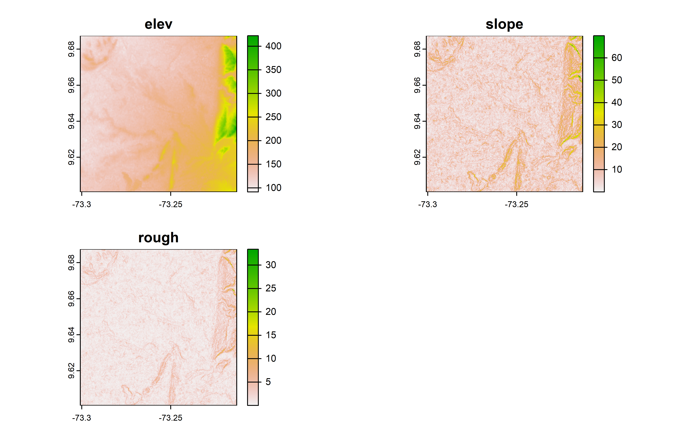
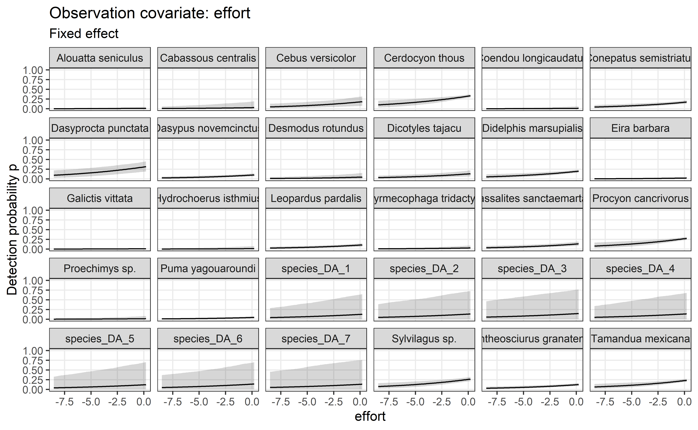
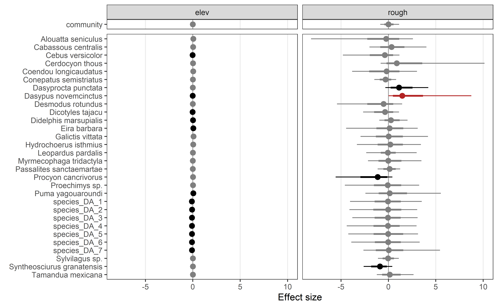
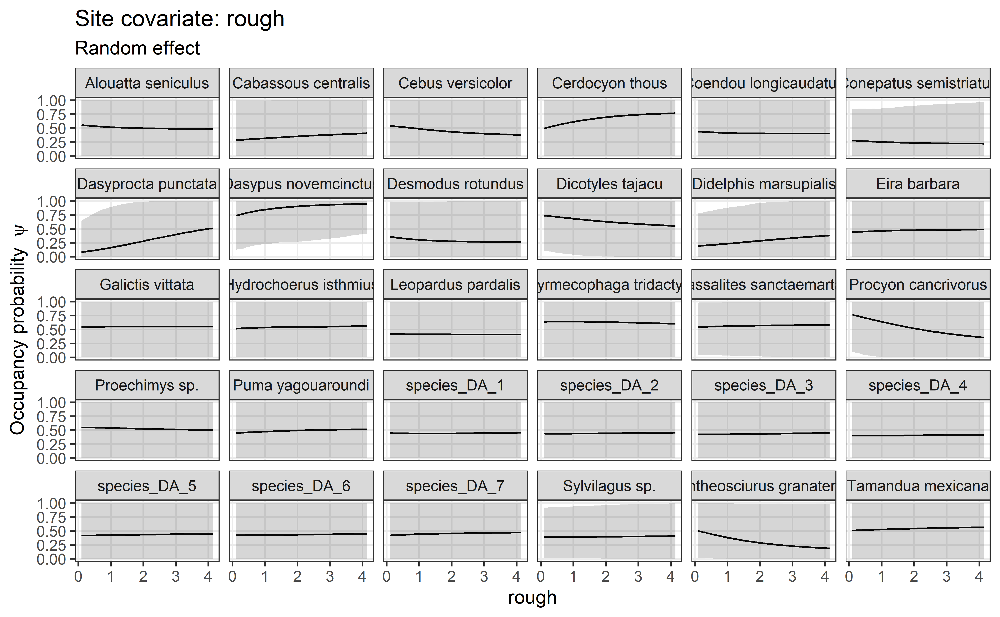
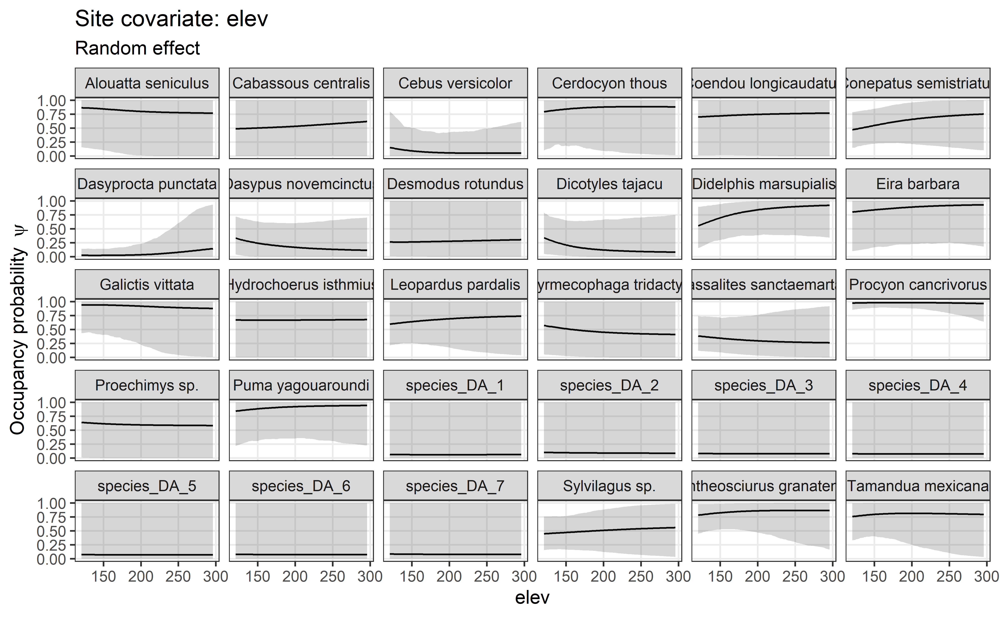
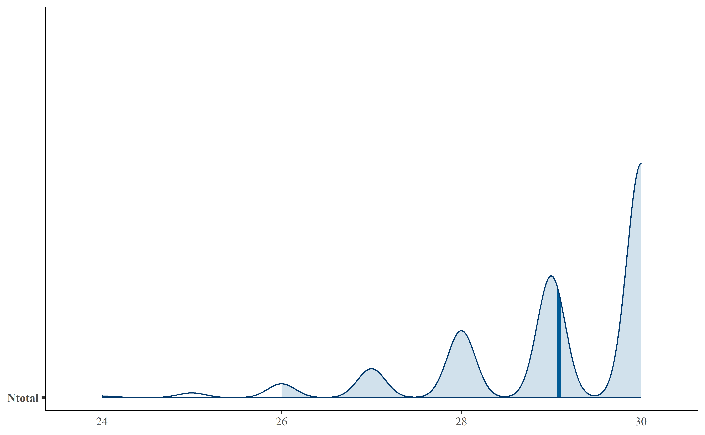
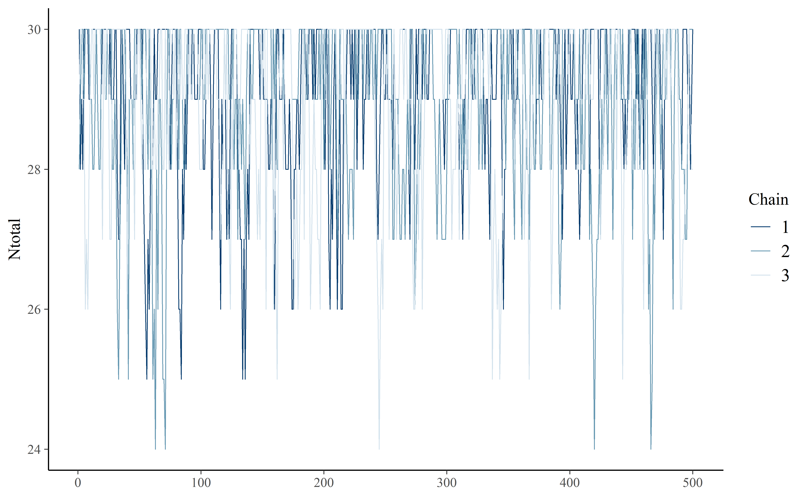
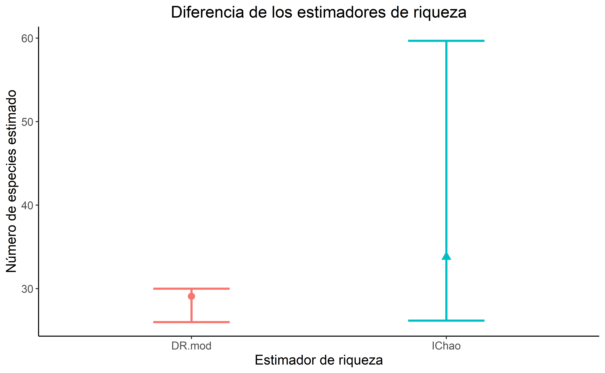
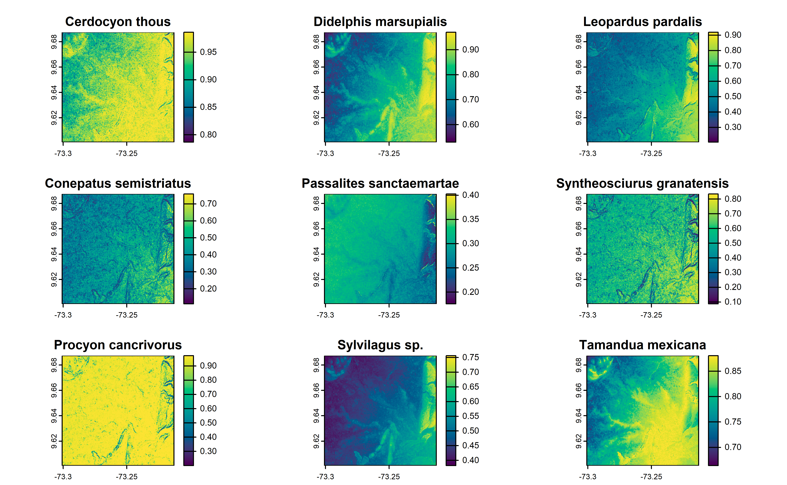
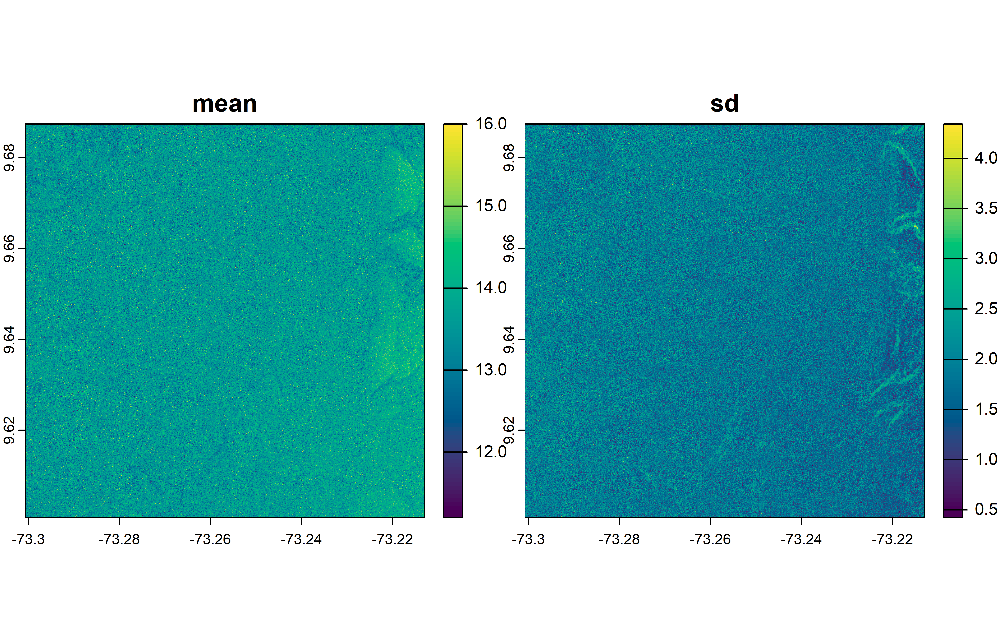

## Using CamtrapR

CamtrapR is making very easy to make Multispecies occupancy models from camera trap data. Here one example.

## Load packages

First we load some packages

Code

``` downlit

library(grateful) # Facilitate Citation of R Packages
library(patchwork) # The Composer of Plots
library(readxl) # Read Excel Files
library(sf) # Simple Features for R
library(mapview) # Interactive Viewing of Spatial Data in R
library(terra) # Spatial Data Analysis
library(elevatr) # Access Elevation Data from Various APIs

library(camtrapR) # Camera Trap Data Management and Preparation of Occupancy and Spatial Capture-Recapture Analyses 
library(rjags) # Bayesian Graphical Models using MCMC 
library(nimble) # MCMC, Particle Filtering, and Programmable Hierarchical Modeling 

library(bayesplot) # Plotting for Bayesian Models # Plotting for Bayesian Models 
library(SpadeR) # Species-Richness Prediction and Diversity Estimation with R 
library(tictoc) # Functions for Timing R Scripts, as Well as Implementations of "Stack" and "StackList" Structures 
library(beepr) # Easily Play Notification Sounds on any Platform 
library(snowfall) # Easier Cluster Computing (Based on 'snow')
library(bayesplot) # Plotting for Bayesian Models # Plotting for Bayesian Models 

library(kableExtra) # Construct Complex Table with 'kable' and Pipe Syntax
library(tidyverse) # Easily Install and Load the 'Tidyverse'
```

## Load data

The data set is i a excel file so we use read_excel function to load it.

Code

``` downlit

datos <- read_excel("C:/CodigoR/CameraTrapCesar/data/CT_Cesar.xlsx")
```

## Selecting Just CT_Becerril 2021

To this example I selected just one place one year, Becerril 2021. Sometimes we need to make unique codes per camera and cameraOperation table.

Code

``` downlit
# make a new column Station
# datos_PCF <- datos |> dplyr::filter(Proyecto=="CT_LaPaz_Manaure") |> unite ("Station", ProyectoEtapa:Salida:CT, sep = "-")

# fix dates
datos$Start <- as.Date(datos$Start, "%d/%m/%Y")
datos$End <- as.Date(datos$End, "%d/%m/%Y")
datos$eventDate <- as.Date(datos$eventDate, "%d/%m/%Y")
datos$eventDateTime <- ymd_hms(paste(datos$eventDate, " ",
                              datos$eventTime, ":00", sep=""))

# filter Becerril
datos_PCF <- datos |> dplyr::filter(ProyectoEtapa=="CT_Becerril") |> mutate (Station=IdGeo)

# filter 2021 and make uniques
CToperation  <- datos_PCF |> filter(Year==2021) |> group_by(Station) |> 
                           mutate(minStart=min(Start), maxEnd=max(End)) |> distinct(Longitude, Latitude, minStart, maxEnd, Year) |> ungroup()
```

## Generating cameraOperation and making detection histories for all the species.

The package CamtrapR has the function ‘cameraOperation’ which makes a table of cameras (stations) and dates (setup, puck-up), this table is key to generate the detection histories using the function ‘detectionHistory’ in the next step.

Code

``` downlit
# Generamos la matríz de operación de las cámaras

camop <- cameraOperation(CTtable= CToperation, # Tabla de operación
                         stationCol= "Station", # Columna que define la estación
                         setupCol= "minStart", #Columna fecha de colocación
                         retrievalCol= "maxEnd", #Columna fecha de retiro
                         #hasProblems= T, # Hubo fallos de cámaras
                         dateFormat= "%Y-%m-%d") #, # Formato de las fechas
                         #cameraCol="CT")
                         # sessionCol= "Year")

# Generar las historias de detección ---------------------------------------
## remove plroblem species
ind <- which(datos_PCF$Species=="Marmosa sp.")
datos_PCF <- datos_PCF[-ind,]

DetHist_list <- lapply(unique(datos_PCF$Species), FUN = function(x) {
  detectionHistory(
    recordTable         = datos_PCF, # Tabla de registros
    camOp                = camop, # Matriz de operación de cámaras
    stationCol           = "Station",
    speciesCol           = "Species",
    recordDateTimeCol    = "eventDateTime",
    recordDateTimeFormat  = "%Y-%m-%d",
    species              = x,     # la función reemplaza x por cada una de las especies
    occasionLength       = 10, # Colapso de las historias a 10 ías
    day1                 = "station", #inicie en la fecha de cada survey
    datesAsOccasionNames = FALSE,
    includeEffort        = TRUE,
    scaleEffort          = TRUE,
    #unmarkedMultFrameInput=TRUE
    timeZone             = "America/Bogota" 
    )
  }
)

# names
names(DetHist_list) <- unique(datos_PCF$Species)

# Finalmente creamos una lista nueva donde estén solo las historias de detección
ylist <- lapply(DetHist_list, FUN = function(x) x$detection_history)
```

## Preparing spatial covariates

### make sf object, get elevation and derive terrain (slope and roughness).

We use the lat and long to make a sf object with the camera locations.

Code

``` downlit

# make sf object
projlatlon <- "+proj=longlat +datum=WGS84 +no_defs +ellps=WGS84 +towgs84=0,0,0"

datos_PCF_sf <-  st_as_sf(x = CToperation,
                         coords = c("Longitude", 
                                    "Latitude"),
                         crs = projlatlon)

# covariates
elev <- rast(get_elev_raster(datos_PCF_sf, z=14)) # get raster map
slope <- terrain(elev, v="slope", neighbors=8, unit="degrees")  
# also slope, aspect, TPI, TRI, TRIriley, TRIrmsd, roughness, flowdir 
rough <- terrain(elev, v="roughness", neighbors=8, unit="degrees")  
# landcover <- rast("C:/CodigoR/WCS-CameraTrap/raster/latlon/LandCover_Type_Yearly_500m_v61/LC1/MCD12Q1_LC1_2021_001.tif") 

cos_rast <- c(elev,slope, rough) # make a stack
# rename stack
names(cos_rast) <- c("elev", "slope", "rough")

plot(cos_rast)
```

[](index_files/figure-html/unnamed-chunk-5-1.png)

Code

``` downlit

mapview(elev) + mapview(datos_PCF_sf)
```

### Extract values from the rasters

We use the camera locations to extract the raster (elevations, slope and roughness) information.

Code

``` downlit


# extract
covs <- terra::extract(cos_rast, datos_PCF_sf)
# landcov <- terra::extract(landcover, datos_PCF_sf)
```

## Multispecies occupancy model

### Preparing the model

Now we have all ready to make our model. We put the data of the species, and the covariates in a list.

Code

``` downlit

# check consistancy equal mumner of spatial covariates and rows in data
# identical(nrow(ylist[[1]]), nrow(covars)) 

# Base de datos para los análisis -----------------------------------------

data_list <- list(ylist    = ylist, # Historias de detección
                  siteCovs = covs[,2:4], #covars, # Covariables de sitio
                  obsCovs  = list(effort = DetHist_list[[1]]$effort))  # agregamos el esfuerzo de muestreo como covariable de observación

# 3. 1 Modelo multi-especie  -----------------------------------------

# Se creará un txt temporal donde estarán las especificaciones del modelo en enfoque Bayesiano
modelfile <- (fileext = "modoccu.txt")

# Usaremos la función ` communityModel`
```

### Generating the model

We use the function ‘communityModel’ to setup our model, selecting which covariates is for detection or occupancy and if it is fixed or random effect.

Code

``` downlit


# Generemos el modelo
comu_model <- communityModel(data_list, # la lista de datos
                             occuCovs = list(ranef=c("rough", "elev")), # ranef La covariables de sitio
                             detCovsObservation = list(fixed = "effort"), #Covariables de observación
                             intercepts = list(det = "ranef", occu = "ranef"),
                             augmentation = c(full = 30),# Número aumentado de especies
                             modelFile = "modelfile")

summary(comu_model)
#> commOccu object for community occupancy model (in JAGS)
#> 
#> 30 species,  23 stations,  39 occasions
#> 530 occasions with effort
#> Number of detections (by species): 0 - 164 
#> 
#> Available site covariates:
#>  elev, slope, rough 
#> 
#> Used site covariates:
#>  elev, rough 
#> 
#> Available site-occasion covariates:
#>  effort
```

### Running the model

> Go for a coffe and enjoy while you wait for the signal beep.

Code

``` downlit
# Running the model

fit.commu <- fit(comu_model,
                 n.iter = 1200,
                 n.burnin = 200,
                 thin = 2,
                 chains = 3,
                 cores = 3,
                 quiet = T
);beep(sound = 4)

# save the results to not run again
save(fit.commu, file="C:/CodigoR/CameraTrapCesar/posts/2024-06-20-multispecies-occupancy/result/DR_result.R") # guardamos los resultados para no correr de nuevo
```

### See the results

#### As a table

Code

``` downlit

# Resultados --------------------------------------------------------------

# Extraemos lo tabla de valores estimados
modresult <- as.data.frame(summary(fit.commu)[["statistics"]])
# View(modresult)
DT::datatable(round(summary(fit.commu)$statistics, 3))
```

#### As graphs

Code

``` downlit
# Gráficos de predicción y de coeficientes

# Otra gran ventaja de CamtrapR es que permite gráficar de manera muy sencilla la predicción posterior del modelo. Veamos que pasa con la ocupación de cada especie

plot_effects(comu_model,
              fit.commu,
              submodel = "det")
#> $effort
```

[](index_files/figure-html/unnamed-chunk-12-1.png)

Code

``` downlit

plot_coef(comu_model,
           fit.commu,
           submodel = "state",
           combine = T)
```

[](index_files/figure-html/unnamed-chunk-12-2.png)

Code

``` downlit

plot_effects(comu_model, # El modelo
             fit.commu, # El objeto ajustado
             submodel = "state",
             response = "occupancy") # el parámetro de interés
#> $rough
```

[](index_files/figure-html/unnamed-chunk-12-3.png)

    #> 
    #> $elev

[](index_files/figure-html/unnamed-chunk-12-4.png)

Code

``` downlit

# Ahora con los coeficientes estimados

# plot_coef(comu_model,
#           fit.commu,
#           submodel = "state")
```

#### See the species richness

Notice the estimated species richness, Mean, SD, and SE is: 29.0866667, 1.1764686, 0.0303763, 0.0529884

Code

``` downlit

# Valor de Ntotal, es decir del número de especies estimado
(riqueza_est <- modresult["Ntotal",])
#>            Mean       SD   Naive SE Time-series SE
#> Ntotal 29.08667 1.176469 0.03037629     0.05298842

# Veamos el gráfico de la distribución posterior
mcmc_areas(fit.commu, # objeto jags
           pars= "Ntotal", # parámetro de interés
           point_est = "mean",
           prob = 0.95) # intervalos de credibilidad
```

[](index_files/figure-html/unnamed-chunk-13-1.png)

Code

``` downlit


# La estimación no se ve muy bien, hay que verificar los trace plots

mcmc_trace(fit.commu, pars = "Ntotal")
```

[](index_files/figure-html/unnamed-chunk-13-2.png)

Code

``` downlit

# Debería verse como un cesped, muy probablemente necesitamos muchas mas iteraciones para este modelo

gd <- as.data.frame(gelman.diag(fit.commu,  multivariate = FALSE)[[1]])
DT::datatable(gd["Ntotal",])
```

Code

``` downlit

#La prueba de Gelman-Rubin debe ser ~1 para considerar que hay buena convergencia. Aunque tenemos un valor bueno para Ntotal, hay varios valores de omega con NA, eso puede estar causando los problemas.
```

#### Comparing species richness with Chao

Code

``` downlit

# Comparando con métodos clásicos -----------------------------------------


# Formatear los datos a un vector de frecuencia
inci_Chao <- ylist %>%  # historias de captura
  map(~rowSums(.,na.rm = T)) %>% # sumo las detecciones en cada sitio
  reduce(cbind) %>% # unimos las listas
  t() %>% # trasponer la tabla
  as_tibble() %>% #formato tibble
  mutate_if(is.numeric,~(.>=1)*1) %>%  #como es incidencia, formateo a 1 y 0
  rowSums() %>%  # ahora si la suma de las incidencias en cada sitio
  as_tibble() %>% 
 add_row(value= dim(CToperation)[1], .before = 1) %>%  # el formato requiere que el primer valor sea el número de sitios
  as.matrix() # Requiere formato de matriz


# Calcular la riqueza con estimadores no paramétricos
chao_sp <- ChaoSpecies(inci_Chao, datatype = "incidence_freq")

NIChao <- chao_sp$Species_table[4,c(1,3,4)] # Extraer valores de IChao

Nocu<- mcmc_intervals(fit.commu, pars = "Ntotal", prob = 0.95,prob_outer = 0.99, point_est = "mean")[[1]] %>%  # Extraer valores del bayes plot
  select(m,l,h) %>% # Seleccionar columnas
  rename("Estimate"= m, # Renombrarlas
         "95%Lower"= l,
         "95%Upper"= h)


# Unir en un solo dataframe
Nplotdata <- rbind(IChao=NIChao, BayesModel=Nocu) %>% 
  as.data.frame() %>% 
  rownames_to_column(.)

# Gráfico para comparar la riqueza estimada
plotN <- ggplot(Nplotdata, aes(x=rowname, y= Estimate, col=rowname))+
  geom_point(aes(shape=rowname),size=3)+
  geom_errorbar(aes(ymin= `95%Lower`, ymax= `95%Upper`), width=.3, size=1)+
  labs(x="Estimador de riqueza",y="Estimated species number", title = "Richness estimation by Bayesian model vs Chao")+
  theme_classic()+
  theme(text=element_text(size = 13), plot.title = element_text(hjust= 0.5), legend.position = "none")

plotN
```

[](index_files/figure-html/unnamed-chunk-14-1.png)

### Spatial prediction

#### Occupancy

Just like magic `camtrapR` allow us to make predictions using a raster object, obtaining maps of richness and occupancy per species.

> Be aware if you used a large number in interations for better fit in the Running model part, you can get the Error: cannot locate a vector size 467.8 Gb

Here we are plotting only the first 9 species for space reasons.

Code

``` downlit
# species occupancy estimates
predictions_psi <- camtrapR::predict(object    = comu_model, 
                             mcmc.list = fit.commu,
                             x         = cos_rast,
                             type      = "psi",
                             draws     = 1000)

# save the results to not run again
writeRaster(predictions_psi[[1]], file="C:/CodigoR/CameraTrapCesar/posts/2024-06-20-multispecies-occupancy/result/predictions_psi.tif", overwrite=TRUE) # guardamos los resultados para no correr de nuevo


# Plot occupancy
plot(predictions_psi$mean, zlim = c(0,1), 
       col = hcl.colors(100), 
       maxnl = 9,   # plotting only the first 9 species for space reasons
       asp = 1)  
  
```

[](index_files/figure-html/unnamed-chunk-16-1.png)

#### Species Richness

Notice this prediction can be also very RAM consuming…

Code

``` downlit
# species richness estimates
predictions_rich <- predict(object   = comu_model, 
                             mcmc.list = fit.commu,
                             x         = cos_rast,
                             type      = "richness",
                            draws     = 1000)

# save the results to not run again
writeRaster(predictions_rich, file="C:/CodigoR/CameraTrapCesar/posts/2024-06-20-multispecies-occupancy/result/predictions_rich.tif") # guardamos los resultados para no correr de nuevo


# plot richness
plot(predictions_rich, col = hcl.colors(100), asp = 1)
  
```

[](index_files/figure-html/unnamed-chunk-18-1.png)

An additional option to avoid the out of memory issue is to aggregate the pixel size in the raster object before making the prediction.

Code

``` downlit
agregated_raster <- aggregate(old_raster, fact = 10) # aggregate 10 pixels in one
```

## Package Citation

Code

``` downlit
pkgs <- cite_packages(output = "paragraph", out.dir = ".") #knitr::kable(pkgs)
#> WARNING: One or more problems were discovered while enumerating dependencies.
#> 
#> # C:/CodigoR/CameraTrapCesar/posts/2024-06-20-multispecies-occupancy/result/DR_result.R --------
#> Error: invalid multibyte character in parser (<input>:4:4)
#> 
#> # C:/CodigoR/CameraTrapCesar/posts/2024-06-20-multispecies-occupancy/result/predictions_psi.R --------
#> Error: invalid multibyte character in parser (<input>:11:2)
#> 
#> Please see `?renv::dependencies` for more information.
pkgs
```

We used R version 4.3.2 ([R Core Team 2023](#ref-base)) and the following R packages: bayesplot v. 1.11.1 ([Gabry et al. 2019](#ref-bayesplot2019); [Gabry and Mahr 2024](#ref-bayesplot2024)), beepr v. 1.3 ([Bååth 2018](#ref-beepr)), camtrapR v. 2.3.0 ([Niedballa et al. 2016](#ref-camtrapR)), devtools v. 2.4.5 ([Wickham et al. 2022](#ref-devtools)), DT v. 0.32 ([Xie et al. 2024](#ref-DT)), elevatr v. 0.99.0 ([Hollister et al. 2023](#ref-elevatr)), kableExtra v. 1.4.0 ([Zhu 2024](#ref-kableExtra)), mapview v. 2.11.2 ([Appelhans et al. 2023](#ref-mapview)), nimble v. 1.1.0 ([de Valpine et al. 2017](#ref-nimble2017a), [2024b](#ref-nimble2024b), [2024a](#ref-nimble2024c)), patchwork v. 1.2.0 ([Pedersen 2024](#ref-patchwork)), quarto v. 1.4 ([Allaire and Dervieux 2024](#ref-quarto)), rjags v. 4.15 ([Plummer 2023](#ref-rjags)), rmarkdown v. 2.27 ([Xie et al. 2018](#ref-rmarkdown2018), [2020](#ref-rmarkdown2020); [Allaire et al. 2024](#ref-rmarkdown2024)), sf v. 1.0.15 ([Pebesma 2018](#ref-sf2018); [Pebesma and Bivand 2023](#ref-sf2023)), snowfall v. 1.84.6.3 ([Knaus 2023](#ref-snowfall)), SpadeR v. 0.1.1 ([Chao et al. 2016](#ref-SpadeR)), styler v. 1.10.3 ([Müller and Walthert 2024](#ref-styler)), terra v. 1.7.71 ([Hijmans 2024](#ref-terra)), tictoc v. 1.2.1 ([Izrailev 2024](#ref-tictoc)), tidyverse v. 2.0.0 ([Wickham et al. 2019](#ref-tidyverse)).

## Sesion info

Session info

    #> ─ Session info ───────────────────────────────────────────────────────────────────────────────────────────────────────
    #>  setting  value
    #>  version  R version 4.3.2 (2023-10-31 ucrt)
    #>  os       Windows 10 x64 (build 19042)
    #>  system   x86_64, mingw32
    #>  ui       RTerm
    #>  language (EN)
    #>  collate  Spanish_Colombia.utf8
    #>  ctype    Spanish_Colombia.utf8
    #>  tz       America/Bogota
    #>  date     2024-07-04
    #>  pandoc   3.1.11 @ C:/Program Files/RStudio/resources/app/bin/quarto/bin/tools/ (via rmarkdown)
    #> 
    #> ─ Packages ───────────────────────────────────────────────────────────────────────────────────────────────────────────
    #>  ! package           * version    date (UTC) lib source
    #>    abind               1.4-5      2016-07-21 [1] CRAN (R 4.3.1)
    #>    audio               0.1-11     2023-08-18 [1] CRAN (R 4.3.1)
    #>    backports           1.4.1      2021-12-13 [1] CRAN (R 4.3.1)
    #>    base64enc           0.1-3      2015-07-28 [1] CRAN (R 4.3.1)
    #>    bayesplot         * 1.11.1     2024-02-15 [1] CRAN (R 4.3.3)
    #>    beepr             * 1.3        2018-06-04 [1] CRAN (R 4.3.3)
    #>    brew                1.0-10     2023-12-16 [1] CRAN (R 4.3.2)
    #>    bslib               0.6.1      2023-11-28 [1] CRAN (R 4.3.2)
    #>    cachem              1.0.8      2023-05-01 [1] CRAN (R 4.3.2)
    #>    camtrapR          * 2.3.0      2024-02-26 [1] CRAN (R 4.3.3)
    #>    cellranger          1.1.0      2016-07-27 [1] CRAN (R 4.3.2)
    #>    checkmate           2.3.1      2023-12-04 [1] CRAN (R 4.3.2)
    #>    class               7.3-22     2023-05-03 [2] CRAN (R 4.3.2)
    #>    classInt            0.4-10     2023-09-05 [1] CRAN (R 4.3.2)
    #>    cli                 3.6.2      2023-12-11 [1] CRAN (R 4.3.2)
    #>    coda              * 0.19-4.1   2024-01-31 [1] CRAN (R 4.3.2)
    #>    codetools           0.2-19     2023-02-01 [2] CRAN (R 4.3.2)
    #>    colorspace          2.1-0      2023-01-23 [1] CRAN (R 4.3.2)
    #>    crayon              1.5.2      2022-09-29 [1] CRAN (R 4.3.2)
    #>    crosstalk           1.2.1      2023-11-23 [1] CRAN (R 4.3.2)
    #>    curl                5.2.0      2023-12-08 [1] CRAN (R 4.3.2)
    #>    data.table          1.15.0     2024-01-30 [1] CRAN (R 4.3.2)
    #>    DBI                 1.2.2      2024-02-16 [1] CRAN (R 4.3.2)
    #>    devtools            2.4.5      2022-10-11 [1] CRAN (R 4.3.2)
    #>    digest              0.6.34     2024-01-11 [1] CRAN (R 4.3.2)
    #>    distributional      0.4.0      2024-02-07 [1] CRAN (R 4.3.2)
    #>    dplyr             * 1.1.4      2023-11-17 [1] CRAN (R 4.3.2)
    #>    DT                  0.32       2024-02-19 [1] CRAN (R 4.3.3)
    #>    e1071               1.7-14     2023-12-06 [1] CRAN (R 4.3.2)
    #>    elevatr           * 0.99.0     2023-09-12 [1] CRAN (R 4.3.2)
    #>    ellipsis            0.3.2      2021-04-29 [1] CRAN (R 4.3.2)
    #>    evaluate            0.23       2023-11-01 [1] CRAN (R 4.3.2)
    #>    fansi               1.0.6      2023-12-08 [1] CRAN (R 4.3.2)
    #>    farver              2.1.1      2022-07-06 [1] CRAN (R 4.3.2)
    #>    fastmap             1.1.1      2023-02-24 [1] CRAN (R 4.3.2)
    #>    forcats           * 1.0.0      2023-01-29 [1] CRAN (R 4.3.2)
    #>    fs                  1.6.3      2023-07-20 [1] CRAN (R 4.3.2)
    #>    generics            0.1.3      2022-07-05 [1] CRAN (R 4.3.2)
    #>    ggplot2           * 3.5.1      2024-04-23 [1] CRAN (R 4.3.3)
    #>    ggridges            0.5.6      2024-01-23 [1] CRAN (R 4.3.3)
    #>    glue                1.7.0      2024-01-09 [1] CRAN (R 4.3.2)
    #>    grateful          * 0.2.4      2023-10-22 [1] CRAN (R 4.3.3)
    #>    gtable              0.3.4      2023-08-21 [1] CRAN (R 4.3.2)
    #>    hms                 1.1.3      2023-03-21 [1] CRAN (R 4.3.2)
    #>    htmltools           0.5.7      2023-11-03 [1] CRAN (R 4.3.2)
    #>    htmlwidgets         1.6.4      2023-12-06 [1] CRAN (R 4.3.2)
    #>    httpuv              1.6.14     2024-01-26 [1] CRAN (R 4.3.2)
    #>    httr                1.4.7      2023-08-15 [1] CRAN (R 4.3.2)
    #>    igraph              2.0.2      2024-02-17 [1] CRAN (R 4.3.2)
    #>    jquerylib           0.1.4      2021-04-26 [1] CRAN (R 4.3.2)
    #>    jsonlite            1.8.8      2023-12-04 [1] CRAN (R 4.3.2)
    #>    kableExtra        * 1.4.0      2024-01-24 [1] CRAN (R 4.3.3)
    #>    KernSmooth          2.23-22    2023-07-10 [2] CRAN (R 4.3.2)
    #>    knitr               1.46       2024-04-06 [1] CRAN (R 4.3.3)
    #>    labeling            0.4.3      2023-08-29 [1] CRAN (R 4.3.1)
    #>    later               1.3.2      2023-12-06 [1] CRAN (R 4.3.2)
    #>    lattice             0.22-5     2023-10-24 [1] CRAN (R 4.3.2)
    #>    leafem              0.2.3      2023-09-17 [1] CRAN (R 4.3.2)
    #>    leaflet             2.2.1      2023-11-13 [1] CRAN (R 4.3.2)
    #>    leaflet.providers   2.0.0      2023-10-17 [1] CRAN (R 4.3.2)
    #>    leafpop             0.1.0      2021-05-22 [1] CRAN (R 4.3.2)
    #>    lifecycle           1.0.4      2023-11-07 [1] CRAN (R 4.3.2)
    #>    lubridate         * 1.9.3      2023-09-27 [1] CRAN (R 4.3.2)
    #>    lwgeom              0.2-13     2023-05-22 [1] CRAN (R 4.3.2)
    #>    magrittr            2.0.3      2022-03-30 [1] CRAN (R 4.3.2)
    #>    mapview           * 2.11.2     2023-10-13 [1] CRAN (R 4.3.2)
    #>    MASS                7.3-60     2023-05-04 [2] CRAN (R 4.3.2)
    #>    Matrix              1.6-1.1    2023-09-18 [2] CRAN (R 4.3.2)
    #>    memoise             2.0.1      2021-11-26 [1] CRAN (R 4.3.2)
    #>    mgcv                1.9-1      2023-12-21 [1] CRAN (R 4.3.3)
    #>    mime                0.12       2021-09-28 [1] CRAN (R 4.3.1)
    #>    miniUI              0.1.1.1    2018-05-18 [1] CRAN (R 4.3.2)
    #>    munsell             0.5.0      2018-06-12 [1] CRAN (R 4.3.2)
    #>    nimble            * 1.1.0      2024-01-31 [1] CRAN (R 4.3.3)
    #>    nlme                3.1-163    2023-08-09 [2] CRAN (R 4.3.2)
    #>    numDeriv            2016.8-1.1 2019-06-06 [1] CRAN (R 4.3.1)
    #>    patchwork         * 1.2.0      2024-01-08 [1] CRAN (R 4.3.3)
    #>    pillar              1.9.0      2023-03-22 [1] CRAN (R 4.3.2)
    #>    pkgbuild            1.4.4      2024-03-17 [1] CRAN (R 4.3.3)
    #>    pkgconfig           2.0.3      2019-09-22 [1] CRAN (R 4.3.2)
    #>    pkgload             1.3.4      2024-01-16 [1] CRAN (R 4.3.2)
    #>    plyr                1.8.9      2023-10-02 [1] CRAN (R 4.3.2)
    #>    png                 0.1-8      2022-11-29 [1] CRAN (R 4.3.1)
    #>    posterior           1.5.0      2023-10-31 [1] CRAN (R 4.3.2)
    #>    pracma              2.4.4      2023-11-10 [1] CRAN (R 4.3.3)
    #>    prettyunits         1.2.0      2023-09-24 [1] CRAN (R 4.3.2)
    #>    processx            3.8.3      2023-12-10 [1] CRAN (R 4.3.2)
    #>    profvis             0.3.8      2023-05-02 [1] CRAN (R 4.3.2)
    #>    progress            1.2.3      2023-12-06 [1] CRAN (R 4.3.3)
    #>    progressr           0.14.0     2023-08-10 [1] CRAN (R 4.3.2)
    #>    promises            1.2.1      2023-08-10 [1] CRAN (R 4.3.2)
    #>    proxy               0.4-27     2022-06-09 [1] CRAN (R 4.3.2)
    #>    ps                  1.7.6      2024-01-18 [1] CRAN (R 4.3.2)
    #>    purrr             * 1.0.2      2023-08-10 [1] CRAN (R 4.3.2)
    #>    quarto            * 1.4        2024-03-06 [1] CRAN (R 4.3.3)
    #>    R.cache             0.16.0     2022-07-21 [1] CRAN (R 4.3.3)
    #>    R.methodsS3         1.8.2      2022-06-13 [1] CRAN (R 4.3.3)
    #>    R.oo                1.26.0     2024-01-24 [1] CRAN (R 4.3.3)
    #>    R.utils             2.12.3     2023-11-18 [1] CRAN (R 4.3.3)
    #>    R6                  2.5.1      2021-08-19 [1] CRAN (R 4.3.2)
    #>    raster              3.6-26     2023-10-14 [1] CRAN (R 4.3.2)
    #>    RColorBrewer        1.1-3      2022-04-03 [1] CRAN (R 4.3.1)
    #>    Rcpp                1.0.12     2024-01-09 [1] CRAN (R 4.3.2)
    #>    RcppNumerical       0.6-0      2023-09-06 [1] CRAN (R 4.3.3)
    #>  D RcppParallel        5.1.7      2023-02-27 [1] CRAN (R 4.3.2)
    #>    readr             * 2.1.5      2024-01-10 [1] CRAN (R 4.3.2)
    #>    readxl            * 1.4.3      2023-07-06 [1] CRAN (R 4.3.2)
    #>    remotes             2.5.0      2024-03-17 [1] CRAN (R 4.3.3)
    #>    renv                1.0.7      2024-04-11 [1] CRAN (R 4.3.3)
    #>    reshape2            1.4.4      2020-04-09 [1] CRAN (R 4.3.3)
    #>    rjags             * 4-15       2023-11-30 [1] CRAN (R 4.3.3)
    #>    rlang               1.1.3      2024-01-10 [1] CRAN (R 4.3.2)
    #>    rmarkdown           2.27       2024-05-17 [1] CRAN (R 4.3.3)
    #>    rstudioapi          0.16.0     2024-03-24 [1] CRAN (R 4.3.3)
    #>    s2                  1.1.6      2023-12-19 [1] CRAN (R 4.3.2)
    #>    sass                0.4.8      2023-12-06 [1] CRAN (R 4.3.2)
    #>    satellite           1.0.5      2024-02-10 [1] CRAN (R 4.3.2)
    #>    scales              1.3.0      2023-11-28 [1] CRAN (R 4.3.3)
    #>    secr                4.6.6      2024-02-29 [1] CRAN (R 4.3.3)
    #>    sessioninfo         1.2.2      2021-12-06 [1] CRAN (R 4.3.2)
    #>    sf                * 1.0-15     2023-12-18 [1] CRAN (R 4.3.2)
    #>    shiny               1.8.0      2023-11-17 [1] CRAN (R 4.3.2)
    #>    slippymath          0.3.1      2019-06-28 [1] CRAN (R 4.3.2)
    #>    snow              * 0.4-4      2021-10-27 [1] CRAN (R 4.3.2)
    #>    snowfall          * 1.84-6.3   2023-11-26 [1] CRAN (R 4.3.2)
    #>    sp                  2.1-3      2024-01-30 [1] CRAN (R 4.3.2)
    #>    SpadeR            * 0.1.1      2016-09-06 [1] CRAN (R 4.3.1)
    #>    stars               0.6-4      2023-09-11 [1] CRAN (R 4.3.2)
    #>    stringi             1.8.3      2023-12-11 [1] CRAN (R 4.3.2)
    #>    stringr           * 1.5.1      2023-11-14 [1] CRAN (R 4.3.2)
    #>    styler            * 1.10.3     2024-04-07 [1] CRAN (R 4.3.3)
    #>    svglite             2.1.3      2023-12-08 [1] CRAN (R 4.3.2)
    #>    systemfonts         1.0.5      2023-10-09 [1] CRAN (R 4.3.2)
    #>    tensorA             0.36.2.1   2023-12-13 [1] CRAN (R 4.3.2)
    #>    terra             * 1.7-71     2024-01-31 [1] CRAN (R 4.3.2)
    #>    tibble            * 3.2.1      2023-03-20 [1] CRAN (R 4.3.2)
    #>    tictoc            * 1.2.1      2024-03-18 [1] CRAN (R 4.3.3)
    #>    tidyr             * 1.3.1      2024-01-24 [1] CRAN (R 4.3.2)
    #>    tidyselect          1.2.1      2024-03-11 [1] CRAN (R 4.3.3)
    #>    tidyverse         * 2.0.0      2023-02-22 [1] CRAN (R 4.3.2)
    #>    timechange          0.3.0      2024-01-18 [1] CRAN (R 4.3.2)
    #>    tzdb                0.4.0      2023-05-12 [1] CRAN (R 4.3.2)
    #>    units               0.8-5      2023-11-28 [1] CRAN (R 4.3.2)
    #>    urlchecker          1.0.1      2021-11-30 [1] CRAN (R 4.3.2)
    #>    usethis             2.2.3      2024-02-19 [1] CRAN (R 4.3.2)
    #>    utf8                1.2.4      2023-10-22 [1] CRAN (R 4.3.2)
    #>    uuid                1.2-0      2024-01-14 [1] CRAN (R 4.3.2)
    #>    vctrs               0.6.5      2023-12-01 [1] CRAN (R 4.3.2)
    #>    viridisLite         0.4.2      2023-05-02 [1] CRAN (R 4.3.2)
    #>    withr               3.0.0      2024-01-16 [1] CRAN (R 4.3.2)
    #>    wk                  0.9.1      2023-11-29 [1] CRAN (R 4.3.2)
    #>    xfun                0.44       2024-05-15 [1] CRAN (R 4.3.3)
    #>    xml2                1.3.6      2023-12-04 [1] CRAN (R 4.3.2)
    #>    xtable              1.8-4      2019-04-21 [1] CRAN (R 4.3.2)
    #>    yaml                2.3.8      2023-12-11 [1] CRAN (R 4.3.2)
    #> 
    #>  [1] C:/Users/usuario/AppData/Local/R/win-library/4.3
    #>  [2] C:/Program Files/R/R-4.3.2/library
    #> 
    #>  D ── DLL MD5 mismatch, broken installation.
    #> 
    #> ──────────────────────────────────────────────────────────────────────────────────────────────────────────────────────

Back to top

## References

Allaire, JJ, and Christophe Dervieux. 2024. *quarto: R Interface to “Quarto” Markdown Publishing System*. <https://CRAN.R-project.org/package=quarto>.

Allaire, JJ, Yihui Xie, Christophe Dervieux, et al. 2024. *rmarkdown: Dynamic Documents for r*. <https://github.com/rstudio/rmarkdown>.

Appelhans, Tim, Florian Detsch, Christoph Reudenbach, and Stefan Woellauer. 2023. *mapview: Interactive Viewing of Spatial Data in r*. <https://CRAN.R-project.org/package=mapview>.

Bååth, Rasmus. 2018. *beepr: Easily Play Notification Sounds on Any Platform*. <https://CRAN.R-project.org/package=beepr>.

Chao, Anne, K. H. Ma, T. C. Hsieh, and Chun-Huo Chiu. 2016. *SpadeR: Species-Richness Prediction and Diversity Estimation with r*. <https://CRAN.R-project.org/package=SpadeR>.

de Valpine, Perry, Christopher Paciorek, Daniel Turek, et al. 2024a. *NIMBLE User Manual*. Version 1.1.0. <https://doi.org/10.5281/zenodo.1211190>.

de Valpine, Perry, Christopher Paciorek, Daniel Turek, et al. 2024b. *NIMBLE: MCMC, Particle Filtering, and Programmable Hierarchical Modeling*. Version 1.1.0. <https://doi.org/10.5281/zenodo.1211190>.

de Valpine, Perry, Daniel Turek, Christopher Paciorek, Cliff Anderson-Bergman, Duncan Temple Lang, and Ras Bodik. 2017. “Programming with Models: Writing Statistical Algorithms for General Model Structures with NIMBLE.” *Journal of Computational and Graphical Statistics* 26: 403–13. <https://doi.org/10.1080/10618600.2016.1172487>.

Gabry, Jonah, and Tristan Mahr. 2024. *bayesplot: Plotting for Bayesian Models*. <https://mc-stan.org/bayesplot/>.

Gabry, Jonah, Daniel Simpson, Aki Vehtari, Michael Betancourt, and Andrew Gelman. 2019. “Visualization in Bayesian Workflow.” *J. R. Stat. Soc. A* 182: 389–402. <https://doi.org/10.1111/rssa.12378>.

Hijmans, Robert J. 2024. *terra: Spatial Data Analysis*. <https://CRAN.R-project.org/package=terra>.

Hollister, Jeffrey, Tarak Shah, Jakub Nowosad, Alec L. Robitaille, Marcus W. Beck, and Mike Johnson. 2023. *elevatr: Access Elevation Data from Various APIs*. <https://doi.org/10.5281/zenodo.8335450>.

Izrailev, Sergei. 2024. *tictoc: Functions for Timing r Scripts, as Well as Implementations of “Stack” and “StackList” Structures*. <https://CRAN.R-project.org/package=tictoc>.

Knaus, Jochen. 2023. *snowfall: Easier Cluster Computing (Based on “snow”)*. <https://CRAN.R-project.org/package=snowfall>.

Müller, Kirill, and Lorenz Walthert. 2024. *styler: Non-Invasive Pretty Printing of r Code*. <https://CRAN.R-project.org/package=styler>.

Niedballa, Jürgen, Rahel Sollmann, Alexandre Courtiol, and Andreas Wilting. 2016. “camtrapR: An r Package for Efficient Camera Trap Data Management.” *Methods in Ecology and Evolution* 7 (12): 1457–62. <https://doi.org/10.1111/2041-210X.12600>.

Pebesma, Edzer. 2018. “Simple Features for R: Standardized Support for Spatial Vector Data.” *The R Journal* 10 (1): 439–46. <https://doi.org/10.32614/RJ-2018-009>.

Pebesma, Edzer, and Roger Bivand. 2023. *Spatial Data Science: With applications in R*. Chapman and Hall/CRC. <https://doi.org/10.1201/9780429459016>.

Pedersen, Thomas Lin. 2024. *patchwork: The Composer of Plots*. <https://CRAN.R-project.org/package=patchwork>.

Plummer, Martyn. 2023. *rjags: Bayesian Graphical Models Using MCMC*. <https://CRAN.R-project.org/package=rjags>.

R Core Team. 2023. *R: A Language and Environment for Statistical Computing*. R Foundation for Statistical Computing. <https://www.R-project.org/>.

Wickham, Hadley, Mara Averick, Jennifer Bryan, et al. 2019. “Welcome to the tidyverse.” *Journal of Open Source Software* 4 (43): 1686. <https://doi.org/10.21105/joss.01686>.

Wickham, Hadley, Jim Hester, Winston Chang, and Jennifer Bryan. 2022. *devtools: Tools to Make Developing r Packages Easier*. <https://CRAN.R-project.org/package=devtools>.

Xie, Yihui, J. J. Allaire, and Garrett Grolemund. 2018. *R Markdown: The Definitive Guide*. Chapman; Hall/CRC. <https://bookdown.org/yihui/rmarkdown>.

Xie, Yihui, Joe Cheng, and Xianying Tan. 2024. *DT: A Wrapper of the JavaScript Library “DataTables”*. <https://CRAN.R-project.org/package=DT>.

Xie, Yihui, Christophe Dervieux, and Emily Riederer. 2020. *R Markdown Cookbook*. Chapman; Hall/CRC. <https://bookdown.org/yihui/rmarkdown-cookbook>.

Zhu, Hao. 2024. *kableExtra: Construct Complex Table with “kable” and Pipe Syntax*. <https://CRAN.R-project.org/package=kableExtra>.

## Citation

BibTeX citation:

``` quarto-appendix-bibtex
@online{j._lizcano2024,
  author = {J. Lizcano, Diego},
  title = {Multispecies Occupancy Model},
  date = {2024-06-23},
  url = {https://dlizcano.github.io/cameratrap/posts/2024-06-20-multispecies-occupancy/},
  langid = {en}
}
```

For attribution, please cite this work as:

J. Lizcano, Diego. 2024. “Multispecies Occupancy Model.” June 23. <https://dlizcano.github.io/cameratrap/posts/2024-06-20-multispecies-occupancy/>.
