## Species richness and sampling effort

There are two commonly used ways to account for survey effort when estimating species richness using camera traps:

1.  using the rarefaction of observed richness.

2.  using multispecies occupancy models to account for the species present but not observed (occupancy model, taking in to account imperfect detection).

In this post we can see an example of No 1. using the classical approach of community ecology using the `vegan` package. The vegan package (https://cran.r-project.org/package=vegan) provides tools for descriptive community ecology. It has basic functions of diversity analysis, community ordination and dissimilarity analysis. The vegan package provides most standard tools of descriptive community analysis. Later in the post we carry out another diversity analysis using functions of the package `iNEXT`.

The modern approach to measure species diversity include the “Sample Hill diversities” also known as Hill numbers. Rarefaction and extrapolation with Hill numbers have gain popularity in the last decade and can be computed using the function `renyi` in the R package `vegan` (Oksanen 2016) and the function `rarity` in the R package `MeanRarity` (Roswell and Dushoff 2020), and Hill diversities of equal-sized or equal-coverage samples can be approximately compared using the functions `iNEXT` and `estimateD` in the R package `iNEXT` (Hsieh et al. 2016). Estimates for asymptotic values of Hill diversity are available in `SpadeR` (Chao and Jost 2015, Chao et al. 2015).

## Load packages

Code

``` downlit


library(patchwork) # The Composer of Plots
library(readxl) # Read Excel Files
library(sf) # Simple Features for R
library(elevatr) # Access Elevation Data from Various APIs
library(mapview) # Interactive Viewing of Spatial Data in R
library(tmap)
library(eks) # make countours
library(grateful) # Facilitate Citation of R Packages
library(camtrapR) # Camera Trap Data Management and Preparation of Occupancy and Spatial Capture-Recapture Analyses
library(vegan) # Community Ecology Package 
library(ggvegan)
# library(BiodiversityR) # cause error!
library(ggordiplots)
library(grid)
library(gridExtra)
library(DT)
library(MeanRarity)
library(SpadeR)
library(iNEXT) # Interpolation and Extrapolation for Species Diversity
library(knitr) # A General-Purpose Package for Dynamic Report Generation in R
library(kableExtra) # Construct Complex Table with 'kable' and Pipe Syntax
library(tidyverse) # Easily Install and Load the 'Tidyverse'
library(ggforce) # Accelerating 'ggplot2'
library(plotly)
```

## Load data

Code

``` downlit

datos <- read_excel("C:/CodigoR/CameraTrapCesar/data/CT_Cesar.xlsx")

# habitat types extracted from Copernicus
habs <- read.csv("C:/CodigoR/CameraTrapCesar/data/habitats.csv")
```

## Pooling together several sites

For this example I used data gathered by [fundación Galictis](https://www.linkedin.com/company/fundaci%C3%B3n-galictis) in Perija, Colombia. I selected one year for the sites: Becerril 2021, LaPaz_Manaure 2019, MLJ, CL1, CL2 and PCF. Sometimes we need to make unique codes per camera and cameraOperation table. This was not the case.

For this example we are using the habitat type were the camera was installed as a way to see the sampling effort (number of cameras) per habitat type. The habitat type was extracted overlaying the camera points on top of the [Land Cover 100m global dataset from COPERNICUS](https://developers.google.com/earth-engine/datasets/catalog/COPERNICUS_Landcover_100m_Proba-V-C3_Global#bands) using Google Earth engine connected to R. How to do this will be in another post.

Code

``` downlit
# make a new column Station
# datos_PCF <- datos |> dplyr::filter(Proyecto=="CT_LaPaz_Manaure") |> unite ("Station", ProyectoEtapa:Salida:CT, sep = "-")

# fix dates
datos$Start <- as.Date(datos$Start, "%d/%m/%Y")
datos$End <- as.Date(datos$End, "%d/%m/%Y")
datos$eventDate <- as.Date(datos$eventDate, "%d/%m/%Y")
datos$eventDateTime <- ymd_hms(paste(datos$eventDate, " ",
                              datos$eventTime, ":00", sep=""))

# filter Becerril
datos_Becerril <- datos |> dplyr::filter(ProyectoEtapa=="CT_Becerril") |> mutate (Station=IdGeo) |> filter(Year==2021)

# filter LaPaz_Manaure
datos_LaPaz_Manaure<- datos |> dplyr::filter(ProyectoEtapa=="CT_LaPaz_Manaure") |> mutate (Station=IdGeo) |> filter(Year==2019)

# filter MLJ
datos_MLJ <- datos |> dplyr::filter(ProyectoEtapa=="MLJ_TH_TS_2021") |> mutate (Station=IdGeo)

# filter CL
datos_CL1 <- datos |> dplyr::filter(ProyectoEtapa=="CL-TH2022") |> mutate (Station=IdGeo)
# filter CL
datos_CL2 <- datos |> dplyr::filter(ProyectoEtapa=="CL-TS2022") |> mutate (Station=IdGeo)

# filter PCF
datos_PCF <- datos |> dplyr::filter(Proyecto=="PCF") |> mutate (Station=IdGeo)

data_south <- rbind(datos_LaPaz_Manaure, datos_Becerril, datos_MLJ,datos_CL1, datos_CL2,datos_PCF)

# filter 2021 and make uniques
CToperation  <- data_south |> 
              # filter(Year==2021) |> 
              group_by(Station) |> 
              mutate(minStart=min(Start), maxEnd=max(End)) |>  distinct(Longitude, Latitude, minStart, maxEnd, Year) |> 
  ungroup()
```

## Generating the cameraOperation table and making detection histories for all the species.

The package CamtrapR has the function ‘cameraOperation’ which makes a table of cameras (stations) and dates (setup, puck-up), this table is key to generate the detection histories using the function ‘detectionHistory’ in the next step.

Code

``` downlit
# Generamos la matríz de operación de las cámaras

camop <- cameraOperation(CTtable= CToperation, # Tabla de operación
                         stationCol= "Station", # Columna que define la estación
                         setupCol= "minStart", #Columna fecha de colocación
                         retrievalCol= "maxEnd", #Columna fecha de retiro
                         #hasProblems= T, # Hubo fallos de cámaras
                         dateFormat= "%Y-%m-%d") #, # Formato de las fechas
                         #cameraCol="CT")
                         # sessionCol= "Year")

# Generar las historias de detección ---------------------------------------
## remove plroblem species
# ind <- which(datos_PCF$Species=="Marmosa sp.")
# datos_PCF <- datos_PCF[-ind,]

DetHist_list <- lapply(unique(data_south$Species), FUN = function(x) {
  detectionHistory(
    recordTable         = data_south, # Tabla de registros
    camOp                = camop, # Matriz de operación de cámaras
    stationCol           = "Station",
    speciesCol           = "Species",
    recordDateTimeCol    = "eventDateTime",
    recordDateTimeFormat  = "%Y-%m-%d",
    species              = x,     # la función reemplaza x por cada una de las especies
    occasionLength       = 7, # Colapso de las historias a 10 días
    day1                 = "station", # ("survey"),or #inicia en la fecha de cada station
    datesAsOccasionNames = FALSE,
    includeEffort        = TRUE,
    scaleEffort          = FALSE,
    output               = ("binary"), # ("binary") or ("count")
    #unmarkedMultFrameInput=TRUE
    timeZone             = "America/Bogota" 
    )
  }
)

# put names to the species 
names(DetHist_list) <- unique(data_south$Species)

# Finally we make a new list to put all the detection histories.
ylist <- lapply(DetHist_list, FUN = function(x) x$detection_history)


  
```

## Use the detection histories to make the a matrix for `vegan` and the incidence for `iNEXT`.

Species accumulation curves made using the package vegan, plot the increase in species richness as we add survey units. If the curve plateaus (flattens), then that suggests you have sampled the majority of the species in your survey site (camera or habitat type).

Code

``` downlit
# loop to make vegan matrix
mat_vegan <- matrix(NA, dim(ylist[[1]])[1], length(unique(data_south$Species)))
for(i in 1:length(unique(data_south$Species))){
  mat_vegan[,i] <- apply(ylist[[i]], 1, sum, na.rm=TRUE)
  mat_vegan[,i] <- tidyr::replace_na(mat_vegan[,i], 0) # replace na with 0
}

colnames(mat_vegan)  <- unique(data_south$Species)
rownames(mat_vegan) <- rownames(ylist[[1]])

mat_vegan2 <- as.data.frame(mat_vegan)
mat_vegan2$hab <- habs$hab_code
# mat_vegan3 <-  mat_vegan2 |> 
  
# Select specific rows by row numbers
closed_forest_rows <- which(mat_vegan2$hab=="closed_forest_evergreen_broad")
herbaceous_rows <- which(mat_vegan2$hab=="herbaceous_wetland")
herbs_rows <- which(mat_vegan2$hab=="herbs")
open_forest_rows <- which(mat_vegan2$hab=="open_forest_evergreen_broad")
open_forest2_rows <- which(mat_vegan2$hab=="open_forest_other")


closed_forest <- apply(mat_vegan2[closed_forest_rows,1:22], MARGIN = 2, sum)
herbaceous_wetland <- apply(mat_vegan2[herbaceous_rows,1:22], MARGIN = 2, sum)
herbs  <- apply(mat_vegan2[herbs_rows,1:22], MARGIN = 2, sum)
open_forest_evergreen <- apply(mat_vegan2[open_forest_rows,1:22], MARGIN = 2, sum)
open_forest_other <- apply(mat_vegan2[open_forest2_rows,1:22], MARGIN = 2, sum)

# tb_sp <- mat_vegan2 |> group_by(hab)
# hab_list <- group_split(tb_sp)

# make list of dataframe per habitat
sp_by_hab <- mat_vegan2 |> dplyr::group_by(hab) %>% split (.$hab)
# arrange abundance (detection frecuency) mat for INEXT 
cesar_sp <- t(rbind(
t(colSums(sp_by_hab[[1]][,1:33])),
t(colSums(sp_by_hab[[2]][,1:33])),
t(colSums(sp_by_hab[[3]][,1:33])),
t(colSums(sp_by_hab[[4]][,1:33])),
t(colSums(sp_by_hab[[5]][,1:33]))
))
 
colnames(cesar_sp) <- names(sp_by_hab)


# function to Format data to incidence and use iNext
f_incidences <- function(habitat_rows=closed_forest_rows){ylist %>%  # historias de detection
  map(~rowSums(.,na.rm = T)) %>% # sumo las detecciones en cada sitio
  reduce(cbind) %>% # unimos las listas
  as_data_frame() %>% #formato dataframe
  filter(row_number() %in% habitat_rows) |> 
  t() %>% # trasponer la tabla
  as_tibble() %>% #formato tibble
  mutate_if(is.numeric,~(.>=1)*1) %>%  #como es incidencia, formateo a 1 y 0
  rowSums() %>%  # ahora si la suma de las incidencias en cada sitio
  sort(decreasing=T) |> 
  as_tibble() %>% 
  add_row(value= length(habitat_rows), .before = 1) %>%  # requiere que el primer valor sea el número de sitios
  filter(!if_any()==0) |>  # filter ceros
  as.matrix() # Requiere formato de matriz
}

# Make incidence frequency table (is a list whit 5 habitats)
# Make an empty list to store our data
incidence_cesar <- list() 
incidence_cesar[[1]] <- f_incidences(closed_forest_rows)
incidence_cesar[[2]] <- f_incidences(herbaceous_rows)
incidence_cesar[[3]] <- f_incidences(herbs_rows)
incidence_cesar[[4]] <- f_incidences(open_forest_rows)
incidence_cesar[[5]] <- f_incidences(open_forest_other)

# put names
names(incidence_cesar) <- names(sp_by_hab)

# we deleted this habitat type for making error
incidence_cesar <- within(incidence_cesar, rm("herbaceous_wetland")) 
```

## To start lets plot the species vs sites

Code

``` downlit
# Transpose if needed to have sample site names on rows
abund_table<-mat_vegan
# Convert to relative frequencies
abund_table <- abund_table/rowSums(abund_table)
library(reshape2)
df<-melt(abund_table)
colnames(df)<-c("Sampled_site","Species","Value")
library(plyr)
library(scales)
 
# We are going to apply transformation to our data to make it
# easier on eyes 
 
#df<-ddply(df,.(Samples),transform,rescale=scale(Value))
df<-ddply(df,.(Sampled_site),transform,rescale=sqrt(Value))
 
# Plot heatmap
p <- ggplot(df, aes(Species, Sampled_site)) + 
  geom_tile(aes(fill = rescale),colour = "white") + 
  scale_fill_gradient(low = "white",high = "#1E5A8C")+
  scale_x_discrete(expand = c(0, 0)) +
  scale_y_discrete(expand = c(0, 0)) + theme(legend.position = "none",axis.ticks = element_blank(),axis.text.x = element_text(angle = 90, hjust = 1,size=6),axis.text.y = element_text(size=4))

# ggplotly(p) # see interactive
# View the plot
p
```

[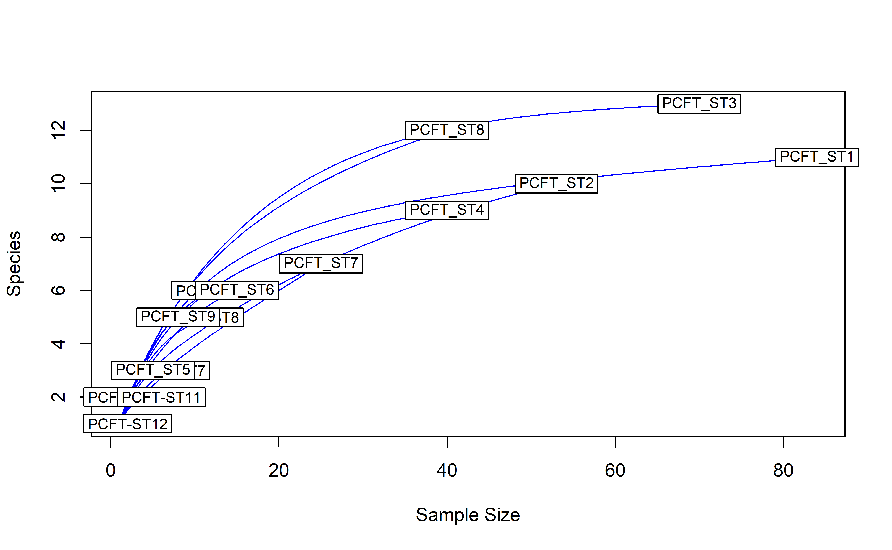](index_files/figure-html/unnamed-chunk-5-1.png)

> Notice how some cameras didn’t record any species. Here showed as the gay horizontal line. Perhaps we need to delete those cameras.

## Rarefaction using `vegan`

> Notice that sites are cameras and the accumulation is species per camera not time

Rarefaction is a technique to assess expected species richness. Rarefaction allows the calculation of species richness for a given number of individual samples, based on the construction of rarefaction curves.

The issue that occurs when sampling various species in a community is that the larger the number of individuals sampled, the more species that will be found. Rarefaction curves are created by randomly re-sampling the pool of N samples multiple times and then plotting the average number of species found in each sample (1,2, … N). “Thus rarefaction generates the expected number of species in a small collection of n individuals (or n samples) drawn at random from the large pool of N samples.”. Rarefaction curves generally grow rapidly at first, as the most common species are found, but the curves plateau as only the rarest species remain to be sampled.

Code

``` downlit

rarecurve(mat_vegan, col = "blue") 
```

[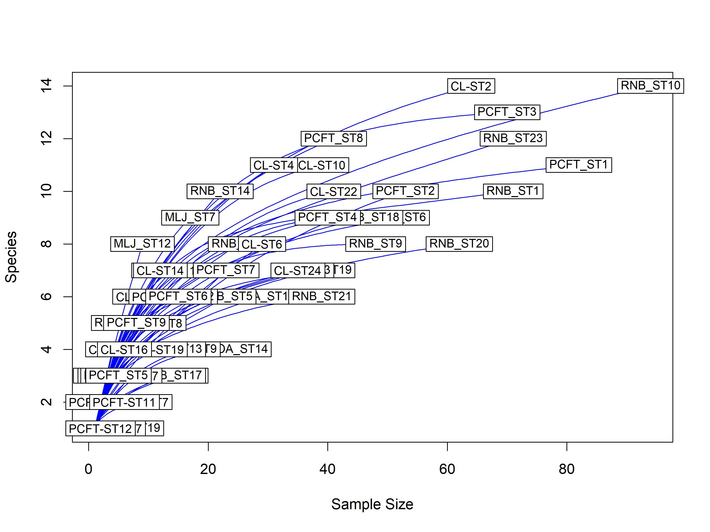](index_files/figure-html/unnamed-chunk-6-1.png)

Code

``` downlit
rarecurve(t(cesar_sp), col = "blue") 
```

[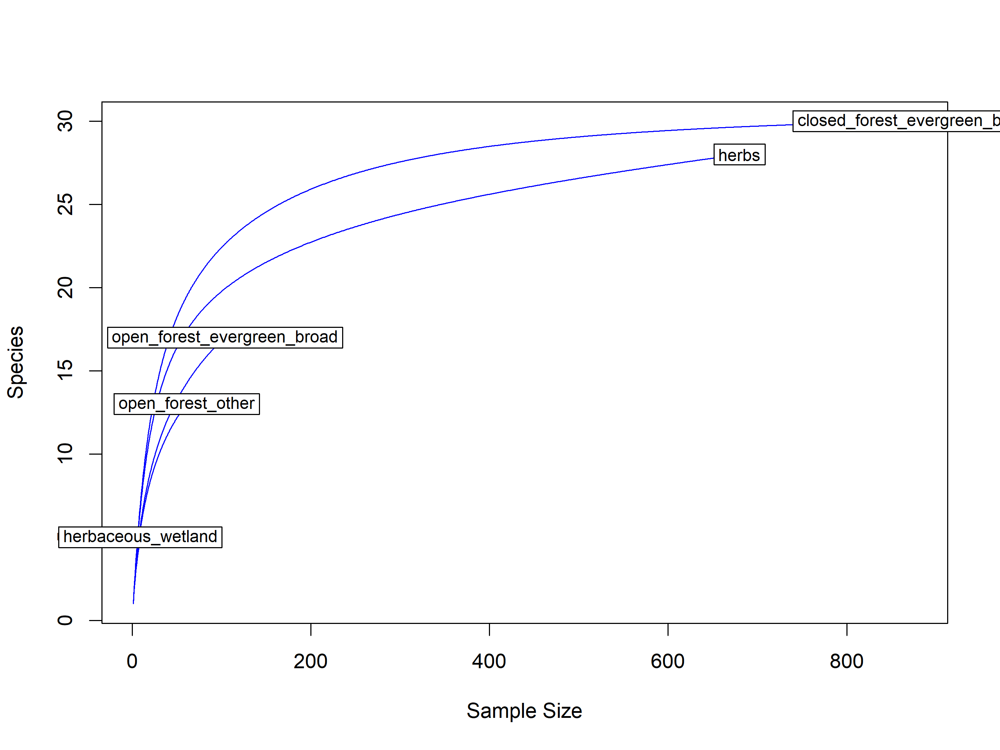](index_files/figure-html/unnamed-chunk-6-2.png)

Code

``` downlit

sp1 <- specaccum(mat_vegan)
sp2 <- specaccum(mat_vegan, "random")
# sp2
# summary(sp2)
plot(sp1, ci.type="poly", col="blue", lwd=2, ci.lty=0, ci.col="lightblue")
```

[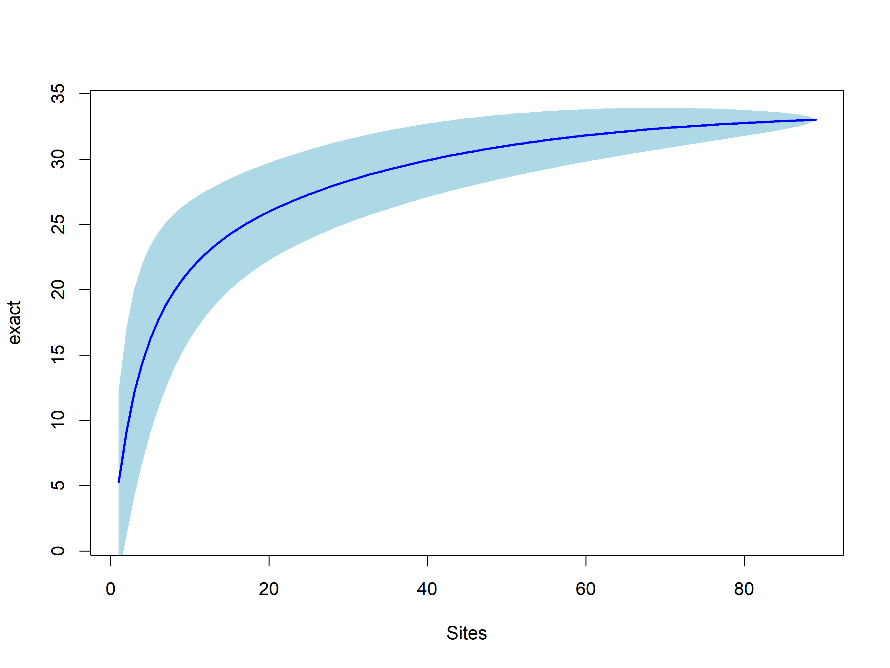](index_files/figure-html/unnamed-chunk-6-3.png)

Code

``` downlit
# boxplot(sp2, col="yellow", add=TRUE, pch="+")


mods <- fitspecaccum(sp1, "gleason")
plot(mods, col="hotpink")
boxplot(sp2, col = "yellow", border = "blue", lty=1, cex=0.3, add= TRUE)
```

[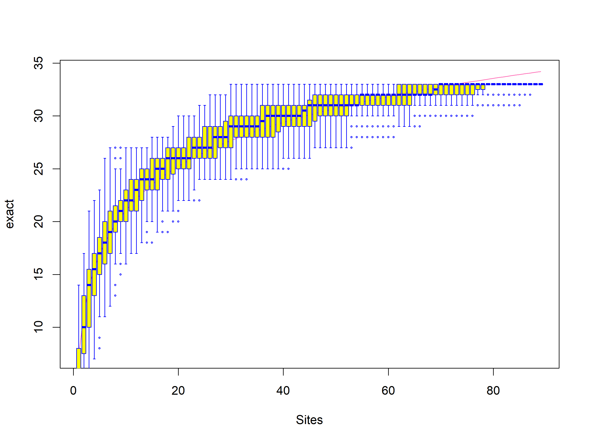](index_files/figure-html/unnamed-chunk-6-4.png)

Code

``` downlit


## Accumulation model
pool <- poolaccum(mat_vegan)
# summary(pool, display = "chao")
plot(pool)
```

[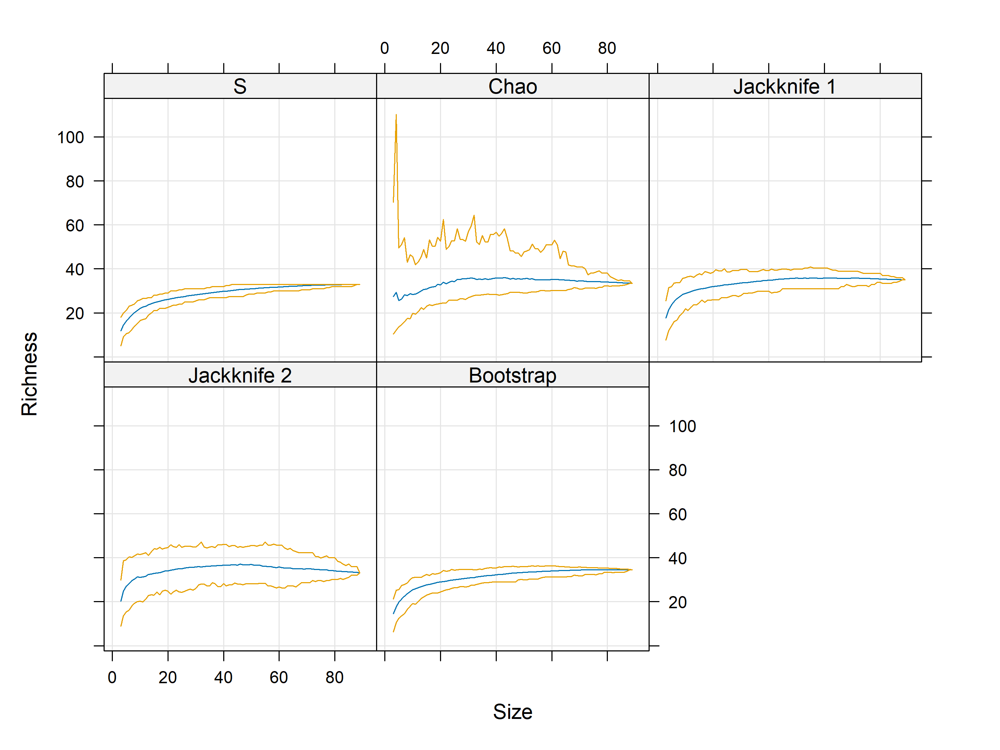](index_files/figure-html/unnamed-chunk-6-5.png)

### Ranked abundance distribution

An alternative approach to species abundance distribution is to plot logarithmic abundances in decreasing order, or against ranks of species.

Code

``` downlit
k <- sample(nrow(mat_vegan), 1)
rad <- radfit(mat_vegan[22,]) # species 22
# plot(rad)
radlattice(rad)
```

[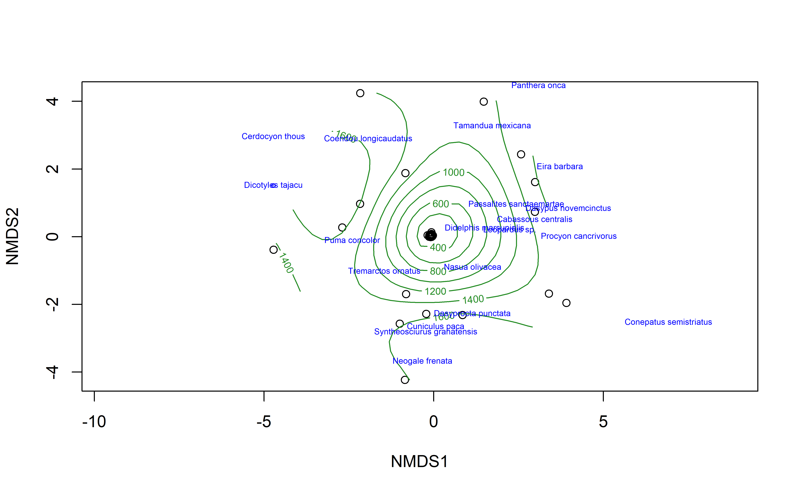](index_files/figure-html/unnamed-chunk-7-1.png)

### Hill Diversities using vegan

Code

``` downlit
# data(BCI)
i <- sample(nrow(mat_vegan), 20)
mod <- renyi(mat_vegan) #selecting sites with more than one record
plot(mod)
```

[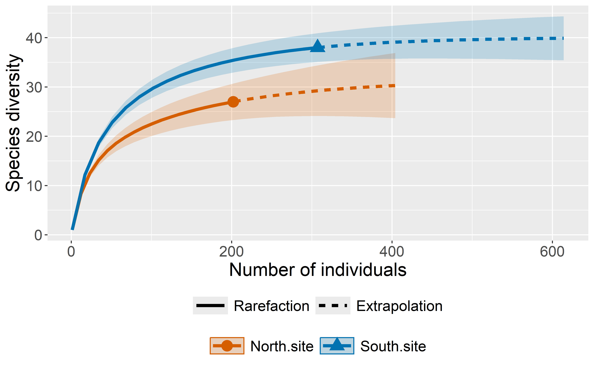](index_files/figure-html/unnamed-chunk-8-1.png)

Code

``` downlit
mod <- renyiaccum(mat_vegan[55:89,])
plot(mod, as.table=TRUE, col = c(1, 2, 2))
```

[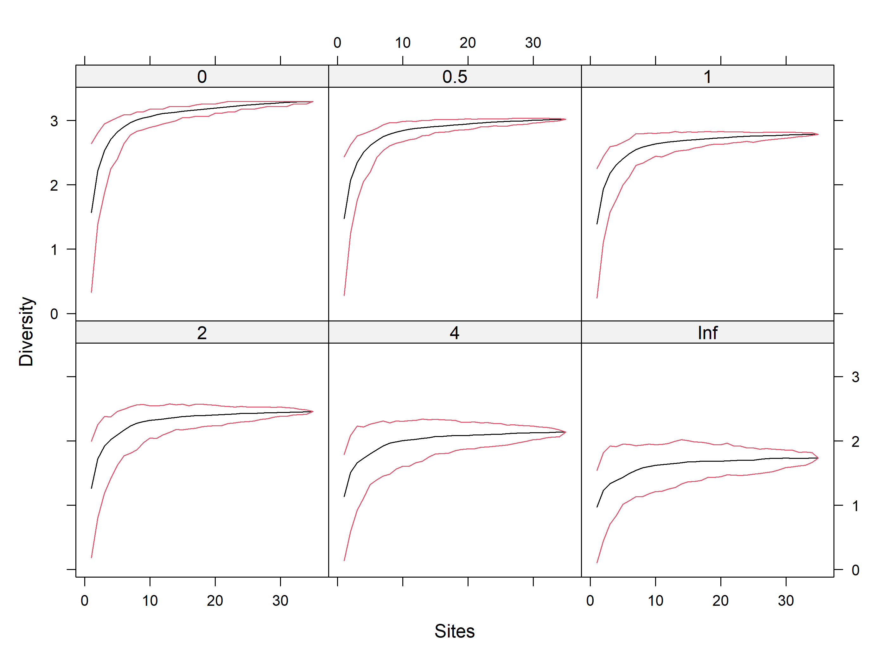](index_files/figure-html/unnamed-chunk-8-2.png)

Code

``` downlit
persp(mod)
```

[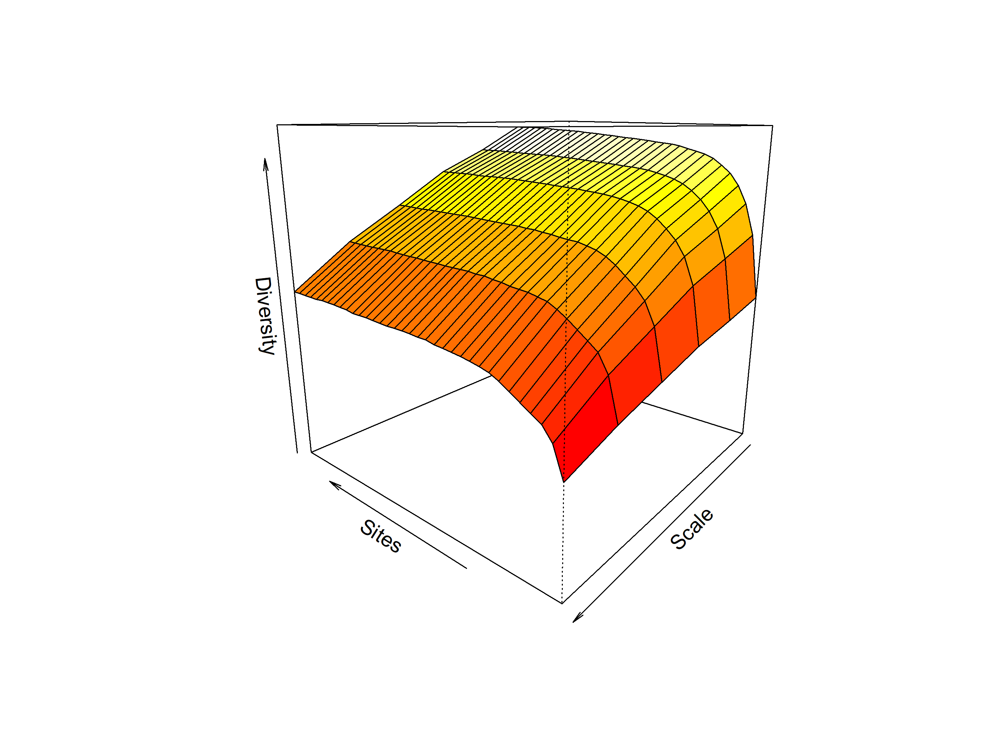](index_files/figure-html/unnamed-chunk-8-3.png)

### Total number of species

Code

``` downlit
DT::datatable(round(specpool(mat_vegan),3))
```

### Number of unseen species per camera

Look at S.chao1

Code

``` downlit
DT::datatable(
t(round(as.data.frame(estimateR(mat_vegan[,])),3))
)
```

Code

``` downlit

# save as dataframe
S_per_site <- as.data.frame(t(round(as.data.frame(estimateR(mat_vegan[,])),3)))
# add sites
S_per_site$Station <- rownames(S_per_site)
```

It is weird to have .5 species in some sites.

## Map it converting Cameratrap-operation to sf

In this step we convert the Cameratrap-operation table to sf, we add elevation from Amazon web Services (AWS), habitat type and species per site (S.chao1) to finally visualize the map showing the number of species as the size of the dot.

Code

``` downlit

# datos_distinct <- datos |> distinct(Longitude, Latitude, CT, Proyecto)

projlatlon <- "+proj=longlat +datum=WGS84 +no_defs +ellps=WGS84 +towgs84=0,0,0"

CToperation_sf <-  st_as_sf(x = CToperation,
                         coords = c("Longitude", 
                                    "Latitude"),
                         crs = projlatlon)

# write.csv(habs, "C:/CodigoR/CameraTrapCesar/data/habitats.csv")
habs <- read.csv("C:/CodigoR/CameraTrapCesar/data/habitats.csv")

CToperation_elev_sf <- get_elev_point(CToperation_sf, src = "aws") # get elevation from AWS

CToperation_elev_sf <- CToperation_elev_sf |> left_join(habs, by='Station') |> left_join(S_per_site, by='Station') |> select("Station", "elevation", "minStart.x","maxEnd.x", "Year.x", "hab_code" , "S.obs", "S.chao1")

# add habitat 
# CToperation_elev_sf$habs <- habs$hab_code
# see the map
mapview(CToperation_elev_sf, zcol="hab_code", cex = "S.chao1", alpha = 0)
```

## Perhaps it is easyer to plot the species number as a countour map

One advantage of using the `eks` density estimate, is that it is clearer what the output means. The 20% contour means “20% of the measurements lie inside this contour”. The documentation for `eks` takes issue with how `stat_density_2d` from `ggplot2` does its calculation, I don’t know who is right because the estimated value is species and both graphs are similar.

Code

``` downlit
# select chao
species <- dplyr::select(CToperation_elev_sf, "S.chao1")
# hakeoides_coord <- data.frame(sf::st_coordinates(hakeoides))
Sta_den <- eks::st_kde(species) # calculate density

# VERY conveniently, eks can generate an sf file of contour lines
contours <- eks::st_get_contour(Sta_den, cont=c( 10,20,30,40,50,60,70,80, 90)) %>% 
  mutate(value=as.numeric(levels(contlabel)))


# pal_fun <- leaflet::colorQuantile("YlOrRd", NULL, n = 5)

p_popup <- paste("Species", as.numeric(levels(contours$estimate)), "number")


tmap::tmap_mode("view") # set mode to interactive plots

tmap::tm_shape(species) + 
    tmap::tm_sf(col="black", size=0.2) +
  #   contours from eks
  tmap::tm_shape(contours) +
    tmap::tm_polygons("estimate",
                      palette="Reds",
                      alpha=0.5 )
```

Code

``` downlit


## geom_sf plot
# ## suitable smoothing matrix gives optimally smoothed contours
# gs1 <- ggplot(Sta_den) + geom_sf(data=CToperation_elev_sf, fill=NA) + ggthemes::theme_map() +
#     colorspace::scale_fill_discrete_sequential(palette="Heat2") 
# gs1 + geom_sf(data=st_get_contour(Sta_den), aes(fill=label_percent(contlabel))) +
#     coord_sf(xlim=xlim, ylim=ylim) 
```

> In general terms the species estimate per site seems to be larger near the coal mine and decrease with the distance to the mine. Also notice kernel density estimates are larger than s.chao1.

## Nonmetric Multidimensional Scaling (NMDS)

Often in ecological research, we are interested not only in comparing univariate descriptors of communities, like diversity, but also in how the constituent species — or the species composition — changes from one community to the next. One common tool to do this is non-metric multidimensional scaling, or NMDS. The goal of NMDS is to collapse information from multiple dimensions (e.g, from multiple communities, sites were the cameratrap was installed, etc.) into just a few, so that they can be visualized and interpreted. Unlike other ordination techniques that rely on (primarily Euclidean) distances, such as Principal Coordinates Analysis, NMDS uses rank orders, and thus is an extremely flexible technique that can accommodate a variety of different kinds of data.

If the treatment is continuous, such as an environmental gradient, then it might be useful to plot contour lines rather than convex hulls. We can get some, elevation data for our original community matrix and overlay them onto the NMDS plot using `ordisurf`.

Code

``` downlit

example_NMDS=metaMDS(as.data.frame(mat_vegan), 
                     distance="euclidean",
                     zerodist = "ignore",
                     trymax=300,
                     k=5) # T
#> Wisconsin double standardization
#> Run 0 stress 0.1177774 
#> Run 1 stress 0.1206288 
#> Run 2 stress 0.1186686 
#> Run 3 stress 0.1191797 
#> Run 4 stress 0.1179719 
#> ... Procrustes: rmse 0.05919246  max resid 0.2038165 
#> Run 5 stress 0.1183849 
#> Run 6 stress 0.1196809 
#> Run 7 stress 0.1186472 
#> Run 8 stress 0.1184403 
#> Run 9 stress 0.1196989 
#> Run 10 stress 0.1194615 
#> Run 11 stress 0.1214856 
#> Run 12 stress 0.1188458 
#> Run 13 stress 0.1204449 
#> Run 14 stress 0.1193109 
#> Run 15 stress 0.118481 
#> Run 16 stress 0.1195796 
#> Run 17 stress 0.1186381 
#> Run 18 stress 0.1191817 
#> Run 19 stress 0.1176268 
#> ... New best solution
#> ... Procrustes: rmse 0.06730393  max resid 0.1981391 
#> Run 20 stress 0.1188219 
#> Run 21 stress 0.1185899 
#> Run 22 stress 0.1203331 
#> Run 23 stress 0.1194288 
#> Run 24 stress 0.1201856 
#> Run 25 stress 0.1202617 
#> Run 26 stress 0.1181575 
#> Run 27 stress 0.1202947 
#> Run 28 stress 0.118683 
#> Run 29 stress 0.119821 
#> Run 30 stress 0.1194675 
#> Run 31 stress 0.1210007 
#> Run 32 stress 0.1184738 
#> Run 33 stress 0.1195521 
#> Run 34 stress 0.1187497 
#> Run 35 stress 0.1191322 
#> Run 36 stress 0.1179864 
#> ... Procrustes: rmse 0.06264792  max resid 0.2506916 
#> Run 37 stress 0.1185073 
#> Run 38 stress 0.1192425 
#> Run 39 stress 0.1187494 
#> Run 40 stress 0.1178776 
#> ... Procrustes: rmse 0.06673682  max resid 0.3230683 
#> Run 41 stress 0.1191402 
#> Run 42 stress 0.1183157 
#> Run 43 stress 0.118886 
#> Run 44 stress 0.118375 
#> Run 45 stress 0.1210902 
#> Run 46 stress 0.1183168 
#> Run 47 stress 0.1200819 
#> Run 48 stress 0.1188811 
#> Run 49 stress 0.1190618 
#> Run 50 stress 0.1190239 
#> Run 51 stress 0.1192832 
#> Run 52 stress 0.1171768 
#> ... New best solution
#> ... Procrustes: rmse 0.06292082  max resid 0.295684 
#> Run 53 stress 0.1187272 
#> Run 54 stress 0.1191086 
#> Run 55 stress 0.1192896 
#> Run 56 stress 0.1205005 
#> Run 57 stress 0.1187612 
#> Run 58 stress 0.119228 
#> Run 59 stress 0.1190356 
#> Run 60 stress 0.1179332 
#> Run 61 stress 0.1197881 
#> Run 62 stress 0.1181237 
#> Run 63 stress 0.1193814 
#> Run 64 stress 0.118903 
#> Run 65 stress 0.1191659 
#> Run 66 stress 0.1189552 
#> Run 67 stress 0.118381 
#> Run 68 stress 0.1182353 
#> Run 69 stress 0.1185069 
#> Run 70 stress 0.119889 
#> Run 71 stress 0.1189324 
#> Run 72 stress 0.1202498 
#> Run 73 stress 0.1198287 
#> Run 74 stress 0.1173791 
#> ... Procrustes: rmse 0.03459135  max resid 0.1320568 
#> Run 75 stress 0.118462 
#> Run 76 stress 0.1208487 
#> Run 77 stress 0.1184617 
#> Run 78 stress 0.11866 
#> Run 79 stress 0.1205182 
#> Run 80 stress 0.1196904 
#> Run 81 stress 0.1190856 
#> Run 82 stress 0.1181391 
#> Run 83 stress 0.1194442 
#> Run 84 stress 0.1185924 
#> Run 85 stress 0.1193937 
#> Run 86 stress 0.121223 
#> Run 87 stress 0.1180475 
#> Run 88 stress 0.1172267 
#> ... Procrustes: rmse 0.03409711  max resid 0.1753628 
#> Run 89 stress 0.1192943 
#> Run 90 stress 0.1196633 
#> Run 91 stress 0.1188599 
#> Run 92 stress 0.1183631 
#> Run 93 stress 0.1187598 
#> Run 94 stress 0.1185968 
#> Run 95 stress 0.11951 
#> Run 96 stress 0.1213391 
#> Run 97 stress 0.1197127 
#> Run 98 stress 0.119473 
#> Run 99 stress 0.1196205 
#> Run 100 stress 0.1192707 
#> Run 101 stress 0.1187672 
#> Run 102 stress 0.1193891 
#> Run 103 stress 0.1180284 
#> Run 104 stress 0.1203894 
#> Run 105 stress 0.1194927 
#> Run 106 stress 0.1212493 
#> Run 107 stress 0.1182965 
#> Run 108 stress 0.1202082 
#> Run 109 stress 0.1196737 
#> Run 110 stress 0.1184745 
#> Run 111 stress 0.1196734 
#> Run 112 stress 0.1210192 
#> Run 113 stress 0.1204562 
#> Run 114 stress 0.1183794 
#> Run 115 stress 0.1196312 
#> Run 116 stress 0.1195102 
#> Run 117 stress 0.1186427 
#> Run 118 stress 0.1177037 
#> Run 119 stress 0.1196211 
#> Run 120 stress 0.1184335 
#> Run 121 stress 0.1187205 
#> Run 122 stress 0.1193329 
#> Run 123 stress 0.1183935 
#> Run 124 stress 0.1180111 
#> Run 125 stress 0.1190067 
#> Run 126 stress 0.1199412 
#> Run 127 stress 0.1203917 
#> Run 128 stress 0.1193066 
#> Run 129 stress 0.1190813 
#> Run 130 stress 0.1210336 
#> Run 131 stress 0.1183395 
#> Run 132 stress 0.1185109 
#> Run 133 stress 0.1186184 
#> Run 134 stress 0.1182459 
#> Run 135 stress 0.1190389 
#> Run 136 stress 0.1204167 
#> Run 137 stress 0.1186198 
#> Run 138 stress 0.118966 
#> Run 139 stress 0.1201539 
#> Run 140 stress 0.1192333 
#> Run 141 stress 0.1191073 
#> Run 142 stress 0.1181058 
#> Run 143 stress 0.1180379 
#> Run 144 stress 0.1194509 
#> Run 145 stress 0.1190307 
#> Run 146 stress 0.1227532 
#> Run 147 stress 0.1197243 
#> Run 148 stress 0.1194925 
#> Run 149 stress 0.1176478 
#> ... Procrustes: rmse 0.03324642  max resid 0.1376792 
#> Run 150 stress 0.1197673 
#> Run 151 stress 0.118505 
#> Run 152 stress 0.1195788 
#> Run 153 stress 0.1183746 
#> Run 154 stress 0.1207917 
#> Run 155 stress 0.1195209 
#> Run 156 stress 0.1186476 
#> Run 157 stress 0.1205683 
#> Run 158 stress 0.1203957 
#> Run 159 stress 0.1194334 
#> Run 160 stress 0.1187067 
#> Run 161 stress 0.1191248 
#> Run 162 stress 0.1194916 
#> Run 163 stress 0.1187049 
#> Run 164 stress 0.1188084 
#> Run 165 stress 0.1195733 
#> Run 166 stress 0.1189146 
#> Run 167 stress 0.1189353 
#> Run 168 stress 0.1190702 
#> Run 169 stress 0.1188005 
#> Run 170 stress 0.1188069 
#> Run 171 stress 0.1199909 
#> Run 172 stress 0.1198793 
#> Run 173 stress 0.1193492 
#> Run 174 stress 0.1183103 
#> Run 175 stress 0.1188022 
#> Run 176 stress 0.119465 
#> Run 177 stress 0.1201642 
#> Run 178 stress 0.1203076 
#> Run 179 stress 0.1184545 
#> Run 180 stress 0.1191182 
#> Run 181 stress 0.1184663 
#> Run 182 stress 0.1197293 
#> Run 183 stress 0.1196431 
#> Run 184 stress 0.1200847 
#> Run 185 stress 0.1218445 
#> Run 186 stress 0.1205694 
#> Run 187 stress 0.1193901 
#> Run 188 stress 0.1202695 
#> Run 189 stress 0.1186335 
#> Run 190 stress 0.1189535 
#> Run 191 stress 0.1184268 
#> Run 192 stress 0.1203722 
#> Run 193 stress 0.11953 
#> Run 194 stress 0.1181967 
#> Run 195 stress 0.1210427 
#> Run 196 stress 0.1193239 
#> Run 197 stress 0.1189304 
#> Run 198 stress 0.1188824 
#> Run 199 stress 0.1179775 
#> Run 200 stress 0.1200429 
#> Run 201 stress 0.1186354 
#> Run 202 stress 0.1175204 
#> ... Procrustes: rmse 0.05732237  max resid 0.2698293 
#> Run 203 stress 0.1190253 
#> Run 204 stress 0.119378 
#> Run 205 stress 0.1187723 
#> Run 206 stress 0.1193228 
#> Run 207 stress 0.1190969 
#> Run 208 stress 0.1190627 
#> Run 209 stress 0.1184325 
#> Run 210 stress 0.1194397 
#> Run 211 stress 0.1194828 
#> Run 212 stress 0.1185745 
#> Run 213 stress 0.1186796 
#> Run 214 stress 0.1192906 
#> Run 215 stress 0.1200002 
#> Run 216 stress 0.1186742 
#> Run 217 stress 0.119254 
#> Run 218 stress 0.1191419 
#> Run 219 stress 0.120306 
#> Run 220 stress 0.119665 
#> Run 221 stress 0.1212614 
#> Run 222 stress 0.118446 
#> Run 223 stress 0.1191734 
#> Run 224 stress 0.1186459 
#> Run 225 stress 0.1186136 
#> Run 226 stress 0.1198339 
#> Run 227 stress 0.1189743 
#> Run 228 stress 0.1191247 
#> Run 229 stress 0.1186571 
#> Run 230 stress 0.1183342 
#> Run 231 stress 0.120657 
#> Run 232 stress 0.1200303 
#> Run 233 stress 0.1194832 
#> Run 234 stress 0.1183993 
#> Run 235 stress 0.1192708 
#> Run 236 stress 0.1195927 
#> Run 237 stress 0.1192793 
#> Run 238 stress 0.1203671 
#> Run 239 stress 0.1187571 
#> Run 240 stress 0.1206314 
#> Run 241 stress 0.1172878 
#> ... Procrustes: rmse 0.03546175  max resid 0.1313024 
#> Run 242 stress 0.1180823 
#> Run 243 stress 0.1204901 
#> Run 244 stress 0.1190983 
#> Run 245 stress 0.1199391 
#> Run 246 stress 0.1182834 
#> Run 247 stress 0.1184138 
#> Run 248 stress 0.1205916 
#> Run 249 stress 0.1173884 
#> ... Procrustes: rmse 0.06476341  max resid 0.2793467 
#> Run 250 stress 0.1184572 
#> Run 251 stress 0.1179883 
#> Run 252 stress 0.119103 
#> Run 253 stress 0.1208135 
#> Run 254 stress 0.1192279 
#> Run 255 stress 0.1194243 
#> Run 256 stress 0.1203805 
#> Run 257 stress 0.1196346 
#> Run 258 stress 0.1187809 
#> Run 259 stress 0.1220039 
#> Run 260 stress 0.1202155 
#> Run 261 stress 0.119038 
#> Run 262 stress 0.1185969 
#> Run 263 stress 0.1185206 
#> Run 264 stress 0.1191264 
#> Run 265 stress 0.1203919 
#> Run 266 stress 0.1193328 
#> Run 267 stress 0.119689 
#> Run 268 stress 0.1185788 
#> Run 269 stress 0.1190655 
#> Run 270 stress 0.1193243 
#> Run 271 stress 0.1204081 
#> Run 272 stress 0.1193853 
#> Run 273 stress 0.1191507 
#> Run 274 stress 0.1191006 
#> Run 275 stress 0.1194524 
#> Run 276 stress 0.1196515 
#> Run 277 stress 0.1191174 
#> Run 278 stress 0.1197212 
#> Run 279 stress 0.1195057 
#> Run 280 stress 0.1190863 
#> Run 281 stress 0.1173829 
#> ... Procrustes: rmse 0.04228723  max resid 0.2906148 
#> Run 282 stress 0.1183771 
#> Run 283 stress 0.118756 
#> Run 284 stress 0.1184836 
#> Run 285 stress 0.1193089 
#> Run 286 stress 0.1187367 
#> Run 287 stress 0.1211166 
#> Run 288 stress 0.118612 
#> Run 289 stress 0.1182366 
#> Run 290 stress 0.1190942 
#> Run 291 stress 0.118254 
#> Run 292 stress 0.1182043 
#> Run 293 stress 0.1210657 
#> Run 294 stress 0.1176667 
#> ... Procrustes: rmse 0.0316457  max resid 0.1553559 
#> Run 295 stress 0.1180872 
#> Run 296 stress 0.1173496 
#> ... Procrustes: rmse 0.05887519  max resid 0.229526 
#> Run 297 stress 0.1178518 
#> Run 298 stress 0.1220267 
#> Run 299 stress 0.1186454 
#> Run 300 stress 0.1205719 
#> *** Best solution was not repeated -- monoMDS stopping criteria:
#>    300: no. of iterations >= maxit

# plot the graph
vegan::ordisurf((example_NMDS),CToperation_elev_sf$elevation,main="",col="forestgreen", trymax=100) # bubble = 2
#> 
#> Family: gaussian 
#> Link function: identity 
#> 
#> Formula:
#> y ~ s(x1, x2, k = 10, bs = "tp", fx = FALSE)
#> 
#> Estimated degrees of freedom:
#> 5.1  total = 6.1 
#> 
#> REML score: 732.1451
vegan::orditorp(example_NMDS,display="species",col="blue",air=0.1,
   cex=0.5)
```

[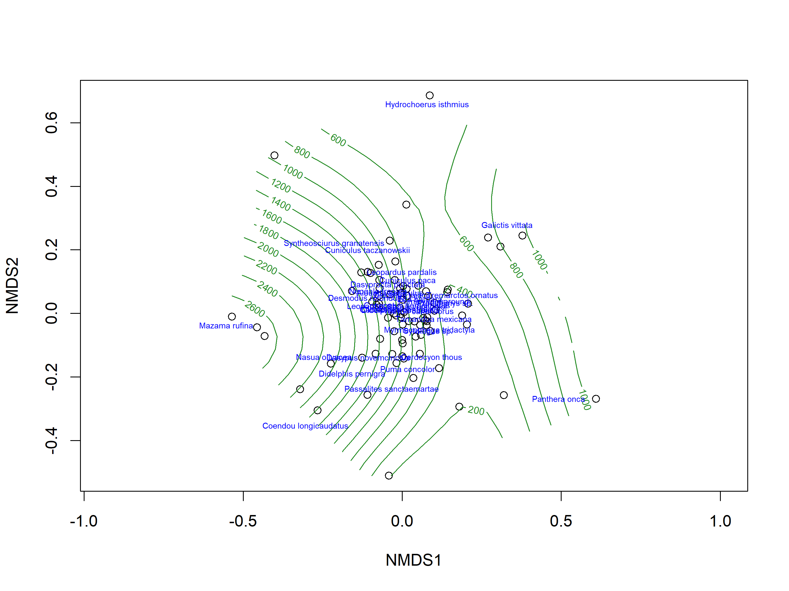](index_files/figure-html/unnamed-chunk-13-1.png)

We can make a similar plot using `gg_ordisurf` from the package `ggordiplots` but also incorporating habitat type.

Code

``` downlit
# ggordiplots::gg_ordisurf()
# To fit a surface with ggordiplots:

 
ordiplot <- gg_ordisurf(ord = example_NMDS, 
                        env.var = CToperation_elev_sf$elevation,
                        var.label = "Elevation",
                        pt.size = 2,
                        groups = CToperation_elev_sf$hab_code,
                        binwidth = 50)
```

[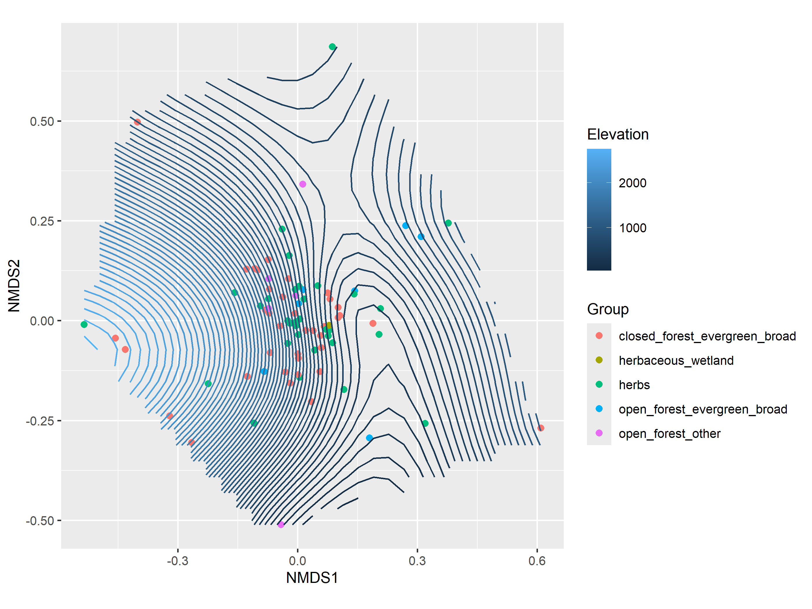](index_files/figure-html/unnamed-chunk-14-1.png)

Code

``` downlit

# ggplotly(ordiplot$plot) # see interactive

# # alternative using biodiversityR
# 
# A1.surface <- ordisurf( y=example_NMDS)
# A1.grid <- ordisurfgrid.long(A1.surface)
# # Preparing the plot
# 
# plotgg4 <- ggplot() + 
#     geom_contour_filled(data=A1.grid, 
#                         aes(x=x, y=y, z=z)) +
#     geom_vline(xintercept = c(0), color = "grey70", linetype = 2) +
#     geom_hline(yintercept = c(0), color = "grey70", linetype = 2) +  
#     xlab(axis.long2[1, "label"]) +
#     ylab(axis.long2[2, "label"]) +  
#     scale_x_continuous(sec.axis = dup_axis(labels=NULL, name=NULL)) +
#     scale_y_continuous(sec.axis = dup_axis(labels=NULL, name=NULL)) +
#     geom_point(data=sites.long2, 
#                aes(x=axis1, y=axis2, shape=Management), 
#                colour="red", size=4) +
#     BioR.theme +
#     scale_fill_viridis_d() +
#     labs(fill="A1") +
#     coord_fixed(ratio=1)
# # and seeing the plot.
# 
# plotgg4
```

The contours connect species in the ordination space that are predicted to have the same elevation. Notice this is not a geographic map, it is a multivariate space.

## Rarefaction using `iNEXT`

Code

``` downlit


out <- iNEXT(incidence_cesar, # The data frame
             q=0,# The type of diversity estimator 
             datatype="incidence_freq",   # The type of analysis
             knots=40,                    # The number of data points 
             se=TRUE,                     # confidence intervals
             conf=0.95,                   # The level of confidence intervals
             nboot=100)                    # The number of bootstraps 

ggiNEXT(out, type=1)
```

[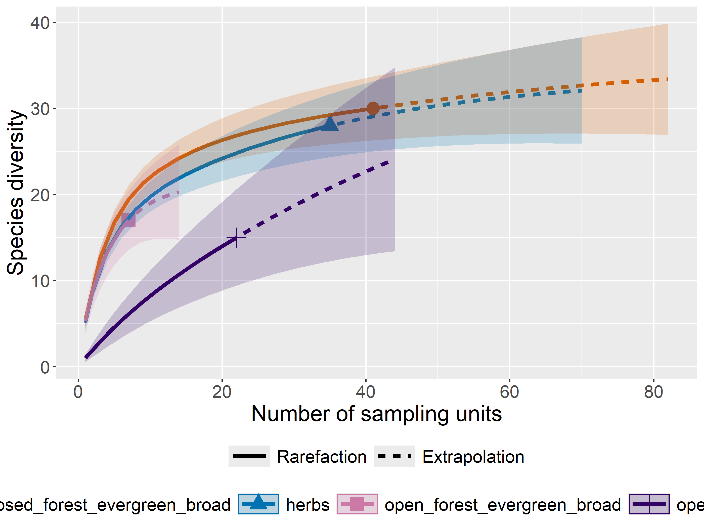](index_files/figure-html/unnamed-chunk-15-1.png)

Code

``` downlit
ggiNEXT(out, type=2)
```

[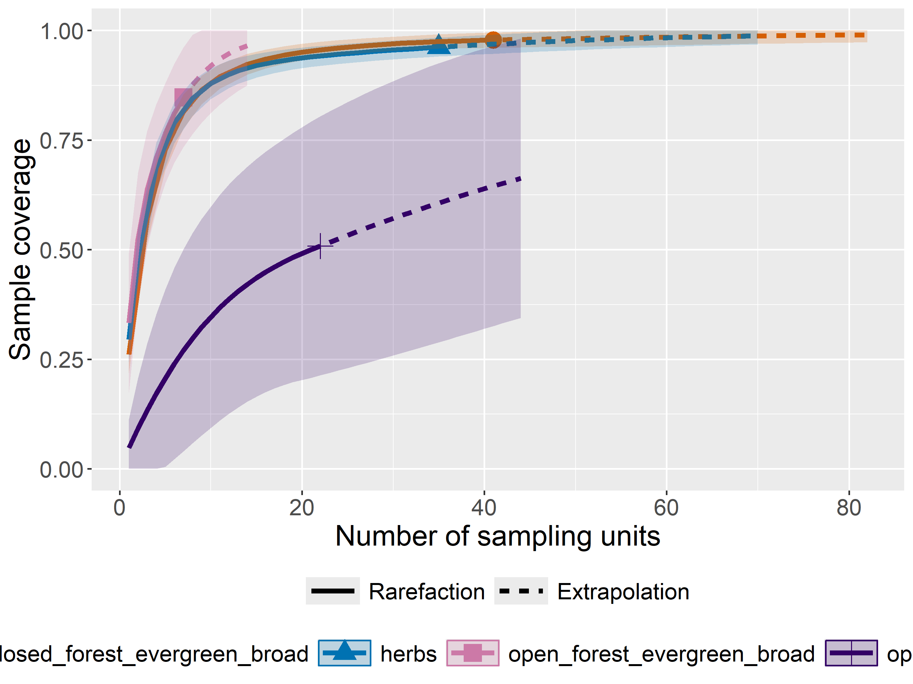](index_files/figure-html/unnamed-chunk-15-2.png)

Code

``` downlit
ggiNEXT(out, type=3)
```

[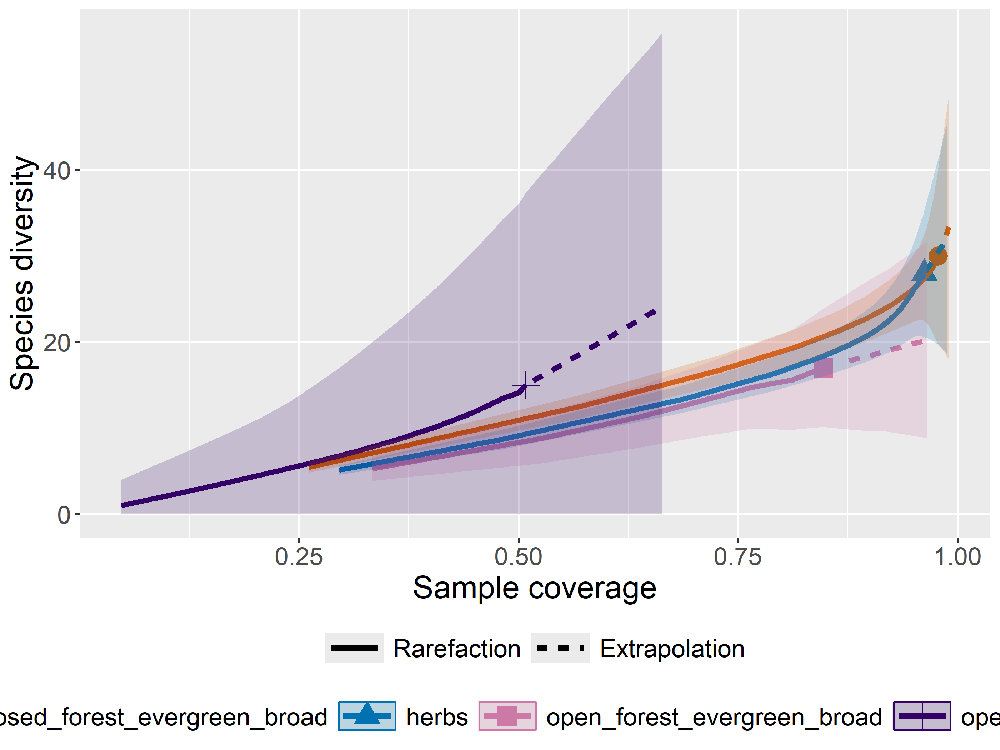](index_files/figure-html/unnamed-chunk-15-3.png)

Code

``` downlit

p1 <- ggiNEXT(out, type=1)+ theme_classic() +   #  type 1 = the diversity estimator
        labs(x = "Survey sites", y = "Richness")
  
p2 <- ggiNEXT(out, type=2)+ theme_classic() +    #  type 2 = the survey coverage
        labs(x = "Survey sites")
    
grid.arrange(p1, p2, nrow = 2)
```

[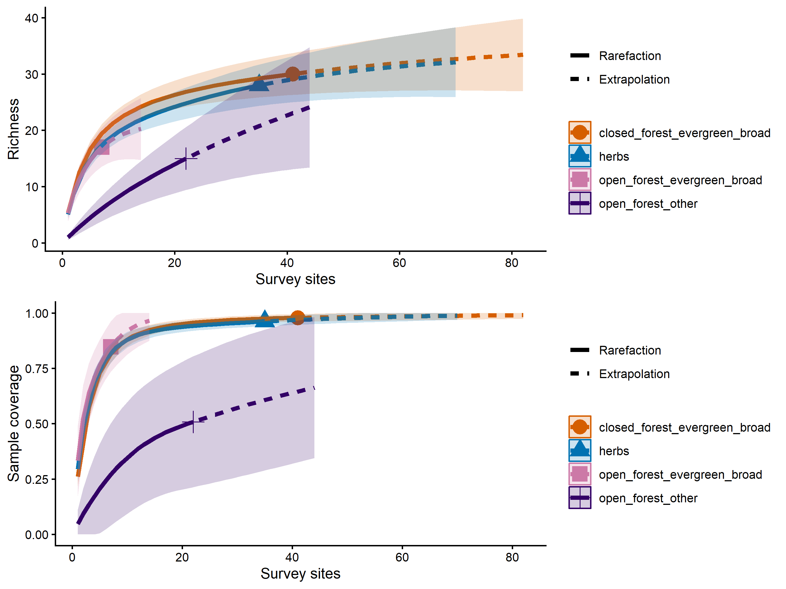](index_files/figure-html/unnamed-chunk-15-4.png)

Code

``` downlit
##############
out2 <- iNEXT(incidence_cesar, q=c(0,1,2) ,datatype="incidence_freq" )

ggiNEXT(out2, type=1, facet.var="Order.q", color.var="Assemblage") + theme_classic() 
```

[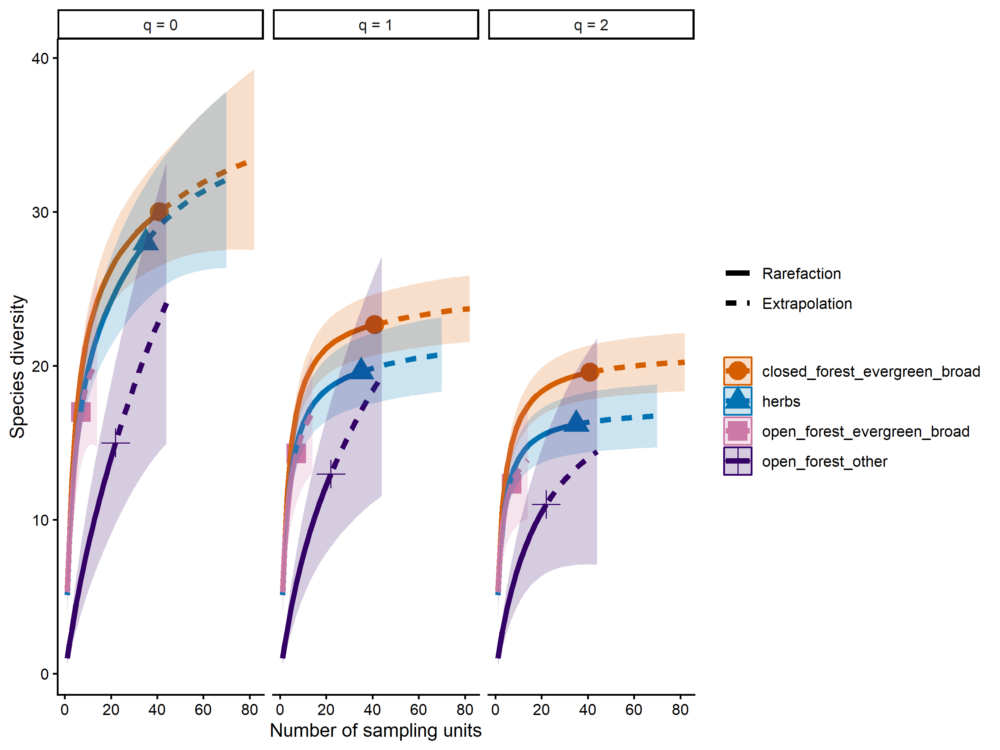](index_files/figure-html/unnamed-chunk-15-5.png)

The `iNEXT` package is well suited for comparisons of diversity indices through the use of hill numbers - of which the `q` value = 1 represents the traditional diversity indices: The species richness is q = 0. The Shannon index is (q=1), and Simpson is (q=2). Note Increasing values of q reduces the influence of rare species on our estimate of community diversity.

## Package Citation

Code

``` downlit
pkgs <- cite_packages(output = "paragraph", out.dir = ".") #knitr::kable(pkgs)
pkgs
```

We used R v. 4.4.2 ([R Core Team 2024](#ref-base)) and the following R packages: camtrapR v. 3.0.0 ([Niedballa et al. 2016](#ref-camtrapR)), devtools v. 2.4.6 ([Wickham, Hester, et al. 2025](#ref-devtools)), DT v. 0.34.0 ([Xie et al. 2025](#ref-DT)), eks v. 1.1.1 ([Duong 2025](#ref-eks)), elevatr v. 0.99.0 ([Hollister et al. 2023](#ref-elevatr)), ggforce v. 0.4.2 ([Pedersen 2024](#ref-ggforce)), ggordiplots v. 0.4.3 ([Quensen et al. 2024](#ref-ggordiplots)), ggvegan v. 0.1.999 ([Simpson and Oksanen 2023](#ref-ggvegan)), gridExtra v. 2.3 ([Auguie 2017](#ref-gridExtra)), iNEXT v. 3.0.1 ([Chao et al. 2014](#ref-iNEXT2014); [Hsieh et al. 2024](#ref-iNEXT2024)), kableExtra v. 1.4.0 ([Zhu 2024](#ref-kableExtra)), knitr v. 1.50 ([Xie 2014](#ref-knitr2014), [2015](#ref-knitr2015), [2025](#ref-knitr2025)), mapview v. 2.11.4 ([Appelhans et al. 2025](#ref-mapview)), MeanRarity v. 0.0.1.5 ([Roswell and Dushoff 2023](#ref-MeanRarity)), patchwork v. 1.3.2 ([Pedersen 2025](#ref-patchwork)), plotly v. 4.10.4 ([Sievert 2020](#ref-plotly)), plyr v. 1.8.9 ([Wickham 2011](#ref-plyr)), reshape2 v. 1.4.4 ([Wickham 2007](#ref-reshape2)), rmarkdown v. 2.30 ([Xie et al. 2018](#ref-rmarkdown2018), [2020](#ref-rmarkdown2020); [Allaire et al. 2025](#ref-rmarkdown2025)), scales v. 1.4.0 ([Wickham, Pedersen, et al. 2025](#ref-scales)), sf v. 1.0.21 ([Pebesma 2018](#ref-sf2018); [Pebesma and Bivand 2023](#ref-sf2023)), SpadeR v. 0.1.1 ([Chao et al. 2016](#ref-SpadeR)), tidyverse v. 2.0.0 ([Wickham et al. 2019](#ref-tidyverse)), tmap v. 4.2 ([Tennekes 2018](#ref-tmap)), vegan v. 2.7.2 ([Oksanen et al. 2025](#ref-vegan)).

## Sesion info

Session info

    #> ─ Session info ─────────────────────────────────────────────────────────────────────────────────────────────────────────────────────────────────────
    #>  setting  value
    #>  version  R version 4.4.2 (2024-10-31 ucrt)
    #>  os       Windows 10 x64 (build 19045)
    #>  system   x86_64, mingw32
    #>  ui       RTerm
    #>  language (EN)
    #>  collate  Spanish_Colombia.utf8
    #>  ctype    Spanish_Colombia.utf8
    #>  tz       America/Bogota
    #>  date     2025-11-05
    #>  pandoc   3.6.3 @ C:/Program Files/RStudio/resources/app/bin/quarto/bin/tools/ (via rmarkdown)
    #>  quarto   NA @ C:\\Users\\usuario\\AppData\\Local\\Programs\\Quarto\\bin\\quarto.exe
    #> 
    #> ─ Packages ─────────────────────────────────────────────────────────────────────────────────────────────────────────────────────────────────────────
    #>  ! package           * version    date (UTC) lib source
    #>    abind               1.4-8      2024-09-12 [1] CRAN (R 4.4.1)
    #>    base64enc           0.1-3      2015-07-28 [1] CRAN (R 4.4.0)
    #>    brew                1.0-10     2023-12-16 [1] CRAN (R 4.4.2)
    #>    bslib               0.9.0      2025-01-30 [1] CRAN (R 4.4.3)
    #>    cachem              1.1.0      2024-05-16 [1] CRAN (R 4.4.2)
    #>    camtrapR          * 3.0.0      2025-09-28 [1] CRAN (R 4.4.3)
    #>    cellranger          1.1.0      2016-07-27 [1] CRAN (R 4.4.2)
    #>    class               7.3-22     2023-05-03 [2] CRAN (R 4.4.2)
    #>    classInt            0.4-11     2025-01-08 [1] CRAN (R 4.4.3)
    #>    cli                 3.6.5      2025-04-23 [1] CRAN (R 4.4.3)
    #>    cluster             2.1.6      2023-12-01 [2] CRAN (R 4.4.2)
    #>    codetools           0.2-20     2024-03-31 [2] CRAN (R 4.4.2)
    #>    colorspace          2.1-1      2024-07-26 [1] CRAN (R 4.4.2)
    #>    cols4all            0.8-1      2025-08-17 [1] Github (cols4all/cols4all-R@d39bcbd)
    #>    crayon              1.5.3      2024-06-20 [1] CRAN (R 4.4.2)
    #>    crosstalk           1.2.1      2023-11-23 [1] CRAN (R 4.4.2)
    #>    curl                7.0.0      2025-08-19 [1] CRAN (R 4.4.3)
    #>    data.table          1.17.8     2025-07-10 [1] CRAN (R 4.4.3)
    #>    DBI                 1.2.3      2024-06-02 [1] CRAN (R 4.4.2)
    #>    devtools            2.4.6      2025-10-03 [1] CRAN (R 4.4.3)
    #>    dichromat           2.0-0.1    2022-05-02 [1] CRAN (R 4.4.0)
    #>    digest              0.6.37     2024-08-19 [1] CRAN (R 4.4.2)
    #>    dplyr             * 1.1.4      2023-11-17 [1] CRAN (R 4.4.2)
    #>    DT                * 0.34.0     2025-09-02 [1] CRAN (R 4.4.3)
    #>    e1071               1.7-16     2024-09-16 [1] CRAN (R 4.4.2)
    #>    eks               * 1.1.1      2025-07-08 [1] CRAN (R 4.4.3)
    #>    elevatr           * 0.99.0     2023-09-12 [1] CRAN (R 4.4.2)
    #>    ellipsis            0.3.2      2021-04-29 [1] CRAN (R 4.4.2)
    #>    evaluate            1.0.4      2025-06-18 [1] CRAN (R 4.4.3)
    #>    farver              2.1.2      2024-05-13 [1] CRAN (R 4.4.2)
    #>    fastmap             1.2.0      2024-05-15 [1] CRAN (R 4.4.2)
    #>    forcats           * 1.0.0      2023-01-29 [1] CRAN (R 4.4.2)
    #>    fs                  1.6.6      2025-04-12 [1] CRAN (R 4.4.3)
    #>    generics            0.1.3      2022-07-05 [1] CRAN (R 4.4.2)
    #>    geos                0.2.4      2023-11-30 [1] CRAN (R 4.4.3)
    #>    ggforce           * 0.4.2      2024-02-19 [1] CRAN (R 4.4.2)
    #>    ggordiplots       * 0.4.3      2024-01-14 [1] CRAN (R 4.4.2)
    #>    ggplot2           * 4.0.0      2025-09-11 [1] CRAN (R 4.4.3)
    #>    ggrepel             0.9.6      2024-09-07 [1] CRAN (R 4.4.2)
    #>    ggvegan           * 0.1.999    2024-12-15 [1] Github (gavinsimpson/ggvegan@058c08c)
    #>    glue              * 1.8.0      2024-09-30 [1] CRAN (R 4.4.2)
    #>    grateful          * 0.3.0      2025-09-04 [1] CRAN (R 4.4.3)
    #>    gridExtra         * 2.3        2017-09-09 [1] CRAN (R 4.4.2)
    #>    gtable              0.3.6      2024-10-25 [1] CRAN (R 4.4.2)
    #>    hms                 1.1.3      2023-03-21 [1] CRAN (R 4.4.2)
    #>    htmltools           0.5.8.1    2024-04-04 [1] CRAN (R 4.4.2)
    #>    htmlwidgets         1.6.4      2023-12-06 [1] CRAN (R 4.4.2)
    #>    httpuv              1.6.16     2025-04-16 [1] CRAN (R 4.4.3)
    #>    httr                1.4.7      2023-08-15 [1] CRAN (R 4.4.2)
    #>    iNEXT             * 3.0.1      2024-03-24 [1] CRAN (R 4.4.2)
    #>    isoband             0.2.7      2022-12-20 [1] CRAN (R 4.4.2)
    #>    jquerylib           0.1.4      2021-04-26 [1] CRAN (R 4.4.2)
    #>    jsonlite            2.0.0      2025-03-27 [1] CRAN (R 4.4.3)
    #>    kableExtra        * 1.4.0      2024-01-24 [1] CRAN (R 4.4.2)
    #>    KernSmooth          2.23-24    2024-05-17 [2] CRAN (R 4.4.2)
    #>    knitr             * 1.50       2025-03-16 [1] CRAN (R 4.4.3)
    #>    ks                  1.15.1     2025-05-04 [1] CRAN (R 4.4.3)
    #>    labeling            0.4.3      2023-08-29 [1] CRAN (R 4.4.0)
    #>    later               1.4.2      2025-04-08 [1] CRAN (R 4.4.3)
    #>    lattice             0.22-6     2024-03-20 [2] CRAN (R 4.4.2)
    #>    lazyeval            0.2.2      2019-03-15 [1] CRAN (R 4.4.2)
    #>    leafem              0.2.4      2025-05-01 [1] CRAN (R 4.4.3)
    #>    leaflegend          1.2.1      2024-05-09 [1] CRAN (R 4.4.2)
    #>    leaflet             2.2.3      2025-09-04 [1] CRAN (R 4.4.3)
    #>    leaflet.providers   2.0.0      2023-10-17 [1] CRAN (R 4.4.2)
    #>    leafpop             0.1.0      2021-05-22 [1] CRAN (R 4.4.2)
    #>    leafsync            0.1.0      2019-03-05 [1] CRAN (R 4.4.2)
    #>    libgeos             3.11.1-3   2025-03-19 [1] CRAN (R 4.4.3)
    #>    lifecycle           1.0.4      2023-11-07 [1] CRAN (R 4.4.2)
    #>    logger              0.4.0      2024-10-22 [1] CRAN (R 4.4.3)
    #>    lubridate         * 1.9.4      2024-12-08 [1] CRAN (R 4.4.2)
    #>    lwgeom              0.2-14     2024-02-21 [1] CRAN (R 4.4.2)
    #>    magrittr            2.0.3      2022-03-30 [1] CRAN (R 4.4.2)
    #>    maplegend           0.2.0      2024-11-12 [1] CRAN (R 4.4.2)
    #>    mapsf               1.0.0      2025-07-01 [1] CRAN (R 4.4.3)
    #>    maptiles            0.10.0     2025-05-07 [1] CRAN (R 4.4.3)
    #>    mapview           * 2.11.4     2025-09-08 [1] CRAN (R 4.4.3)
    #>    MASS                7.3-61     2024-06-13 [2] CRAN (R 4.4.2)
    #>    Matrix              1.7-1      2024-10-18 [2] CRAN (R 4.4.2)
    #>    mclust              6.1.1      2024-04-29 [1] CRAN (R 4.4.2)
    #>    MeanRarity        * 0.0.1.0005 2024-12-15 [1] Github (mikeroswell/MeanRarity@a8b518d)
    #>    memoise             2.0.1      2021-11-26 [1] CRAN (R 4.4.2)
    #>    mgcv                1.9-1      2023-12-21 [2] CRAN (R 4.4.2)
    #>    microbenchmark      1.5.0      2024-09-04 [1] CRAN (R 4.4.2)
    #>    mime                0.13       2025-03-17 [1] CRAN (R 4.4.3)
    #>    mvtnorm             1.3-2      2024-11-04 [1] CRAN (R 4.4.2)
    #>    nlme                3.1-166    2024-08-14 [2] CRAN (R 4.4.2)
    #>    patchwork         * 1.3.2      2025-08-25 [1] CRAN (R 4.4.3)
    #>    permute           * 0.9-7      2022-01-27 [1] CRAN (R 4.4.2)
    #>    pillar              1.11.1     2025-09-17 [1] CRAN (R 4.4.2)
    #>    pkgbuild            1.4.8      2025-05-26 [1] CRAN (R 4.4.3)
    #>    pkgconfig           2.0.3      2019-09-22 [1] CRAN (R 4.4.2)
    #>    pkgload             1.4.1      2025-09-23 [1] CRAN (R 4.4.3)
    #>    plotly            * 4.10.4     2024-01-13 [1] CRAN (R 4.4.2)
    #>    plyr              * 1.8.9      2023-10-02 [1] CRAN (R 4.4.2)
    #>    png                 0.1-8      2022-11-29 [1] CRAN (R 4.4.0)
    #>    polyclip            1.10-7     2024-07-23 [1] CRAN (R 4.4.1)
    #>    pracma              2.4.4      2023-11-10 [1] CRAN (R 4.4.2)
    #>    prettyunits         1.2.0      2023-09-24 [1] CRAN (R 4.4.2)
    #>    progress            1.2.3      2023-12-06 [1] CRAN (R 4.4.2)
    #>    progressr           0.15.0     2024-10-29 [1] CRAN (R 4.4.2)
    #>    promises            1.3.3      2025-05-29 [1] CRAN (R 4.4.3)
    #>    proxy               0.4-27     2022-06-09 [1] CRAN (R 4.4.2)
    #>    purrr             * 1.1.0      2025-07-10 [1] CRAN (R 4.4.3)
    #>    R6                  2.6.1      2025-02-15 [1] CRAN (R 4.4.2)
    #>    raster              3.6-32     2025-03-28 [1] CRAN (R 4.4.3)
    #>    rbibutils           2.3        2024-10-04 [1] CRAN (R 4.4.2)
    #>    RColorBrewer        1.1-3      2022-04-03 [1] CRAN (R 4.4.0)
    #>    Rcpp                1.1.0      2025-07-02 [1] CRAN (R 4.4.3)
    #>    RcppNumerical       0.6-0      2023-09-06 [1] CRAN (R 4.4.2)
    #>  D RcppParallel        5.1.9      2024-08-19 [1] CRAN (R 4.4.2)
    #>    Rdpack              2.6.2      2024-11-15 [1] CRAN (R 4.4.2)
    #>    readr             * 2.1.5      2024-01-10 [1] CRAN (R 4.4.2)
    #>    readxl            * 1.4.3      2023-07-06 [1] CRAN (R 4.4.2)
    #>    remotes             2.5.0      2024-03-17 [1] CRAN (R 4.4.3)
    #>    renv                1.0.11     2024-10-12 [1] CRAN (R 4.4.2)
    #>    reshape2          * 1.4.4      2020-04-09 [1] CRAN (R 4.4.2)
    #>    rlang               1.1.6      2025-04-11 [1] CRAN (R 4.4.3)
    #>    rmarkdown           2.30       2025-09-28 [1] CRAN (R 4.4.3)
    #>    rstudioapi          0.17.1     2024-10-22 [1] CRAN (R 4.4.2)
    #>    s2                  1.1.9      2025-05-23 [1] CRAN (R 4.4.3)
    #>    S7                  0.2.0      2024-11-07 [1] CRAN (R 4.4.3)
    #>    sass                0.4.10     2025-04-11 [1] CRAN (R 4.4.3)
    #>    satellite           1.0.5      2024-02-10 [1] CRAN (R 4.4.2)
    #>    scales            * 1.4.0      2025-04-24 [1] CRAN (R 4.4.3)
    #>    secr                5.1.0      2024-11-04 [1] CRAN (R 4.4.2)
    #>    sessioninfo         1.2.3      2025-02-05 [1] CRAN (R 4.4.3)
    #>    sf                * 1.0-21     2025-05-15 [1] CRAN (R 4.4.3)
    #>    shiny               1.9.1      2024-08-01 [1] CRAN (R 4.4.2)
    #>    shinyBS             0.61.1     2022-04-17 [1] CRAN (R 4.4.3)
    #>    shinydashboard      0.7.3      2025-04-21 [1] CRAN (R 4.4.3)
    #>    slippymath          0.3.1      2019-06-28 [1] CRAN (R 4.4.2)
    #>    sp                  2.2-0      2025-02-01 [1] CRAN (R 4.4.3)
    #>    spacesXYZ           1.6-0      2025-06-06 [1] CRAN (R 4.4.3)
    #>    SpadeR            * 0.1.1      2016-09-06 [1] CRAN (R 4.4.0)
    #>    stars               0.6-8      2025-02-01 [1] CRAN (R 4.4.2)
    #>    stringi             1.8.4      2024-05-06 [1] CRAN (R 4.4.0)
    #>    stringr           * 1.5.2      2025-09-08 [1] CRAN (R 4.4.3)
    #>    svglite             2.1.3      2023-12-08 [1] CRAN (R 4.4.2)
    #>    systemfonts         1.1.0      2024-05-15 [1] CRAN (R 4.4.2)
    #>    terra               1.8-70     2025-09-27 [1] CRAN (R 4.4.3)
    #>    tibble            * 3.2.1      2023-03-20 [1] CRAN (R 4.4.2)
    #>    tidyr             * 1.3.1      2024-01-24 [1] CRAN (R 4.4.2)
    #>    tidyselect          1.2.1      2024-03-11 [1] CRAN (R 4.4.2)
    #>    tidyverse         * 2.0.0      2023-02-22 [1] CRAN (R 4.4.2)
    #>    timechange          0.3.0      2024-01-18 [1] CRAN (R 4.4.2)
    #>    tmap              * 4.2        2025-09-10 [1] CRAN (R 4.4.3)
    #>    tmaptools           3.3        2025-07-24 [1] CRAN (R 4.4.3)
    #>    tweenr              2.0.3      2024-02-26 [1] CRAN (R 4.4.2)
    #>    tzdb                0.4.0      2023-05-12 [1] CRAN (R 4.4.2)
    #>    units               0.8-7      2025-03-11 [1] CRAN (R 4.4.3)
    #>    usethis             3.2.1      2025-09-06 [1] CRAN (R 4.4.3)
    #>    uuid                1.2-1      2024-07-29 [1] CRAN (R 4.4.1)
    #>    vctrs               0.6.5      2023-12-01 [1] CRAN (R 4.4.2)
    #>    vegan             * 2.7-2      2025-10-08 [1] CRAN (R 4.4.3)
    #>    viridisLite         0.4.2      2023-05-02 [1] CRAN (R 4.4.2)
    #>    withr               3.0.2      2024-10-28 [1] CRAN (R 4.4.2)
    #>    wk                  0.9.4      2024-10-11 [1] CRAN (R 4.4.2)
    #>    xfun                0.52       2025-04-02 [1] CRAN (R 4.4.3)
    #>    XML                 3.99-0.18  2025-01-01 [1] CRAN (R 4.4.3)
    #>    xml2                1.4.0      2025-08-20 [1] CRAN (R 4.4.3)
    #>    xtable              1.8-4      2019-04-21 [1] CRAN (R 4.4.2)
    #>    yaml                2.3.10     2024-07-26 [1] CRAN (R 4.4.1)
    #> 
    #>  [1] C:/Users/usuario/AppData/Local/R/win-library/4.4
    #>  [2] C:/Program Files/R/R-4.4.2/library
    #> 
    #>  * ── Packages attached to the search path.
    #>  D ── DLL MD5 mismatch, broken installation.
    #> 
    #> ────────────────────────────────────────────────────────────────────────────────────────────────────────────────────────────────────────────────────

Back to top

## References

Allaire, JJ, Yihui Xie, Christophe Dervieux, et al. 2025. *rmarkdown: Dynamic Documents for r*. <https://github.com/rstudio/rmarkdown>.

Appelhans, Tim, Florian Detsch, Christoph Reudenbach, and Stefan Woellauer. 2025. *mapview: Interactive Viewing of Spatial Data in r*. <https://CRAN.R-project.org/package=mapview>.

Auguie, Baptiste. 2017. *gridExtra: Miscellaneous Functions for “Grid” Graphics*. <https://CRAN.R-project.org/package=gridExtra>.

Chao, Anne, Nicholas J. Gotelli, T. C. Hsieh, et al. 2014. “Rarefaction and Extrapolation with Hill Numbers: A Framework for Sampling and Estimation in Species Diversity Studies.” *Ecological Monographs* 84: 45–67.

Chao, Anne, K. H. Ma, T. C. Hsieh, and Chun-Huo Chiu. 2016. *SpadeR: Species-Richness Prediction and Diversity Estimation with r*. <https://CRAN.R-project.org/package=SpadeR>.

Duong, Tarn. 2025. *eks: Tidy and Geospatial Kernel Smoothing*. <https://CRAN.R-project.org/package=eks>.

Hollister, Jeffrey, Tarak Shah, Jakub Nowosad, Alec L. Robitaille, Marcus W. Beck, and Mike Johnson. 2023. *elevatr: Access Elevation Data from Various APIs*. <https://doi.org/10.5281/zenodo.8335450>.

Hsieh, T. C., K. H. Ma, and Anne Chao. 2024. *iNEXT: Interpolation and Extrapolation for Species Diversity*. <http://chao.stat.nthu.edu.tw/wordpress/software_download/>.

Niedballa, Jürgen, Rahel Sollmann, Alexandre Courtiol, and Andreas Wilting. 2016. “camtrapR: An r Package for Efficient Camera Trap Data Management.” *Methods in Ecology and Evolution* 7 (12): 1457–62. <https://doi.org/10.1111/2041-210X.12600>.

Oksanen, Jari, Gavin L. Simpson, F. Guillaume Blanchet, et al. 2025. *vegan: Community Ecology Package*. <https://CRAN.R-project.org/package=vegan>.

Pebesma, Edzer. 2018. “Simple Features for R: Standardized Support for Spatial Vector Data.” *The R Journal* 10 (1): 439–46. <https://doi.org/10.32614/RJ-2018-009>.

Pebesma, Edzer, and Roger Bivand. 2023. *Spatial Data Science: With applications in R*. Chapman and Hall/CRC. <https://doi.org/10.1201/9780429459016>.

Pedersen, Thomas Lin. 2024. *ggforce: Accelerating “ggplot2”*. <https://CRAN.R-project.org/package=ggforce>.

Pedersen, Thomas Lin. 2025. *patchwork: The Composer of Plots*. <https://CRAN.R-project.org/package=patchwork>.

Quensen, John, Gavin Simpson, and Jari Oksanen. 2024. *ggordiplots: Make “ggplot2” Versions of Vegan’s Ordiplots*. <https://CRAN.R-project.org/package=ggordiplots>.

R Core Team. 2024. *R: A Language and Environment for Statistical Computing*. R Foundation for Statistical Computing. <https://www.R-project.org/>.

Roswell, Michael, and Joanathan Dushoff. 2023. *MeanRarity: Hill Diversity Estimation and Visualization*. <https://github.com/mikeroswell/MeanRarity>.

Sievert, Carson. 2020. *Interactive Web-Based Data Visualization with r, Plotly, and Shiny*. Chapman; Hall/CRC. <https://plotly-r.com>.

Simpson, Gavin L., and Jari Oksanen. 2023. *ggvegan: “ggplot2” Plots for the “vegan” Package*. <https://github.com/gavinsimpson/ggvegan>.

Tennekes, Martijn. 2018. “tmap: Thematic Maps in R.” *Journal of Statistical Software* 84 (6): 1–39. <https://doi.org/10.18637/jss.v084.i06>.

Wickham, Hadley. 2007. “Reshaping Data with the reshape Package.” *Journal of Statistical Software* 21 (12): 1–20. <http://www.jstatsoft.org/v21/i12/>.

Wickham, Hadley. 2011. “The Split-Apply-Combine Strategy for Data Analysis.” *Journal of Statistical Software* 40 (1): 1–29. <https://www.jstatsoft.org/v40/i01/>.

Wickham, Hadley, Mara Averick, Jennifer Bryan, et al. 2019. “Welcome to the tidyverse.” *Journal of Open Source Software* 4 (43): 1686. <https://doi.org/10.21105/joss.01686>.

Wickham, Hadley, Jim Hester, Winston Chang, and Jennifer Bryan. 2025. *devtools: Tools to Make Developing r Packages Easier*. <https://CRAN.R-project.org/package=devtools>.

Wickham, Hadley, Thomas Lin Pedersen, and Dana Seidel. 2025. *scales: Scale Functions for Visualization*. <https://CRAN.R-project.org/package=scales>.

Xie, Yihui. 2014. “knitr: A Comprehensive Tool for Reproducible Research in R.” In *Implementing Reproducible Computational Research*, edited by Victoria Stodden, Friedrich Leisch, and Roger D. Peng. Chapman; Hall/CRC.

Xie, Yihui. 2015. *Dynamic Documents with R and Knitr*. 2nd ed. Chapman; Hall/CRC. <https://yihui.org/knitr/>.

Xie, Yihui. 2025. *knitr: A General-Purpose Package for Dynamic Report Generation in R*. <https://yihui.org/knitr/>.

Xie, Yihui, J. J. Allaire, and Garrett Grolemund. 2018. *R Markdown: The Definitive Guide*. Chapman; Hall/CRC. <https://bookdown.org/yihui/rmarkdown>.

Xie, Yihui, Joe Cheng, Xianying Tan, and Garrick Aden-Buie. 2025. *DT: A Wrapper of the JavaScript Library “DataTables”*. <https://CRAN.R-project.org/package=DT>.

Xie, Yihui, Christophe Dervieux, and Emily Riederer. 2020. *R Markdown Cookbook*. Chapman; Hall/CRC. <https://bookdown.org/yihui/rmarkdown-cookbook>.

Zhu, Hao. 2024. *kableExtra: Construct Complex Table with “kable” and Pipe Syntax*. <https://CRAN.R-project.org/package=kableExtra>.

## Citation

BibTeX citation:

``` quarto-appendix-bibtex
@online{j._lizcano2024,
  author = {J. Lizcano, Diego},
  title = {Species Diversity},
  date = {2024-06-25},
  url = {https://dlizcano.github.io/cameratrap/posts/2024-06-25-species-diversity/},
  langid = {en}
}
```

For attribution, please cite this work as:

J. Lizcano, Diego. 2024. “Species Diversity.” June 25. <https://dlizcano.github.io/cameratrap/posts/2024-06-25-species-diversity/>.
