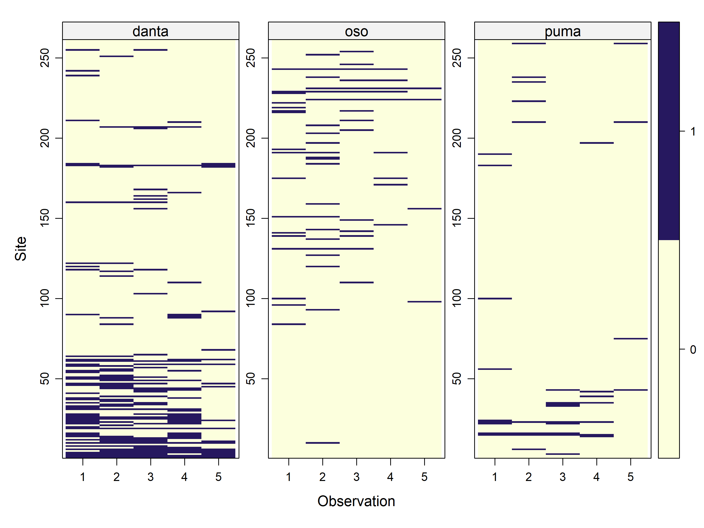
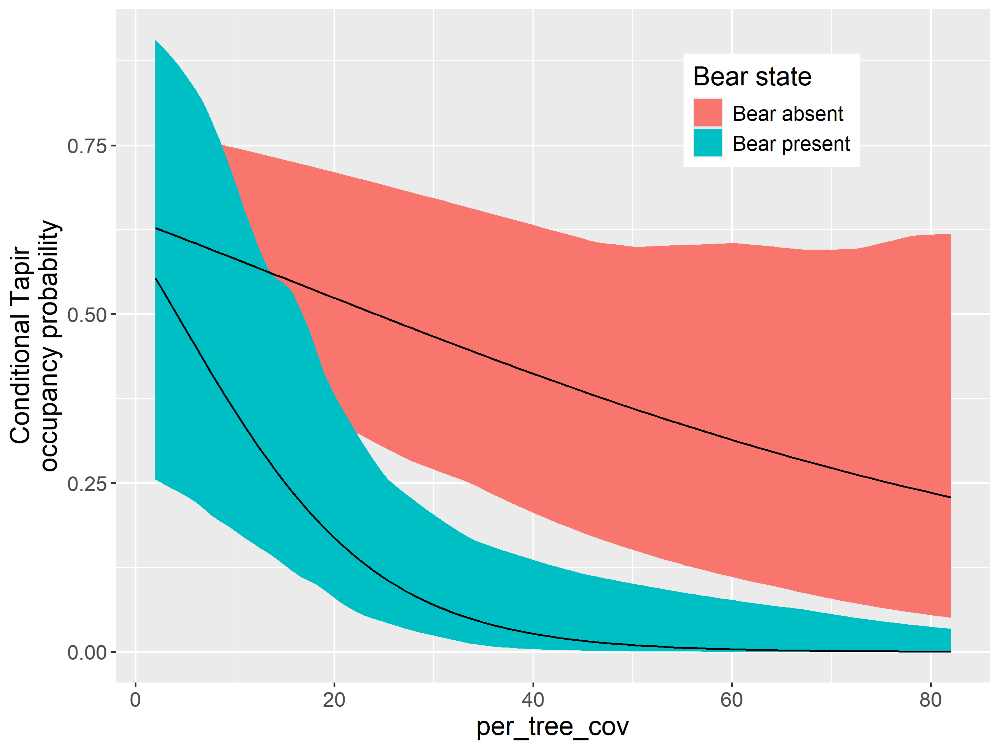
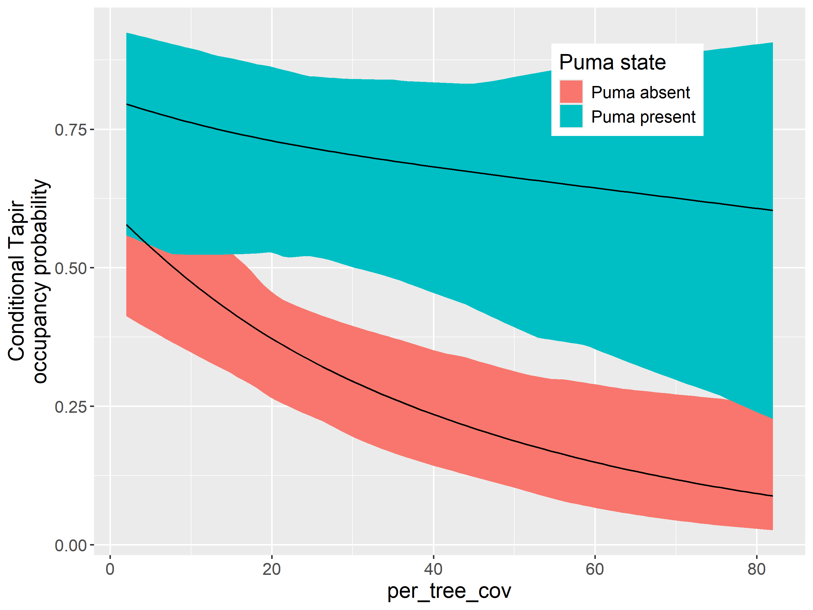
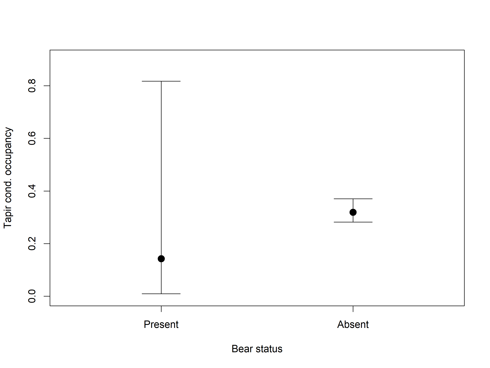
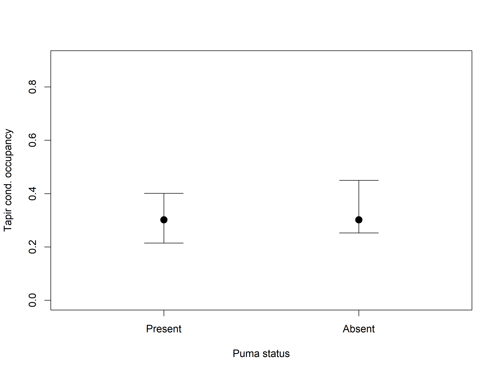
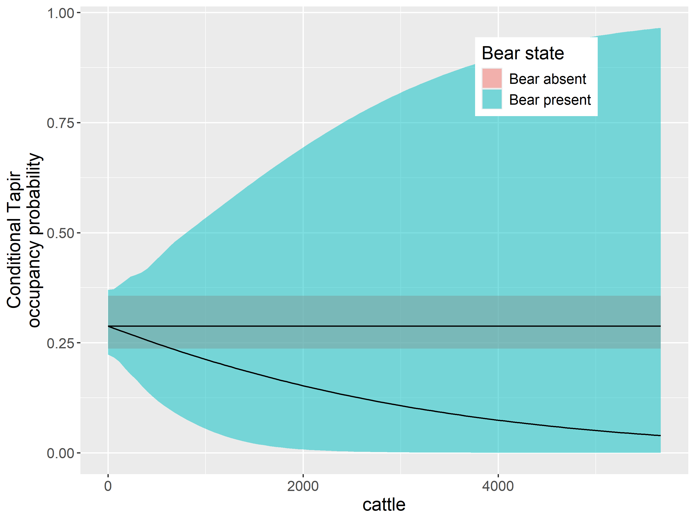
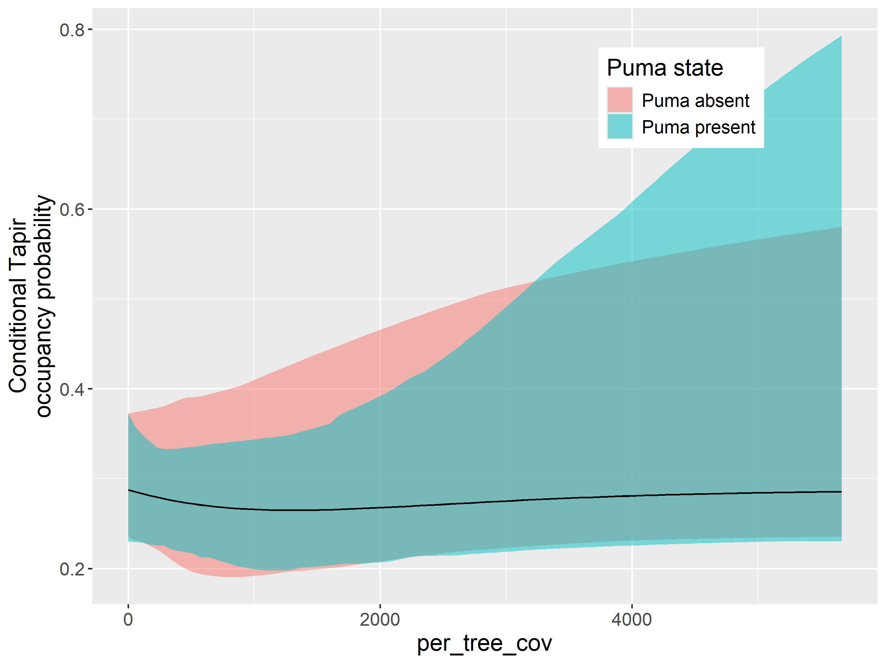

## How can we model species interactions?:

1.  Direct observations of interactions (e.g. predation events)
2.  Indirect ways:

- Over time. We can use Activity pattern analysis (e.g. Ridout and Linkie 2009, overlap R package). Doesn’t necessarily test if species are typically found in the **same locations**.

- Over space. Multispecies occupancy models. Don’t necessary test if species are active at the **same time**.

### Three are several types of multispecies occupancy models:

- Two or more species, no interactions explicitly modeled (e.g. community occupancy models; AHM1 Chap 11).

- Two species, species interaction factor, sometimes has numerical issues (MacKenzie et al. 2004).

- Two species, asymmetric interactions (Waddle et al. 2010, Richmond et al. 2010). Available in PRESENCE and MARK software.

- Two species, symmetric interactions (Rota et al. 2016, AHM2 Chap 8) \<- focus of this post.

## Load packages

Code

``` downlit

# library(ggpmthemes)
library(glue) # Interpreted String Literals
library(patchwork) # The Composer of Plots
library(readxl) # Read Excel Files
library(sf) # Simple Features for R
library(mapview) # Interactive Viewing of Spatial Data in R
library(grateful) # Facilitate Citation of R Packages
library (terra)
library(unmarked)
library(stars)
library(elevatr)
library(ubms)
library(camtrapR)
library(knitr) # A General-Purpose Package for Dynamic Report Generation in R
# options(kableExtra.auto_format = FALSE)
library(kableExtra) # Construct Complex Table with 'kable' and Pipe Syntax
library(DT)
library(tidyverse) # Easily Install and Load the 'Tidyverse'
library(ggforce) # Accelerating 'ggplot2'

library(readr)


source("C:/CodigoR/CameraTrapCesar/R/organiza_datos.R")
```

## Load data

Single campaign in raw format and next arrange to 5 occasions

### Load full dataset

Code

``` downlit

odp_ecu_col<- read_csv("C:/CodigoR/CameraTrapCesar/data/oso_danta_puma_ucu_pitalito_cocha2_ana_saldania_ecuador_noNA.csv")
```

## Convert to sf

Code

``` downlit

datos_distinct <- odp_ecu_col |> distinct(Longitude, Latitude, Deployment_id)

projlatlon <- "+proj=longlat +datum=WGS84 +no_defs +ellps=WGS84 +towgs84=0,0,0"

datos_sf <-  st_as_sf(x = datos_distinct,
                         coords = c("Longitude", 
                                    "Latitude"),
                         crs = projlatlon)

mapview(datos_sf, zcol="Deployment_id")
```

## get rasters

Code

``` downlit

#load raster
per_tree_cov <- rast("C:/CodigoR/WCS-CameraTrap/raster/latlon/Veg_Cont_Fields_Yearly_250m_v61/Perc_TreeCov/MOD44B_Perc_TreeCov_2010_065.tif")
road_den <- rast("C:/CodigoR/WCS-CameraTrap/raster/latlon/RoadDensity/grip4_total_dens_m_km2.asc")
# elev <- rast("D:/CORREGIDAS/elevation_z7.tif")
landcov <- rast("C:/CodigoR/WCS-CameraTrap/raster/latlon/LandCover_Type_Yearly_500m_v61/LC1/MCD12Q1_LC1_2010_001.tif") 
cattle <- rast("C:/CodigoR/WCS-CameraTrap/raster/latlon/Global cattle distribution/5_Ct_2010_Da.tif")
#river <- st_read("F:/WCS-CameraTrap/shp/DensidadRios/MCD12Q1_LC1_2001_001_RECLASS_MASK_GRID_3600m_DensDrenSouthAmer.shp")

# get elevation map
#elevation_detailed <- rast(get_elev_raster(sites, z = 10, clip="bbox", neg_to_na=TRUE))
elevation_detailed <- get_elev_point (datos_sf, src="aws", overwrite=TRUE)


# extract covs using points and add to sites
# covs <- cbind(sites, terra::extract(SiteCovsRast, sites))
per_tre <- terra::extract(per_tree_cov, datos_sf)
roads <- terra::extract(road_den, datos_sf)
# eleva <- terra::extract(elevation_detailed, sites)
land_cov <- terra::extract(landcov, datos_sf)
cattle_den <-  terra::extract(cattle, datos_sf)

sites <- as.data.frame(datos_sf)

# remove decimals convert to factor
sites$land_cover <-  factor(land_cov$MCD12Q1_LC1_2010_001)
# sites$elevation <-  eleva$file3be898018c3
sites$per_tree_cov <- per_tre$MOD44B_Perc_TreeCov_2010_065 
#  fix 200 isue
ind <- which(sites$per_tree_cov== 200)
sites$per_tree_cov[ind] <- 0

sites$elevation <- elevation_detailed$elevation
sites$roads <- roads$grip4_total_dens_m_km2
sites$cattle <- cattle_den[,2]

# arrange detections observations

effort <- as.data.frame(odp_ecu_col[,19:23])

ylist <- list(oso  =as.matrix(odp_ecu_col[,4:8]),
              danta=as.matrix(odp_ecu_col[,9:13]),
              puma =as.matrix(odp_ecu_col[,14:18]))

lapply(ylist, head) # look at first few rows
#> $oso
#>      o1 o2 o3 o4 o5
#> [1,]  0  0  0  0  0
#> [2,]  0  0  0  0  0
#> [3,]  0  0  0  0  0
#> [4,]  0  0  0  0  0
#> [5,]  0  0  0  0  0
#> [6,]  0  0  0  0  0
#> 
#> $danta
#>      d1 d2 d3 d4 d5
#> [1,]  1  1  1  1  1
#> [2,]  1  1  1  1  1
#> [3,]  1  1  1  0  1
#> [4,]  1  1  1  1  1
#> [5,]  0  1  1  1  1
#> [6,]  1  1  1  1  1
#> 
#> $puma
#>      p1 p2 p3 p4 p5
#> [1,]  0  0  0  0  0
#> [2,]  0  0  0  0  0
#> [3,]  0  0  1  0  0
#> [4,]  0  0  0  0  0
#> [5,]  0  0  0  0  0
#> [6,]  0  1  0  0  0

site_covs <- as.data.frame(sites[,4:7])
# site_covs$roads <- as.numeric(site_covs$roads)
# site_covs <- scale(site_covs)
head(site_covs)
#>   per_tree_cov elevation roads   cattle
#> 1           19      2199   541 2554.303
#> 2           13      2729   541 2554.303
#> 3            9      2199   541 2554.303
#> 4            5      2199   541 2554.303
#> 5            8      2199   541 2554.303
#> 6           13      2370   541 2554.303


ObsCovs_list <- list(effort= odp_ecu_col[,19:23])


# Make UMF object
umf <- unmarkedFrameOccuMulti(y=ylist, 
                              siteCovs=site_covs,
                              obsCovs=ObsCovs_list
                              )
head(umf)
#> Data frame representation of unmarkedFrame object.
#> Only showing observation matrix for species 1.
#>    y.1 y.2 y.3 y.4 y.5 per_tree_cov elevation roads   cattle effort.1 effort.2
#> 1    0   0   0   0   0           19      2199   541 2554.303      9.5       10
#> 2    0   0   0   0   0           13      2729   541 2554.303      9.5       10
#> 3    0   0   0   0   0            9      2199   541 2554.303      9.5       10
#> 4    0   0   0   0   0            5      2199   541 2554.303      9.5       10
#> 5    0   0   0   0   0            8      2199   541 2554.303      9.5       10
#> 6    0   0   0   0   0           13      2370   541 2554.303      9.5       10
#> 7    0   0   0   0   0            4      2218    57 2545.696      9.5       10
#> 8    0   0   0   0   0            5      2310    57 2545.696      9.5       10
#> 9    0   0   0   0   0           10      2310    57 2545.696      9.5       10
#> 10   0   1   0   0   0            6      2023  1315 2963.785      9.5       10
#>    effort.3 effort.4 effort.5
#> 1        10       10      4.5
#> 2        10       10      2.5
#> 3        10       10      4.5
#> 4        10       10      4.5
#> 5        10       10     10.0
#> 6        10       10      3.5
#> 7        10       10     10.0
#> 8        10       10      2.5
#> 9        10       10     10.0
#> 10       10       10      2.5
summary(umf)
#> unmarkedFrame Object
#> 
#> 287 sites
#> 3 species: oso danta puma 
#> Maximum number of observations per site: 5 
#> Mean number of observations per site:
#> oso: 5  danta: 5  puma: 5  
#> Sites with at least one detection:
#> oso: 48  danta: 88  puma: 28  
#> Tabulation of y observations:
#> oso:
#>    0    1 
#> 1364   71 
#> danta:
#>    0    1 
#> 1238  197 
#> puma:
#>    0    1 
#> 1393   42 
#> 
#> Site-level covariates:
#>   per_tree_cov     elevation        roads            cattle      
#>  Min.   : 2.00   Min.   : 684   Min.   :   0.0   Min.   :   0.0  
#>  1st Qu.:10.00   1st Qu.:2225   1st Qu.:   0.0   1st Qu.: 371.3  
#>  Median :19.00   Median :2590   Median :  59.0   Median :1599.6  
#>  Mean   :28.49   Mean   :2629   Mean   : 216.1   Mean   :1350.4  
#>  3rd Qu.:44.50   3rd Qu.:3038   3rd Qu.: 448.0   3rd Qu.:2498.4  
#>  Max.   :82.00   Max.   :4019   Max.   :1315.0   Max.   :5666.5  
#> 
#> Observation-level covariates:
#>      effort     
#>  Min.   : 0.00  
#>  1st Qu.: 9.50  
#>  Median :10.00  
#>  Mean   :11.13  
#>  3rd Qu.:19.50  
#>  Max.   :24.00

plot(umf)
```

[](index_files/figure-html/unnamed-chunk-5-1.png)

## Set up the formulas

### Intercept-only model, assuming independence

For now, we assume independence among species. We do this by only allowing 1st order natural parameters (maxOrder = 1).

This is equivalent to fitting 3 single-species occupancy models.

Code

``` downlit

umf@fDesign
#>          f1[oso] f2[danta] f3[puma] f4[oso:danta] f5[oso:puma] f6[danta:puma]
#> psi[111]       1         1        1             1            1              1
#> psi[110]       1         1        0             1            0              0
#> psi[101]       1         0        1             0            1              0
#> psi[100]       1         0        0             0            0              0
#> psi[011]       0         1        1             0            0              1
#> psi[010]       0         1        0             0            0              0
#> psi[001]       0         0        1             0            0              0
#> psi[000]       0         0        0             0            0              0
#>          f7[oso:danta:puma]
#> psi[111]                  1
#> psi[110]                  0
#> psi[101]                  0
#> psi[100]                  0
#> psi[011]                  0
#> psi[010]                  0
#> psi[001]                  0
#> psi[000]                  0

fit_1 <- occuMulti(detformulas = c('~1', '~1', '~1'),
                   stateformulas = c('~1', '~1', '~1'),
                   maxOrder = 1,
                   data = umf)

# DT::datatable(round(summary(fit_1), 3))

summary(fit_1)
#> 
#> Call:
#> occuMulti(detformulas = c("~1", "~1", "~1"), stateformulas = c("~1", 
#>     "~1", "~1"), data = umf, maxOrder = 1)
#> 
#> Occupancy (logit-scale):
#>                     Estimate    SE     z  P(>|z|)
#> [oso] (Intercept)     -1.094 0.225 -4.86 1.18e-06
#> [danta] (Intercept)   -0.715 0.134 -5.32 1.06e-07
#> [puma] (Intercept)    -1.789 0.259 -6.89 5.42e-12
#> 
#> Detection (logit-scale):
#>                     Estimate    SE     z  P(>|z|)
#> [oso] (Intercept)     -1.404 0.213 -6.58 4.64e-11
#> [danta] (Intercept)   -0.332 0.108 -3.06 2.19e-03
#> [puma] (Intercept)    -1.360 0.274 -4.96 6.95e-07
#> 
#> AIC: 1825.561 
#> Number of sites: 287
#> optim convergence code: 0
#> optim iterations: 68 
#> Bootstrap iterations: 0
```

### Intercept-only model, assuming dependence

- Set maxOrder = 2 to estimate up to 2nd order natural parameters
- Permits dependence between species
- Fixes all natural parameters \> maxOrder at 0

In fit_2 The species are interacting, but no covariates are involved.

Code

``` downlit

fit_2 <- occuMulti(detformulas = c('~1', '~1', '~1'),
                   stateformulas = c('~1', '~1', '~1',
                                     '~1', '~1', '~1'),
                   maxOrder = 2,
                   data = umf)

summary(fit_2)
#> 
#> Call:
#> occuMulti(detformulas = c("~1", "~1", "~1"), stateformulas = c("~1", 
#>     "~1", "~1", "~1", "~1", "~1"), data = umf, maxOrder = 2)
#> 
#> Occupancy (logit-scale):
#>                          Estimate    SE      z  P(>|z|)
#> [oso] (Intercept)          -0.797 0.264 -3.014 2.58e-03
#> [danta] (Intercept)        -0.720 0.190 -3.795 1.47e-04
#> [puma] (Intercept)         -2.567 0.458 -5.603 2.10e-08
#> [oso:danta] (Intercept)    -1.250 0.495 -2.524 1.16e-02
#> [oso:puma] (Intercept)      0.197 0.716  0.275 7.83e-01
#> [danta:puma] (Intercept)    1.611 0.519  3.104 1.91e-03
#> 
#> Detection (logit-scale):
#>                     Estimate    SE     z  P(>|z|)
#> [oso] (Intercept)     -1.402 0.213 -6.58 4.58e-11
#> [danta] (Intercept)   -0.329 0.108 -3.05 2.31e-03
#> [puma] (Intercept)    -1.362 0.275 -4.95 7.30e-07
#> 
#> AIC: 1811.834 
#> Number of sites: 287
#> optim convergence code: 0
#> optim iterations: 39 
#> Bootstrap iterations: 0
```

oso y danta occur together more frequently than expected by chance (p\<0.01) danta y puma occur together more frequently than expected by chance (p\<0.01)

### Incorporating covariates

Any parameter can be modeled as a function of covariates. The Covariate for each parameter can be unique names of detection covariates corresponding to names provided in named list of the `umf` object. Names of occupancy covariates correspond to names in the data.frame part of `umf`. The model below is driven by biology and have the interest in demonstrating that each parameter can be modeled uniquely.

So number of days (sampling effort) is the covariate for the detection part. Bear occupancy depends on cattle, tapir occupancy depends on elevation, and puma occupancy depends on elevation as well. The interaction oso:danta depends on cattle, oso:puma depends on per_tree_cov and danta:puma on per_tree_cov as well.

Code

``` downlit
fit_3 <- occuMulti(detformulas = c('~effort', '~effort', '~effort'),
                   stateformulas = c('~cattle', #oso
                                     '~elevation', #danta
                                     '~elevation', #puma
                                     '~cattle', #oso:danta
                                     '~per_tree_cov', #oso:puma
                                     '~per_tree_cov' #danta:puma
                                     ),
                   maxOrder = 2,
                   se=TRUE,
                   penalty=0.5,
                   data = umf)
#> Bootstraping covariance matrix

summary(fit_3)
#> 
#> Call:
#> occuMulti(detformulas = c("~effort", "~effort", "~effort"), stateformulas = c("~cattle", 
#>     "~elevation", "~elevation", "~cattle", "~per_tree_cov", "~per_tree_cov"), 
#>     data = umf, maxOrder = 2, penalty = 0.5, se = TRUE)
#> 
#> Occupancy (logit-scale):
#>                            Estimate       SE         z  P(>|z|)
#> [oso] (Intercept)         -5.18e-07 2.06e-01 -2.51e-06 1.00e+00
#> [oso] cattle              -7.89e-04 1.57e-04 -5.03e+00 5.01e-07
#> [danta] (Intercept)       -6.12e-08 4.81e-01 -1.27e-07 1.00e+00
#> [danta] elevation         -3.45e-04 2.47e-04 -1.40e+00 1.62e-01
#> [puma] (Intercept)        -3.71e-07 1.20e-01 -3.08e-06 1.00e+00
#> [puma] elevation          -1.00e-03 7.69e-05 -1.30e+01 7.08e-39
#> [oso:danta] (Intercept)   -2.67e-07 1.24e-01 -2.15e-06 1.00e+00
#> [oso:danta] cattle        -4.04e-04 6.94e-04 -5.82e-01 5.60e-01
#> [oso:puma] (Intercept)    -2.57e-07 4.84e-01 -5.31e-07 1.00e+00
#> [oso:puma] per_tree_cov   -7.89e-06 2.49e-03 -3.17e-03 9.97e-01
#> [danta:puma] (Intercept)  -1.40e-07 5.60e-01 -2.49e-07 1.00e+00
#> [danta:puma] per_tree_cov -4.20e-06 1.01e-02 -4.16e-04 1.00e+00
#> 
#> Detection (logit-scale):
#>                      Estimate     SE         z P(>|z|)
#> [oso] (Intercept)   -5.28e-07 0.7627 -6.92e-07       1
#> [oso] effort        -4.95e-06 0.0323 -1.53e-04       1
#> [danta] (Intercept) -2.76e-07 0.2390 -1.16e-06       1
#> [danta] effort      -1.79e-06 0.0191 -9.36e-05       1
#> [puma] (Intercept)  -3.21e-07 0.6453 -4.98e-07       1
#> [puma] effort       -3.23e-06 0.0147 -2.19e-04       1
#> 
#> AIC: 1977.895 
#> Number of sites: 287
#> optim convergence code: 0
#> optim iterations: 101 
#> Bootstrap iterations: 30
```

### Conditional occupancy probability

Calculation of conditional and marginal occupancy probabilities is done with the predict function.

Create a data.frame for predictions The procedure is equivalent to creating data frames for all other applications of predict Include complete range of observed cattle; hold all other variables at their mean.

Code

``` downlit
nd_cond <- data.frame(
  # cattle is the one changing from min to max
  cattle = seq(min(site_covs$cattle), max(site_covs$cattle), length.out = 100), 
  elevation = rep(mean(site_covs$elevation), 100),
  roads = rep(mean(site_covs$roads), 100),
  per_tree_cov = rep(mean(site_covs$per_tree_cov), 100) # max(site_covs$per_tree_cov),
                 # length.out = 100)
)
```

### Predicting danta occurrence when oso are present

species indicates which species we assume when predicting occupancy cond indicates which species we are assuming is present or absent

Code

``` downlit
danta_oso_1 <- predict(fit_3, type = 'state', species = 'danta',
                     cond = 'oso', newdata = nd_cond)
```

### Predicting danta occurrence when oso are absent

putting a - in front of oso tells predict you wish to assume oso are absent

Code

``` downlit

danta_oso_0 <- predict(fit_3, type = 'state', species = 'danta',
                     cond = '-oso', newdata = nd_cond)
```

### danta oso marginal occupancy box plot

Code

``` downlit
################################## Marginal
danta_marginal <- predict(fit_3, type="state", species="danta")
head(danta_marginal)
#>   Predicted         SE     lower     upper
#> 1 0.3021211 0.08128417 0.2565159 0.4397345
#> 2 0.2650259 0.09711105 0.2030555 0.4494998
#> 3 0.3021219 0.08087223 0.2578118 0.4387217
#> 4 0.3021222 0.08074926 0.2583218 0.4383562
#> 5 0.3021220 0.08083894 0.2579374 0.4386284
#> 6 0.2898338 0.08585125 0.2388948 0.4426687

oso_marginal <- predict(fit_3, type='state', species="oso") # get coyote
marg_plot_dat <- rbind(danta_marginal[1,], oso_marginal[1,])
marg_plot_dat$Species <- c("Tapir", "Bear")
marg_plot_dat
#>    Predicted         SE      lower     upper Species
#> 1 0.30212114 0.08128417 0.25651587 0.4397345   Tapir
#> 2 0.09583095 0.13700921 0.05208936 0.5353914    Bear


plot(1:2, marg_plot_dat$Predicted, ylim=c(0,0.9), 
     xlim=c(0.5,2.5), pch=19, cex=1.5, xaxt='n', 
     xlab="", ylab="Marginal occupancy")
axis(1, at=1:2, labels=marg_plot_dat$Species)

# CIs
top <- 0.1
for (i in 1:2){
  segments(i, marg_plot_dat$lower[i], i, marg_plot_dat$upper[i])
  segments(i-top, marg_plot_dat$lower[i], i+top)
  segments(i-top, marg_plot_dat$upper[i], i+top)
}
```

[](index_files/figure-html/unnamed-chunk-12-1.png)

### danta puma marginal occupancy box plot

Code

``` downlit
################################## Marginal
danta_marginal <- predict(fit_3, type="state", species="danta")
head(danta_marginal)
#>   Predicted         SE     lower     upper
#> 1 0.3021211 0.08395486 0.2565297 0.4859036
#> 2 0.2650259 0.09928923 0.2090361 0.4913584
#> 3 0.3021219 0.08334700 0.2584128 0.4845884
#> 4 0.3021222 0.08312611 0.2589106 0.4841209
#> 5 0.3021220 0.08329045 0.2585376 0.4844686
#> 6 0.2898338 0.08844256 0.2428272 0.4873957

oso_marginal <- predict(fit_3, type='state', species="puma") # get coyote
marg_plot_dat <- rbind(danta_marginal[1,], oso_marginal[1,])
marg_plot_dat$Species <- c("Tapir", "Puma")
marg_plot_dat
#>    Predicted         SE      lower     upper Species
#> 1 0.30212114 0.08395486 0.25652967 0.4859036   Tapir
#> 2 0.09927149 0.03690354 0.04093709 0.1944529    Puma


plot(1:2, marg_plot_dat$Predicted, ylim=c(0,0.9), 
     xlim=c(0.5,2.5), pch=19, cex=1.5, xaxt='n', 
     xlab="", ylab="Marginal occupancy")
axis(1, at=1:2, labels=marg_plot_dat$Species)

# CIs
top <- 0.1
for (i in 1:2){
  segments(i, marg_plot_dat$lower[i], i, marg_plot_dat$upper[i])
  segments(i-top, marg_plot_dat$lower[i], i+top)
  segments(i-top, marg_plot_dat$upper[i], i+top)
}
```

[](index_files/figure-html/unnamed-chunk-13-1.png)

### danta oso conditional box plot

Code

``` downlit

######################### Conditional
danta_oso <- predict(fit_3, type="state", species="danta", cond="oso")
head(danta_oso)
#>   Predicted        SE       lower     upper
#> 1 0.1429898 0.2461383 0.009344876 0.8173717
#> 2 0.1220171 0.2488071 0.006604323 0.8196394
#> 3 0.1429903 0.2456877 0.009881261 0.8168746
#> 4 0.1429905 0.2455080 0.010123259 0.8166972
#> 5 0.1429904 0.2456428 0.009940192 0.8168291
#> 6 0.1359140 0.2469085 0.008530747 0.8179675

danta_No_oso <- predict(fit_3, type="state", species="danta", cond="-oso")
head(danta_oso)
#>   Predicted        SE       lower     upper
#> 1 0.1429898 0.2461383 0.009344876 0.8173717
#> 2 0.1220171 0.2488071 0.006604323 0.8196394
#> 3 0.1429903 0.2456877 0.009881261 0.8168746
#> 4 0.1429905 0.2455080 0.010123259 0.8166972
#> 5 0.1429904 0.2456428 0.009940192 0.8168291
#> 6 0.1359140 0.2469085 0.008530747 0.8179675


plot_data <- rbind(danta_oso[1,], danta_No_oso[1,])
plot_data$Oso_status <- c("Present","Absent")
head(plot_data)
#>   Predicted         SE       lower     upper Oso_status
#> 1 0.1429898 0.24613826 0.009344876 0.8173717    Present
#> 2 0.3189871 0.02345546 0.282291906 0.3704988     Absent

plot(1:2, plot_data$Predicted, ylim=c(0, 0.9), 
     xlim=c(0.5,2.5), pch=19, cex=1.5, xaxt='n', 
     xlab="Bear status", ylab="Tapir cond. occupancy")
axis(1, at=1:2, labels=plot_data$Oso_status)

# CIs
top <- 0.1
for (i in 1:2){
  segments(i, plot_data$lower[i], i, plot_data$upper[i])
  segments(i-top, plot_data$lower[i], i+top)
  segments(i-top, plot_data$upper[i], i+top)
}
```

[](index_files/figure-html/unnamed-chunk-14-1.png)

### danta puma conditional box plot

Code

``` downlit

######################### Conditional
danta_oso <- predict(fit_3, type="state", species="danta", cond="puma")
head(danta_oso)
#>   Predicted         SE     lower     upper
#> 1 0.3021080 0.05173259 0.2150523 0.4010237
#> 2 0.2650173 0.04030880 0.2038915 0.3472187
#> 3 0.3021157 0.06940203 0.1926251 0.4259667
#> 4 0.3021187 0.07700312 0.1811854 0.4381635
#> 5 0.3021164 0.07128587 0.1896902 0.4290078
#> 6 0.2898249 0.05372997 0.2022631 0.3896648

danta_No_oso <- predict(fit_3, type="state", species="danta", cond="-puma")
head(danta_oso)
#>   Predicted         SE     lower     upper
#> 1 0.3021080 0.05173259 0.2150523 0.4010237
#> 2 0.2650173 0.04030880 0.2038915 0.3472187
#> 3 0.3021157 0.06940203 0.1926251 0.4259667
#> 4 0.3021187 0.07700312 0.1811854 0.4381635
#> 5 0.3021164 0.07128587 0.1896902 0.4290078
#> 6 0.2898249 0.05372997 0.2022631 0.3896648


plot_data <- rbind(danta_oso[1,], danta_No_oso[1,])
plot_data$Oso_status <- c("Present","Absent")
head(plot_data)
#>   Predicted         SE     lower     upper Oso_status
#> 1 0.3021080 0.05173259 0.2150523 0.4010237    Present
#> 2 0.3021226 0.06373796 0.2524167 0.4499569     Absent

plot(1:2, plot_data$Predicted, ylim=c(0, 0.9), 
     xlim=c(0.5,2.5), pch=19, cex=1.5, xaxt='n', 
     xlab="Puma status", ylab="Tapir cond. occupancy")
axis(1, at=1:2, labels=plot_data$Oso_status)

# CIs
top <- 0.1
for (i in 1:2){
  segments(i, plot_data$lower[i], i, plot_data$upper[i])
  segments(i-top, plot_data$lower[i], i+top)
  segments(i-top, plot_data$upper[i], i+top)
}
```

[](index_files/figure-html/unnamed-chunk-15-1.png)

### predicting with covariates

Code

``` downlit

gg_df_cond1 <- data.frame(
  cattle = rep(nd_cond$cattle, 2),
  occupancy = c(danta_oso_1$Predicted,
                danta_oso_0$Predicted),
  low = c(danta_oso_1$lower,
          danta_oso_0$lower),
  high = c(danta_oso_1$upper,
           danta_oso_0$upper),
  conditional = rep(c('Bear present', 'Bear absent'),
                    each = 100)
)


cond_fig1 <- ggplot(gg_df_cond1, aes(x = cattle, y = occupancy,
                                   group = conditional)) +
  geom_ribbon(aes(ymin = low, ymax = high, fill = conditional),  alpha=0.5) +
  geom_line() +
  ylab('Conditional Tapir\noccupancy probability') +
  xlab('cattle') +
  labs(fill = 'Bear state') +
  theme(text = element_text(size = 15),
        legend.position = c(0.75, 0.85))

cond_fig1
```

[](index_files/figure-html/unnamed-chunk-16-1.png)

#### danta puma

Code

``` downlit

danta_puma_1 <- predict(fit_3, type = 'state', species = 'danta',
                     cond = 'puma', newdata = nd_cond)

danta_puma_0 <- predict(fit_3, type = 'state', species = 'danta',
                     cond = '-puma', newdata = nd_cond)


gg_df_cond2 <- data.frame(
  cattle = rep(nd_cond$cattle, 2),
  occupancy = c(danta_puma_1$Predicted,
                danta_puma_0$Predicted),
  low = c(danta_puma_1$lower,
          danta_puma_0$lower),
  high = c(danta_puma_1$upper,
           danta_puma_0$upper),
  conditional = rep(c('Puma present', 'Puma absent'),
                    each = 100)
)


cond_fig2 <- ggplot(gg_df_cond2, aes(x = cattle, y = occupancy,
                                   group = conditional)) +
  geom_ribbon(aes(ymin = low, ymax = high, fill = conditional),  alpha=0.5) +
  geom_line() +
  ylab('Conditional Tapir\noccupancy probability') +
  xlab('per_tree_cov') +
  labs(fill = 'Puma state') +
  theme(text = element_text(size = 15),
        legend.position = c(0.75, 0.85))

cond_fig2
```

[](index_files/figure-html/unnamed-chunk-17-1.png)

https://eesc.usgs.gov/MBR/workshops/ahm2023/04_Multispecies%20_occupancy/multispecies-occupancy.html

## Package Citation

Code

``` downlit
pkgs <- cite_packages(output = "paragraph", out.dir = ".") #knitr::kable(pkgs)
pkgs
```

We used R version 4.3.2 ([R Core Team 2023](#ref-base)) and the following R packages: camtrapR v. 2.3.0 ([Niedballa et al. 2016](#ref-camtrapR)), devtools v. 2.4.5 ([Wickham et al. 2022](#ref-devtools)), DT v. 0.32 ([Xie et al. 2024](#ref-DT)), elevatr v. 0.99.0 ([Hollister et al. 2023](#ref-elevatr)), ggforce v. 0.4.2 ([Pedersen 2024a](#ref-ggforce)), glue v. 1.7.0 ([Hester and Bryan 2024](#ref-glue)), kableExtra v. 1.4.0 ([Zhu 2024](#ref-kableExtra)), knitr v. 1.46 ([Xie 2014](#ref-knitr2014), [2015](#ref-knitr2015), [2024](#ref-knitr2024)), mapview v. 2.11.2 ([Appelhans et al. 2023](#ref-mapview)), patchwork v. 1.2.0 ([Pedersen 2024b](#ref-patchwork)), quarto v. 1.4 ([Allaire and Dervieux 2024](#ref-quarto)), rmarkdown v. 2.27 ([Xie et al. 2018](#ref-rmarkdown2018), [2020](#ref-rmarkdown2020); [Allaire et al. 2024](#ref-rmarkdown2024)), sf v. 1.0.15 ([Pebesma 2018](#ref-sf2018); [Pebesma and Bivand 2023a](#ref-sf2023)), stars v. 0.6.4 ([Pebesma and Bivand 2023b](#ref-stars)), styler v. 1.10.3 ([Müller and Walthert 2024](#ref-styler)), terra v. 1.7.71 ([Hijmans 2024](#ref-terra)), tidyverse v. 2.0.0 ([Wickham et al. 2019](#ref-tidyverse)), ubms v. 1.2.6 ([Kellner et al. 2021](#ref-ubms)), unmarked v. 1.4.1 ([Fiske and Chandler 2011](#ref-unmarked2011); [Kellner et al. 2023](#ref-unmarked2023)).

## Sesion info

Session info

    #> ─ Session info ─────────────────────────────────────────────────────────────────────────────────────────────────────────────────────────────────────
    #>  setting  value
    #>  version  R version 4.3.2 (2023-10-31 ucrt)
    #>  os       Windows 10 x64 (build 19042)
    #>  system   x86_64, mingw32
    #>  ui       RTerm
    #>  language (EN)
    #>  collate  Spanish_Colombia.utf8
    #>  ctype    Spanish_Colombia.utf8
    #>  tz       America/Bogota
    #>  date     2024-07-17
    #>  pandoc   3.1.11 @ C:/Program Files/RStudio/resources/app/bin/quarto/bin/tools/ (via rmarkdown)
    #> 
    #> ─ Packages ─────────────────────────────────────────────────────────────────────────────────────────────────────────────────────────────────────────
    #>  ! package           * version  date (UTC) lib source
    #>    abind             * 1.4-5    2016-07-21 [1] CRAN (R 4.3.1)
    #>    base64enc           0.1-3    2015-07-28 [1] CRAN (R 4.3.1)
    #>    bit                 4.0.5    2022-11-15 [1] CRAN (R 4.3.2)
    #>    bit64               4.0.5    2020-08-30 [1] CRAN (R 4.3.2)
    #>    boot                1.3-28.1 2022-11-22 [2] CRAN (R 4.3.2)
    #>    brew                1.0-10   2023-12-16 [1] CRAN (R 4.3.2)
    #>    cachem              1.0.8    2023-05-01 [1] CRAN (R 4.3.2)
    #>    camtrapR          * 2.3.0    2024-02-26 [1] CRAN (R 4.3.3)
    #>    cellranger          1.1.0    2016-07-27 [1] CRAN (R 4.3.2)
    #>    class               7.3-22   2023-05-03 [2] CRAN (R 4.3.2)
    #>    classInt            0.4-10   2023-09-05 [1] CRAN (R 4.3.2)
    #>    cli                 3.6.2    2023-12-11 [1] CRAN (R 4.3.2)
    #>    codetools           0.2-19   2023-02-01 [2] CRAN (R 4.3.2)
    #>    colorspace          2.1-0    2023-01-23 [1] CRAN (R 4.3.2)
    #>    crayon              1.5.2    2022-09-29 [1] CRAN (R 4.3.2)
    #>    crosstalk           1.2.1    2023-11-23 [1] CRAN (R 4.3.2)
    #>    curl                5.2.0    2023-12-08 [1] CRAN (R 4.3.2)
    #>    data.table          1.15.0   2024-01-30 [1] CRAN (R 4.3.2)
    #>    DBI                 1.2.2    2024-02-16 [1] CRAN (R 4.3.2)
    #>    devtools            2.4.5    2022-10-11 [1] CRAN (R 4.3.2)
    #>    digest              0.6.34   2024-01-11 [1] CRAN (R 4.3.2)
    #>    dplyr             * 1.1.4    2023-11-17 [1] CRAN (R 4.3.2)
    #>    DT                * 0.32     2024-02-19 [1] CRAN (R 4.3.3)
    #>    e1071               1.7-14   2023-12-06 [1] CRAN (R 4.3.2)
    #>    elevatr           * 0.99.0   2023-09-12 [1] CRAN (R 4.3.2)
    #>    ellipsis            0.3.2    2021-04-29 [1] CRAN (R 4.3.2)
    #>    evaluate            0.23     2023-11-01 [1] CRAN (R 4.3.2)
    #>    fansi               1.0.6    2023-12-08 [1] CRAN (R 4.3.2)
    #>    farver              2.1.1    2022-07-06 [1] CRAN (R 4.3.2)
    #>    fastmap             1.1.1    2023-02-24 [1] CRAN (R 4.3.2)
    #>    forcats           * 1.0.0    2023-01-29 [1] CRAN (R 4.3.2)
    #>    fs                  1.6.3    2023-07-20 [1] CRAN (R 4.3.2)
    #>    generics            0.1.3    2022-07-05 [1] CRAN (R 4.3.2)
    #>    ggforce           * 0.4.2    2024-02-19 [1] CRAN (R 4.3.3)
    #>    ggplot2           * 3.5.1    2024-04-23 [1] CRAN (R 4.3.3)
    #>    glue              * 1.7.0    2024-01-09 [1] CRAN (R 4.3.2)
    #>    grateful          * 0.2.4    2023-10-22 [1] CRAN (R 4.3.3)
    #>    gridExtra           2.3      2017-09-09 [1] CRAN (R 4.3.2)
    #>    gtable              0.3.4    2023-08-21 [1] CRAN (R 4.3.2)
    #>    hms                 1.1.3    2023-03-21 [1] CRAN (R 4.3.2)
    #>    htmltools           0.5.7    2023-11-03 [1] CRAN (R 4.3.2)
    #>    htmlwidgets         1.6.4    2023-12-06 [1] CRAN (R 4.3.2)
    #>    httpuv              1.6.14   2024-01-26 [1] CRAN (R 4.3.2)
    #>    httr                1.4.7    2023-08-15 [1] CRAN (R 4.3.2)
    #>    inline              0.3.19   2021-05-31 [1] CRAN (R 4.3.2)
    #>    jquerylib           0.1.4    2021-04-26 [1] CRAN (R 4.3.2)
    #>    jsonlite            1.8.8    2023-12-04 [1] CRAN (R 4.3.2)
    #>    kableExtra        * 1.4.0    2024-01-24 [1] CRAN (R 4.3.3)
    #>    KernSmooth          2.23-22  2023-07-10 [2] CRAN (R 4.3.2)
    #>    knitr             * 1.46     2024-04-06 [1] CRAN (R 4.3.3)
    #>    labeling            0.4.3    2023-08-29 [1] CRAN (R 4.3.1)
    #>    later               1.3.2    2023-12-06 [1] CRAN (R 4.3.2)
    #>    lattice             0.22-5   2023-10-24 [1] CRAN (R 4.3.2)
    #>    leafem              0.2.3    2023-09-17 [1] CRAN (R 4.3.2)
    #>    leaflet             2.2.1    2023-11-13 [1] CRAN (R 4.3.2)
    #>    leaflet.providers   2.0.0    2023-10-17 [1] CRAN (R 4.3.2)
    #>    leafpop             0.1.0    2021-05-22 [1] CRAN (R 4.3.2)
    #>    lifecycle           1.0.4    2023-11-07 [1] CRAN (R 4.3.2)
    #>    lme4                1.1-35.3 2024-04-16 [1] CRAN (R 4.3.2)
    #>    loo                 2.7.0    2024-02-24 [1] CRAN (R 4.3.2)
    #>    lubridate         * 1.9.3    2023-09-27 [1] CRAN (R 4.3.2)
    #>    magrittr            2.0.3    2022-03-30 [1] CRAN (R 4.3.2)
    #>    mapview           * 2.11.2   2023-10-13 [1] CRAN (R 4.3.2)
    #>    MASS                7.3-60   2023-05-04 [2] CRAN (R 4.3.2)
    #>    Matrix              1.6-1.1  2023-09-18 [2] CRAN (R 4.3.2)
    #>    matrixStats         1.2.0    2023-12-11 [1] CRAN (R 4.3.2)
    #>    memoise             2.0.1    2021-11-26 [1] CRAN (R 4.3.2)
    #>    mgcv                1.9-1    2023-12-21 [1] CRAN (R 4.3.3)
    #>    mime                0.12     2021-09-28 [1] CRAN (R 4.3.1)
    #>    miniUI              0.1.1.1  2018-05-18 [1] CRAN (R 4.3.2)
    #>    minqa               1.2.6    2023-09-11 [1] CRAN (R 4.3.2)
    #>    munsell             0.5.0    2018-06-12 [1] CRAN (R 4.3.2)
    #>    nlme                3.1-163  2023-08-09 [2] CRAN (R 4.3.2)
    #>    nloptr              2.0.3    2022-05-26 [1] CRAN (R 4.3.2)
    #>    patchwork         * 1.2.0    2024-01-08 [1] CRAN (R 4.3.3)
    #>    pbapply             1.7-2    2023-06-27 [1] CRAN (R 4.3.2)
    #>    pillar              1.9.0    2023-03-22 [1] CRAN (R 4.3.2)
    #>    pkgbuild            1.4.4    2024-03-17 [1] CRAN (R 4.3.3)
    #>    pkgconfig           2.0.3    2019-09-22 [1] CRAN (R 4.3.2)
    #>    pkgload             1.3.4    2024-01-16 [1] CRAN (R 4.3.2)
    #>    png                 0.1-8    2022-11-29 [1] CRAN (R 4.3.1)
    #>    polyclip            1.10-6   2023-09-27 [1] CRAN (R 4.3.1)
    #>    prettyunits         1.2.0    2023-09-24 [1] CRAN (R 4.3.2)
    #>    processx            3.8.3    2023-12-10 [1] CRAN (R 4.3.2)
    #>    profvis             0.3.8    2023-05-02 [1] CRAN (R 4.3.2)
    #>    progress            1.2.3    2023-12-06 [1] CRAN (R 4.3.3)
    #>    progressr           0.14.0   2023-08-10 [1] CRAN (R 4.3.2)
    #>    promises            1.2.1    2023-08-10 [1] CRAN (R 4.3.2)
    #>    proxy               0.4-27   2022-06-09 [1] CRAN (R 4.3.2)
    #>    ps                  1.7.6    2024-01-18 [1] CRAN (R 4.3.2)
    #>    purrr             * 1.0.2    2023-08-10 [1] CRAN (R 4.3.2)
    #>    quarto            * 1.4      2024-03-06 [1] CRAN (R 4.3.3)
    #>    QuickJSR            1.1.3    2024-01-31 [1] CRAN (R 4.3.2)
    #>    R.cache             0.16.0   2022-07-21 [1] CRAN (R 4.3.3)
    #>    R.methodsS3         1.8.2    2022-06-13 [1] CRAN (R 4.3.3)
    #>    R.oo                1.26.0   2024-01-24 [1] CRAN (R 4.3.3)
    #>    R.utils             2.12.3   2023-11-18 [1] CRAN (R 4.3.3)
    #>    R6                  2.5.1    2021-08-19 [1] CRAN (R 4.3.2)
    #>    raster              3.6-26   2023-10-14 [1] CRAN (R 4.3.2)
    #>    Rcpp                1.0.12   2024-01-09 [1] CRAN (R 4.3.2)
    #>    RcppNumerical       0.6-0    2023-09-06 [1] CRAN (R 4.3.3)
    #>  D RcppParallel        5.1.7    2023-02-27 [1] CRAN (R 4.3.2)
    #>    readr             * 2.1.5    2024-01-10 [1] CRAN (R 4.3.2)
    #>    readxl            * 1.4.3    2023-07-06 [1] CRAN (R 4.3.2)
    #>    remotes             2.5.0    2024-03-17 [1] CRAN (R 4.3.3)
    #>    renv                1.0.7    2024-04-11 [1] CRAN (R 4.3.3)
    #>    rlang               1.1.3    2024-01-10 [1] CRAN (R 4.3.2)
    #>    rmarkdown           2.27     2024-05-17 [1] CRAN (R 4.3.3)
    #>    RSpectra            0.16-1   2022-04-24 [1] CRAN (R 4.3.2)
    #>    rstan               2.32.6   2024-03-05 [1] CRAN (R 4.3.3)
    #>    rstantools          2.4.0    2024-01-31 [1] CRAN (R 4.3.2)
    #>    rstudioapi          0.16.0   2024-03-24 [1] CRAN (R 4.3.3)
    #>    satellite           1.0.5    2024-02-10 [1] CRAN (R 4.3.2)
    #>    scales              1.3.0    2023-11-28 [1] CRAN (R 4.3.3)
    #>    secr                4.6.6    2024-02-29 [1] CRAN (R 4.3.3)
    #>    sessioninfo         1.2.2    2021-12-06 [1] CRAN (R 4.3.2)
    #>    sf                * 1.0-15   2023-12-18 [1] CRAN (R 4.3.2)
    #>    shiny               1.8.0    2023-11-17 [1] CRAN (R 4.3.2)
    #>    slippymath          0.3.1    2019-06-28 [1] CRAN (R 4.3.2)
    #>    sp                  2.1-3    2024-01-30 [1] CRAN (R 4.3.2)
    #>    StanHeaders         2.32.5   2024-01-10 [1] CRAN (R 4.3.2)
    #>    stars             * 0.6-4    2023-09-11 [1] CRAN (R 4.3.2)
    #>    stringi             1.8.3    2023-12-11 [1] CRAN (R 4.3.2)
    #>    stringr           * 1.5.1    2023-11-14 [1] CRAN (R 4.3.2)
    #>    styler            * 1.10.3   2024-04-07 [1] CRAN (R 4.3.3)
    #>    svglite             2.1.3    2023-12-08 [1] CRAN (R 4.3.2)
    #>    systemfonts         1.0.5    2023-10-09 [1] CRAN (R 4.3.2)
    #>    terra             * 1.7-71   2024-01-31 [1] CRAN (R 4.3.2)
    #>    tibble            * 3.2.1    2023-03-20 [1] CRAN (R 4.3.2)
    #>    tidyr             * 1.3.1    2024-01-24 [1] CRAN (R 4.3.2)
    #>    tidyselect          1.2.1    2024-03-11 [1] CRAN (R 4.3.3)
    #>    tidyverse         * 2.0.0    2023-02-22 [1] CRAN (R 4.3.2)
    #>    timechange          0.3.0    2024-01-18 [1] CRAN (R 4.3.2)
    #>    tweenr              2.0.3    2024-02-26 [1] CRAN (R 4.3.3)
    #>    tzdb                0.4.0    2023-05-12 [1] CRAN (R 4.3.2)
    #>    ubms              * 1.2.6    2023-09-11 [1] CRAN (R 4.3.2)
    #>    units               0.8-5    2023-11-28 [1] CRAN (R 4.3.2)
    #>    unmarked          * 1.4.1    2024-01-09 [1] CRAN (R 4.3.2)
    #>    urlchecker          1.0.1    2021-11-30 [1] CRAN (R 4.3.2)
    #>    usethis             2.2.3    2024-02-19 [1] CRAN (R 4.3.2)
    #>    utf8                1.2.4    2023-10-22 [1] CRAN (R 4.3.2)
    #>    uuid                1.2-0    2024-01-14 [1] CRAN (R 4.3.2)
    #>    V8                  4.4.2    2024-02-15 [1] CRAN (R 4.3.3)
    #>    vctrs               0.6.5    2023-12-01 [1] CRAN (R 4.3.2)
    #>    viridisLite         0.4.2    2023-05-02 [1] CRAN (R 4.3.2)
    #>    vroom               1.6.5    2023-12-05 [1] CRAN (R 4.3.2)
    #>    withr               3.0.0    2024-01-16 [1] CRAN (R 4.3.2)
    #>    xfun                0.44     2024-05-15 [1] CRAN (R 4.3.3)
    #>    xml2                1.3.6    2023-12-04 [1] CRAN (R 4.3.2)
    #>    xtable              1.8-4    2019-04-21 [1] CRAN (R 4.3.2)
    #>    yaml                2.3.8    2023-12-11 [1] CRAN (R 4.3.2)
    #> 
    #>  [1] C:/Users/usuario/AppData/Local/R/win-library/4.3
    #>  [2] C:/Program Files/R/R-4.3.2/library
    #> 
    #>  D ── DLL MD5 mismatch, broken installation.
    #> 
    #> ────────────────────────────────────────────────────────────────────────────────────────────────────────────────────────────────────────────────────

Back to top

## References

Allaire, JJ, and Christophe Dervieux. 2024. *quarto: R Interface to “Quarto” Markdown Publishing System*. <https://CRAN.R-project.org/package=quarto>.

Allaire, JJ, Yihui Xie, Christophe Dervieux, et al. 2024. *rmarkdown: Dynamic Documents for r*. <https://github.com/rstudio/rmarkdown>.

Appelhans, Tim, Florian Detsch, Christoph Reudenbach, and Stefan Woellauer. 2023. *mapview: Interactive Viewing of Spatial Data in r*. <https://CRAN.R-project.org/package=mapview>.

Fiske, Ian, and Richard Chandler. 2011. “unmarked: An R Package for Fitting Hierarchical Models of Wildlife Occurrence and Abundance.” *Journal of Statistical Software* 43 (10): 1–23. <https://www.jstatsoft.org/v43/i10/>.

Hester, Jim, and Jennifer Bryan. 2024. *glue: Interpreted String Literals*. <https://CRAN.R-project.org/package=glue>.

Hijmans, Robert J. 2024. *terra: Spatial Data Analysis*. <https://CRAN.R-project.org/package=terra>.

Hollister, Jeffrey, Tarak Shah, Jakub Nowosad, Alec L. Robitaille, Marcus W. Beck, and Mike Johnson. 2023. *elevatr: Access Elevation Data from Various APIs*. <https://doi.org/10.5281/zenodo.8335450>.

Kellner, Kenneth F., Nicholas L. Fowler, Tyler R. Petroelje, Todd M. Kautz, Dean E. Beyer, and Jerrold L. Belant. 2021. “ubms: An R Package for Fitting Hierarchical Occupancy and n-Mixture Abundance Models in a Bayesian Framework.” *Methods in Ecology and Evolution* 13: 577–84. <https://doi.org/10.1111/2041-210X.13777>.

Kellner, Kenneth F., Adam D. Smith, J. Andrew Royle, Marc Kery, Jerrold L. Belant, and Richard B. Chandler. 2023. “The unmarked R Package: Twelve Years of Advances in Occurrence and Abundance Modelling in Ecology.” *Methods in Ecology and Evolution* 14 (6): 1408–15. <https://www.jstatsoft.org/v43/i10/>.

Müller, Kirill, and Lorenz Walthert. 2024. *styler: Non-Invasive Pretty Printing of r Code*. <https://CRAN.R-project.org/package=styler>.

Niedballa, Jürgen, Rahel Sollmann, Alexandre Courtiol, and Andreas Wilting. 2016. “camtrapR: An r Package for Efficient Camera Trap Data Management.” *Methods in Ecology and Evolution* 7 (12): 1457–62. <https://doi.org/10.1111/2041-210X.12600>.

Pebesma, Edzer. 2018. “Simple Features for R: Standardized Support for Spatial Vector Data.” *The R Journal* 10 (1): 439–46. <https://doi.org/10.32614/RJ-2018-009>.

Pebesma, Edzer, and Roger Bivand. 2023a. *Spatial Data Science: With applications in R*. Chapman and Hall/CRC. <https://doi.org/10.1201/9780429459016>.

Pebesma, Edzer, and Roger Bivand. 2023b. *Spatial Data Science: With applications in R*. Chapman; Hall/CRC. <https://doi.org/10.1201/9780429459016>.

Pedersen, Thomas Lin. 2024a. *ggforce: Accelerating “ggplot2”*. <https://CRAN.R-project.org/package=ggforce>.

Pedersen, Thomas Lin. 2024b. *patchwork: The Composer of Plots*. <https://CRAN.R-project.org/package=patchwork>.

R Core Team. 2023. *R: A Language and Environment for Statistical Computing*. R Foundation for Statistical Computing. <https://www.R-project.org/>.

Wickham, Hadley, Mara Averick, Jennifer Bryan, et al. 2019. “Welcome to the tidyverse.” *Journal of Open Source Software* 4 (43): 1686. <https://doi.org/10.21105/joss.01686>.

Wickham, Hadley, Jim Hester, Winston Chang, and Jennifer Bryan. 2022. *devtools: Tools to Make Developing r Packages Easier*. <https://CRAN.R-project.org/package=devtools>.

Xie, Yihui. 2014. “knitr: A Comprehensive Tool for Reproducible Research in R.” In *Implementing Reproducible Computational Research*, edited by Victoria Stodden, Friedrich Leisch, and Roger D. Peng. Chapman; Hall/CRC.

Xie, Yihui. 2015. *Dynamic Documents with R and Knitr*. 2nd ed. Chapman; Hall/CRC. <https://yihui.org/knitr/>.

Xie, Yihui. 2024. *knitr: A General-Purpose Package for Dynamic Report Generation in r*. <https://yihui.org/knitr/>.

Xie, Yihui, J. J. Allaire, and Garrett Grolemund. 2018. *R Markdown: The Definitive Guide*. Chapman; Hall/CRC. <https://bookdown.org/yihui/rmarkdown>.

Xie, Yihui, Joe Cheng, and Xianying Tan. 2024. *DT: A Wrapper of the JavaScript Library “DataTables”*. <https://CRAN.R-project.org/package=DT>.

Xie, Yihui, Christophe Dervieux, and Emily Riederer. 2020. *R Markdown Cookbook*. Chapman; Hall/CRC. <https://bookdown.org/yihui/rmarkdown-cookbook>.

Zhu, Hao. 2024. *kableExtra: Construct Complex Table with “kable” and Pipe Syntax*. <https://CRAN.R-project.org/package=kableExtra>.

## Citation

BibTeX citation:

``` quarto-appendix-bibtex
@online{j._lizcano2024,
  author = {J. Lizcano, Diego},
  title = {A Multi-Species (Species Interactions) Occupancy Model},
  date = {2024-07-07},
  url = {https://dlizcano.github.io/cameratrap/posts/2024-07-05-multi-species-interacting-occupancy/},
  langid = {en}
}
```

For attribution, please cite this work as:

J. Lizcano, Diego. 2024. “A Multi-Species (Species Interactions) Occupancy Model.” July 7. <https://dlizcano.github.io/cameratrap/posts/2024-07-05-multi-species-interacting-occupancy/>.
