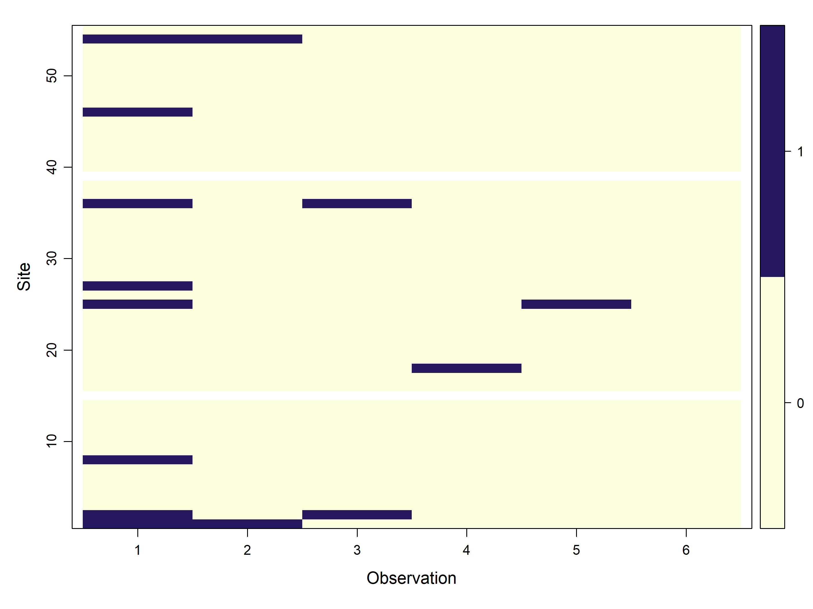
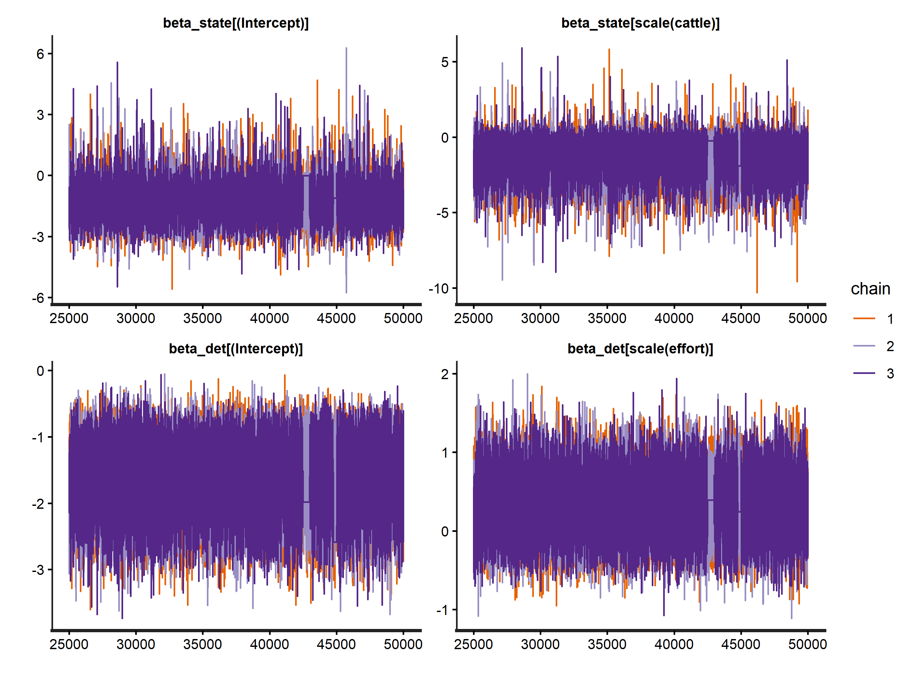
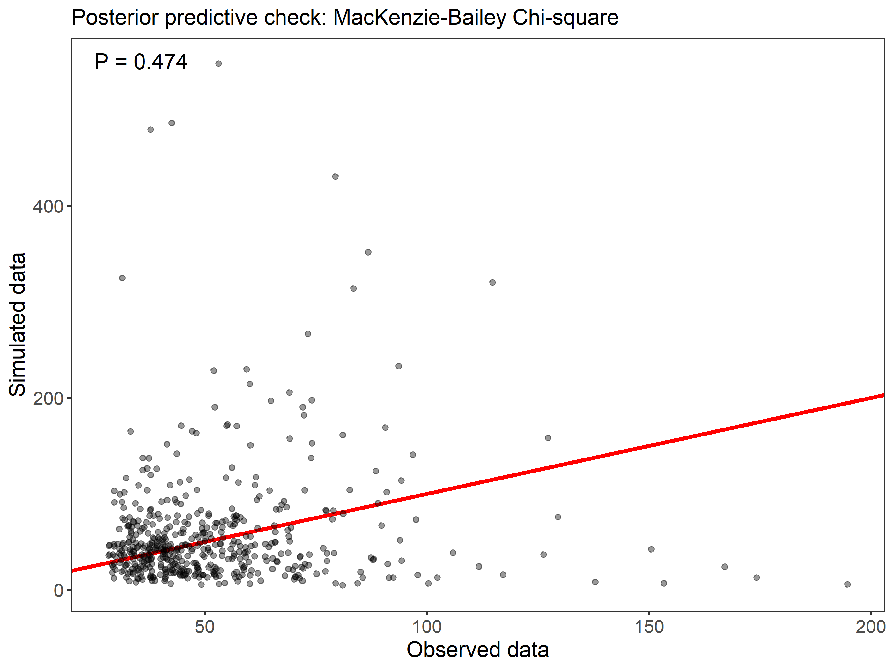
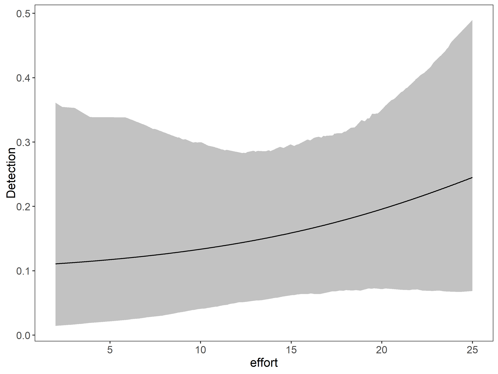
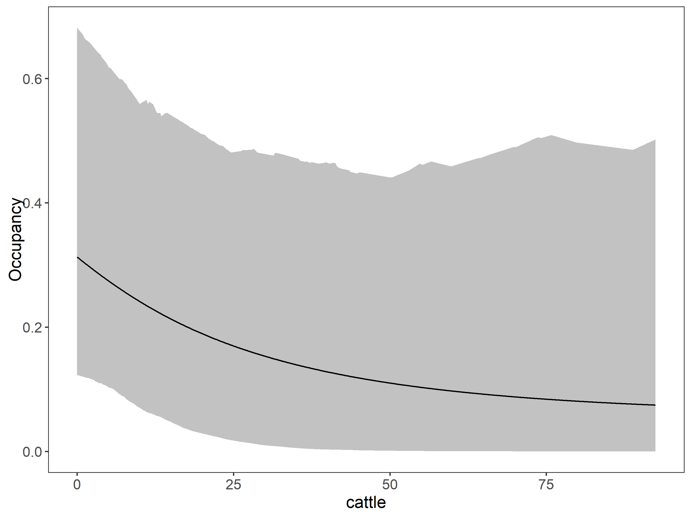
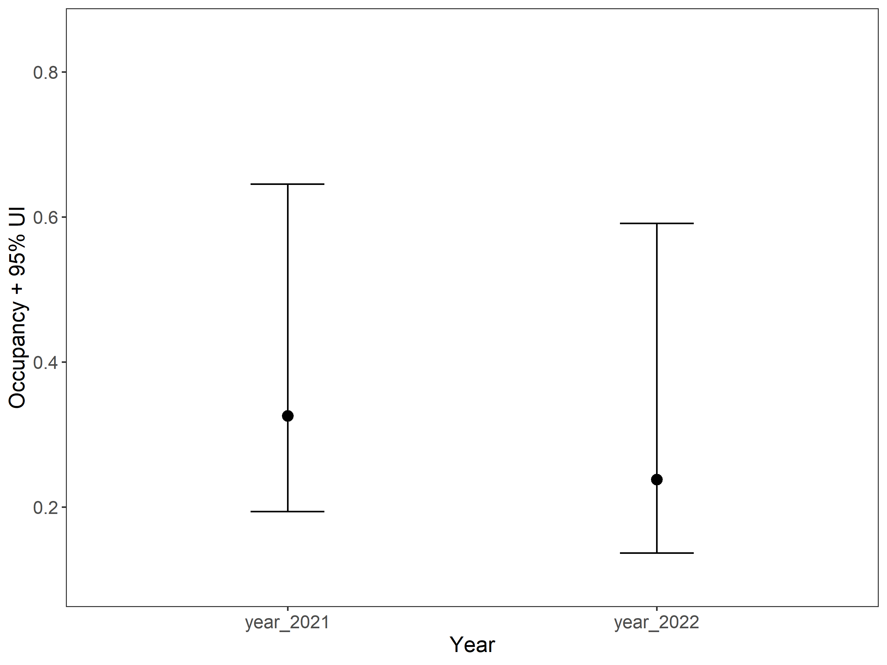
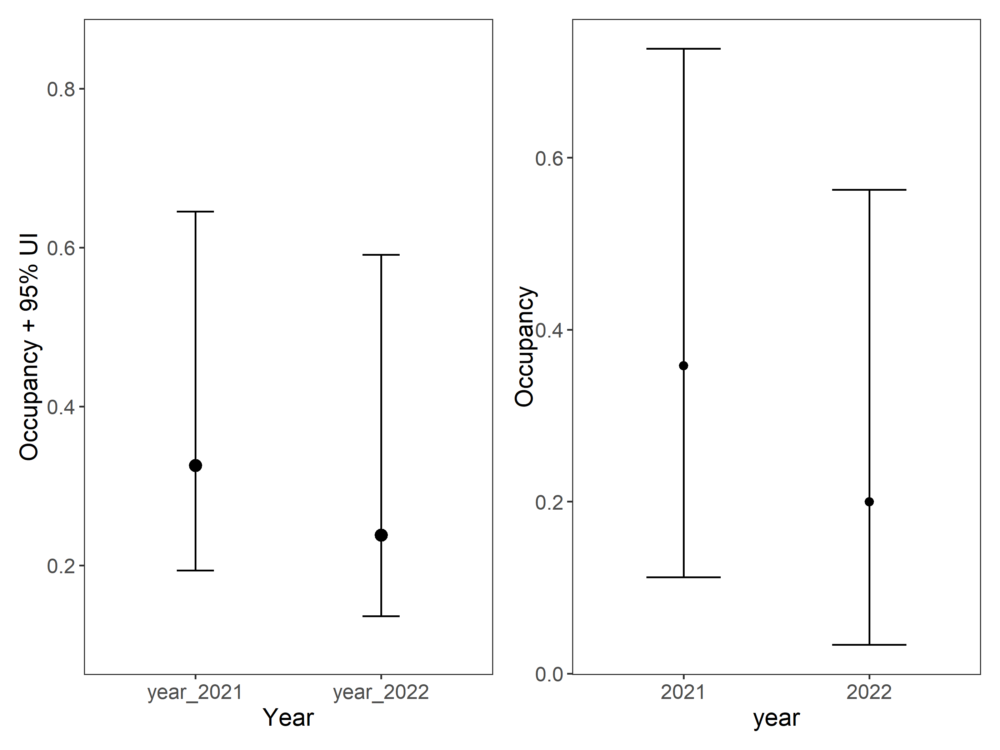
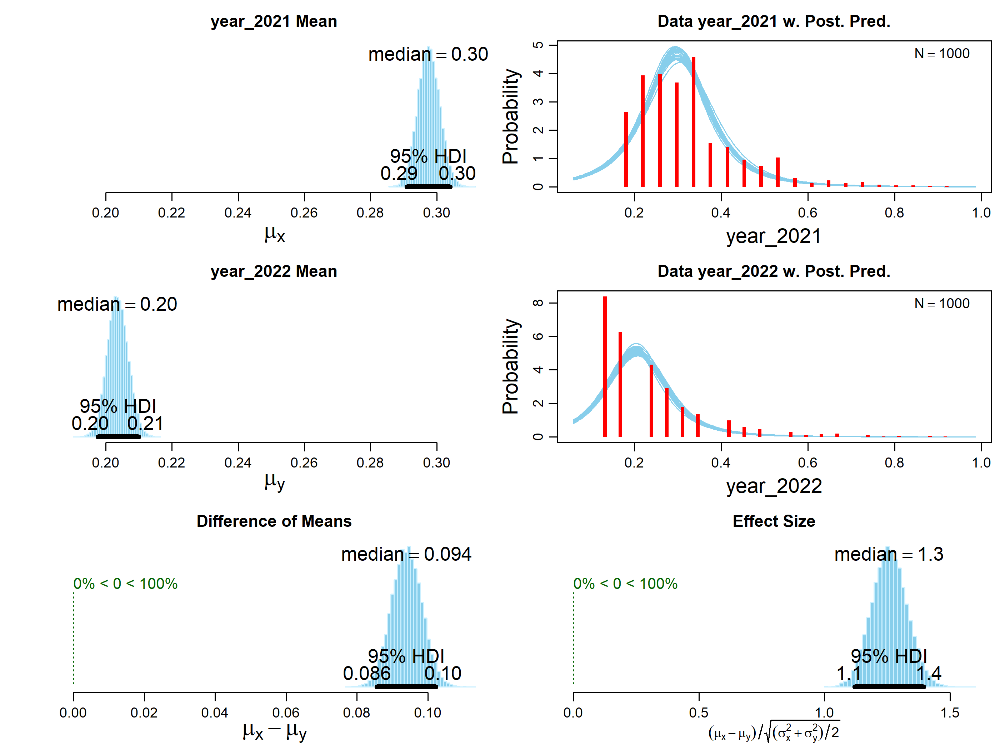

## Shoud I use a multiseason model?

Multi-season (or dynamic) models are commonly used to estimate colonization and/or extinction probabilities, and to test hypotheses on these parameters (using covariates on the parameters gamma and epsilon). This approach needs good amounts of data (many sites, and specially many seasons or years). If you don’t need to estimate dynamic parameters (Colonization or extinction, gamma and epsilon) but you’d like to test for temporal variation in occupancy (Psi) between two or three years taking in to account detection probability (p) you could apply a single-season model with random effects (being random effects the camera trap, sampling unit, or site), by stacking years (i.e., your sampling units would be combination camera-years).

## Using random effects with `ubms`

One of the advantages of the package `ubms` is that it is possible to include random effects easily in your models, using the same syntax as `lme4` (Bates et al. 2015). For example, if you have a group or site covariate, you can fit a model with random intercepts by group-site by including + (1\|site) in your parameter formula. Random slopes, or a combination of random slopes and intercepts, are also possible.

To illustrate the use of random effects using the package `ubms`, in this post, we fit a model using a “stacked” model approach. Additionally in `ubms` you can instead include, for example, random site intercepts to account for possible pseudoreplication, or handle the temporal autocorrelation structure of o two-three year dataset.

Recently (February 2025) [version 1.5.0 of `unmarked`](https://github.com/biodiverse/unmarked/releases/tag/v1.5.0) also incorporated random effects and community models.

## The “stacked” model

An alternative approach to try a dynamic model, is to fit multiple years of data into a single-season model, using the “stacked” approach. Essentially, you treat unique site-year combinations as sites and can make occupancy comparisons between years.

There are several potential reasons for this:

- 1.  Take in to account that dynamic models and Dail-Madsen type models are particularly data hungry.
- 2.  You are not interested in the transition probabilities (colonization or extinction rates).
- 3.  You have very few years or seasons (less than five) in your sampling design, and the occupancy did not changed substantially in those few years.

This is specially useful if you only have 2 years of data, so there is no great gain in fitting a dynamic occupancy model with the four parameters parameters \\\Psi\\, \\p\\, \\\gamma\\, and \\\epsilon\\, especially if you have a low number of detections and few years or seasond. So the best approach is combining (stacking) the two-treee years, and running a single season occupancy model, with just two parameters (\\\Psi\\ and \\p\\ instead of four parameters), with year as an explanatory variable and the site as random effect as using `lme4` notation as:

model \<- occu (~ effort ~ elevation + year + (1 \| site), data = newOccu)

## Load packages

First we load some packages

Code

``` downlit

library(grateful) # Facilitate Citation of R Packages
library(patchwork) # The Composer of Plots
library(readxl) # Read Excel Files
library(sf) # Simple Features for R
library(mapview) # Interactive Viewing of Spatial Data in R
library(terra) # Spatial Data Analysis
library(elevatr) # Access Elevation Data from Various APIs
library(readr) # read csv files 

library(camtrapR) # Camera Trap Data Management and Preparation of Occupancy and Spatial Capture-Recapture Analyses 
library(ubms) # bayesian occupancy modeling
library(lme4) # 
library(DT) # nice tables

library(kableExtra) # Construct Complex Table with 'kable' and Pipe Syntax
library(tidyverse) # Load the 'Tidyverse'
```

## Load data

The data set is [downloaded from Initiative Monitoreo Katios in Wildlife insights](https://app.wildlifeinsights.org/initiatives/2000172/Monitoreo-Katios) were we sampled with an array of 30 cameras on two consecutive years in Katios National Park in Colombia.


Initiative Monitoreo Katios

Code

``` downlit

path <- "C:/CodigoR/CameraTrapCesar/data/katios/"
cameras <- read_csv(paste(path, "cameras.csv", sep=""))
deployment <- read_csv(paste(path, "deployments.csv", sep=""))
images <- read_csv(paste(path, "images.csv", sep=""))
project <- read_csv(paste(path, "projects.csv", sep=""))

# join_by(project_id, camera_id, camera_name)`
cam_deploy <- cameras |> left_join(deployment) |> 
  dplyr::mutate(year=lubridate::year(start_date)) #|> filter(year== 2023)
cam_deploy_image <- images  |> 
  left_join(cam_deploy) |> 
  mutate(scientificName= paste(genus, species, sep = " ")) |> 
   mutate(deployment_id_cam=paste(deployment_id, camera_id, sep = "-")) #|> 
  # filter(year==2022)
```

## Convert to sf and view the map

Code

``` downlit

datos_distinct <- cam_deploy_image |> distinct(longitude, latitude, deployment_id, samp_year) |> as.data.frame()

# Fix NA camera 16
datos_distinct[16,] <- c( -77.2787, 7.73855, 
                      "CT-K1-31-124", 2021)

projlatlon <- "+proj=longlat +datum=WGS84 +no_defs +ellps=WGS84 +towgs84=0,0,0"

datos_sf <-  st_as_sf(x = datos_distinct,
                         coords = c("longitude", 
                                    "latitude"),
                         crs = projlatlon)

mapview(st_jitter(datos_sf, 0.00075) , zcol="samp_year")
```

Notice we used the function [`st_jitter()`](https://r-spatial.github.io/sf/reference/st_jitter.html) because the points are on top of the previous year.

## Extract site covariates

Using the coordinates of the `sf` object (datos_sf) we put the cameras on top of the covaraies and with the function [`terra::extract()`](https://rspatial.github.io/terra/reference/extract.html) we get the covariate value.

In this case we used as covariates:

- Cattle distribution as number of cows per 10 square kilometer ([Gilbert et al. 2018](#ref-Gilbert2018)).
- Percent of tree cover from [MODIS product 44B](https://lpdaac.usgs.gov/products/mod44bv006/).
- Road density from ([Meijer et al. 2018](#ref-Meijer2018)).
- Land cover types from [MODIS](https://lpdaac.usgs.gov/products/mcd12q1v006/).

Code

``` downlit
#load rasters
per_tree_cov <- rast("C:/CodigoR/WCS-CameraTrap/raster/latlon/Veg_Cont_Fields_Yearly_250m_v61/Perc_TreeCov/MOD44B_Perc_TreeCov_2021_065.tif")
road_den <- rast("C:/CodigoR/WCS-CameraTrap/raster/latlon/RoadDensity/grip4_total_dens_m_km2.asc")
# elev <- rast("D:/CORREGIDAS/elevation_z7.tif")
landcov <- rast("C:/CodigoR/WCS-CameraTrap/raster/latlon/LandCover_Type_Yearly_500m_v61/LC1/MCD12Q1_LC1_2021_001.tif") 
cattle <- rast("C:/CodigoR/WCS-CameraTrap/raster/latlon/Global cattle distribution/5_Ct_2010_Da.tif")
#river <- st_read("F:/WCS-CameraTrap/shp/DensidadRios/MCD12Q1_LC1_2001_001_RECLASS_MASK_GRID_3600m_DensDrenSouthAmer.shp")

# get elevation map
# elevation_detailed <- rast(get_elev_raster(sites, z = 10, clip="bbox", neg_to_na=TRUE))
# elevation_detailed <- get_elev_point (datos_sf, src="aws", overwrite=TRUE)


# extract covs using points and add to sites
# covs <- cbind(sites, terra::extract(SiteCovsRast, sites))
per_tre <- terra::extract(per_tree_cov, datos_sf)
roads <- terra::extract(road_den, datos_sf)
# eleva <- terra::extract(elevation_detailed, sites)
land_cov <- terra::extract(landcov, datos_sf)
cattle_den <-  terra::extract(cattle, datos_sf)

#### drop geometry 
sites <- datos_sf %>%
  mutate(lat = st_coordinates(.)[,1],
         lon = st_coordinates(.)[,2]) %>%
  st_drop_geometry() |> as.data.frame()

# remove decimals convert to factor
sites$land_cover <-  factor(land_cov$MCD12Q1_LC1_2021_001)
# sites$elevation <-  eleva$file3be898018c3
sites$per_tree_cov <- per_tre$MOD44B_Perc_TreeCov_2021_065 
#  fix 200 isue
ind <- which(sites$per_tree_cov== 200)
sites$per_tree_cov[ind] <- 0

# sites$elevation <- elevation_detailed$elevation
sites$roads <- roads$grip4_total_dens_m_km2
sites$cattle <- cattle_den[,2]


write.csv(sites, "C:/CodigoR/CameraTrapCesar/data/katios/stacked/site_covs.csv")
```

## Select by years and convert to stacked format

To get the detection history we use the function detectionHistory of the `camtrapR` package.

> **TIP:**
>
> | obs1 | obs2 | obs3 | site | year |
> |------|------|------|------|------|
> | 0    | 0    | 0    | 1    | 1    |
> | 0    | 0    | 0    | 2    | 1    |
> | 1    | NA   | NA   | 3    | 1    |
> | 0    | 0    | 0    | 4    | 1    |
> | 0    | 0    | 0    | 1    | 2    |
> | 1    | 0    | 1    | 2    | 2    |
> | 0    | 1    | NA   | 3    | 2    |

So we need to go by years and then stack de two tables.

### First year 2021

Here we use the function [`detectionHistory()`](https://jniedballa.github.io/camtrapR/reference/detectionHistory.html) from the package `camtrapR` to generate species detection histories that can be used later in occupancy analyses, with package `unmarked` and `ubms`. [`detectionHistory()`](https://jniedballa.github.io/camtrapR/reference/detectionHistory.html) generates detection histories in different formats, with adjustable occasion length and occasion start time and effort covariates. Notice we first need to get the camera operation dates using the function [`cameraOperation()`](https://jniedballa.github.io/camtrapR/reference/cameraOperation.html).

Code

``` downlit

# filter first year and make uniques

CToperation_2021  <- cam_deploy_image |> #multi-season data
  filter(samp_year==2021) |> 
  group_by(deployment_id) |> 
  mutate(minStart=min(start_date), maxEnd=max(end_date)) |> 
  distinct(longitude, latitude, minStart, maxEnd, samp_year) |> 
  ungroup() |> as.data.frame()


# Fix NA camera 16
CToperation_2021[16,] <- c("CT-K1-31-124", -77.2787,    7.73855, 
                      "2021-10-10", "2021-12-31", 2021)

# make numeric sampling year
CToperation_2021$samp_year <- as.numeric(CToperation_2021$samp_year)

# camera operation matrix for _2021
# multi-season data. Season1
camop_2021 <- cameraOperation(CTtable= CToperation_2021, # Tabla de operación
                         stationCol= "deployment_id", # Columna que define la estación
                         setupCol= "minStart", #Columna fecha de colocación
                         retrievalCol= "maxEnd", #Columna fecha de retiro
                         sessionCol = "samp_year", # multi-season column
                         #hasProblems= T, # Hubo fallos de cámaras
                         dateFormat= "%Y-%m-%d")#, #, # Formato de las fechas
                         #cameraCol="CT")
                         #sessionCol= "samp_year")

# Generar las historias de detección ---------------------------------------
## remove plroblem species
# ind <- which(datos_PCF$Species=="Marmosa sp.")
# datos_PCF <- datos_PCF[-ind,]

# filter y1
datay_2021 <- cam_deploy_image |> filter(samp_year ==2021) # |> 
  # filter(samp_year==2022) 

DetHist_list_2021 <- lapply(unique(datay_2021$scientificName), FUN = function(x) {
  detectionHistory(
    recordTable         = datay_2021, # Tabla de registros
    camOp                = camop_2021, # Matriz de operación de cámaras
    stationCol           = "deployment_id",
    speciesCol           = "scientificName",
    recordDateTimeCol    = "timestamp",
    recordDateTimeFormat  = "%Y-%m-%d %H:%M:%S",
    species              = x,     # la función reemplaza x por cada una de las especies
    occasionLength       = 15, # Colapso de las historias a días
    day1                 = "station", #inicie en la fecha de cada survey
    datesAsOccasionNames = FALSE,
    includeEffort        = TRUE,
    scaleEffort          = FALSE,
    unmarkedMultFrameInput=TRUE,
    timeZone             = "America/Bogota" 
    )
  }
)

# names
names(DetHist_list_2021) <- unique(datay_2021$scientificName)

# Finalmente creamos una lista nueva donde estén solo las historias de detección
ylist_2021 <- lapply(DetHist_list_2021, FUN = function(x) x$detection_history)
# y el esfuerzo
effortlist_2021 <- lapply(DetHist_list_2021, FUN = function(x) x$effort)

### Danta, Jaguar
which(names(ylist_2021) =="Tapirus bairdii")
#> integer(0)
which(names(ylist_2021) =="Panthera onca") 
#> [1] 5
```

### Next, the year 2022

Code

``` downlit

# filter firs year and make uniques

CToperation_2022  <- cam_deploy_image |> #multi-season data
  filter(samp_year==2022) |> 
  group_by(deployment_id) |> 
  mutate(minStart=min(start_date), maxEnd=max(end_date)) |> 
  distinct(longitude, latitude, minStart, maxEnd, samp_year) |> 
  ungroup() |> as.data.frame()


# Fix NA camera 16
# CToperation_2022[16,] <- c("CT-K1-31-124", -77.2787,  7.73855, 
#                       "2022-10-10", "2022-12-31", 2022)

# make numeric sampling year
CToperation_2022$samp_year <- as.numeric(CToperation_2022$samp_year)

# camera operation matrix for _2022
# multi-season data. Season1
camop_2022 <- cameraOperation(CTtable= CToperation_2022, # Tabla de operación
                         stationCol= "deployment_id", # Columna que define la estación
                         setupCol= "minStart", #Columna fecha de colocación
                         retrievalCol= "maxEnd", #Columna fecha de retiro
                         sessionCol = "samp_year", # multi-season column
                         #hasProblems= T, # Hubo fallos de cámaras
                         dateFormat= "%Y-%m-%d")#, #, # Formato de las fechas
                         #cameraCol="CT")
                         #sessionCol= "samp_year")

# Generar las historias de detección ---------------------------------------
## remove plroblem species
# ind <- which(datos_PCF$Species=="Marmosa sp.")
# datos_PCF <- datos_PCF[-ind,]

# filter y1
datay_2022 <- cam_deploy_image |> filter(samp_year ==2022) # |> 
  # filter(samp_year==2022) 

DetHist_list_2022 <- lapply(unique(datay_2022$scientificName), FUN = function(x) {
  detectionHistory(
    recordTable         = datay_2022, # Tabla de registros
    camOp                = camop_2022, # Matriz de operación de cámaras
    stationCol           = "deployment_id",
    speciesCol           = "scientificName",
    recordDateTimeCol    = "timestamp",
    recordDateTimeFormat  = "%Y-%m-%d %H:%M:%S",
    species              = x,     # la función reemplaza x por cada una de las especies
    occasionLength       = 25, # Colapso de las historias a días
    day1                 = "station", #inicie en la fecha de cada survey
    datesAsOccasionNames = FALSE,
    includeEffort        = TRUE,
    scaleEffort          = FALSE,
    unmarkedMultFrameInput=TRUE,
    timeZone             = "America/Bogota" 
    )
  }
)

# names
names(DetHist_list_2022) <- unique(datay_2022$scientificName)

# Finalmente creamos una lista nueva donde estén solo las historias de detección
ylist_2022 <- lapply(DetHist_list_2022, FUN = function(x) x$detection_history)
effortlist_2022 <- lapply(DetHist_list_2022, FUN = function(x) x$effort)

### Danta, Jaguar
### Danta, Jaguar
which(names(ylist_2022) =="Tapirus bairdii")
#> [1] 21
which(names(ylist_2022) =="Panthera onca") 
#> [1] 19
```

## Save and fix in excel if it is needed

### We are using the data for the Jaguar

Code

``` downlit
# Jaguar
# datatable (ylist_2021[[5]], caption = 'Jaguar 2021')
# datatable (ylist_2022[[19]], caption = 'Jaguar 2022')

# y obs
write.csv(ylist_2021[[5]], "C:/CodigoR/CameraTrapCesar/data/katios/stacked/y_jaguar2021.csv")
# effort
write.csv(effortlist_2021[[5]], "C:/CodigoR/CameraTrapCesar/data/katios/stacked/effort_jaguar2021.csv")
# y obs
write.csv(ylist_2022[[19]], "C:/CodigoR/CameraTrapCesar/data/katios/stacked/y_jaguar2022.csv")
# effort
write.csv(effortlist_2022[[5]], "C:/CodigoR/CameraTrapCesar/data/katios/stacked/effort_jaguar2022.csv")
```

## Fitting a stacked model for the Jaguar

Lets use the `ubms` package to make a stacked occupancy model pooling 2021 and 2022 data together and use the percent tree cover, the road density and the cattle density as covariates for the occupancy and the effort as the number of sampling days as covariate for detection.

### Load the data

Code

``` downlit
jaguar <- read.csv("C:/CodigoR/CameraTrapCesar/data/katios/stacked/y_jaguar_stacked.csv")
```

#### Look at the data

Code

``` downlit

datatable(head(jaguar))
```

Notice we collapsed the events to 15 days in the 2021 sampling season, and to 25 days in the 2022 sampling season, to end with 6 repeated observations in de matrix. In the matrix o1 to o6 are observations and e1 to e6 are sampling effort (observation-detection covariates). Land_cover, per_tree_cov and roads are site covariates (occupancy covariate).

### Create an unmarked frame

With our stacked dataset constructed, we build the [`unmarkedFrameOccu()`](https://rdrr.io/pkg/unmarked/man/unmarkedFrameOccu.html) object, organizing detection, non-detection data along with the covariates.

Code

``` downlit

# fix NA spread
# yj <- rbind(ylist[[62]][1:30,1:8], # 62 is Jaguar
#             ylist[[62]][31:50,12:19])

# ej <- rbind(effortlist[[4]][1:30,1:8],
#             effortlist[[4]][31:50,12:19])
    
  
jaguar_covs <- jaguar[,c(8,9,16:19)]
jaguar_covs$year <- as.factor(jaguar_covs$year)

umf <- unmarkedFrameOccu(y=jaguar[,2:7], 
                         siteCovs=jaguar_covs,
                         obsCovs=list(effort=jaguar[10:15])
                      )

plot(umf)
```

[](index_files/figure-html/unnamed-chunk-9-1.png)

### Fit models

#### Fit the Stacked Model

We’ll now we fit a model with fixed effects of percent tree cover road density and cattle density (per_tree_cov, roads and cattle) on occupancy, and a effort as the detection covariate. In addition, we will include random intercepts by site, since in stacking the data we have pseudoreplication by site. To remember, random effects are specified using the same notation used in with the `lme4` package. For example, a random intercept for each level of the covariate site is specified with the formula component (1\|site). Take in to account, Including random effects in a model in `ubms` usually significantly increases the run time, but at the end is worth the waiting time.

Next we perform model selection.

Code

``` downlit
# fit_0 <- occu(~1~1, data=umf) # unmarked

fit_j0 <- stan_occu(~1~1 + (1|site),
                       data=umf, chains=3, iter=50000, cores=3)
fit_j1 <- stan_occu(~scale(effort) ~1 + (1|site), 
                       data=umf, chains=3, iter=50000)
#> 
#> SAMPLING FOR MODEL 'occu' NOW (CHAIN 1).
#> Chain 1: 
#> Chain 1: Gradient evaluation took 0.000159 seconds
#> Chain 1: 1000 transitions using 10 leapfrog steps per transition would take 1.59 seconds.
#> Chain 1: Adjust your expectations accordingly!
#> Chain 1: 
#> Chain 1: 
#> Chain 1: Iteration:     1 / 50000 [  0%]  (Warmup)
#> Chain 1: Iteration:  5000 / 50000 [ 10%]  (Warmup)
#> Chain 1: Iteration: 10000 / 50000 [ 20%]  (Warmup)
#> Chain 1: Iteration: 15000 / 50000 [ 30%]  (Warmup)
#> Chain 1: Iteration: 20000 / 50000 [ 40%]  (Warmup)
#> Chain 1: Iteration: 25000 / 50000 [ 50%]  (Warmup)
#> Chain 1: Iteration: 25001 / 50000 [ 50%]  (Sampling)
#> Chain 1: Iteration: 30000 / 50000 [ 60%]  (Sampling)
#> Chain 1: Iteration: 35000 / 50000 [ 70%]  (Sampling)
#> Chain 1: Iteration: 40000 / 50000 [ 80%]  (Sampling)
#> Chain 1: Iteration: 45000 / 50000 [ 90%]  (Sampling)
#> Chain 1: Iteration: 50000 / 50000 [100%]  (Sampling)
#> Chain 1: 
#> Chain 1:  Elapsed Time: 62.024 seconds (Warm-up)
#> Chain 1:                62.32 seconds (Sampling)
#> Chain 1:                124.344 seconds (Total)
#> Chain 1: 
#> 
#> SAMPLING FOR MODEL 'occu' NOW (CHAIN 2).
#> Chain 2: 
#> Chain 2: Gradient evaluation took 0.0001 seconds
#> Chain 2: 1000 transitions using 10 leapfrog steps per transition would take 1 seconds.
#> Chain 2: Adjust your expectations accordingly!
#> Chain 2: 
#> Chain 2: 
#> Chain 2: Iteration:     1 / 50000 [  0%]  (Warmup)
#> Chain 2: Iteration:  5000 / 50000 [ 10%]  (Warmup)
#> Chain 2: Iteration: 10000 / 50000 [ 20%]  (Warmup)
#> Chain 2: Iteration: 15000 / 50000 [ 30%]  (Warmup)
#> Chain 2: Iteration: 20000 / 50000 [ 40%]  (Warmup)
#> Chain 2: Iteration: 25000 / 50000 [ 50%]  (Warmup)
#> Chain 2: Iteration: 25001 / 50000 [ 50%]  (Sampling)
#> Chain 2: Iteration: 30000 / 50000 [ 60%]  (Sampling)
#> Chain 2: Iteration: 35000 / 50000 [ 70%]  (Sampling)
#> Chain 2: Iteration: 40000 / 50000 [ 80%]  (Sampling)
#> Chain 2: Iteration: 45000 / 50000 [ 90%]  (Sampling)
#> Chain 2: Iteration: 50000 / 50000 [100%]  (Sampling)
#> Chain 2: 
#> Chain 2:  Elapsed Time: 51.342 seconds (Warm-up)
#> Chain 2:                99.149 seconds (Sampling)
#> Chain 2:                150.491 seconds (Total)
#> Chain 2: 
#> 
#> SAMPLING FOR MODEL 'occu' NOW (CHAIN 3).
#> Chain 3: 
#> Chain 3: Gradient evaluation took 9.7e-05 seconds
#> Chain 3: 1000 transitions using 10 leapfrog steps per transition would take 0.97 seconds.
#> Chain 3: Adjust your expectations accordingly!
#> Chain 3: 
#> Chain 3: 
#> Chain 3: Iteration:     1 / 50000 [  0%]  (Warmup)
#> Chain 3: Iteration:  5000 / 50000 [ 10%]  (Warmup)
#> Chain 3: Iteration: 10000 / 50000 [ 20%]  (Warmup)
#> Chain 3: Iteration: 15000 / 50000 [ 30%]  (Warmup)
#> Chain 3: Iteration: 20000 / 50000 [ 40%]  (Warmup)
#> Chain 3: Iteration: 25000 / 50000 [ 50%]  (Warmup)
#> Chain 3: Iteration: 25001 / 50000 [ 50%]  (Sampling)
#> Chain 3: Iteration: 30000 / 50000 [ 60%]  (Sampling)
#> Chain 3: Iteration: 35000 / 50000 [ 70%]  (Sampling)
#> Chain 3: Iteration: 40000 / 50000 [ 80%]  (Sampling)
#> Chain 3: Iteration: 45000 / 50000 [ 90%]  (Sampling)
#> Chain 3: Iteration: 50000 / 50000 [100%]  (Sampling)
#> Chain 3: 
#> Chain 3:  Elapsed Time: 81.282 seconds (Warm-up)
#> Chain 3:                81.823 seconds (Sampling)
#> Chain 3:                163.105 seconds (Total)
#> Chain 3:
fit_j2 <- stan_occu(~scale(effort) ~scale(per_tree_cov) + (1|site), 
                       data=umf, chains=3, iter=50000)
#> 
#> SAMPLING FOR MODEL 'occu' NOW (CHAIN 1).
#> Chain 1: 
#> Chain 1: Gradient evaluation took 0.000104 seconds
#> Chain 1: 1000 transitions using 10 leapfrog steps per transition would take 1.04 seconds.
#> Chain 1: Adjust your expectations accordingly!
#> Chain 1: 
#> Chain 1: 
#> Chain 1: Iteration:     1 / 50000 [  0%]  (Warmup)
#> Chain 1: Iteration:  5000 / 50000 [ 10%]  (Warmup)
#> Chain 1: Iteration: 10000 / 50000 [ 20%]  (Warmup)
#> Chain 1: Iteration: 15000 / 50000 [ 30%]  (Warmup)
#> Chain 1: Iteration: 20000 / 50000 [ 40%]  (Warmup)
#> Chain 1: Iteration: 25000 / 50000 [ 50%]  (Warmup)
#> Chain 1: Iteration: 25001 / 50000 [ 50%]  (Sampling)
#> Chain 1: Iteration: 30000 / 50000 [ 60%]  (Sampling)
#> Chain 1: Iteration: 35000 / 50000 [ 70%]  (Sampling)
#> Chain 1: Iteration: 40000 / 50000 [ 80%]  (Sampling)
#> Chain 1: Iteration: 45000 / 50000 [ 90%]  (Sampling)
#> Chain 1: Iteration: 50000 / 50000 [100%]  (Sampling)
#> Chain 1: 
#> Chain 1:  Elapsed Time: 82.055 seconds (Warm-up)
#> Chain 1:                70.156 seconds (Sampling)
#> Chain 1:                152.211 seconds (Total)
#> Chain 1: 
#> 
#> SAMPLING FOR MODEL 'occu' NOW (CHAIN 2).
#> Chain 2: 
#> Chain 2: Gradient evaluation took 9.8e-05 seconds
#> Chain 2: 1000 transitions using 10 leapfrog steps per transition would take 0.98 seconds.
#> Chain 2: Adjust your expectations accordingly!
#> Chain 2: 
#> Chain 2: 
#> Chain 2: Iteration:     1 / 50000 [  0%]  (Warmup)
#> Chain 2: Iteration:  5000 / 50000 [ 10%]  (Warmup)
#> Chain 2: Iteration: 10000 / 50000 [ 20%]  (Warmup)
#> Chain 2: Iteration: 15000 / 50000 [ 30%]  (Warmup)
#> Chain 2: Iteration: 20000 / 50000 [ 40%]  (Warmup)
#> Chain 2: Iteration: 25000 / 50000 [ 50%]  (Warmup)
#> Chain 2: Iteration: 25001 / 50000 [ 50%]  (Sampling)
#> Chain 2: Iteration: 30000 / 50000 [ 60%]  (Sampling)
#> Chain 2: Iteration: 35000 / 50000 [ 70%]  (Sampling)
#> Chain 2: Iteration: 40000 / 50000 [ 80%]  (Sampling)
#> Chain 2: Iteration: 45000 / 50000 [ 90%]  (Sampling)
#> Chain 2: Iteration: 50000 / 50000 [100%]  (Sampling)
#> Chain 2: 
#> Chain 2:  Elapsed Time: 60.193 seconds (Warm-up)
#> Chain 2:                82.636 seconds (Sampling)
#> Chain 2:                142.829 seconds (Total)
#> Chain 2: 
#> 
#> SAMPLING FOR MODEL 'occu' NOW (CHAIN 3).
#> Chain 3: 
#> Chain 3: Gradient evaluation took 0.000138 seconds
#> Chain 3: 1000 transitions using 10 leapfrog steps per transition would take 1.38 seconds.
#> Chain 3: Adjust your expectations accordingly!
#> Chain 3: 
#> Chain 3: 
#> Chain 3: Iteration:     1 / 50000 [  0%]  (Warmup)
#> Chain 3: Iteration:  5000 / 50000 [ 10%]  (Warmup)
#> Chain 3: Iteration: 10000 / 50000 [ 20%]  (Warmup)
#> Chain 3: Iteration: 15000 / 50000 [ 30%]  (Warmup)
#> Chain 3: Iteration: 20000 / 50000 [ 40%]  (Warmup)
#> Chain 3: Iteration: 25000 / 50000 [ 50%]  (Warmup)
#> Chain 3: Iteration: 25001 / 50000 [ 50%]  (Sampling)
#> Chain 3: Iteration: 30000 / 50000 [ 60%]  (Sampling)
#> Chain 3: Iteration: 35000 / 50000 [ 70%]  (Sampling)
#> Chain 3: Iteration: 40000 / 50000 [ 80%]  (Sampling)
#> Chain 3: Iteration: 45000 / 50000 [ 90%]  (Sampling)
#> Chain 3: Iteration: 50000 / 50000 [100%]  (Sampling)
#> Chain 3: 
#> Chain 3:  Elapsed Time: 62.106 seconds (Warm-up)
#> Chain 3:                69.241 seconds (Sampling)
#> Chain 3:                131.347 seconds (Total)
#> Chain 3:
fit_j3 <- stan_occu(~scale(effort) ~scale(roads) + (1|site), 
                       data=umf, chains=3, iter=50000)
#> 
#> SAMPLING FOR MODEL 'occu' NOW (CHAIN 1).
#> Chain 1: 
#> Chain 1: Gradient evaluation took 9.9e-05 seconds
#> Chain 1: 1000 transitions using 10 leapfrog steps per transition would take 0.99 seconds.
#> Chain 1: Adjust your expectations accordingly!
#> Chain 1: 
#> Chain 1: 
#> Chain 1: Iteration:     1 / 50000 [  0%]  (Warmup)
#> Chain 1: Iteration:  5000 / 50000 [ 10%]  (Warmup)
#> Chain 1: Iteration: 10000 / 50000 [ 20%]  (Warmup)
#> Chain 1: Iteration: 15000 / 50000 [ 30%]  (Warmup)
#> Chain 1: Iteration: 20000 / 50000 [ 40%]  (Warmup)
#> Chain 1: Iteration: 25000 / 50000 [ 50%]  (Warmup)
#> Chain 1: Iteration: 25001 / 50000 [ 50%]  (Sampling)
#> Chain 1: Iteration: 30000 / 50000 [ 60%]  (Sampling)
#> Chain 1: Iteration: 35000 / 50000 [ 70%]  (Sampling)
#> Chain 1: Iteration: 40000 / 50000 [ 80%]  (Sampling)
#> Chain 1: Iteration: 45000 / 50000 [ 90%]  (Sampling)
#> Chain 1: Iteration: 50000 / 50000 [100%]  (Sampling)
#> Chain 1: 
#> Chain 1:  Elapsed Time: 56.59 seconds (Warm-up)
#> Chain 1:                79.364 seconds (Sampling)
#> Chain 1:                135.954 seconds (Total)
#> Chain 1: 
#> 
#> SAMPLING FOR MODEL 'occu' NOW (CHAIN 2).
#> Chain 2: 
#> Chain 2: Gradient evaluation took 9.7e-05 seconds
#> Chain 2: 1000 transitions using 10 leapfrog steps per transition would take 0.97 seconds.
#> Chain 2: Adjust your expectations accordingly!
#> Chain 2: 
#> Chain 2: 
#> Chain 2: Iteration:     1 / 50000 [  0%]  (Warmup)
#> Chain 2: Iteration:  5000 / 50000 [ 10%]  (Warmup)
#> Chain 2: Iteration: 10000 / 50000 [ 20%]  (Warmup)
#> Chain 2: Iteration: 15000 / 50000 [ 30%]  (Warmup)
#> Chain 2: Iteration: 20000 / 50000 [ 40%]  (Warmup)
#> Chain 2: Iteration: 25000 / 50000 [ 50%]  (Warmup)
#> Chain 2: Iteration: 25001 / 50000 [ 50%]  (Sampling)
#> Chain 2: Iteration: 30000 / 50000 [ 60%]  (Sampling)
#> Chain 2: Iteration: 35000 / 50000 [ 70%]  (Sampling)
#> Chain 2: Iteration: 40000 / 50000 [ 80%]  (Sampling)
#> Chain 2: Iteration: 45000 / 50000 [ 90%]  (Sampling)
#> Chain 2: Iteration: 50000 / 50000 [100%]  (Sampling)
#> Chain 2: 
#> Chain 2:  Elapsed Time: 79.361 seconds (Warm-up)
#> Chain 2:                83.312 seconds (Sampling)
#> Chain 2:                162.673 seconds (Total)
#> Chain 2: 
#> 
#> SAMPLING FOR MODEL 'occu' NOW (CHAIN 3).
#> Chain 3: 
#> Chain 3: Gradient evaluation took 9.8e-05 seconds
#> Chain 3: 1000 transitions using 10 leapfrog steps per transition would take 0.98 seconds.
#> Chain 3: Adjust your expectations accordingly!
#> Chain 3: 
#> Chain 3: 
#> Chain 3: Iteration:     1 / 50000 [  0%]  (Warmup)
#> Chain 3: Iteration:  5000 / 50000 [ 10%]  (Warmup)
#> Chain 3: Iteration: 10000 / 50000 [ 20%]  (Warmup)
#> Chain 3: Iteration: 15000 / 50000 [ 30%]  (Warmup)
#> Chain 3: Iteration: 20000 / 50000 [ 40%]  (Warmup)
#> Chain 3: Iteration: 25000 / 50000 [ 50%]  (Warmup)
#> Chain 3: Iteration: 25001 / 50000 [ 50%]  (Sampling)
#> Chain 3: Iteration: 30000 / 50000 [ 60%]  (Sampling)
#> Chain 3: Iteration: 35000 / 50000 [ 70%]  (Sampling)
#> Chain 3: Iteration: 40000 / 50000 [ 80%]  (Sampling)
#> Chain 3: Iteration: 45000 / 50000 [ 90%]  (Sampling)
#> Chain 3: Iteration: 50000 / 50000 [100%]  (Sampling)
#> Chain 3: 
#> Chain 3:  Elapsed Time: 90.606 seconds (Warm-up)
#> Chain 3:                142.612 seconds (Sampling)
#> Chain 3:                233.218 seconds (Total)
#> Chain 3:
fit_j4 <- stan_occu(~scale(effort) ~scale(cattle) + (1|site), 
                       data=umf, chains=3, iter=50000)
#> 
#> SAMPLING FOR MODEL 'occu' NOW (CHAIN 1).
#> Chain 1: 
#> Chain 1: Gradient evaluation took 9.9e-05 seconds
#> Chain 1: 1000 transitions using 10 leapfrog steps per transition would take 0.99 seconds.
#> Chain 1: Adjust your expectations accordingly!
#> Chain 1: 
#> Chain 1: 
#> Chain 1: Iteration:     1 / 50000 [  0%]  (Warmup)
#> Chain 1: Iteration:  5000 / 50000 [ 10%]  (Warmup)
#> Chain 1: Iteration: 10000 / 50000 [ 20%]  (Warmup)
#> Chain 1: Iteration: 15000 / 50000 [ 30%]  (Warmup)
#> Chain 1: Iteration: 20000 / 50000 [ 40%]  (Warmup)
#> Chain 1: Iteration: 25000 / 50000 [ 50%]  (Warmup)
#> Chain 1: Iteration: 25001 / 50000 [ 50%]  (Sampling)
#> Chain 1: Iteration: 30000 / 50000 [ 60%]  (Sampling)
#> Chain 1: Iteration: 35000 / 50000 [ 70%]  (Sampling)
#> Chain 1: Iteration: 40000 / 50000 [ 80%]  (Sampling)
#> Chain 1: Iteration: 45000 / 50000 [ 90%]  (Sampling)
#> Chain 1: Iteration: 50000 / 50000 [100%]  (Sampling)
#> Chain 1: 
#> Chain 1:  Elapsed Time: 58.057 seconds (Warm-up)
#> Chain 1:                83.491 seconds (Sampling)
#> Chain 1:                141.548 seconds (Total)
#> Chain 1: 
#> 
#> SAMPLING FOR MODEL 'occu' NOW (CHAIN 2).
#> Chain 2: 
#> Chain 2: Gradient evaluation took 9.7e-05 seconds
#> Chain 2: 1000 transitions using 10 leapfrog steps per transition would take 0.97 seconds.
#> Chain 2: Adjust your expectations accordingly!
#> Chain 2: 
#> Chain 2: 
#> Chain 2: Iteration:     1 / 50000 [  0%]  (Warmup)
#> Chain 2: Iteration:  5000 / 50000 [ 10%]  (Warmup)
#> Chain 2: Iteration: 10000 / 50000 [ 20%]  (Warmup)
#> Chain 2: Iteration: 15000 / 50000 [ 30%]  (Warmup)
#> Chain 2: Iteration: 20000 / 50000 [ 40%]  (Warmup)
#> Chain 2: Iteration: 25000 / 50000 [ 50%]  (Warmup)
#> Chain 2: Iteration: 25001 / 50000 [ 50%]  (Sampling)
#> Chain 2: Iteration: 30000 / 50000 [ 60%]  (Sampling)
#> Chain 2: Iteration: 35000 / 50000 [ 70%]  (Sampling)
#> Chain 2: Iteration: 40000 / 50000 [ 80%]  (Sampling)
#> Chain 2: Iteration: 45000 / 50000 [ 90%]  (Sampling)
#> Chain 2: Iteration: 50000 / 50000 [100%]  (Sampling)
#> Chain 2: 
#> Chain 2:  Elapsed Time: 67.705 seconds (Warm-up)
#> Chain 2:                81.827 seconds (Sampling)
#> Chain 2:                149.532 seconds (Total)
#> Chain 2: 
#> 
#> SAMPLING FOR MODEL 'occu' NOW (CHAIN 3).
#> Chain 3: 
#> Chain 3: Gradient evaluation took 9.5e-05 seconds
#> Chain 3: 1000 transitions using 10 leapfrog steps per transition would take 0.95 seconds.
#> Chain 3: Adjust your expectations accordingly!
#> Chain 3: 
#> Chain 3: 
#> Chain 3: Iteration:     1 / 50000 [  0%]  (Warmup)
#> Chain 3: Iteration:  5000 / 50000 [ 10%]  (Warmup)
#> Chain 3: Iteration: 10000 / 50000 [ 20%]  (Warmup)
#> Chain 3: Iteration: 15000 / 50000 [ 30%]  (Warmup)
#> Chain 3: Iteration: 20000 / 50000 [ 40%]  (Warmup)
#> Chain 3: Iteration: 25000 / 50000 [ 50%]  (Warmup)
#> Chain 3: Iteration: 25001 / 50000 [ 50%]  (Sampling)
#> Chain 3: Iteration: 30000 / 50000 [ 60%]  (Sampling)
#> Chain 3: Iteration: 35000 / 50000 [ 70%]  (Sampling)
#> Chain 3: Iteration: 40000 / 50000 [ 80%]  (Sampling)
#> Chain 3: Iteration: 45000 / 50000 [ 90%]  (Sampling)
#> Chain 3: Iteration: 50000 / 50000 [100%]  (Sampling)
#> Chain 3: 
#> Chain 3:  Elapsed Time: 50.122 seconds (Warm-up)
#> Chain 3:                91.64 seconds (Sampling)
#> Chain 3:                141.762 seconds (Total)
#> Chain 3:
# compare
models <- list(Null = fit_j0,
                effort = fit_j1,
                effort_treecov = fit_j2,
                effort_road = fit_j3,
                effort_cattle = fit_j4)

mods <- fitList(fits = models)


## see model selection as a table
datatable( 
  round(modSel(mods), 3)
  )
```

Instead of AIC, models are compared using leave-one-out cross-validation (LOO) (Vehtari, Gelman, and Gabry 2017) via the loo package. Based on this cross-validation, the expected predictive accuracy (elpd) for each model is calculated. The model with the largest elpd (effort_cattle) performed best. The looic value is analogous to AIC.

Code

``` downlit
loo(fit_j4)
#> 
#> Computed from 75000 by 53 log-likelihood matrix.
#> 
#>          Estimate   SE
#> elpd_loo    -54.8 13.5
#> p_loo         4.3  1.0
#> looic       109.5 27.0
#> ------
#> MCSE of elpd_loo is 0.0.
#> MCSE and ESS estimates assume MCMC draws (r_eff in [0.1, 0.7]).
#> 
#> All Pareto k estimates are good (k < 0.7).
#> See help('pareto-k-diagnostic') for details.
```

> Best model is effort_cattle *(fit_j4)* which has effort on detection and percent tree cover on occupancy.

Code

``` downlit
fit_j4
#> 
#> Call:
#> stan_occu(formula = ~scale(effort) ~ scale(cattle) + (1 | site), 
#>     data = umf, chains = 3, iter = 50000)
#> 
#> Occupancy (logit-scale):
#>                Estimate    SD    2.5% 97.5% n_eff Rhat
#> (Intercept)      -1.301 0.770 -2.7196 0.358  8064    1
#> scale(cattle)    -1.252 1.066 -3.7744 0.345 14017    1
#> sigma [1|site]    0.685 0.659  0.0652 2.460   946    1
#> 
#> Detection (logit-scale):
#>               Estimate    SD   2.5%  97.5% n_eff Rhat
#> (Intercept)     -1.630 0.484 -2.656 -0.772  8482    1
#> scale(effort)    0.326 0.355 -0.341  1.050 17670    1
#> 
#> LOOIC: 109.528
#> Runtime: 7.214 min
```

Looking at the summary of `fit_j4`, we conclude MCMC chains have converged if all R^\>1.05 To visualize convergence, look at the traceplots:

Code

``` downlit
traceplot(fit_j4, pars=c("beta_state", "beta_det"))
```

[](index_files/figure-html/unnamed-chunk-13-1.png)

### Evaluate model fit

Statistic should be near 0.5 if the model fits well.

Code

``` downlit
# eval
fit_top_gof <- gof(fit_j4, draws=500, quiet=TRUE)
fit_top_gof
#> MacKenzie-Bailey Chi-square 
#> Point estimate = 52.16
#> Posterior predictive p = 0.474

plot(fit_top_gof)
```

[](index_files/figure-html/unnamed-chunk-14-1.png)

### Model inference

Effort in detection and cattle density in occupancy

Code

``` downlit
ubms::plot_effects(fit_j4, "det")
```

[](index_files/figure-html/unnamed-chunk-15-1.png)

Code

``` downlit
ubms::plot_effects(fit_j4, "state")
```

[](index_files/figure-html/unnamed-chunk-15-2.png)

## Comparing occupancy between years

Using the `posterior_predict` function in `ubms`, you can generate an equivalent posterior distribution of z, and latter to do a post-hoc analyses to test for a difference in mean occupancy probability between sites 2021 and sites 2022.

Code

``` downlit
zpost <- posterior_predict(fit_j4, "z", draws=1000)
dim(zpost)
#> [1] 1000   55

year_2021 <- rowMeans(zpost[,1:32], na.rm=TRUE) 
year_2022 <- rowMeans(zpost[,33:55], na.rm=TRUE)

plot_dat <- rbind(data.frame(group="year_2021", occ=mean(year_2021),
                             lower=quantile(year_2021, 0.025),
                             upper=quantile(year_2021, 0.975)),
                  data.frame(group="year_2022", occ=mean(year_2022),
                             lower=quantile(year_2022, 0.025),
                             upper=quantile(year_2022, 0.975)))

# Now plot the posterior distributions of the two means:


a <- ggplot(plot_dat, aes(x=group, y=occ)) +
  geom_errorbar(aes(ymin=lower, ymax=upper), width=0.2) +
  geom_point(size=3) +
  ylim(0.1, 0.85) +
  labs(x="Year", y="Occupancy + 95% UI") +
  theme_bw() +
  theme(panel.grid.major=element_blank(), panel.grid.minor=element_blank(),
        axis.text=element_text(size=12), axis.title=element_text(size=14))

# print graph
a
```

[](index_files/figure-html/unnamed-chunk-16-1.png)

It seems there is a reduction in mean occupancy probability, but the difference in mean occupancy probability between years is not significant.

### Comparing against year in occupancy

Code

``` downlit
fit_j5 <- stan_occu(~scale(effort) ~scale(cattle) + year + (1|site), 
                       data=umf, chains=3, iter=50000)
#> 
#> SAMPLING FOR MODEL 'occu' NOW (CHAIN 1).
#> Chain 1: 
#> Chain 1: Gradient evaluation took 0.000101 seconds
#> Chain 1: 1000 transitions using 10 leapfrog steps per transition would take 1.01 seconds.
#> Chain 1: Adjust your expectations accordingly!
#> Chain 1: 
#> Chain 1: 
#> Chain 1: Iteration:     1 / 50000 [  0%]  (Warmup)
#> Chain 1: Iteration:  5000 / 50000 [ 10%]  (Warmup)
#> Chain 1: Iteration: 10000 / 50000 [ 20%]  (Warmup)
#> Chain 1: Iteration: 15000 / 50000 [ 30%]  (Warmup)
#> Chain 1: Iteration: 20000 / 50000 [ 40%]  (Warmup)
#> Chain 1: Iteration: 25000 / 50000 [ 50%]  (Warmup)
#> Chain 1: Iteration: 25001 / 50000 [ 50%]  (Sampling)
#> Chain 1: Iteration: 30000 / 50000 [ 60%]  (Sampling)
#> Chain 1: Iteration: 35000 / 50000 [ 70%]  (Sampling)
#> Chain 1: Iteration: 40000 / 50000 [ 80%]  (Sampling)
#> Chain 1: Iteration: 45000 / 50000 [ 90%]  (Sampling)
#> Chain 1: Iteration: 50000 / 50000 [100%]  (Sampling)
#> Chain 1: 
#> Chain 1:  Elapsed Time: 81.797 seconds (Warm-up)
#> Chain 1:                110.592 seconds (Sampling)
#> Chain 1:                192.389 seconds (Total)
#> Chain 1: 
#> 
#> SAMPLING FOR MODEL 'occu' NOW (CHAIN 2).
#> Chain 2: 
#> Chain 2: Gradient evaluation took 9.9e-05 seconds
#> Chain 2: 1000 transitions using 10 leapfrog steps per transition would take 0.99 seconds.
#> Chain 2: Adjust your expectations accordingly!
#> Chain 2: 
#> Chain 2: 
#> Chain 2: Iteration:     1 / 50000 [  0%]  (Warmup)
#> Chain 2: Iteration:  5000 / 50000 [ 10%]  (Warmup)
#> Chain 2: Iteration: 10000 / 50000 [ 20%]  (Warmup)
#> Chain 2: Iteration: 15000 / 50000 [ 30%]  (Warmup)
#> Chain 2: Iteration: 20000 / 50000 [ 40%]  (Warmup)
#> Chain 2: Iteration: 25000 / 50000 [ 50%]  (Warmup)
#> Chain 2: Iteration: 25001 / 50000 [ 50%]  (Sampling)
#> Chain 2: Iteration: 30000 / 50000 [ 60%]  (Sampling)
#> Chain 2: Iteration: 35000 / 50000 [ 70%]  (Sampling)
#> Chain 2: Iteration: 40000 / 50000 [ 80%]  (Sampling)
#> Chain 2: Iteration: 45000 / 50000 [ 90%]  (Sampling)
#> Chain 2: Iteration: 50000 / 50000 [100%]  (Sampling)
#> Chain 2: 
#> Chain 2:  Elapsed Time: 54.83 seconds (Warm-up)
#> Chain 2:                93.65 seconds (Sampling)
#> Chain 2:                148.48 seconds (Total)
#> Chain 2: 
#> 
#> SAMPLING FOR MODEL 'occu' NOW (CHAIN 3).
#> Chain 3: 
#> Chain 3: Gradient evaluation took 0.000101 seconds
#> Chain 3: 1000 transitions using 10 leapfrog steps per transition would take 1.01 seconds.
#> Chain 3: Adjust your expectations accordingly!
#> Chain 3: 
#> Chain 3: 
#> Chain 3: Iteration:     1 / 50000 [  0%]  (Warmup)
#> Chain 3: Iteration:  5000 / 50000 [ 10%]  (Warmup)
#> Chain 3: Iteration: 10000 / 50000 [ 20%]  (Warmup)
#> Chain 3: Iteration: 15000 / 50000 [ 30%]  (Warmup)
#> Chain 3: Iteration: 20000 / 50000 [ 40%]  (Warmup)
#> Chain 3: Iteration: 25000 / 50000 [ 50%]  (Warmup)
#> Chain 3: Iteration: 25001 / 50000 [ 50%]  (Sampling)
#> Chain 3: Iteration: 30000 / 50000 [ 60%]  (Sampling)
#> Chain 3: Iteration: 35000 / 50000 [ 70%]  (Sampling)
#> Chain 3: Iteration: 40000 / 50000 [ 80%]  (Sampling)
#> Chain 3: Iteration: 45000 / 50000 [ 90%]  (Sampling)
#> Chain 3: Iteration: 50000 / 50000 [100%]  (Sampling)
#> Chain 3: 
#> Chain 3:  Elapsed Time: 68.66 seconds (Warm-up)
#> Chain 3:                70.125 seconds (Sampling)
#> Chain 3:                138.785 seconds (Total)
#> Chain 3:

fit_j6 <- stan_occu(~scale(effort) ~ year + (1|site), 
                       data=umf, chains=3, iter=50000)
#> 
#> SAMPLING FOR MODEL 'occu' NOW (CHAIN 1).
#> Chain 1: 
#> Chain 1: Gradient evaluation took 9.8e-05 seconds
#> Chain 1: 1000 transitions using 10 leapfrog steps per transition would take 0.98 seconds.
#> Chain 1: Adjust your expectations accordingly!
#> Chain 1: 
#> Chain 1: 
#> Chain 1: Iteration:     1 / 50000 [  0%]  (Warmup)
#> Chain 1: Iteration:  5000 / 50000 [ 10%]  (Warmup)
#> Chain 1: Iteration: 10000 / 50000 [ 20%]  (Warmup)
#> Chain 1: Iteration: 15000 / 50000 [ 30%]  (Warmup)
#> Chain 1: Iteration: 20000 / 50000 [ 40%]  (Warmup)
#> Chain 1: Iteration: 25000 / 50000 [ 50%]  (Warmup)
#> Chain 1: Iteration: 25001 / 50000 [ 50%]  (Sampling)
#> Chain 1: Iteration: 30000 / 50000 [ 60%]  (Sampling)
#> Chain 1: Iteration: 35000 / 50000 [ 70%]  (Sampling)
#> Chain 1: Iteration: 40000 / 50000 [ 80%]  (Sampling)
#> Chain 1: Iteration: 45000 / 50000 [ 90%]  (Sampling)
#> Chain 1: Iteration: 50000 / 50000 [100%]  (Sampling)
#> Chain 1: 
#> Chain 1:  Elapsed Time: 58.518 seconds (Warm-up)
#> Chain 1:                63.123 seconds (Sampling)
#> Chain 1:                121.641 seconds (Total)
#> Chain 1: 
#> 
#> SAMPLING FOR MODEL 'occu' NOW (CHAIN 2).
#> Chain 2: 
#> Chain 2: Gradient evaluation took 9.8e-05 seconds
#> Chain 2: 1000 transitions using 10 leapfrog steps per transition would take 0.98 seconds.
#> Chain 2: Adjust your expectations accordingly!
#> Chain 2: 
#> Chain 2: 
#> Chain 2: Iteration:     1 / 50000 [  0%]  (Warmup)
#> Chain 2: Iteration:  5000 / 50000 [ 10%]  (Warmup)
#> Chain 2: Iteration: 10000 / 50000 [ 20%]  (Warmup)
#> Chain 2: Iteration: 15000 / 50000 [ 30%]  (Warmup)
#> Chain 2: Iteration: 20000 / 50000 [ 40%]  (Warmup)
#> Chain 2: Iteration: 25000 / 50000 [ 50%]  (Warmup)
#> Chain 2: Iteration: 25001 / 50000 [ 50%]  (Sampling)
#> Chain 2: Iteration: 30000 / 50000 [ 60%]  (Sampling)
#> Chain 2: Iteration: 35000 / 50000 [ 70%]  (Sampling)
#> Chain 2: Iteration: 40000 / 50000 [ 80%]  (Sampling)
#> Chain 2: Iteration: 45000 / 50000 [ 90%]  (Sampling)
#> Chain 2: Iteration: 50000 / 50000 [100%]  (Sampling)
#> Chain 2: 
#> Chain 2:  Elapsed Time: 49.211 seconds (Warm-up)
#> Chain 2:                78.764 seconds (Sampling)
#> Chain 2:                127.975 seconds (Total)
#> Chain 2: 
#> 
#> SAMPLING FOR MODEL 'occu' NOW (CHAIN 3).
#> Chain 3: 
#> Chain 3: Gradient evaluation took 9.8e-05 seconds
#> Chain 3: 1000 transitions using 10 leapfrog steps per transition would take 0.98 seconds.
#> Chain 3: Adjust your expectations accordingly!
#> Chain 3: 
#> Chain 3: 
#> Chain 3: Iteration:     1 / 50000 [  0%]  (Warmup)
#> Chain 3: Iteration:  5000 / 50000 [ 10%]  (Warmup)
#> Chain 3: Iteration: 10000 / 50000 [ 20%]  (Warmup)
#> Chain 3: Iteration: 15000 / 50000 [ 30%]  (Warmup)
#> Chain 3: Iteration: 20000 / 50000 [ 40%]  (Warmup)
#> Chain 3: Iteration: 25000 / 50000 [ 50%]  (Warmup)
#> Chain 3: Iteration: 25001 / 50000 [ 50%]  (Sampling)
#> Chain 3: Iteration: 30000 / 50000 [ 60%]  (Sampling)
#> Chain 3: Iteration: 35000 / 50000 [ 70%]  (Sampling)
#> Chain 3: Iteration: 40000 / 50000 [ 80%]  (Sampling)
#> Chain 3: Iteration: 45000 / 50000 [ 90%]  (Sampling)
#> Chain 3: Iteration: 50000 / 50000 [100%]  (Sampling)
#> Chain 3: 
#> Chain 3:  Elapsed Time: 58.802 seconds (Warm-up)
#> Chain 3:                232.844 seconds (Sampling)
#> Chain 3:                291.646 seconds (Total)
#> Chain 3:

# compare
models2 <- list(Null = fit_j0,
                effort_cattle = fit_j4,
                effort_cattle_yr = fit_j5,
                effort_yr = fit_j6)

mods2 <- fitList(fits = models2)

## see model selection as a table
datatable( 
  round(modSel(mods2), 3)
  )
```

### Plot year in occupancy model

First the plot extracting posteriors, second using year as covariate

Code

``` downlit
b <- ubms::plot_effects(fit_j6, "state", level=0.95)

library(patchwork)
a + b
```

[](index_files/figure-html/unnamed-chunk-18-1.png)

It seems to be better to extract the years from the posteriors.

### Lets make a Bayes two Sample t-test to check differences in posteriors of occupancy between years

For this we use the old but reliable [`BayesianFirstAid` package](https://www.sumsar.net/blog/2014/01/bayesian-first-aid/). Notice you need to install the package from github. The goal of Bayesian First Aid is to bring in some of the benefits of cookbook solutions and make it easy to start doing Bayesian data analysis. The target audience is people that are curious about Bayesian statistics, that perhaps have some experience with classical statistics and that would want to see what reasonable Bayesian alternatives would be to their favorite statistical tests.

Code

``` downlit
posterior_totest <- data.frame(posterior_occu=
                                 as.vector(c(year_2021, 
                                             year_2022)))
posterior_totest$year <- as.factor(c(rep("2021",1000), rep("2022",1000)))

# 
# devtools::install_github("rasmusab/bayesian_first_aid")
library(BayesianFirstAid)
fit <- bayes.t.test(year_2021, year_2022)
print(fit)
#> 
#>  Bayesian estimation supersedes the t test (BEST) - two sample
#> 
#> data: year_2021 (n = 1000) and year_2022 (n = 1000)
#> 
#>   Estimates [95% credible interval]
#> mean of year_2021: 0.30 [0.29, 0.30]
#> mean of year_2022: 0.20 [0.20, 0.21]
#> difference of the means: 0.094 [0.086, 0.10]
#> sd of year_2021: 0.078 [0.072, 0.084]
#> sd of year_2022: 0.071 [0.066, 0.077]
#> 
#> The difference of the means is greater than 0 by a probability of >0.999 
#> and less than 0 by a probability of <0.001
plot(fit)
```

[](index_files/figure-html/unnamed-chunk-19-1.png)

Code

``` downlit

# traditional anova
# anov <- glm(posterior_occu ~ year, data = posterior_totest)

# Another Bayes t test
# library(bayesAB)
# AB1 <- bayesTest(as.vector(year_2021), 
#                 as.vector(year_2022), 
#                  priors = c('mu' = 0.5, 
#                             'lambda' = 1, 
#                             'alpha' = 3, 
#                             'beta' = 1), 
#                 distribution = 'normal')

# summary(AB1)
# plot(AB1)
```

### Lets make a similar test using Bayes Factors

However this time we test if occupancy from the posteriors in 2022 is \< than occupancy from the posteriors in 2021.

Code

``` downlit

library(rstanarm)

model <- stan_glm(
  formula = posterior_occu ~ year,
  data = posterior_totest,
  prior = student_t(1, 0.3, autoscale = TRUE),
  chains = 3, iter = 50000, warmup = 1000
)
#> 
#> SAMPLING FOR MODEL 'continuous' NOW (CHAIN 1).
#> Chain 1: 
#> Chain 1: Gradient evaluation took 0.000141 seconds
#> Chain 1: 1000 transitions using 10 leapfrog steps per transition would take 1.41 seconds.
#> Chain 1: Adjust your expectations accordingly!
#> Chain 1: 
#> Chain 1: 
#> Chain 1: Iteration:     1 / 50000 [  0%]  (Warmup)
#> Chain 1: Iteration:  1001 / 50000 [  2%]  (Sampling)
#> Chain 1: Iteration:  6000 / 50000 [ 12%]  (Sampling)
#> Chain 1: Iteration: 11000 / 50000 [ 22%]  (Sampling)
#> Chain 1: Iteration: 16000 / 50000 [ 32%]  (Sampling)
#> Chain 1: Iteration: 21000 / 50000 [ 42%]  (Sampling)
#> Chain 1: Iteration: 26000 / 50000 [ 52%]  (Sampling)
#> Chain 1: Iteration: 31000 / 50000 [ 62%]  (Sampling)
#> Chain 1: Iteration: 36000 / 50000 [ 72%]  (Sampling)
#> Chain 1: Iteration: 41000 / 50000 [ 82%]  (Sampling)
#> Chain 1: Iteration: 46000 / 50000 [ 92%]  (Sampling)
#> Chain 1: Iteration: 50000 / 50000 [100%]  (Sampling)
#> Chain 1: 
#> Chain 1:  Elapsed Time: 0.079 seconds (Warm-up)
#> Chain 1:                9.322 seconds (Sampling)
#> Chain 1:                9.401 seconds (Total)
#> Chain 1: 
#> 
#> SAMPLING FOR MODEL 'continuous' NOW (CHAIN 2).
#> Chain 2: 
#> Chain 2: Gradient evaluation took 1.8e-05 seconds
#> Chain 2: 1000 transitions using 10 leapfrog steps per transition would take 0.18 seconds.
#> Chain 2: Adjust your expectations accordingly!
#> Chain 2: 
#> Chain 2: 
#> Chain 2: Iteration:     1 / 50000 [  0%]  (Warmup)
#> Chain 2: Iteration:  1001 / 50000 [  2%]  (Sampling)
#> Chain 2: Iteration:  6000 / 50000 [ 12%]  (Sampling)
#> Chain 2: Iteration: 11000 / 50000 [ 22%]  (Sampling)
#> Chain 2: Iteration: 16000 / 50000 [ 32%]  (Sampling)
#> Chain 2: Iteration: 21000 / 50000 [ 42%]  (Sampling)
#> Chain 2: Iteration: 26000 / 50000 [ 52%]  (Sampling)
#> Chain 2: Iteration: 31000 / 50000 [ 62%]  (Sampling)
#> Chain 2: Iteration: 36000 / 50000 [ 72%]  (Sampling)
#> Chain 2: Iteration: 41000 / 50000 [ 82%]  (Sampling)
#> Chain 2: Iteration: 46000 / 50000 [ 92%]  (Sampling)
#> Chain 2: Iteration: 50000 / 50000 [100%]  (Sampling)
#> Chain 2: 
#> Chain 2:  Elapsed Time: 0.088 seconds (Warm-up)
#> Chain 2:                9.335 seconds (Sampling)
#> Chain 2:                9.423 seconds (Total)
#> Chain 2: 
#> 
#> SAMPLING FOR MODEL 'continuous' NOW (CHAIN 3).
#> Chain 3: 
#> Chain 3: Gradient evaluation took 1.9e-05 seconds
#> Chain 3: 1000 transitions using 10 leapfrog steps per transition would take 0.19 seconds.
#> Chain 3: Adjust your expectations accordingly!
#> Chain 3: 
#> Chain 3: 
#> Chain 3: Iteration:     1 / 50000 [  0%]  (Warmup)
#> Chain 3: Iteration:  1001 / 50000 [  2%]  (Sampling)
#> Chain 3: Iteration:  6000 / 50000 [ 12%]  (Sampling)
#> Chain 3: Iteration: 11000 / 50000 [ 22%]  (Sampling)
#> Chain 3: Iteration: 16000 / 50000 [ 32%]  (Sampling)
#> Chain 3: Iteration: 21000 / 50000 [ 42%]  (Sampling)
#> Chain 3: Iteration: 26000 / 50000 [ 52%]  (Sampling)
#> Chain 3: Iteration: 31000 / 50000 [ 62%]  (Sampling)
#> Chain 3: Iteration: 36000 / 50000 [ 72%]  (Sampling)
#> Chain 3: Iteration: 41000 / 50000 [ 82%]  (Sampling)
#> Chain 3: Iteration: 46000 / 50000 [ 92%]  (Sampling)
#> Chain 3: Iteration: 50000 / 50000 [100%]  (Sampling)
#> Chain 3: 
#> Chain 3:  Elapsed Time: 0.065 seconds (Warm-up)
#> Chain 3:                9.102 seconds (Sampling)
#> Chain 3:                9.167 seconds (Total)
#> Chain 3:


library(bayestestR)

My_first_BF <- bayesfactor_parameters(model, direction = "<")
My_first_BF
#> Bayes Factor (Savage-Dickey density ratio)
#> 
#> Parameter   |       BF
#> ----------------------
#> (Intercept) |    0.002
#> year2022    | 6.93e+22
#> 
#> * Evidence Against The Null: 0
#> *                 Direction: Left-Sided test

print(
  effectsize::interpret_bf(exp(My_first_BF$log_BF[2]), include_value = TRUE)
)
#> [1] "extreme evidence (BF = 6.93e+22) in favour of"
#> (Rules: jeffreys1961)

#library(see)
#plot(My_first_BF)
```

In fact occupancy from posteriors are different, and 2022 is \< than 2021.

## Package Citation

Code

``` downlit
pkgs <- cite_packages(output = "paragraph", out.dir = ".") #knitr::kable(pkgs)
pkgs
```

We used R v. 4.4.2 ([R Core Team 2024](#ref-base)) and the following R packages: BayesianFirstAid v. 0.1 ([Bååth 2013](#ref-BayesianFirstAid)), bayestestR v. 0.17.0 ([Makowski et al. 2019](#ref-bayestestR)), camtrapR v. 3.0.0 ([Niedballa et al. 2016](#ref-camtrapR)), devtools v. 2.4.6 ([Wickham et al. 2025](#ref-devtools)), DT v. 0.34.0 ([Xie et al. 2025](#ref-DT)), effectsize v. 1.0.1 ([Ben-Shachar et al. 2020](#ref-effectsize)), elevatr v. 0.99.0 ([Hollister et al. 2023](#ref-elevatr)), kableExtra v. 1.4.0 ([Zhu 2024](#ref-kableExtra)), lme4 v. 1.1.35.5 ([Bates et al. 2015](#ref-lme4)), mapview v. 2.11.4 ([Appelhans et al. 2025](#ref-mapview)), patchwork v. 1.3.2 ([Pedersen 2025](#ref-patchwork)), quarto v. 1.5.1 ([Allaire and Dervieux 2025](#ref-quarto)), rmarkdown v. 2.30 ([Xie et al. 2018](#ref-rmarkdown2018), [2020](#ref-rmarkdown2020); [Allaire et al. 2025](#ref-rmarkdown2025)), rstanarm v. 2.32.2 ([Brilleman et al. 2018](#ref-rstanarm2018); [Goodrich et al. 2025](#ref-rstanarm2025)), sf v. 1.0.21 ([Pebesma 2018](#ref-sf2018); [Pebesma and Bivand 2023](#ref-sf2023)), styler v. 1.10.3 ([Müller and Walthert 2024](#ref-styler)), terra v. 1.8.70 ([Hijmans 2025](#ref-terra)), tidyverse v. 2.0.0 ([Wickham et al. 2019](#ref-tidyverse)), ubms v. 1.2.8 ([Kellner et al. 2021](#ref-ubms)).

## Session info

Session info

    #> ─ Session info ───────────────────────────────────────────────────────────────────────────────────────────────────────
    #>  setting  value
    #>  version  R version 4.4.2 (2024-10-31 ucrt)
    #>  os       Windows 10 x64 (build 19045)
    #>  system   x86_64, mingw32
    #>  ui       RTerm
    #>  language (EN)
    #>  collate  Spanish_Colombia.utf8
    #>  ctype    Spanish_Colombia.utf8
    #>  tz       America/Bogota
    #>  date     2025-11-05
    #>  pandoc   3.6.3 @ C:/Program Files/RStudio/resources/app/bin/quarto/bin/tools/ (via rmarkdown)
    #>  quarto   NA @ C:\\Users\\usuario\\AppData\\Local\\Programs\\Quarto\\bin\\quarto.exe
    #> 
    #> ─ Packages ───────────────────────────────────────────────────────────────────────────────────────────────────────────
    #>  ! package           * version  date (UTC) lib source
    #>    abind               1.4-8    2024-09-12 [1] CRAN (R 4.4.1)
    #>  D archive             1.1.12   2025-03-20 [1] CRAN (R 4.4.3)
    #>    backports           1.5.0    2024-05-23 [1] CRAN (R 4.4.0)
    #>    base64enc           0.1-3    2015-07-28 [1] CRAN (R 4.4.0)
    #>    BayesianFirstAid  * 0.1      2025-07-18 [1] Github (rasmusab/bayesian_first_aid@d80c0fd)
    #>    bayesplot           1.14.0   2025-08-31 [1] CRAN (R 4.4.3)
    #>    bayestestR        * 0.17.0   2025-08-29 [1] CRAN (R 4.4.3)
    #>    bit                 4.5.0.1  2024-12-03 [1] CRAN (R 4.4.2)
    #>    bit64               4.5.2    2024-09-22 [1] CRAN (R 4.4.2)
    #>    boot                1.3-31   2024-08-28 [2] CRAN (R 4.4.2)
    #>    brew                1.0-10   2023-12-16 [1] CRAN (R 4.4.2)
    #>    bslib               0.9.0    2025-01-30 [1] CRAN (R 4.4.3)
    #>    cachem              1.1.0    2024-05-16 [1] CRAN (R 4.4.2)
    #>    camtrapR          * 3.0.0    2025-09-28 [1] CRAN (R 4.4.3)
    #>    cellranger          1.1.0    2016-07-27 [1] CRAN (R 4.4.2)
    #>    checkmate           2.3.2    2024-07-29 [1] CRAN (R 4.4.2)
    #>    class               7.3-22   2023-05-03 [2] CRAN (R 4.4.2)
    #>    classInt            0.4-11   2025-01-08 [1] CRAN (R 4.4.3)
    #>    cli                 3.6.5    2025-04-23 [1] CRAN (R 4.4.3)
    #>    cluster             2.1.6    2023-12-01 [2] CRAN (R 4.4.2)
    #>    coda              * 0.19-4.1 2024-01-31 [1] CRAN (R 4.4.2)
    #>    codetools           0.2-20   2024-03-31 [2] CRAN (R 4.4.2)
    #>    colourpicker        1.3.0    2023-08-21 [1] CRAN (R 4.4.3)
    #>    crayon              1.5.3    2024-06-20 [1] CRAN (R 4.4.2)
    #>    crosstalk           1.2.1    2023-11-23 [1] CRAN (R 4.4.2)
    #>    curl                7.0.0    2025-08-19 [1] CRAN (R 4.4.3)
    #>    data.table          1.17.8   2025-07-10 [1] CRAN (R 4.4.3)
    #>    datawizard          1.2.0    2025-07-17 [1] CRAN (R 4.4.2)
    #>    DBI                 1.2.3    2024-06-02 [1] CRAN (R 4.4.2)
    #>    devtools            2.4.6    2025-10-03 [1] CRAN (R 4.4.3)
    #>    dichromat           2.0-0.1  2022-05-02 [1] CRAN (R 4.4.0)
    #>    digest              0.6.37   2024-08-19 [1] CRAN (R 4.4.2)
    #>    distributional      0.5.0    2024-09-17 [1] CRAN (R 4.4.2)
    #>    dplyr             * 1.1.4    2023-11-17 [1] CRAN (R 4.4.2)
    #>    DT                * 0.34.0   2025-09-02 [1] CRAN (R 4.4.3)
    #>    dygraphs            1.1.1.6  2018-07-11 [1] CRAN (R 4.4.3)
    #>    e1071               1.7-16   2024-09-16 [1] CRAN (R 4.4.2)
    #>    effectsize          1.0.1    2025-05-27 [1] CRAN (R 4.4.3)
    #>    elevatr           * 0.99.0   2023-09-12 [1] CRAN (R 4.4.2)
    #>    ellipsis            0.3.2    2021-04-29 [1] CRAN (R 4.4.2)
    #>    emmeans             1.11.1   2025-05-04 [1] CRAN (R 4.4.3)
    #>    estimability        1.5.1    2024-05-12 [1] CRAN (R 4.4.3)
    #>    evaluate            1.0.4    2025-06-18 [1] CRAN (R 4.4.3)
    #>    farver              2.1.2    2024-05-13 [1] CRAN (R 4.4.2)
    #>    fastmap             1.2.0    2024-05-15 [1] CRAN (R 4.4.2)
    #>    forcats           * 1.0.0    2023-01-29 [1] CRAN (R 4.4.2)
    #>    fs                  1.6.6    2025-04-12 [1] CRAN (R 4.4.3)
    #>    generics            0.1.3    2022-07-05 [1] CRAN (R 4.4.2)
    #>    ggplot2           * 4.0.0    2025-09-11 [1] CRAN (R 4.4.3)
    #>    glue                1.8.0    2024-09-30 [1] CRAN (R 4.4.2)
    #>    grateful          * 0.3.0    2025-09-04 [1] CRAN (R 4.4.3)
    #>    gridExtra           2.3      2017-09-09 [1] CRAN (R 4.4.2)
    #>    gtable              0.3.6    2024-10-25 [1] CRAN (R 4.4.2)
    #>    gtools              3.9.5    2023-11-20 [1] CRAN (R 4.4.2)
    #>    hms                 1.1.3    2023-03-21 [1] CRAN (R 4.4.2)
    #>    htmltools           0.5.8.1  2024-04-04 [1] CRAN (R 4.4.2)
    #>    htmlwidgets         1.6.4    2023-12-06 [1] CRAN (R 4.4.2)
    #>    httpuv              1.6.16   2025-04-16 [1] CRAN (R 4.4.3)
    #>    igraph              2.1.4    2025-01-23 [1] CRAN (R 4.4.2)
    #>    inline              0.3.20   2024-11-10 [1] CRAN (R 4.4.2)
    #>    insight             1.4.2    2025-09-02 [1] CRAN (R 4.4.3)
    #>    jquerylib           0.1.4    2021-04-26 [1] CRAN (R 4.4.2)
    #>    jsonlite            2.0.0    2025-03-27 [1] CRAN (R 4.4.3)
    #>    kableExtra        * 1.4.0    2024-01-24 [1] CRAN (R 4.4.2)
    #>    KernSmooth          2.23-24  2024-05-17 [2] CRAN (R 4.4.2)
    #>    knitr               1.50     2025-03-16 [1] CRAN (R 4.4.3)
    #>    labeling            0.4.3    2023-08-29 [1] CRAN (R 4.4.0)
    #>    later               1.4.2    2025-04-08 [1] CRAN (R 4.4.3)
    #>    lattice             0.22-6   2024-03-20 [2] CRAN (R 4.4.2)
    #>    leafem              0.2.4    2025-05-01 [1] CRAN (R 4.4.3)
    #>    leaflet             2.2.3    2025-09-04 [1] CRAN (R 4.4.3)
    #>    leaflet.providers   2.0.0    2023-10-17 [1] CRAN (R 4.4.2)
    #>    leafpop             0.1.0    2021-05-22 [1] CRAN (R 4.4.2)
    #>    lifecycle           1.0.4    2023-11-07 [1] CRAN (R 4.4.2)
    #>    lme4              * 1.1-35.5 2024-07-03 [1] CRAN (R 4.4.2)
    #>    logspline           2.1.22   2024-05-10 [1] CRAN (R 4.4.0)
    #>    loo                 2.8.0    2024-07-03 [1] CRAN (R 4.4.2)
    #>    lubridate         * 1.9.4    2024-12-08 [1] CRAN (R 4.4.2)
    #>    magrittr            2.0.3    2022-03-30 [1] CRAN (R 4.4.2)
    #>    mapview           * 2.11.4   2025-09-08 [1] CRAN (R 4.4.3)
    #>    markdown            2.0      2025-03-23 [1] CRAN (R 4.4.3)
    #>    MASS                7.3-61   2024-06-13 [2] CRAN (R 4.4.2)
    #>    Matrix            * 1.7-1    2024-10-18 [2] CRAN (R 4.4.2)
    #>    matrixStats         1.5.0    2025-01-07 [1] CRAN (R 4.4.2)
    #>    memoise             2.0.1    2021-11-26 [1] CRAN (R 4.4.2)
    #>    mgcv                1.9-1    2023-12-21 [2] CRAN (R 4.4.2)
    #>    mime                0.13     2025-03-17 [1] CRAN (R 4.4.3)
    #>    miniUI              0.1.2    2025-04-17 [1] CRAN (R 4.4.3)
    #>    minqa               1.2.8    2024-08-17 [1] CRAN (R 4.4.2)
    #>    multcomp            1.4-28   2025-01-29 [1] CRAN (R 4.4.3)
    #>    mvtnorm             1.3-2    2024-11-04 [1] CRAN (R 4.4.2)
    #>    nlme                3.1-166  2024-08-14 [2] CRAN (R 4.4.2)
    #>    nloptr              2.1.1    2024-06-25 [1] CRAN (R 4.4.2)
    #>    parameters          0.28.2   2025-09-10 [1] CRAN (R 4.4.3)
    #>    patchwork         * 1.3.2    2025-08-25 [1] CRAN (R 4.4.3)
    #>    pbapply             1.7-2    2023-06-27 [1] CRAN (R 4.4.2)
    #>    pillar              1.11.1   2025-09-17 [1] CRAN (R 4.4.2)
    #>    pkgbuild            1.4.8    2025-05-26 [1] CRAN (R 4.4.3)
    #>    pkgconfig           2.0.3    2019-09-22 [1] CRAN (R 4.4.2)
    #>    pkgload             1.4.1    2025-09-23 [1] CRAN (R 4.4.3)
    #>    plyr                1.8.9    2023-10-02 [1] CRAN (R 4.4.2)
    #>    png                 0.1-8    2022-11-29 [1] CRAN (R 4.4.0)
    #>    posterior           1.6.1    2025-03-12 [1] Github (jgabry/posterior@307260e)
    #>    processx            3.8.4    2024-03-16 [1] CRAN (R 4.4.2)
    #>    progressr           0.15.0   2024-10-29 [1] CRAN (R 4.4.2)
    #>    promises            1.3.3    2025-05-29 [1] CRAN (R 4.4.3)
    #>    proxy               0.4-27   2022-06-09 [1] CRAN (R 4.4.2)
    #>    ps                  1.8.1    2024-10-28 [1] CRAN (R 4.4.2)
    #>    purrr             * 1.1.0    2025-07-10 [1] CRAN (R 4.4.3)
    #>    quarto            * 1.5.1    2025-09-04 [1] CRAN (R 4.4.3)
    #>    QuickJSR            1.4.0    2024-10-01 [1] CRAN (R 4.4.2)
    #>    R.cache             0.16.0   2022-07-21 [1] CRAN (R 4.4.2)
    #>    R.methodsS3         1.8.2    2022-06-13 [1] CRAN (R 4.4.0)
    #>    R.oo                1.27.0   2024-11-01 [1] CRAN (R 4.4.1)
    #>    R.utils             2.13.0   2025-02-24 [1] CRAN (R 4.4.3)
    #>    R6                  2.6.1    2025-02-15 [1] CRAN (R 4.4.2)
    #>    raster              3.6-32   2025-03-28 [1] CRAN (R 4.4.3)
    #>    rbibutils           2.3      2024-10-04 [1] CRAN (R 4.4.2)
    #>    RColorBrewer        1.1-3    2022-04-03 [1] CRAN (R 4.4.0)
    #>    Rcpp              * 1.1.0    2025-07-02 [1] CRAN (R 4.4.3)
    #>    RcppNumerical       0.6-0    2023-09-06 [1] CRAN (R 4.4.2)
    #>  D RcppParallel        5.1.9    2024-08-19 [1] CRAN (R 4.4.2)
    #>    Rdpack              2.6.2    2024-11-15 [1] CRAN (R 4.4.2)
    #>    readr             * 2.1.5    2024-01-10 [1] CRAN (R 4.4.2)
    #>    readxl            * 1.4.3    2023-07-06 [1] CRAN (R 4.4.2)
    #>    reformulas          0.4.1    2025-04-30 [1] CRAN (R 4.4.3)
    #>    remotes             2.5.0    2024-03-17 [1] CRAN (R 4.4.3)
    #>    renv                1.0.11   2024-10-12 [1] CRAN (R 4.4.2)
    #>    reshape2            1.4.4    2020-04-09 [1] CRAN (R 4.4.2)
    #>    rjags             * 4-17     2025-03-24 [1] CRAN (R 4.4.3)
    #>    rlang               1.1.6    2025-04-11 [1] CRAN (R 4.4.3)
    #>    rmarkdown           2.30     2025-09-28 [1] CRAN (R 4.4.3)
    #>    RSpectra            0.16-2   2024-07-18 [1] CRAN (R 4.4.2)
    #>    rstan               2.32.7   2025-03-10 [1] CRAN (R 4.4.3)
    #>    rstanarm          * 2.32.2   2025-09-30 [1] CRAN (R 4.4.3)
    #>    rstantools          2.5.0    2025-09-01 [1] CRAN (R 4.4.3)
    #>    rstudioapi          0.17.1   2024-10-22 [1] CRAN (R 4.4.2)
    #>    S7                  0.2.0    2024-11-07 [1] CRAN (R 4.4.3)
    #>    sandwich            3.1-1    2024-09-15 [1] CRAN (R 4.4.2)
    #>    sass                0.4.10   2025-04-11 [1] CRAN (R 4.4.3)
    #>    satellite           1.0.5    2024-02-10 [1] CRAN (R 4.4.2)
    #>    scales              1.4.0    2025-04-24 [1] CRAN (R 4.4.3)
    #>    secr                5.1.0    2024-11-04 [1] CRAN (R 4.4.2)
    #>    sessioninfo         1.2.3    2025-02-05 [1] CRAN (R 4.4.3)
    #>    sf                * 1.0-21   2025-05-15 [1] CRAN (R 4.4.3)
    #>    shiny               1.9.1    2024-08-01 [1] CRAN (R 4.4.2)
    #>    shinyBS             0.61.1   2022-04-17 [1] CRAN (R 4.4.3)
    #>    shinydashboard      0.7.3    2025-04-21 [1] CRAN (R 4.4.3)
    #>    shinyjs             2.1.0    2021-12-23 [1] CRAN (R 4.4.3)
    #>    shinystan           2.6.0    2022-03-03 [1] CRAN (R 4.4.3)
    #>    shinythemes         1.2.0    2021-01-25 [1] CRAN (R 4.4.3)
    #>    sp                  2.2-0    2025-02-01 [1] CRAN (R 4.4.3)
    #>    StanHeaders         2.32.10  2024-07-15 [1] CRAN (R 4.4.2)
    #>    stringi             1.8.4    2024-05-06 [1] CRAN (R 4.4.0)
    #>    stringr           * 1.5.2    2025-09-08 [1] CRAN (R 4.4.3)
    #>    styler            * 1.10.3   2024-04-07 [1] CRAN (R 4.4.2)
    #>    survival            3.7-0    2024-06-05 [2] CRAN (R 4.4.2)
    #>    svglite             2.1.3    2023-12-08 [1] CRAN (R 4.4.2)
    #>    systemfonts         1.1.0    2024-05-15 [1] CRAN (R 4.4.2)
    #>    tensorA             0.36.2.1 2023-12-13 [1] CRAN (R 4.4.0)
    #>    terra             * 1.8-70   2025-09-27 [1] CRAN (R 4.4.3)
    #>    TH.data             1.1-3    2025-01-17 [1] CRAN (R 4.4.3)
    #>    threejs             0.3.4    2025-04-21 [1] CRAN (R 4.4.3)
    #>    tibble            * 3.2.1    2023-03-20 [1] CRAN (R 4.4.2)
    #>    tidyr             * 1.3.1    2024-01-24 [1] CRAN (R 4.4.2)
    #>    tidyselect          1.2.1    2024-03-11 [1] CRAN (R 4.4.2)
    #>    tidyverse         * 2.0.0    2023-02-22 [1] CRAN (R 4.4.2)
    #>    timechange          0.3.0    2024-01-18 [1] CRAN (R 4.4.2)
    #>    tzdb                0.4.0    2023-05-12 [1] CRAN (R 4.4.2)
    #>    ubms              * 1.2.8    2025-09-29 [1] CRAN (R 4.4.3)
    #>    units               0.8-7    2025-03-11 [1] CRAN (R 4.4.3)
    #>    unmarked          * 1.5.1    2025-09-26 [1] CRAN (R 4.4.3)
    #>    usethis             3.2.1    2025-09-06 [1] CRAN (R 4.4.3)
    #>    uuid                1.2-1    2024-07-29 [1] CRAN (R 4.4.1)
    #>    V8                  6.0.0    2024-10-12 [1] CRAN (R 4.4.2)
    #>    vctrs               0.6.5    2023-12-01 [1] CRAN (R 4.4.2)
    #>    viridisLite         0.4.2    2023-05-02 [1] CRAN (R 4.4.2)
    #>    vroom               1.6.5    2023-12-05 [1] CRAN (R 4.4.2)
    #>    withr               3.0.2    2024-10-28 [1] CRAN (R 4.4.2)
    #>    xfun                0.52     2025-04-02 [1] CRAN (R 4.4.3)
    #>    xml2                1.4.0    2025-08-20 [1] CRAN (R 4.4.3)
    #>    xtable              1.8-4    2019-04-21 [1] CRAN (R 4.4.2)
    #>    xts                 0.14.1   2024-10-15 [1] CRAN (R 4.4.2)
    #>    yaml                2.3.10   2024-07-26 [1] CRAN (R 4.4.1)
    #>    zoo                 1.8-12   2023-04-13 [1] CRAN (R 4.4.2)
    #> 
    #>  [1] C:/Users/usuario/AppData/Local/R/win-library/4.4
    #>  [2] C:/Program Files/R/R-4.4.2/library
    #> 
    #>  * ── Packages attached to the search path.
    #>  D ── DLL MD5 mismatch, broken installation.
    #> 
    #> ──────────────────────────────────────────────────────────────────────────────────────────────────────────────────────

Back to top

## References

Allaire, JJ, and Christophe Dervieux. 2025. *quarto: R Interface to “Quarto” Markdown Publishing System*. <https://CRAN.R-project.org/package=quarto>.

Allaire, JJ, Yihui Xie, Christophe Dervieux, et al. 2025. *rmarkdown: Dynamic Documents for r*. <https://github.com/rstudio/rmarkdown>.

Appelhans, Tim, Florian Detsch, Christoph Reudenbach, and Stefan Woellauer. 2025. *mapview: Interactive Viewing of Spatial Data in r*. <https://CRAN.R-project.org/package=mapview>.

Bååth, Rasmus. 2013. “Bayesian First Aid.” *Tba*. [tba](https://tba).

Bates, Douglas, Martin Mächler, Ben Bolker, and Steve Walker. 2015. “Fitting Linear Mixed-Effects Models Using lme4.” *Journal of Statistical Software* 67 (1): 1–48. <https://doi.org/10.18637/jss.v067.i01>.

Ben-Shachar, Mattan S., Daniel Lüdecke, and Dominique Makowski. 2020. “effectsize: Estimation of Effect Size Indices and Standardized Parameters.” *Journal of Open Source Software* 5 (56): 2815. <https://doi.org/10.21105/joss.02815>.

Brilleman, SL, MJ Crowther, M Moreno-Betancur, J Buros Novik, and R Wolfe. 2018. *Joint Longitudinal and Time-to-Event Models via Stan.* <https://github.com/stan-dev/stancon_talks/>.

Gilbert, Marius, Gaëlle Nicolas, Giusepina Cinardi, et al. 2018. “Global distribution data for cattle, buffaloes, horses, sheep, goats, pigs, chickens and ducks in 2010.” *Scientific Data* 5 (1): 180227. <https://doi.org/10.1038/sdata.2018.227>.

Goodrich, Ben, Jonah Gabry, Imad Ali, and Sam Brilleman. 2025. *rstanarm: Bayesian Applied Regression Modeling via Stan.* <https://mc-stan.org/rstanarm/>.

Hijmans, Robert J. 2025. *terra: Spatial Data Analysis*. <https://CRAN.R-project.org/package=terra>.

Hollister, Jeffrey, Tarak Shah, Jakub Nowosad, Alec L. Robitaille, Marcus W. Beck, and Mike Johnson. 2023. *elevatr: Access Elevation Data from Various APIs*. <https://doi.org/10.5281/zenodo.8335450>.

Kellner, Kenneth F., Nicholas L. Fowler, Tyler R. Petroelje, Todd M. Kautz, Dean E. Beyer, and Jerrold L. Belant. 2021. “ubms: An R Package for Fitting Hierarchical Occupancy and n-Mixture Abundance Models in a Bayesian Framework.” *Methods in Ecology and Evolution* 13: 577–84. <https://doi.org/10.1111/2041-210X.13777>.

Makowski, Dominique, Mattan S. Ben-Shachar, and Daniel Lüdecke. 2019. “bayestestR: Describing Effects and Their Uncertainty, Existence and Significance Within the Bayesian Framework.” *Journal of Open Source Software* 4 (40): 1541. <https://doi.org/10.21105/joss.01541>.

Meijer, Johan R, Mark A J Huijbregts, Kees C G J Schotten, and Aafke M Schipper. 2018. “Global patterns of current and future road infrastructure.” *Environmental Research Letters* 13 (6): 64006. <https://doi.org/10.1088/1748-9326/aabd42>.

Müller, Kirill, and Lorenz Walthert. 2024. *styler: Non-Invasive Pretty Printing of r Code*. <https://CRAN.R-project.org/package=styler>.

Niedballa, Jürgen, Rahel Sollmann, Alexandre Courtiol, and Andreas Wilting. 2016. “camtrapR: An r Package for Efficient Camera Trap Data Management.” *Methods in Ecology and Evolution* 7 (12): 1457–62. <https://doi.org/10.1111/2041-210X.12600>.

Pebesma, Edzer. 2018. “Simple Features for R: Standardized Support for Spatial Vector Data.” *The R Journal* 10 (1): 439–46. <https://doi.org/10.32614/RJ-2018-009>.

Pebesma, Edzer, and Roger Bivand. 2023. *Spatial Data Science: With applications in R*. Chapman and Hall/CRC. <https://doi.org/10.1201/9780429459016>.

Pedersen, Thomas Lin. 2025. *patchwork: The Composer of Plots*. <https://CRAN.R-project.org/package=patchwork>.

R Core Team. 2024. *R: A Language and Environment for Statistical Computing*. R Foundation for Statistical Computing. <https://www.R-project.org/>.

Wickham, Hadley, Mara Averick, Jennifer Bryan, et al. 2019. “Welcome to the tidyverse.” *Journal of Open Source Software* 4 (43): 1686. <https://doi.org/10.21105/joss.01686>.

Wickham, Hadley, Jim Hester, Winston Chang, and Jennifer Bryan. 2025. *devtools: Tools to Make Developing r Packages Easier*. <https://CRAN.R-project.org/package=devtools>.

Xie, Yihui, J. J. Allaire, and Garrett Grolemund. 2018. *R Markdown: The Definitive Guide*. Chapman; Hall/CRC. <https://bookdown.org/yihui/rmarkdown>.

Xie, Yihui, Joe Cheng, Xianying Tan, and Garrick Aden-Buie. 2025. *DT: A Wrapper of the JavaScript Library “DataTables”*. <https://CRAN.R-project.org/package=DT>.

Xie, Yihui, Christophe Dervieux, and Emily Riederer. 2020. *R Markdown Cookbook*. Chapman; Hall/CRC. <https://bookdown.org/yihui/rmarkdown-cookbook>.

Zhu, Hao. 2024. *kableExtra: Construct Complex Table with “kable” and Pipe Syntax*. <https://CRAN.R-project.org/package=kableExtra>.

## Citation

BibTeX citation:

``` quarto-appendix-bibtex
@online{j._lizcano2024,
  author = {J. Lizcano, Diego and F. González-Maya, José},
  title = {“{Stacked}” {Models}},
  date = {2024-07-17},
  url = {https://dlizcano.github.io/cameratrap/posts/2024-07-17-stackmodel/},
  langid = {en}
}
```

For attribution, please cite this work as:

J. Lizcano, Diego, and José F. González-Maya. 2024. “‘Stacked’ Models.” July 17. <https://dlizcano.github.io/cameratrap/posts/2024-07-17-stackmodel/>.
