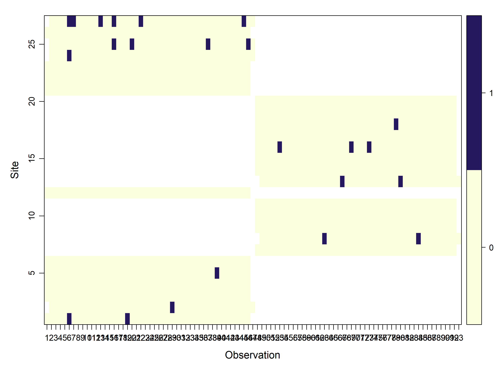
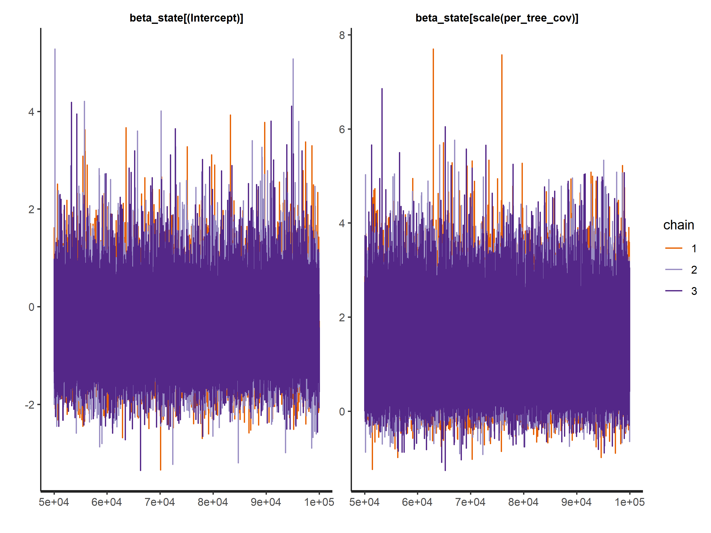
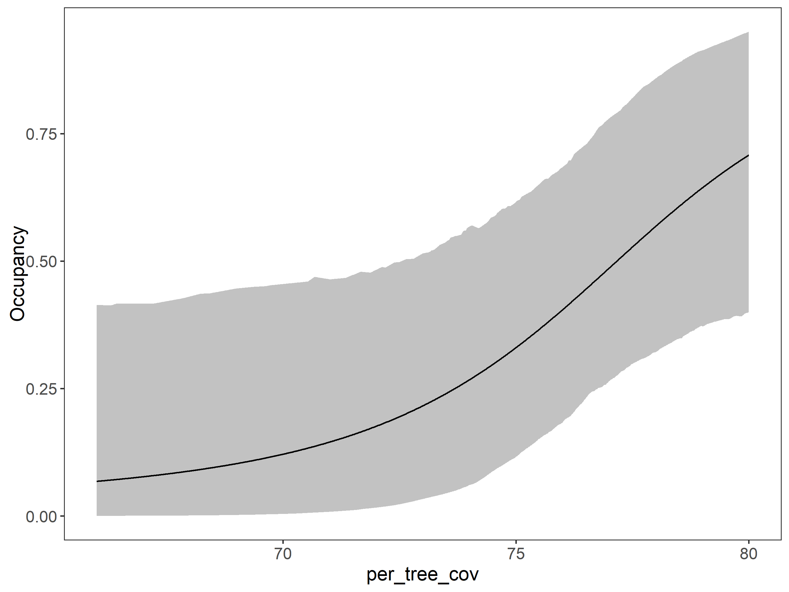
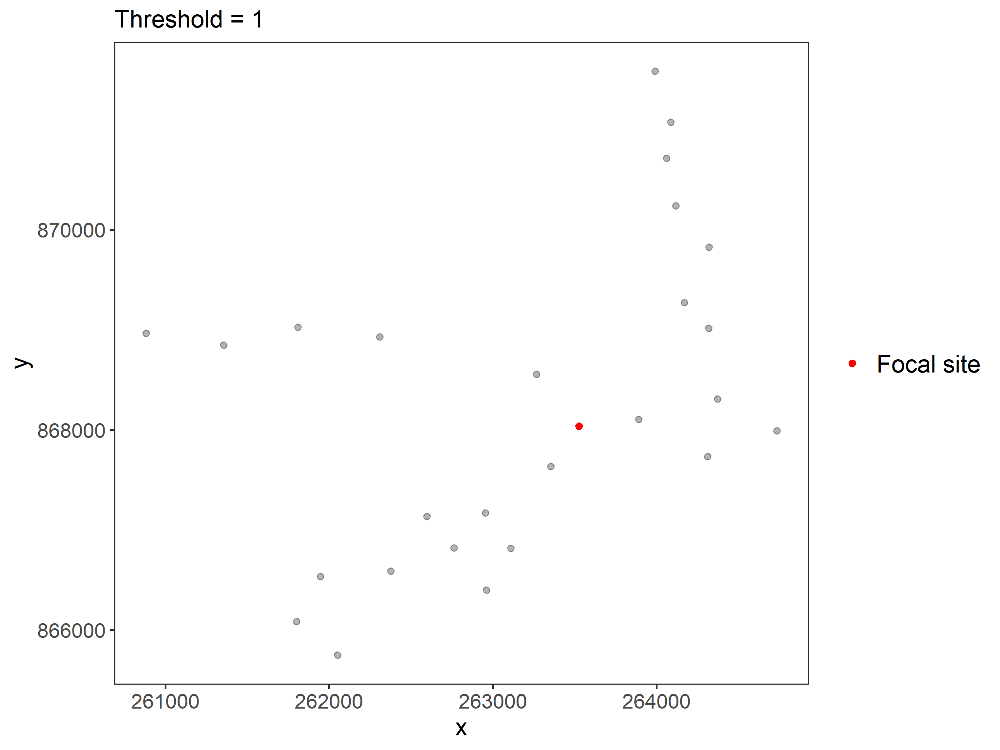

## Load packages

First we load some packages

Code

``` downlit

library(grateful) # Facilitate Citation of R Packages
library(patchwork) # The Composer of Plots
library(readxl) # Read Excel Files
library(sf) # Simple Features for R
library(mapview) # Interactive Viewing of Spatial Data in R
library(terra) # Spatial Data Analysis
library(elevatr) # Access Elevation Data from Various APIs
library(readr)

library(camtrapR) # Camera Trap Data Management and Preparation of Occupancy and Spatial Capture-Recapture Analyses 
library(unmarked) 
library(ubms) 
library(DT)

library(kableExtra) # Construct Complex Table with 'kable' and Pipe Syntax
library(tidyverse) # Easily Install and Load the 'Tidyverse'

# source("C:/CodigoR/CameraTrapCesar/R/organiza_datos.R")
```

## Organize the data

The workflow starts with package [`unmarked`](https://biodiverse.github.io/unmarked/) for organize data and continue with the package [`ubms`](https://biodiverse.github.io/ubms/) for model building, selection and prediction. The first step to perform the analysis is to organize data following the `unmarked` package. The data should have detection, non-detection records along with the covariates.

See the [`unmarked::unmarkedFrameOccu`](https://rdrr.io/pkg/unmarked/man/unmarkedFrameOccu.html) function for details typing: ?unmarkedFrameOccu in your R console.

## Load data

The data set was collected by Sebastián Mejía-Correa and is part of the study: [Mejia-Correa S, Diaz-Martinez A. 2014. Densidad y hábitos alimentarios de la danta Tapirus bairdii en el Parque Nacional Natural Los Katios, Colombia. Tapir Conservation. 23:16–23.](https://tapirconservation.github.io/2014/06/30/volume-23-number-32/).

Code

``` downlit


katios1 <- read_excel("C:/CodigoR/CameraTrapCesar/data/katios/Tbairdii_sebastian.xlsx", sheet = "danta")
```

### View the data

Code

``` downlit
datatable(head(katios1))
```

### View as map

Code

``` downlit
# Load Katios National Park shapefile
katios_np <- read_sf("C:/CodigoR/CameraTrapCesar/data/katios/shp/WDPA_WDOECM_Nov2024_Public_61610_shp-polygons.shp")

# make projection
projlatlon <- "+proj=longlat +datum=WGS84 +no_defs +ellps=WGS84 +towgs84=0,0,0"

katios_sf <-  st_as_sf(x = katios1 |> distinct(Longitude, Latitude, camera),
                         coords = c("Longitude", 
                                    "Latitude"),
                         crs = projlatlon)

mapview(katios_np, alpha.regions=0.1) + 
mapview(katios_sf, zcol="camera")
```

Cmeras location.

### Function to make detection history matrix

Code

``` downlit


f.matrix.creator<-function(data){
  #results object
  res<-list()
  
  #get the dimensions of the matrix
  
  #list if sanpling units
  cams<-unique(data$camera)
  cams<-sort(cams)
  rows<-length(cams)
  species<-unique(data$species)
  #start and end dates of sampling periods
  # data<-data[data$Sampling.Period==year,]
  min<-min(as.Date(as.character(data$start), "%Y-%m-%d"))
  max<-max(as.Date(as.character(data$end), "%Y-%m-%d"))
  cols<-max-min+1
  
  #sampling period
  date.header<-seq(from=min,to=max, by="days")
  mat<-matrix(NA,rows,cols,dimnames=list(cams,as.character(date.header)))
  
  #for all cameras, determine the open and close date and mark in the matrix
  start.dates<-tapply(as.character(data$start),data$camera,unique)
  nms<-names(start.dates)
  # start.dates<-ymd(start.dates)
  names(start.dates)<-nms
  end.dates<-tapply(as.character(data$end),data$camera,unique)
  # end.dates<-ymd(end.dates)
  names(end.dates)<-nms
  
  #outline the sampling periods for each camera j
  for(j in 1:length(start.dates)){
    #for each camera beginning and end of sampling
    low<-which(date.header==as.Date(as.character(start.dates[j]), format = "%Y-%m-%d"))
    hi<-which(date.header==as.Date(as.character(end.dates[j]), format = "%Y-%m-%d"))
    if(length(low)+length(hi)>0){
      indx<-seq(from=low,to=hi)
      mat[names(start.dates)[j],indx]<- 0
    } else next
  }
  mat.template<-mat
  #get the species
  #species<-unique(data$bin)
  #construct the matrix for each species i
  for(i in 1:length(species)){
    indx<-which(data$species==species[i])
    #dates and cameras when/where the species was photographed
    dates<-data$date[indx]
    cameras<-data$camera[indx]
    dates.cameras<-data.frame(dates,cameras)
    #unique combination of dates and cameras 
    dates.cameras<-unique(dates.cameras)
    #fill in the matrix
    for(j in 1:length(dates.cameras[,1])){
      col<-which(date.header==as.character( dates.cameras[j,1]))
      row<-which(cams==as.character( dates.cameras[j,2]))
      mat[row,col]<-1
    }
    mat.nas<-is.na(mat)
    sum.nas<-apply(mat.nas,2,sum)
    indx.nas<-which(sum.nas==rows)
    if(length(indx.nas)>0){
      mat<-mat[,-indx.nas]
    }
    
    res<-c(res,list(mat))
    #return the matrix to its original form
    mat<-mat.template
  }
  
  names(res)<-species
  #res<-lapply(res,f.dum)
  res #object to return
}
```

### Apply the function to get *Tapirus bairdii* detection matrix

Code

``` downlit

# filter firs year and make uniques

tbairdi <- f.matrix.creator(katios1)[[1]]
```

### Lets extract percent tree cover 2012 to be used as site covariate

The covariate is coming from MODIS. MOD44B Version 6 Vegetation Continuous Fields (VCF). <https://lpdaac.usgs.gov/products/mod44bv006/>

We plot the cameras as sf object on top the map and extract the values using the function [`terra::extract`](https://rspatial.github.io/terra/reference/extract.html)

Code

``` downlit
# load the raster map
per_tree_cov <- rast("C:/CodigoR/WCS-CameraTrap/raster/latlon/Veg_Cont_Fields_Yearly_250m_v61/Perc_TreeCov/MOD44B_Perc_TreeCov_2012_065.tif")

# extract values per camera
per_tre <- terra::extract(per_tree_cov, katios_sf)

# assign values to the sf object
katios_sf$per_tree_cov <- per_tre$MOD44B_Perc_TreeCov_2012_065 
#  fix 200 issue
# ind <- which(sites$per_tree_cov== 200)
# sites$per_tree_cov[ind] <- 0
```

## Create unmarked frame object

Lets use the `unmarked` package to make an unmarkedFrameOccu object.

Code

``` downlit
umf <- unmarkedFrameOccu(y=tbairdi, 
                         siteCovs=data.frame(
                           per_tree_cov=katios_sf$per_tree_cov)
                           # road_den=sites$roads),
                         # obsCovs=list(effort=ej)
                      )

plot(umf)
```

[](index_files/figure-html/unnamed-chunk-9-1.png "Sites against days (observation)")

Sites against days (observation)

Code

``` downlit

unmarked::summary(umf)
#> unmarkedFrame Object
#> 
#> 27 sites
#> Maximum number of observations per site: 93 
#> Mean number of observations per site: 45.52 
#> Sites with at least one detection: 10 
#> 
#> Tabulation of y observations:
#>    0    1 <NA> 
#> 1206   23 1282 
#> 
#> Site-level covariates:
#>   per_tree_cov  
#>  Min.   :66.00  
#>  1st Qu.:73.00  
#>  Median :78.00  
#>  Mean   :76.07  
#>  3rd Qu.:78.00  
#>  Max.   :80.00
```

## Fit models

lets use `ubms` package to fit several models. We contrast the null model (no covariates) against a model with percent tree cover to explain the occupancy. For this example we are not using covariates for the detection part.

Code

``` downlit
# fit_0 <- occu(~1~1, data=umf) # unmarked

fit_j0 <- stan_occu(~1~1, data=umf, chains=3, iter=100000, cores=3)
fit_j2 <- stan_occu(~1~scale(per_tree_cov), data=umf, chains=3, iter=100000, cores=3)
```

### Model selection

Code

``` downlit
# compare models
models <- list("p(.)psi(.)" = fit_j0, # put names
                "p(.)psi(per_tree_cov)" = fit_j2) # put names

mods <- fitList(fits = models)

## see model selection as a table
datatable( 
  round(modSel(mods), 3)
  )
```

The model p(.)psi(per_tree_cov) is the “better”.

#### Estimates for the null model

Estimated values for the null model `p(.)psi(.)` are: 0.4410786, 0.0438637 for occupancy, and detection probability respectively.

#### Details of the best model

Code

``` downlit
fit_j2
#> 
#> Call:
#> stan_occu(formula = ~1 ~ scale(per_tree_cov), data = umf, chains = 3, 
#>     iter = 1e+05, cores = 3)
#> 
#> Occupancy (logit-scale):
#>                     Estimate    SD   2.5% 97.5% n_eff Rhat
#> (Intercept)           -0.403 0.583 -1.492 0.812 88523    1
#> scale(per_tree_cov)    1.336 0.707  0.154 2.919 89674    1
#> 
#> Detection (logit-scale):
#>  Estimate    SD  2.5% 97.5% n_eff Rhat
#>     -3.09 0.262 -3.64 -2.62 91423    1
#> 
#> LOOIC: 217.038
#> Runtime: 81.605 sec
```

we conclude MCMC chains have converged if all R\>1.05  
Convergence here is not that good…

### Model convergence

Let see the chains.

Code

``` downlit
traceplot(fit_j2, pars=c("beta_state"))
```

[](index_files/figure-html/unnamed-chunk-13-1.png "Chains trace plot. The chains should be converging")

Chains trace plot. The chains should be converging

not that good…

### Evaluate model fit

Statistic (p) should be near 0.5 if the model fits well.

Code

``` downlit

# eval
fit_top_gof <- gof(fit_j2, draws=500, quiet=TRUE)
fit_top_gof
#> MacKenzie-Bailey Chi-square 
#> Point estimate = 707667614.926
#> Posterior predictive p = 0.122

# plot(fit_top_gof)
```

0.14 is not that bad.

### Model inference

No covariate for detection, and percent of forest tree cover in occupancy.

Code

``` downlit
# ubms::plot_effects(fit_j2, "det")
ubms::plot_effects(fit_j2, "state")
```

[](index_files/figure-html/unnamed-chunk-15-1.png "Prediction of occupancy with percent tree cover")

Prediction of occupancy with percent tree cover

The error band is large but there is a clear trend.

### Spatial model

Taking in to account spatial autocorrelation.

Code

``` downlit
# convert to UTM
katios_utm = st_transform(katios_sf, 21818)
katios_cord <- st_coordinates(katios_utm)
site_cov <- as.data.frame(cbind(per_tree_cov=scale(katios_sf$per_tree_cov),
                  katios_cord))

names(site_cov) <- c("per_tree_cov", "X", "Y")

with(site_cov, RSR(X, Y, threshold=1, plot_site=27))
```

[](index_files/figure-html/unnamed-chunk-16-1.png "Spatial autocorrelation.")

Spatial autocorrelation.

Code

``` downlit

form <- ~1 ~per_tree_cov + RSR(X, Y, threshold=1)
umf2 <- unmarkedFrameOccu(y=tbairdi, siteCovs=site_cov)
# fit_spatial <- stan_occu(form, umf2, chains=3, cores=3, seed=123) # error
```

Spatial model do not run… Error at Building RSR matrices: TridiagEigen: eigen decomposition failed. Probably to few sites.

## Predict occupancy in a map

Lets use a raster map with percent tree cover to predict the occupancy and see the resulting occupancy as a map.

Code

``` downlit
# cut large raster 
box <- ext(-77.18,-77.11, 7.800, 7.89) # make a box xmin, xmax, ymin, ymax
library(raster)
per_tree_cov_cut <- raster(crop(per_tree_cov, box))# cut raster using the box
# put correct name
names(per_tree_cov_cut) <- "per_tree_cov"

# predict in ubms
map_occupancy <- ubms::predict(fit_j2,
                               submodel="state",
                               newdata=per_tree_cov_cut,
                               transform=TRUE)

katios_occu <- map_occupancy[[1]] # assign just prediction
katios_occu[katios_occu >= 0.9] <- NA # convert river to NA

# make a palette 9 colors yellow to green
pal <- grDevices::colorRampPalette(RColorBrewer::brewer.pal(9, "YlGn"))
# plot map
mapview(katios_np, alpha.regions=0.1) +
mapview(katios_occu, col.regions= pal, alpha = 0.5) + mapview(katios_sf, cex=2) 
```

Predicted occupancy map.

## Package Citation

Code

``` downlit
pkgs <- cite_packages(output = "paragraph", out.dir = ".") #knitr::kable(pkgs)
pkgs
```

We used R version 4.4.2 ([R Core Team 2024](#ref-base)) and the following R packages: camtrapR v. 2.3.0 ([Niedballa et al. 2016](#ref-camtrapR)), devtools v. 2.4.5 ([Wickham et al. 2022](#ref-devtools)), DT v. 0.33 ([Xie et al. 2024](#ref-DT)), elevatr v. 0.99.0 ([Hollister et al. 2023](#ref-elevatr)), kableExtra v. 1.4.0 ([Zhu 2024](#ref-kableExtra)), mapview v. 2.11.2 ([Appelhans et al. 2023](#ref-mapview)), patchwork v. 1.3.0 ([Pedersen 2024](#ref-patchwork)), quarto v. 1.4.4 ([Allaire and Dervieux 2024](#ref-quarto)), raster v. 3.6.30 ([Hijmans 2024a](#ref-raster)), RColorBrewer v. 1.1.3 ([Neuwirth 2022](#ref-RColorBrewer)), rmarkdown v. 2.29 ([Xie et al. 2018](#ref-rmarkdown2018), [2020](#ref-rmarkdown2020); [Allaire et al. 2024](#ref-rmarkdown2024)), sf v. 1.0.19 ([Pebesma 2018](#ref-sf2018); [Pebesma and Bivand 2023](#ref-sf2023)), styler v. 1.10.3 ([Müller and Walthert 2024](#ref-styler)), terra v. 1.8.5 ([Hijmans 2024b](#ref-terra)), tidyverse v. 2.0.0 ([Wickham et al. 2019](#ref-tidyverse)), ubms v. 1.2.7 ([Kellner et al. 2021](#ref-ubms)), unmarked v. 1.4.3 ([Fiske and Chandler 2011](#ref-unmarked2011); [Kellner et al. 2023](#ref-unmarked2023)).

## Sesion info

Session info

    #> ─ Session info ───────────────────────────────────────────────────────────────────────────────────────────────────────
    #>  setting  value
    #>  version  R version 4.4.2 (2024-10-31 ucrt)
    #>  os       Windows 10 x64 (build 19045)
    #>  system   x86_64, mingw32
    #>  ui       RTerm
    #>  language (EN)
    #>  collate  Spanish_Colombia.utf8
    #>  ctype    Spanish_Colombia.utf8
    #>  tz       America/Bogota
    #>  date     2024-12-15
    #>  pandoc   3.2 @ C:/Program Files/RStudio/resources/app/bin/quarto/bin/tools/ (via rmarkdown)
    #> 
    #> ─ Packages ───────────────────────────────────────────────────────────────────────────────────────────────────────────
    #>  ! package           * version  date (UTC) lib source
    #>    abind               1.4-8    2024-09-12 [1] CRAN (R 4.4.1)
    #>    backports           1.5.0    2024-05-23 [1] CRAN (R 4.4.0)
    #>    base64enc           0.1-3    2015-07-28 [1] CRAN (R 4.4.0)
    #>    brew                1.0-10   2023-12-16 [1] CRAN (R 4.4.2)
    #>    bslib               0.8.0    2024-07-29 [1] CRAN (R 4.4.2)
    #>    cachem              1.1.0    2024-05-16 [1] CRAN (R 4.4.2)
    #>    camtrapR          * 2.3.0    2024-02-26 [1] CRAN (R 4.4.2)
    #>    cellranger          1.1.0    2016-07-27 [1] CRAN (R 4.4.2)
    #>    checkmate           2.3.2    2024-07-29 [1] CRAN (R 4.4.2)
    #>    class               7.3-22   2023-05-03 [2] CRAN (R 4.4.2)
    #>    classInt            0.4-10   2023-09-05 [1] CRAN (R 4.4.2)
    #>    cli                 3.6.3    2024-06-21 [1] CRAN (R 4.4.2)
    #>    codetools           0.2-20   2024-03-31 [2] CRAN (R 4.4.2)
    #>    colorspace          2.1-1    2024-07-26 [1] CRAN (R 4.4.2)
    #>    crosstalk           1.2.1    2023-11-23 [1] CRAN (R 4.4.2)
    #>    curl                6.0.0    2024-11-05 [1] CRAN (R 4.4.2)
    #>    data.table          1.16.4   2024-12-06 [1] CRAN (R 4.4.2)
    #>    DBI                 1.2.3    2024-06-02 [1] CRAN (R 4.4.2)
    #>    devtools            2.4.5    2022-10-11 [1] CRAN (R 4.4.2)
    #>    digest              0.6.37   2024-08-19 [1] CRAN (R 4.4.2)
    #>    distributional      0.5.0    2024-09-17 [1] CRAN (R 4.4.2)
    #>    dplyr             * 1.1.4    2023-11-17 [1] CRAN (R 4.4.2)
    #>    DT                * 0.33     2024-04-04 [1] CRAN (R 4.4.2)
    #>    e1071               1.7-16   2024-09-16 [1] CRAN (R 4.4.2)
    #>    elevatr           * 0.99.0   2023-09-12 [1] CRAN (R 4.4.2)
    #>    ellipsis            0.3.2    2021-04-29 [1] CRAN (R 4.4.2)
    #>    evaluate            1.0.1    2024-10-10 [1] CRAN (R 4.4.2)
    #>    fansi               1.0.6    2023-12-08 [1] CRAN (R 4.4.2)
    #>    farver              2.1.2    2024-05-13 [1] CRAN (R 4.4.2)
    #>    fastmap             1.2.0    2024-05-15 [1] CRAN (R 4.4.2)
    #>    forcats           * 1.0.0    2023-01-29 [1] CRAN (R 4.4.2)
    #>    fs                  1.6.5    2024-10-30 [1] CRAN (R 4.4.2)
    #>    generics            0.1.3    2022-07-05 [1] CRAN (R 4.4.2)
    #>    ggplot2           * 3.5.1    2024-04-23 [1] CRAN (R 4.4.2)
    #>    glue                1.8.0    2024-09-30 [1] CRAN (R 4.4.2)
    #>    grateful          * 0.2.10   2024-09-04 [1] CRAN (R 4.4.2)
    #>    gridExtra           2.3      2017-09-09 [1] CRAN (R 4.4.2)
    #>    gtable              0.3.6    2024-10-25 [1] CRAN (R 4.4.2)
    #>    hms                 1.1.3    2023-03-21 [1] CRAN (R 4.4.2)
    #>    htmltools           0.5.8.1  2024-04-04 [1] CRAN (R 4.4.2)
    #>    htmlwidgets         1.6.4    2023-12-06 [1] CRAN (R 4.4.2)
    #>    httpuv              1.6.15   2024-03-26 [1] CRAN (R 4.4.2)
    #>    inline              0.3.20   2024-11-10 [1] CRAN (R 4.4.2)
    #>    jquerylib           0.1.4    2021-04-26 [1] CRAN (R 4.4.2)
    #>    jsonlite            1.8.9    2024-09-20 [1] CRAN (R 4.4.2)
    #>    kableExtra        * 1.4.0    2024-01-24 [1] CRAN (R 4.4.2)
    #>    KernSmooth          2.23-24  2024-05-17 [2] CRAN (R 4.4.2)
    #>    knitr               1.49     2024-11-08 [1] CRAN (R 4.4.2)
    #>    labeling            0.4.3    2023-08-29 [1] CRAN (R 4.4.0)
    #>    later               1.3.2    2023-12-06 [1] CRAN (R 4.4.2)
    #>    lattice             0.22-6   2024-03-20 [2] CRAN (R 4.4.2)
    #>    leafem              0.2.3    2023-09-17 [1] CRAN (R 4.4.2)
    #>    leaflet             2.2.2    2024-03-26 [1] CRAN (R 4.4.2)
    #>    leaflet.providers   2.0.0    2023-10-17 [1] CRAN (R 4.4.2)
    #>    leafpop             0.1.0    2021-05-22 [1] CRAN (R 4.4.2)
    #>    lifecycle           1.0.4    2023-11-07 [1] CRAN (R 4.4.2)
    #>    loo                 2.8.0    2024-07-03 [1] CRAN (R 4.4.2)
    #>    lubridate         * 1.9.4    2024-12-08 [1] CRAN (R 4.4.2)
    #>    magrittr            2.0.3    2022-03-30 [1] CRAN (R 4.4.2)
    #>    mapview           * 2.11.2   2023-10-13 [1] CRAN (R 4.4.2)
    #>    MASS                7.3-61   2024-06-13 [2] CRAN (R 4.4.2)
    #>    Matrix              1.7-1    2024-10-18 [2] CRAN (R 4.4.2)
    #>    matrixStats         1.4.1    2024-09-08 [1] CRAN (R 4.4.2)
    #>    memoise             2.0.1    2021-11-26 [1] CRAN (R 4.4.2)
    #>    mgcv                1.9-1    2023-12-21 [2] CRAN (R 4.4.2)
    #>    mime                0.12     2021-09-28 [1] CRAN (R 4.4.0)
    #>    miniUI              0.1.1.1  2018-05-18 [1] CRAN (R 4.4.2)
    #>    munsell             0.5.1    2024-04-01 [1] CRAN (R 4.4.2)
    #>    mvtnorm             1.3-2    2024-11-04 [1] CRAN (R 4.4.2)
    #>    nlme                3.1-166  2024-08-14 [2] CRAN (R 4.4.2)
    #>    patchwork         * 1.3.0    2024-09-16 [1] CRAN (R 4.4.2)
    #>    pbapply             1.7-2    2023-06-27 [1] CRAN (R 4.4.2)
    #>    pillar              1.9.0    2023-03-22 [1] CRAN (R 4.4.2)
    #>    pkgbuild            1.4.5    2024-10-28 [1] CRAN (R 4.4.2)
    #>    pkgconfig           2.0.3    2019-09-22 [1] CRAN (R 4.4.2)
    #>    pkgload             1.4.0    2024-06-28 [1] CRAN (R 4.4.2)
    #>    png                 0.1-8    2022-11-29 [1] CRAN (R 4.4.0)
    #>    posterior           1.6.0    2024-07-03 [1] CRAN (R 4.4.2)
    #>    processx            3.8.4    2024-03-16 [1] CRAN (R 4.4.2)
    #>    profvis             0.4.0    2024-09-20 [1] CRAN (R 4.4.2)
    #>    progressr           0.15.0   2024-10-29 [1] CRAN (R 4.4.2)
    #>    promises            1.3.0    2024-04-05 [1] CRAN (R 4.4.2)
    #>    proxy               0.4-27   2022-06-09 [1] CRAN (R 4.4.2)
    #>    ps                  1.8.1    2024-10-28 [1] CRAN (R 4.4.2)
    #>    purrr             * 1.0.2    2023-08-10 [1] CRAN (R 4.4.2)
    #>    quarto            * 1.4.4    2024-07-20 [1] CRAN (R 4.4.2)
    #>    QuickJSR            1.4.0    2024-10-01 [1] CRAN (R 4.4.2)
    #>    R.cache             0.16.0   2022-07-21 [1] CRAN (R 4.4.2)
    #>    R.methodsS3         1.8.2    2022-06-13 [1] CRAN (R 4.4.0)
    #>    R.oo                1.27.0   2024-11-01 [1] CRAN (R 4.4.1)
    #>    R.utils             2.12.3   2023-11-18 [1] CRAN (R 4.4.2)
    #>    R6                  2.5.1    2021-08-19 [1] CRAN (R 4.4.2)
    #>    raster            * 3.6-30   2024-10-02 [1] CRAN (R 4.4.2)
    #>    rbibutils           2.3      2024-10-04 [1] CRAN (R 4.4.2)
    #>    RColorBrewer        1.1-3    2022-04-03 [1] CRAN (R 4.4.0)
    #>    Rcpp                1.0.13-1 2024-11-02 [1] CRAN (R 4.4.2)
    #>    RcppNumerical       0.6-0    2023-09-06 [1] CRAN (R 4.4.2)
    #>  D RcppParallel        5.1.9    2024-08-19 [1] CRAN (R 4.4.2)
    #>    Rdpack              2.6.2    2024-11-15 [1] CRAN (R 4.4.2)
    #>    readr             * 2.1.5    2024-01-10 [1] CRAN (R 4.4.2)
    #>    readxl            * 1.4.3    2023-07-06 [1] CRAN (R 4.4.2)
    #>    reformulas          0.4.0    2024-11-03 [1] CRAN (R 4.4.2)
    #>    remotes             2.5.0    2024-03-17 [1] CRAN (R 4.4.2)
    #>    renv                1.0.11   2024-10-12 [1] CRAN (R 4.4.2)
    #>    rlang               1.1.4    2024-06-04 [1] CRAN (R 4.4.2)
    #>    rmarkdown           2.29     2024-11-04 [1] CRAN (R 4.4.2)
    #>    RSpectra            0.16-2   2024-07-18 [1] CRAN (R 4.4.2)
    #>    rstan               2.32.6   2024-03-05 [1] CRAN (R 4.4.2)
    #>    rstantools          2.4.0    2024-01-31 [1] CRAN (R 4.4.2)
    #>    rstudioapi          0.17.1   2024-10-22 [1] CRAN (R 4.4.2)
    #>    sass                0.4.9    2024-03-15 [1] CRAN (R 4.4.2)
    #>    satellite           1.0.5    2024-02-10 [1] CRAN (R 4.4.2)
    #>    scales              1.3.0    2023-11-28 [1] CRAN (R 4.4.2)
    #>    secr                5.1.0    2024-11-04 [1] CRAN (R 4.4.2)
    #>    sessioninfo         1.2.2    2021-12-06 [1] CRAN (R 4.4.2)
    #>    sf                * 1.0-19   2024-11-05 [1] CRAN (R 4.4.2)
    #>    shiny               1.9.1    2024-08-01 [1] CRAN (R 4.4.2)
    #>    sp                * 2.1-4    2024-04-30 [1] CRAN (R 4.4.2)
    #>    StanHeaders         2.32.10  2024-07-15 [1] CRAN (R 4.4.2)
    #>    stringi             1.8.4    2024-05-06 [1] CRAN (R 4.4.0)
    #>    stringr           * 1.5.1    2023-11-14 [1] CRAN (R 4.4.2)
    #>    styler            * 1.10.3   2024-04-07 [1] CRAN (R 4.4.2)
    #>    svglite             2.1.3    2023-12-08 [1] CRAN (R 4.4.2)
    #>    systemfonts         1.1.0    2024-05-15 [1] CRAN (R 4.4.2)
    #>    tensorA             0.36.2.1 2023-12-13 [1] CRAN (R 4.4.0)
    #>    terra             * 1.8-5    2024-12-12 [1] CRAN (R 4.4.2)
    #>    tibble            * 3.2.1    2023-03-20 [1] CRAN (R 4.4.2)
    #>    tidyr             * 1.3.1    2024-01-24 [1] CRAN (R 4.4.2)
    #>    tidyselect          1.2.1    2024-03-11 [1] CRAN (R 4.4.2)
    #>    tidyverse         * 2.0.0    2023-02-22 [1] CRAN (R 4.4.2)
    #>    timechange          0.3.0    2024-01-18 [1] CRAN (R 4.4.2)
    #>    tzdb                0.4.0    2023-05-12 [1] CRAN (R 4.4.2)
    #>    ubms              * 1.2.7    2024-10-01 [1] CRAN (R 4.4.2)
    #>    units               0.8-5    2023-11-28 [1] CRAN (R 4.4.2)
    #>    unmarked          * 1.4.3    2024-09-01 [1] CRAN (R 4.4.2)
    #>    urlchecker          1.0.1    2021-11-30 [1] CRAN (R 4.4.2)
    #>    usethis             3.0.0    2024-07-29 [1] CRAN (R 4.4.1)
    #>    utf8                1.2.4    2023-10-22 [1] CRAN (R 4.4.2)
    #>    uuid                1.2-1    2024-07-29 [1] CRAN (R 4.4.1)
    #>    V8                  6.0.0    2024-10-12 [1] CRAN (R 4.4.2)
    #>    vctrs               0.6.5    2023-12-01 [1] CRAN (R 4.4.2)
    #>    viridisLite         0.4.2    2023-05-02 [1] CRAN (R 4.4.2)
    #>    withr               3.0.2    2024-10-28 [1] CRAN (R 4.4.2)
    #>    xfun                0.49     2024-10-31 [1] CRAN (R 4.4.2)
    #>    xml2                1.3.6    2023-12-04 [1] CRAN (R 4.4.2)
    #>    xtable              1.8-4    2019-04-21 [1] CRAN (R 4.4.2)
    #>    yaml                2.3.10   2024-07-26 [1] CRAN (R 4.4.1)
    #> 
    #>  [1] C:/Users/usuario/AppData/Local/R/win-library/4.4
    #>  [2] C:/Program Files/R/R-4.4.2/library
    #> 
    #>  D ── DLL MD5 mismatch, broken installation.
    #> 
    #> ──────────────────────────────────────────────────────────────────────────────────────────────────────────────────────

Back to top

## References

Allaire, JJ, and Christophe Dervieux. 2024. *quarto: R Interface to “Quarto” Markdown Publishing System*. <https://CRAN.R-project.org/package=quarto>.

Allaire, JJ, Yihui Xie, Christophe Dervieux, et al. 2024. *rmarkdown: Dynamic Documents for r*. <https://github.com/rstudio/rmarkdown>.

Appelhans, Tim, Florian Detsch, Christoph Reudenbach, and Stefan Woellauer. 2023. *mapview: Interactive Viewing of Spatial Data in r*. <https://CRAN.R-project.org/package=mapview>.

Fiske, Ian, and Richard Chandler. 2011. “unmarked: An R Package for Fitting Hierarchical Models of Wildlife Occurrence and Abundance.” *Journal of Statistical Software* 43 (10): 1–23. <https://www.jstatsoft.org/v43/i10/>.

Hijmans, Robert J. 2024a. *raster: Geographic Data Analysis and Modeling*. <https://CRAN.R-project.org/package=raster>.

Hijmans, Robert J. 2024b. *terra: Spatial Data Analysis*. <https://CRAN.R-project.org/package=terra>.

Hollister, Jeffrey, Tarak Shah, Jakub Nowosad, Alec L. Robitaille, Marcus W. Beck, and Mike Johnson. 2023. *elevatr: Access Elevation Data from Various APIs*. <https://doi.org/10.5281/zenodo.8335450>.

Kellner, Kenneth F., Nicholas L. Fowler, Tyler R. Petroelje, Todd M. Kautz, Dean E. Beyer, and Jerrold L. Belant. 2021. “ubms: An R Package for Fitting Hierarchical Occupancy and n-Mixture Abundance Models in a Bayesian Framework.” *Methods in Ecology and Evolution* 13: 577–84. <https://doi.org/10.1111/2041-210X.13777>.

Kellner, Kenneth F., Adam D. Smith, J. Andrew Royle, Marc Kery, Jerrold L. Belant, and Richard B. Chandler. 2023. “The unmarked R Package: Twelve Years of Advances in Occurrence and Abundance Modelling in Ecology.” *Methods in Ecology and Evolution* 14 (6): 1408–15. <https://www.jstatsoft.org/v43/i10/>.

Müller, Kirill, and Lorenz Walthert. 2024. *styler: Non-Invasive Pretty Printing of r Code*. <https://CRAN.R-project.org/package=styler>.

Neuwirth, Erich. 2022. *RColorBrewer: ColorBrewer Palettes*. <https://CRAN.R-project.org/package=RColorBrewer>.

Niedballa, Jürgen, Rahel Sollmann, Alexandre Courtiol, and Andreas Wilting. 2016. “camtrapR: An r Package for Efficient Camera Trap Data Management.” *Methods in Ecology and Evolution* 7 (12): 1457–62. <https://doi.org/10.1111/2041-210X.12600>.

Pebesma, Edzer. 2018. “Simple Features for R: Standardized Support for Spatial Vector Data.” *The R Journal* 10 (1): 439–46. <https://doi.org/10.32614/RJ-2018-009>.

Pebesma, Edzer, and Roger Bivand. 2023. *Spatial Data Science: With applications in R*. Chapman and Hall/CRC. <https://doi.org/10.1201/9780429459016>.

Pedersen, Thomas Lin. 2024. *patchwork: The Composer of Plots*. <https://CRAN.R-project.org/package=patchwork>.

R Core Team. 2024. *R: A Language and Environment for Statistical Computing*. R Foundation for Statistical Computing. <https://www.R-project.org/>.

Wickham, Hadley, Mara Averick, Jennifer Bryan, et al. 2019. “Welcome to the tidyverse.” *Journal of Open Source Software* 4 (43): 1686. <https://doi.org/10.21105/joss.01686>.

Wickham, Hadley, Jim Hester, Winston Chang, and Jennifer Bryan. 2022. *devtools: Tools to Make Developing r Packages Easier*. <https://CRAN.R-project.org/package=devtools>.

Xie, Yihui, J. J. Allaire, and Garrett Grolemund. 2018. *R Markdown: The Definitive Guide*. Chapman; Hall/CRC. <https://bookdown.org/yihui/rmarkdown>.

Xie, Yihui, Joe Cheng, and Xianying Tan. 2024. *DT: A Wrapper of the JavaScript Library “DataTables”*. <https://CRAN.R-project.org/package=DT>.

Xie, Yihui, Christophe Dervieux, and Emily Riederer. 2020. *R Markdown Cookbook*. Chapman; Hall/CRC. <https://bookdown.org/yihui/rmarkdown-cookbook>.

Zhu, Hao. 2024. *kableExtra: Construct Complex Table with “kable” and Pipe Syntax*. <https://CRAN.R-project.org/package=kableExtra>.

## Citation

BibTeX citation:

``` quarto-appendix-bibtex
@online{j._lizcano2024,
  author = {J. Lizcano, Diego},
  title = {Single {Season} {Occupancy} {Model}},
  date = {2024-07-27},
  url = {https://dlizcano.github.io/cameratrap/posts/2024-07-29-sigle-season-occupancy/},
  langid = {en}
}
```

For attribution, please cite this work as:

J. Lizcano, Diego. 2024. “Single Season Occupancy Model.” July 27. <https://dlizcano.github.io/cameratrap/posts/2024-07-29-sigle-season-occupancy/>.
