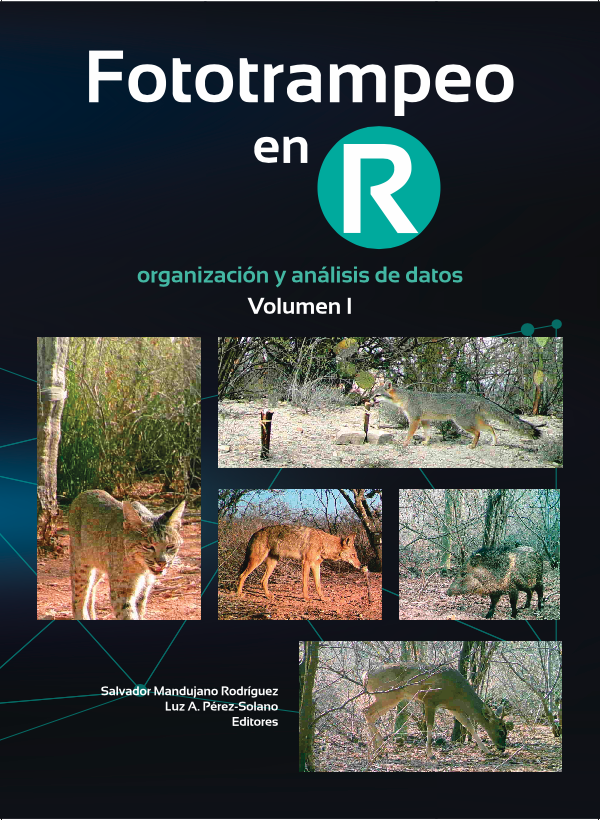
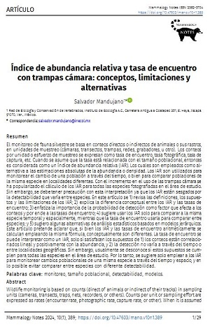
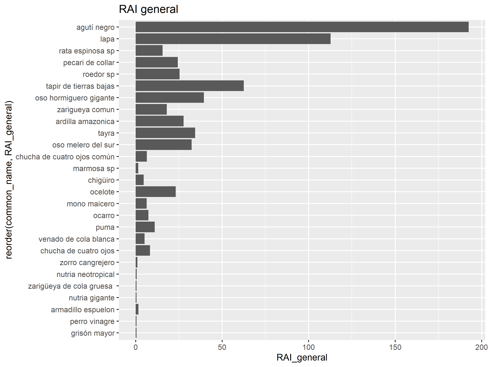
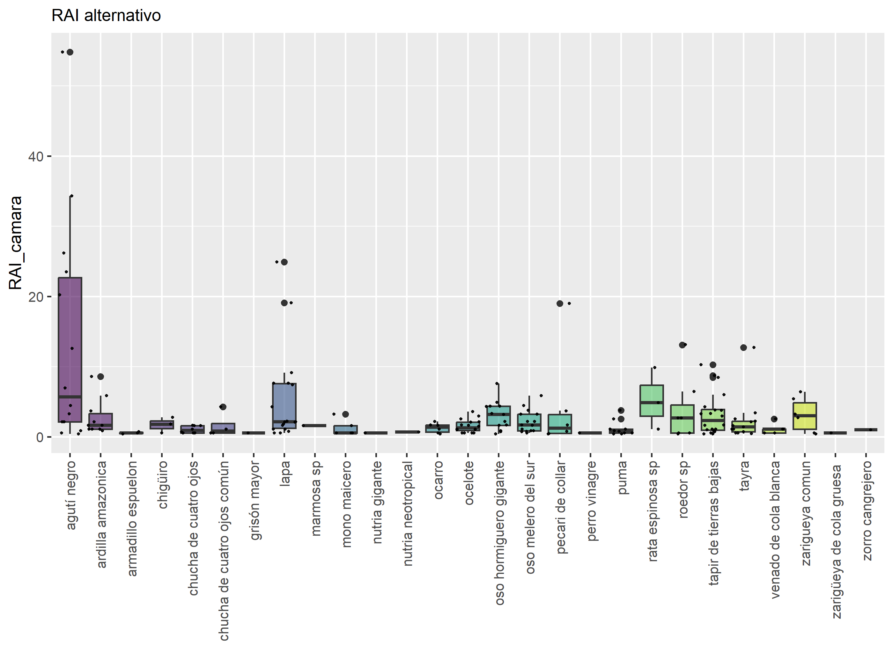
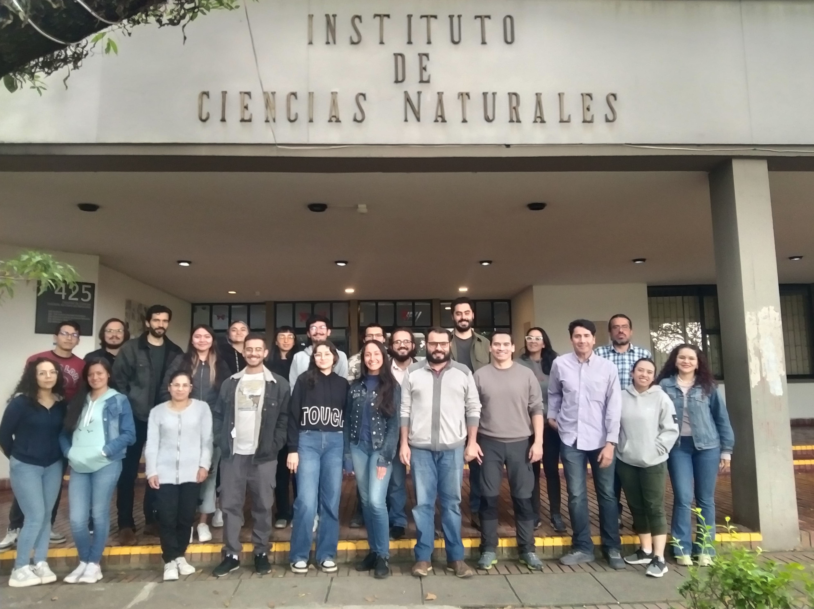

Este post es parte de el curso Introducción al fototrampeo realizado en el Instituto de ciencias naturales (ICN), de la Universidad Nacional de Colombia en Bogota en Diciembre 2024.

## INTRODUCCIÓN

El estudio de mamíferos medianos y grandes en bosques tropicales suele ser difícil ya que muchas de estas especies son crípticas, nocturnas y esquivas, dificultando su detección. Los métodos tradicionales requieren de la captura de los animales y suelen ser costosos, de difícil manejo y poco efectivos a gran escala. Por esta razón, estas técnicas tradicionales han sido reemplazadas rápidamente por la técnica del fototrampeo, la cual usa cámaras fijas que se activan para captar imágenes de animales en el momento que pasan frente a la cámara, mediante sensores de movimiento y calor que activan la cámara.

Las cámaras trampa son utilizadas en investigaciones biológicas como una herramienta importante para determinar distintos parámetros ecológicos como la densidad, ocurrencia, ocupación y riqueza, entre otros. Las ventajas de esta técnica son amplias, por lo que su uso es cada vez más frecuente. Por esta razón es importante conocer las características de los equipos, los alcances y limitaciones del empleo de cámaras, así como tener claridad sobre el tipo de datos proporcionados por esta técnica y su correcta interpretación. El éxito de esta técnica, como de cualquier otra, depende a su vez de un adecuado planteamiento de las preguntas de investigación y del diseño de muestreo, así como el empleo de una base conceptual sólida que permita alcanzar los objetivos planteados.

En este curso queremos hacer una introducción general al fototrampeo donde los participantes entiendan como funcionan las cámaras trampa, que consideraciones se deben tener en cuenta para el diseño de un estudio con fototrampeo, así como una introducción a tres análisis básicos (abundancia relativa, estimación de riqueza y patrones de actividad). En este post haremos énfasis en la abundancia relativa. La estimación de riqueza se puede ver en [éste enlace](https://dlizcano.github.io/cameratrap/posts/2024-12-15-riqueza/index.html). Los patrones de actividad seran objeto de un próximo post donde trataré el tema con bastante profundidad.

## OBJETIVOS

1.  Capacitar estudiantes de pregrado y personas interesadas en entender el uso y los alcances de la técnica del fototrampeo.

2.  Entender de manera general como se diseña un estudio con fototrampeo y como se estructuran e interpretan los datos derivados, haciendo con énfasis en lo basico: riqueza, abundancia relativa y patrones de actividad.

## METODOLOGÍA

El curso está estructurado en dos grandes temas. El primero concerniente a la técnica propiamente dicha y el segundo relacionado con las preguntas de investigación y su análisis. Todas las sesiones son teórico-prácticas y para los ejercicios de montaje de cámaras se hará una práctica corta al interior de la Universidad Nacional. Al finalizar el curso se entregará una carpeta digital con material relacionado como libros y artículos y las presentaciones en pdf, así como los códigos en R usados en las demostraciones.

## Libro

El curso incluye una copia impresa del Libro Fototrampeo en R de Salvador Mandujano:



Fototrampeo en R

## Indice de Abundancia Relativa (RAI)

> Recuerda que el RAI es el número de fotos por unidad de esfuerzo de muestreo y puede ser expresado con la siguiente formula

\\ RAI = \dfrac{Número de fotos independientes}{dias de camara \* 100} \\

y ten muy encuenta que:

> **IMPORTANT:**
>
> Por eso es mucho mejor llamarla *Frecuencia de Captura* (Capture Rate).

Pueden ver una revision muy interesante del concepto de abundancia relativa en el articulo:

[](https://doi.org/10.47603/mano.v10n1.389) link to [artículo](https://doi.org/10.47603/mano.v10n1.389).

Figura 1

## Veamos un ejemplo

### Cargar Paquetes

Primero cargamos algunos paquetes de R

Código

``` downlit

library(grateful) # Facilitate Citation of R Packages
library(patchwork) # The Composer of Plots
library(readxl) # Read Excel Files
library(sf) # Simple Features for R
library(mapview) # Interactive Viewing of Spatial Data in R
library(tmap) #nice mapr in R
library(tmaptools) #expands tmap
# library(terra) # Spatial Data Analysis
library(readr) # Read Rectangular Text Data
library(camtrapR) # Camera Trap Data Management and Preparation of Occupancy and Spatial Capture-Recapture Analyses 
library(RColorBrewer) # ColorBrewer Palettes
library(DT) # A Wrapper of the JavaScript Library 'DataTables'
library(kableExtra) # Construct Complex Table with 'kable' and Pipe Syntax
library(tidyverse) # Easily Install and Load the 'Tidyverse'

# source("C:/CodigoR/CameraTrapCesar/R/organiza_datos.R")
```

### Carguemos los datos

Son dos archivos uno de las cámaras y otro de las especies.

Código

``` downlit


# library(hrbrthemes)
library(viridis)

cameras <- read.csv("C:/CodigoR/CameraTrapCesar/posts/2024-12-10-RAI/data/survey_metadata_sp_rich.csv")
# sp recs
sp_rec <- read.csv2("C:/CodigoR/CameraTrapCesar/posts/2024-12-10-RAI/data/FAZ_sp_rec_only_mammals_indep_with_generics.csv", encoding = "LATIN1")

# Delete cams that were not active
cameras1 <- cameras %>% 
              filter(!No_spp == 0) #
  
# check cams vs sp records

not_in_cams <- left_join(sp_rec, cameras1, by ="deployment_id") 
unique(not_in_cams$deployment_id) #OK
#>  [1] "FAZ001" "FAZ002" "FAZ003" "FAZ004" "FAZ005" "FAZ007" "FAZ008" "FAZ009"
#>  [9] "FAZ010" "FAZ011" "FAZ012" "FAZ013" "FAZ014" "FAZ015" "FAZ017" "FAZ018"
#> [17] "FAZ019" "FAZ020" "FAZ021" "FAZ022" "FAZ023" "FAZ024" "FAZ025" "FAZ026"
#> [25] "FAZ027" "FAZ028" "FAZ029"
```

#### Camaras

Veamos las cámaras en una tabla.

Código

``` downlit
datatable(head(cameras))
```

#### Especies

Veamos las especies.

Código

``` downlit
datatable(sp_rec)
```

### Usemos las funciones de `camtrapR`

Estas funciones nos permiten organizar y manipular las tablas para obtener 5 tablas derivadas. En este caso usaremos la funcion `survey_rep`, pero tenga en cuenta que esta función pronto será reemplazada en una proxima version de `camtrapR`.

Resultando en una lista de R que consta de 5 partes:

- survey_rep\[\[1\]\] esfuerzo_muestreo. camera trap operation times and image date ranges
- survey_rep\[\[2\]\] number of species by station
- survey_rep\[\[3\]\] number of events and number of stations by species
- survey_rep\[\[4\]\] registros_especies. number of species events by station
- survey_rep\[\[5\]\] number of species events by station including 0s (non-observed species)

Código

``` downlit
# first fix dates
sp_rec$start_time <- as.POSIXct(sp_rec$start_time, format = "%Y-%m-%d %H:%M") #     
# make the survey report
survey_rep <- surveyReport(recordTable = sp_rec,
                               CTtable = cameras1,
                               speciesCol = "spanish_common_name", 
                               stationCol = "deployment_id",
                               setupCol = "start_date", 
                               retrievalCol = "end_date",
                               recordDateTimeCol = "start_time",
                               makezip = F # prepara un archivo .zip, False here 
                               #sinkpath = "data_out",
                            # camOp = cam_op) # directorio donde guardara .zip
                           )
#> 
#> -------------------------------------------------------
#> [1] "Total number of stations:  27"
#> 
#> -------------------------------------------------------
#> [1] "Number of operational stations:  27"
#> 
#> -------------------------------------------------------
#> [1] "n nights with cameras set up (operational or not. NOTE: only correct if 1 camera per station): 4531"
#> 
#> -------------------------------------------------------
#> [1] "n nights with cameras set up and active (trap nights. NOTE: only correct if 1 camera per station): 4531"
#> 
#> -------------------------------------------------------
#> [1] "total trapping period:  2024-01-03 - 2024-08-28"
```

### Calculemos el RAI

> **TIP:**
>
> Recuerda que el RAI es en realidad más una tasa de captura que una abundancia.

#### Primero unimos las dos tablas

Unimos las el esfuerzo de muestreo y los registros de las especies.

Código

``` downlit
esfuerzo_muestreo <- survey_rep[[1]] |> left_join(cameras)
n_activas <- esfuerzo_muestreo[c("deployment_id", "n_nights_active",
                                 "longitude", "latitude")]
wildlife.data <- merge(survey_rep[[4]], n_activas, all.y = T)
datatable(head(wildlife.data))# 
```

#### Renombramos algunas columnas

Código

``` downlit
names(wildlife.data)[names(wildlife.data) == "deployment_id"] <- "Camera"
names(wildlife.data)[names(wildlife.data) == "n_events"] <- "Events"
names(wildlife.data)[names(wildlife.data) == "n_nights_active"] <- "Effort"
names(wildlife.data)[names(wildlife.data) == "spanish_common_name"] <- "common_name"
```

#### Veamos en un mapa el esfuerzo de cada camara

Código

``` downlit
# primero convertimos la tabla a un objeto sf
Efort_map <- wildlife.data |> 
  select(c("Camera", "longitude", "latitude", "Effort")) |> 
  st_as_sf(coords = c('longitude', 'latitude'), crs = 4326)
# mapview
mapview(Efort_map, 
        alpha = 0,
        map.types = "Esri.WorldImagery",
        cex = "Effort")
```

#### RAI general por especie

El RAI general que se calcula agrupando toda la información de las cámaras por especie y es un valor que tiene en cuenta los registros de cada especie dividido por el esfuerzo.

Código

``` downlit
RAI <- wildlife.data |> group_by(common_name) |> mutate (RAI_general=round ( (sum(Events) / sum(Effort) ) * 100, 2)) |> ungroup()
datatable(head(RAI))
```

#### RAI alternativo

El RAI alternativo se calcula por especie por camara y es un valor para cada especie en cada camara.

Código

``` downlit
RAI2 <- RAI |> group_by(common_name) |> mutate (RAI_camara=round ( Events / Effort * 100, 2)) |> ungroup()
# make common_name factor
RAI2$common_name <- as.factor(RAI2$common_name)
datatable(head(RAI2))
```

### Veamolo como graficas

Código

``` downlit

# Barplot
ggplot(RAI, aes(x=reorder(common_name, RAI_general), y=RAI_general)) + 
  geom_bar(stat = "identity") +  ggtitle("RAI general") +
  coord_flip()
```

[](index_files/figure-html/unnamed-chunk-10-1.png)

Código

``` downlit

# Barplot
# Plot
RAI2 %>%
  ggplot( aes(x=common_name, y=RAI_camara, fill=common_name)) +
    geom_boxplot() + scale_x_discrete(guide = guide_axis(angle = 90)) +
    scale_fill_viridis(discrete = TRUE, alpha=0.6) +
    geom_jitter(color="black", size=0.4, alpha=0.9) +
    # theme_ipsum() +
    theme(
      legend.position="none",
      plot.title = element_text(size=11)
    ) +
    ggtitle("RAI alternativo") +
    xlab("")
```

[](index_files/figure-html/unnamed-chunk-10-2.png)

### Veamos el RAI alternativo como un mapa

Para esto usaremos las facilidades que ofrece el paquete `tmap`. Los puntos negros son las cámaras y los rojos el RAI alternativo para cada especie.

Código

``` downlit
######| layout-nrow: 1
#### column: screen-inset-shaded

# primero convertimos el RAI2 a un sf
RAI2 <- RAI2 |> st_as_sf(coords = c('longitude', 'latitude'), crs = 4326)

# veamos un mapa por especie
tm_shape(RAI2, bbox = tmaptools::bb(RAI2, ext = 1.5))  + 
  tm_basemap("Esri.WorldImagery") + # usa basemap
    tm_symbols(shape = 1, col = "black", fill = "black",size =0.2) + #punto negro
  tm_shape(RAI2, bbox = tmaptools::bb(RAI2, ext = 1.5))  + 
    tm_bubbles(fill = "red", col = "red", size = "RAI_camara", scale = 1.5) +
    tm_facets(by = "common_name") + #, ncol = 5) +
  tm_tiles("Esri_WorldImagery") +
  tm_legend_hide() 
```

[](index_files/figure-html/unnamed-chunk-11-1.svg)

> Facil no?

Normalmente el trabajo con datos de fototrampeo involucra 80% del tiempo ajustando los datos y las tablas y tan solo en 20% del tiempo corriendo el analisis.

## Foto de los participantes del curso:

[](img/curso_fototrampeo.jpg)

## Package Citation

Código

``` downlit
pkgs <- cite_packages(output = "paragraph", out.dir = ".") #knitr::kable(pkgs)
pkgs
```

We used R v. 4.4.2 ([R Core Team 2024](#ref-base)) and the following R packages: camtrapR v. 3.0.0 ([Niedballa et al. 2016](#ref-camtrapR)), devtools v. 2.4.6 ([Wickham et al. 2025](#ref-devtools)), DT v. 0.34.0 ([Xie et al. 2025](#ref-DT)), kableExtra v. 1.4.0 ([Zhu 2024](#ref-kableExtra)), mapview v. 2.11.4 ([Appelhans et al. 2025](#ref-mapview)), patchwork v. 1.3.2 ([Pedersen 2025](#ref-patchwork)), quarto v. 1.5.1 ([Allaire y Dervieux 2025](#ref-quarto)), RColorBrewer v. 1.1.3 ([Neuwirth 2022](#ref-RColorBrewer)), rmarkdown v. 2.30 ([Xie et al. 2018](#ref-rmarkdown2018), [2020](#ref-rmarkdown2020); [Allaire et al. 2025](#ref-rmarkdown2025)), sf v. 1.0.21 ([Pebesma 2018](#ref-sf2018); [Pebesma y Bivand 2023](#ref-sf2023)), styler v. 1.10.3 ([Müller y Walthert 2024](#ref-styler)), tidyverse v. 2.0.0 ([Wickham et al. 2019](#ref-tidyverse)), tmap v. 4.2 ([Tennekes 2018](#ref-tmap)), tmaptools v. 3.3 ([Tennekes 2025](#ref-tmaptools)), viridis v. 0.6.5 ([Garnier et al. 2024](#ref-viridis)).

## Sesion info

Session info

    #> ─ Session info ───────────────────────────────────────────────────────────────────────────────────────────────────────
    #>  setting  value
    #>  version  R version 4.4.2 (2024-10-31 ucrt)
    #>  os       Windows 10 x64 (build 19045)
    #>  system   x86_64, mingw32
    #>  ui       RTerm
    #>  language (EN)
    #>  collate  Spanish_Colombia.utf8
    #>  ctype    Spanish_Colombia.utf8
    #>  tz       America/Bogota
    #>  date     2025-11-05
    #>  pandoc   3.6.3 @ C:/Program Files/RStudio/resources/app/bin/quarto/bin/tools/ (via rmarkdown)
    #>  quarto   NA @ C:\\Users\\usuario\\AppData\\Local\\Programs\\Quarto\\bin\\quarto.exe
    #> 
    #> ─ Packages ───────────────────────────────────────────────────────────────────────────────────────────────────────────
    #>  ! package           * version   date (UTC) lib source
    #>    abind               1.4-8     2024-09-12 [1] CRAN (R 4.4.1)
    #>    base64enc           0.1-3     2015-07-28 [1] CRAN (R 4.4.0)
    #>    brew                1.0-10    2023-12-16 [1] CRAN (R 4.4.2)
    #>    bslib               0.9.0     2025-01-30 [1] CRAN (R 4.4.3)
    #>    cachem              1.1.0     2024-05-16 [1] CRAN (R 4.4.2)
    #>    camtrapR          * 3.0.0     2025-09-28 [1] CRAN (R 4.4.3)
    #>    cellranger          1.1.0     2016-07-27 [1] CRAN (R 4.4.2)
    #>    class               7.3-22    2023-05-03 [2] CRAN (R 4.4.2)
    #>    classInt            0.4-11    2025-01-08 [1] CRAN (R 4.4.3)
    #>    cli                 3.6.5     2025-04-23 [1] CRAN (R 4.4.3)
    #>    codetools           0.2-20    2024-03-31 [2] CRAN (R 4.4.2)
    #>    colorspace          2.1-1     2024-07-26 [1] CRAN (R 4.4.2)
    #>    cols4all            0.8-1     2025-08-17 [1] Github (cols4all/cols4all-R@d39bcbd)
    #>    crosstalk           1.2.1     2023-11-23 [1] CRAN (R 4.4.2)
    #>    curl                7.0.0     2025-08-19 [1] CRAN (R 4.4.3)
    #>    data.table          1.17.8    2025-07-10 [1] CRAN (R 4.4.3)
    #>    DBI                 1.2.3     2024-06-02 [1] CRAN (R 4.4.2)
    #>    devtools            2.4.6     2025-10-03 [1] CRAN (R 4.4.3)
    #>    dichromat           2.0-0.1   2022-05-02 [1] CRAN (R 4.4.0)
    #>    digest              0.6.37    2024-08-19 [1] CRAN (R 4.4.2)
    #>    dplyr             * 1.1.4     2023-11-17 [1] CRAN (R 4.4.2)
    #>    DT                * 0.34.0    2025-09-02 [1] CRAN (R 4.4.3)
    #>    e1071               1.7-16    2024-09-16 [1] CRAN (R 4.4.2)
    #>    ellipsis            0.3.2     2021-04-29 [1] CRAN (R 4.4.2)
    #>    evaluate            1.0.4     2025-06-18 [1] CRAN (R 4.4.3)
    #>    farver              2.1.2     2024-05-13 [1] CRAN (R 4.4.2)
    #>    fastmap             1.2.0     2024-05-15 [1] CRAN (R 4.4.2)
    #>    forcats           * 1.0.0     2023-01-29 [1] CRAN (R 4.4.2)
    #>    fs                  1.6.6     2025-04-12 [1] CRAN (R 4.4.3)
    #>    generics            0.1.3     2022-07-05 [1] CRAN (R 4.4.2)
    #>    ggplot2           * 4.0.0     2025-09-11 [1] CRAN (R 4.4.3)
    #>    glue                1.8.0     2024-09-30 [1] CRAN (R 4.4.2)
    #>    grateful          * 0.3.0     2025-09-04 [1] CRAN (R 4.4.3)
    #>    gridExtra           2.3       2017-09-09 [1] CRAN (R 4.4.2)
    #>    gtable              0.3.6     2024-10-25 [1] CRAN (R 4.4.2)
    #>    hms                 1.1.3     2023-03-21 [1] CRAN (R 4.4.2)
    #>    htmltools           0.5.8.1   2024-04-04 [1] CRAN (R 4.4.2)
    #>    htmlwidgets         1.6.4     2023-12-06 [1] CRAN (R 4.4.2)
    #>    httpuv              1.6.16    2025-04-16 [1] CRAN (R 4.4.3)
    #>    jquerylib           0.1.4     2021-04-26 [1] CRAN (R 4.4.2)
    #>    jsonlite            2.0.0     2025-03-27 [1] CRAN (R 4.4.3)
    #>    kableExtra        * 1.4.0     2024-01-24 [1] CRAN (R 4.4.2)
    #>    KernSmooth          2.23-24   2024-05-17 [2] CRAN (R 4.4.2)
    #>    knitr               1.50      2025-03-16 [1] CRAN (R 4.4.3)
    #>    labeling            0.4.3     2023-08-29 [1] CRAN (R 4.4.0)
    #>    later               1.4.2     2025-04-08 [1] CRAN (R 4.4.3)
    #>    lattice             0.22-6    2024-03-20 [2] CRAN (R 4.4.2)
    #>    leafem              0.2.4     2025-05-01 [1] CRAN (R 4.4.3)
    #>    leaflegend          1.2.1     2024-05-09 [1] CRAN (R 4.4.2)
    #>    leaflet             2.2.3     2025-09-04 [1] CRAN (R 4.4.3)
    #>    leaflet.providers   2.0.0     2023-10-17 [1] CRAN (R 4.4.2)
    #>    leafpop             0.1.0     2021-05-22 [1] CRAN (R 4.4.2)
    #>    leafsync            0.1.0     2019-03-05 [1] CRAN (R 4.4.2)
    #>    lifecycle           1.0.4     2023-11-07 [1] CRAN (R 4.4.2)
    #>    logger              0.4.0     2024-10-22 [1] CRAN (R 4.4.3)
    #>    lubridate         * 1.9.4     2024-12-08 [1] CRAN (R 4.4.2)
    #>    lwgeom              0.2-14    2024-02-21 [1] CRAN (R 4.4.2)
    #>    magrittr            2.0.3     2022-03-30 [1] CRAN (R 4.4.2)
    #>    maptiles            0.10.0    2025-05-07 [1] CRAN (R 4.4.3)
    #>    mapview           * 2.11.4    2025-09-08 [1] CRAN (R 4.4.3)
    #>    MASS                7.3-61    2024-06-13 [2] CRAN (R 4.4.2)
    #>    Matrix              1.7-1     2024-10-18 [2] CRAN (R 4.4.2)
    #>    memoise             2.0.1     2021-11-26 [1] CRAN (R 4.4.2)
    #>    mgcv                1.9-1     2023-12-21 [2] CRAN (R 4.4.2)
    #>    microbenchmark      1.5.0     2024-09-04 [1] CRAN (R 4.4.2)
    #>    mime                0.13      2025-03-17 [1] CRAN (R 4.4.3)
    #>    mvtnorm             1.3-2     2024-11-04 [1] CRAN (R 4.4.2)
    #>    nlme                3.1-166   2024-08-14 [2] CRAN (R 4.4.2)
    #>    patchwork         * 1.3.2     2025-08-25 [1] CRAN (R 4.4.3)
    #>    pillar              1.11.1    2025-09-17 [1] CRAN (R 4.4.2)
    #>    pkgbuild            1.4.8     2025-05-26 [1] CRAN (R 4.4.3)
    #>    pkgconfig           2.0.3     2019-09-22 [1] CRAN (R 4.4.2)
    #>    pkgload             1.4.1     2025-09-23 [1] CRAN (R 4.4.3)
    #>    png                 0.1-8     2022-11-29 [1] CRAN (R 4.4.0)
    #>    processx            3.8.4     2024-03-16 [1] CRAN (R 4.4.2)
    #>    promises            1.3.3     2025-05-29 [1] CRAN (R 4.4.3)
    #>    proxy               0.4-27    2022-06-09 [1] CRAN (R 4.4.2)
    #>    ps                  1.8.1     2024-10-28 [1] CRAN (R 4.4.2)
    #>    purrr             * 1.1.0     2025-07-10 [1] CRAN (R 4.4.3)
    #>    quarto            * 1.5.1     2025-09-04 [1] CRAN (R 4.4.3)
    #>    R.cache             0.16.0    2022-07-21 [1] CRAN (R 4.4.2)
    #>    R.methodsS3         1.8.2     2022-06-13 [1] CRAN (R 4.4.0)
    #>    R.oo                1.27.0    2024-11-01 [1] CRAN (R 4.4.1)
    #>    R.utils             2.13.0    2025-02-24 [1] CRAN (R 4.4.3)
    #>    R6                  2.6.1     2025-02-15 [1] CRAN (R 4.4.2)
    #>    raster              3.6-32    2025-03-28 [1] CRAN (R 4.4.3)
    #>    RColorBrewer      * 1.1-3     2022-04-03 [1] CRAN (R 4.4.0)
    #>    Rcpp                1.1.0     2025-07-02 [1] CRAN (R 4.4.3)
    #>    RcppNumerical       0.6-0     2023-09-06 [1] CRAN (R 4.4.2)
    #>  D RcppParallel        5.1.9     2024-08-19 [1] CRAN (R 4.4.2)
    #>    readr             * 2.1.5     2024-01-10 [1] CRAN (R 4.4.2)
    #>    readxl            * 1.4.3     2023-07-06 [1] CRAN (R 4.4.2)
    #>    remotes             2.5.0     2024-03-17 [1] CRAN (R 4.4.3)
    #>    renv                1.0.11    2024-10-12 [1] CRAN (R 4.4.2)
    #>    rlang               1.1.6     2025-04-11 [1] CRAN (R 4.4.3)
    #>    rmarkdown           2.30      2025-09-28 [1] CRAN (R 4.4.3)
    #>    rstudioapi          0.17.1    2024-10-22 [1] CRAN (R 4.4.2)
    #>    s2                  1.1.9     2025-05-23 [1] CRAN (R 4.4.3)
    #>    S7                  0.2.0     2024-11-07 [1] CRAN (R 4.4.3)
    #>    sass                0.4.10    2025-04-11 [1] CRAN (R 4.4.3)
    #>    satellite           1.0.5     2024-02-10 [1] CRAN (R 4.4.2)
    #>    scales              1.4.0     2025-04-24 [1] CRAN (R 4.4.3)
    #>    secr                5.1.0     2024-11-04 [1] CRAN (R 4.4.2)
    #>    sessioninfo         1.2.3     2025-02-05 [1] CRAN (R 4.4.3)
    #>    sf                * 1.0-21    2025-05-15 [1] CRAN (R 4.4.3)
    #>    shiny               1.9.1     2024-08-01 [1] CRAN (R 4.4.2)
    #>    shinyBS             0.61.1    2022-04-17 [1] CRAN (R 4.4.3)
    #>    shinydashboard      0.7.3     2025-04-21 [1] CRAN (R 4.4.3)
    #>    slippymath          0.3.1     2019-06-28 [1] CRAN (R 4.4.2)
    #>    sp                  2.2-0     2025-02-01 [1] CRAN (R 4.4.3)
    #>    spacesXYZ           1.6-0     2025-06-06 [1] CRAN (R 4.4.3)
    #>    stars               0.6-8     2025-02-01 [1] CRAN (R 4.4.2)
    #>    stringi             1.8.4     2024-05-06 [1] CRAN (R 4.4.0)
    #>    stringr           * 1.5.2     2025-09-08 [1] CRAN (R 4.4.3)
    #>    styler            * 1.10.3    2024-04-07 [1] CRAN (R 4.4.2)
    #>    svglite             2.1.3     2023-12-08 [1] CRAN (R 4.4.2)
    #>    systemfonts         1.1.0     2024-05-15 [1] CRAN (R 4.4.2)
    #>    terra               1.8-70    2025-09-27 [1] CRAN (R 4.4.3)
    #>    tibble            * 3.2.1     2023-03-20 [1] CRAN (R 4.4.2)
    #>    tidyr             * 1.3.1     2024-01-24 [1] CRAN (R 4.4.2)
    #>    tidyselect          1.2.1     2024-03-11 [1] CRAN (R 4.4.2)
    #>    tidyverse         * 2.0.0     2023-02-22 [1] CRAN (R 4.4.2)
    #>    timechange          0.3.0     2024-01-18 [1] CRAN (R 4.4.2)
    #>    tmap              * 4.2       2025-09-10 [1] CRAN (R 4.4.3)
    #>    tmaptools         * 3.3       2025-07-24 [1] CRAN (R 4.4.3)
    #>    tzdb                0.4.0     2023-05-12 [1] CRAN (R 4.4.2)
    #>    units               0.8-7     2025-03-11 [1] CRAN (R 4.4.3)
    #>    usethis             3.2.1     2025-09-06 [1] CRAN (R 4.4.3)
    #>    uuid                1.2-1     2024-07-29 [1] CRAN (R 4.4.1)
    #>    vctrs               0.6.5     2023-12-01 [1] CRAN (R 4.4.2)
    #>    viridis           * 0.6.5     2024-01-29 [1] CRAN (R 4.4.3)
    #>    viridisLite       * 0.4.2     2023-05-02 [1] CRAN (R 4.4.2)
    #>    withr               3.0.2     2024-10-28 [1] CRAN (R 4.4.2)
    #>    wk                  0.9.4     2024-10-11 [1] CRAN (R 4.4.2)
    #>    xfun                0.52      2025-04-02 [1] CRAN (R 4.4.3)
    #>    XML                 3.99-0.18 2025-01-01 [1] CRAN (R 4.4.3)
    #>    xml2                1.4.0     2025-08-20 [1] CRAN (R 4.4.3)
    #>    xtable              1.8-4     2019-04-21 [1] CRAN (R 4.4.2)
    #>    yaml                2.3.10    2024-07-26 [1] CRAN (R 4.4.1)
    #> 
    #>  [1] C:/Users/usuario/AppData/Local/R/win-library/4.4
    #>  [2] C:/Program Files/R/R-4.4.2/library
    #> 
    #>  * ── Packages attached to the search path.
    #>  D ── DLL MD5 mismatch, broken installation.
    #> 
    #> ──────────────────────────────────────────────────────────────────────────────────────────────────────────────────────

Volver arriba

## Referencias

Allaire, JJ, y Christophe Dervieux. 2025. *quarto: R Interface to «Quarto» Markdown Publishing System*. <https://CRAN.R-project.org/package=quarto>.

Allaire, JJ, Yihui Xie, Christophe Dervieux, et al. 2025. *rmarkdown: Dynamic Documents for R*. <https://github.com/rstudio/rmarkdown>.

Appelhans, Tim, Florian Detsch, Christoph Reudenbach, y Stefan Woellauer. 2025. *mapview: Interactive Viewing of Spatial Data in R*. <https://CRAN.R-project.org/package=mapview>.

Garnier, Simon, Ross, et al. 2024. *viridis(Lite) - Colorblind-Friendly Color Maps for R*. <https://doi.org/10.5281/zenodo.4679423>.

Müller, Kirill, y Lorenz Walthert. 2024. *styler: Non-Invasive Pretty Printing of R Code*. <https://CRAN.R-project.org/package=styler>.

Neuwirth, Erich. 2022. *RColorBrewer: ColorBrewer Palettes*. <https://CRAN.R-project.org/package=RColorBrewer>.

Niedballa, Jürgen, Rahel Sollmann, Alexandre Courtiol, y Andreas Wilting. 2016. «camtrapR: an R package for efficient camera trap data management». *Methods in Ecology and Evolution* 7 (12): 1457-62. <https://doi.org/10.1111/2041-210X.12600>.

Pebesma, Edzer. 2018. «Simple Features for R: Standardized Support for Spatial Vector Data». *The R Journal* 10 (1): 439-46. <https://doi.org/10.32614/RJ-2018-009>.

Pebesma, Edzer, y Roger Bivand. 2023. *Spatial Data Science: With applications in R*. Chapman and Hall/CRC. <https://doi.org/10.1201/9780429459016>.

Pedersen, Thomas Lin. 2025. *patchwork: The Composer of Plots*. <https://CRAN.R-project.org/package=patchwork>.

R Core Team. 2024. *R: A Language and Environment for Statistical Computing*. R Foundation for Statistical Computing. <https://www.R-project.org/>.

Tennekes, Martijn. 2018. «tmap: Thematic Maps in R». *Journal of Statistical Software* 84 (6): 1-39. <https://doi.org/10.18637/jss.v084.i06>.

Tennekes, Martijn. 2025. *tmaptools: Thematic Map Tools*. <https://CRAN.R-project.org/package=tmaptools>.

Wickham, Hadley, Mara Averick, Jennifer Bryan, et al. 2019. «Welcome to the tidyverse». *Journal of Open Source Software* 4 (43): 1686. <https://doi.org/10.21105/joss.01686>.

Wickham, Hadley, Jim Hester, Winston Chang, y Jennifer Bryan. 2025. *devtools: Tools to Make Developing R Packages Easier*. <https://CRAN.R-project.org/package=devtools>.

Xie, Yihui, J. J. Allaire, y Garrett Grolemund. 2018. *R Markdown: The Definitive Guide*. Chapman; Hall/CRC. <https://bookdown.org/yihui/rmarkdown>.

Xie, Yihui, Joe Cheng, Xianying Tan, y Garrick Aden-Buie. 2025. *DT: A Wrapper of the JavaScript Library «DataTables»*. <https://CRAN.R-project.org/package=DT>.

Xie, Yihui, Christophe Dervieux, y Emily Riederer. 2020. *R Markdown Cookbook*. Chapman; Hall/CRC. <https://bookdown.org/yihui/rmarkdown-cookbook>.

Zhu, Hao. 2024. *kableExtra: Construct Complex Table with «kable» and Pipe Syntax*. <https://CRAN.R-project.org/package=kableExtra>.

## Cómo citar

BibTeX

``` quarto-appendix-bibtex
@online{j._lizcano2024,
  author = {J. Lizcano, Diego and E. Pardo, Lain and Diaz-Pulido,
    Angélica},
  title = {Esfuerzo de muestreo y RAI en Fototrampeo},
  date = {2024-12-10},
  url = {https://dlizcano.github.io/cameratrap/posts/2024-12-10-RAI/},
  langid = {es}
}
```

Por favor, cita este trabajo como:

J. Lizcano, Diego, Lain E. Pardo, and Angélica Diaz-Pulido. 2024. “Esfuerzo de muestreo y RAI en Fototrampeo.” December 10. <https://dlizcano.github.io/cameratrap/posts/2024-12-10-RAI/>.
