## Riqueza de especies y esfuerzo de muestreo

Hay dos formas de uso común para tener en cuenta el esfuerzo de muestreo al estimar la riqueza de especies mediante cámaras trampa:

1.  Utilizando la rarefacción de la riqueza observada.
2.  Utilizando modelos de ocupación multiespecie para tener en cuenta las especies presentes pero no observadas (teniendo en cuenta la detección imperfecta).

En este post podemos ver un ejemplo del número 1 utilizando el enfoque clásico de la ecología de comunidades usando el paquete `vegan`. El paquete `vegan` ([https://cran.r-project.org/package=vegan](https://vegandevs.github.io/vegan/)) proporciona herramientas para describir la ecología de las comunidades. Este paquete tiene funciones básicas de análisis de diversidad, ordenación de comunidades y análisis de disimilitud. El paquete `vegan` proporciona la mayoría de las herramientas estándar para el análisis descriptivo de comunidades principalmente de comunidades vegetales, pero sus conceptos tambien pueden ser aplicados a la fauna. Más adelante en este post realizamos otro análisis de diversidad utilizando algunas funciones del paquete `iNEXT`.

El enfoque moderno para medir la diversidad de especies incluye los “numeros de Hill”. La rarefacción y la extrapolación con números de Hill han ganado popularidad en la última década y se pueden calcular utilizando la función `renyi` en el paquete `vegan` (Oksanen 2016) y la función `rarity` en el paquete `MeanRarity` (Roswell y Dushoff 2020), y las diversidades de Hill de muestras de igual tamaño o igual cobertura se pueden comparar utilizando las funciones `iNEXT` y `estimateD` del paquete `iNEXT` (Hsieh et al. 2016). Las estimaciones para valores asintóticos de diversidad de Hill están tambien disponibles en el paquete `SpadeR` (Chao y Jost 2015, Chao et al. 2015).

## Cargar Paquetes

Code

``` downlit


library(patchwork) # The Composer of Plots
library(readxl) # Read Excel Files
library(sf) # Simple Features for R
library(elevatr) # Access Elevation Data from Various APIs
library(mapview) # Interactive Viewing of Spatial Data in R
library(tmap) # nice maps in R
library(eks) # make countours
library(grateful) # Facilitate Citation of R Packages
library(camtrapR) # Camera Trap Data Management and Preparation of Occupancy and Spatial Capture-Recapture Analyses
library(vegan) # Community Ecology Package 
library(ggvegan) # vegan adaptation for ggplot
# library(BiodiversityR) # cause error!
library(ggordiplots)
library(grid)
library(gridExtra)
library(DT) # tablas en R
library(MeanRarity)
library(SpadeR)
library(iNEXT) # Interpolation and Extrapolation for Species Diversity
library(knitr) # A General-Purpose Package for Dynamic Report Generation in R
library(kableExtra) # Construct Complex Table with 'kable' and Pipe Syntax
library(tidyverse) # Easily Install and Load the 'Tidyverse'
library(ggforce) # Accelerating 'ggplot2'
library(plotly)
```

## Cargar los Datos

Code

``` downlit

datos <- read_excel("C:/CodigoR/CameraTrapCesar/data/CT_CESAR_editada2025.xlsx",
    sheet = "ImageData")

# habitat types extracted from Copernicus
habs <- read.csv("C:/CodigoR/CameraTrapCesar/data/habitats.csv")
```

## Agrupación de varios sitios

Para este ejemplo usaremos datos de la [Fundación Galictis](https://www.linkedin.com/company/fundaci%C3%B3n-galictis) y la [Fundación Carboandes](https://fundacioncarboandes.org/), que fueron tomados en varias localidade de la Serrania del Perija. En este caso seleccioné un año para los sitios: Becerril 2021 y LaPaz_Manaure 2019. Algunas veces, necesitamos crear códigos únicos por cámara y una tabla que relaciona las fechas de operacion de cada camara, Sin embargo, este no fue el caso.

Para este ejemplo, usamos el tipo de hábitat donde se instaló la cámara como una categoria para comparar el esfuerzo de muestreo (número de cámaras) por tipo de hábitat. El tipo de hábitat se extrajo superponiendo los puntos de la cámara sobre el [conjunto de datos global de cobertura terrestre de 100 m de COPERNICUS](https://developers.google.com/earth-engine/datasets/catalog/COPERNICUS_Landcover_100m_Proba-V-C3_Global#bands) utilizando el Google Earth Engine conectado a R. Cómo hacer esto se explicará en otra publicación.

Code

``` downlit
# make a new column Station
# datos_PCF <- datos |> dplyr::filter(Proyecto=="CT_LaPaz_Manaure") |> unite ("Station", ProyectoEtapa:Salida:CT, sep = "-")

# fix dates
datos$Start <- as.Date(datos$EM_Inicio, "%d/%m/%Y") #start camera trap
datos$End <- as.Date(datos$EM_Fin, "%d/%m/%Y") # end camera trap
datos$eventDate <- as.Date(datos$eventDate_correjido, "%d/%m/%Y")
datos$eventDateTime <- ymd_hms(paste(datos$eventDate, " ",
                              datos$eventTime4_Final, ":00", sep=""))

# filter Becerril
datos_Becerril <- datos |> dplyr::filter(Proyecto=="Becerril") |> mutate (Station=ID_GEO) |> mutate(Year= year(eventDate)) |> filter(Year==2021)

# filter LaPaz_Manaure
datos_LaPaz_Manaure<- datos |> dplyr::filter(Proyecto=="LaPaz_Manaure") |> mutate (Station=ID_GEO) |> mutate(Year= year(eventDate)) |> filter(Year==2019)

# filter MLJ
# datos_MLJ <- datos |> dplyr::filter(ProyectoEtapa=="MLJ_TH_TS_2021") |> mutate (Station=IdGeo)

# filter CL
#datos_CL1 <- datos |> dplyr::filter(ProyectoEtapa=="CL-TH2022") |> mutate (Station=IdGeo)
# filter CL
#datos_CL2 <- datos |> dplyr::filter(ProyectoEtapa=="CL-TS2022") |> mutate (Station=IdGeo)

# filter PCF
#datos_PCF <- datos |> dplyr::filter(Proyecto=="PCF") |> mutate (Station=IdGeo)

data_south <- rbind(datos_LaPaz_Manaure, datos_Becerril) #, datos_MLJ,datos_CL1, datos_CL2,datos_PCF)

# group and  and make uniques
CToperation  <- data_south |> 
              # filter(Year==2021) |> 
              group_by(Station) |> 
              mutate(minStart=min(Start), maxEnd=max(End)) |>  distinct(Lon, Lat, minStart, maxEnd, Year) |> 
  ungroup()
```

## Generar la tabla cameraOperation y realizar las historias de detección para todas las especies

El paquete `CamtrapR` tiene la función `cameraOperation` que realiza una tabla de cámaras (estaciones) y fechas (setup, puck-up), esta tabla es la clave para generar las historias de detección utilizando la función `detectionHistory` en el siguiente paso. Para simplificar la matriz y facilitar la convergencia del modelo estamos colapsando los datos a 7 dias.

Code

``` downlit
# Generamos la matríz de operación de las cámaras

camop <- cameraOperation(CTtable= CToperation, # Tabla de operación
                         stationCol= "Station", # Columna que define la estación
                         setupCol= "minStart", #Columna fecha de colocación
                         retrievalCol= "maxEnd", #Columna fecha de retiro
                         #hasProblems= T, # Hubo fallos de cámaras
                         dateFormat= "%Y-%m-%d") #, # Formato de las fechas
                         #cameraCol="CT")
                         # sessionCol= "Year")

# Generar las historias de detección ---------------------------------------
## remove problem species
ind <- which(data_south$Species=="Leopardus sp.")
data_south <- data_south[-ind,]
# ind <- which(data_south$Species=="Hydrochoerus isthmius")
# data_south <- data_south[-ind,]


DetHist_list <- lapply(unique(data_south$Species), FUN = function(x) {
  detectionHistory(
    recordTable         = data_south, # Tabla de registros
    camOp                = camop, # Matriz de operación de cámaras
    stationCol           = "Station",
    speciesCol           = "Species",
    recordDateTimeCol    = "eventDateTime",
    recordDateTimeFormat  = "%Y-%m-%d",
    species              = x,     # la función reemplaza x por cada una de las especies
    occasionLength       = 7, # Colapso de las historias a 10 días
    day1                 = "station", # ("survey"),or #inicia en la fecha de cada station
    datesAsOccasionNames = FALSE,
    includeEffort        = TRUE,
    scaleEffort          = FALSE,
    output               = ("binary"), # ("binary") or ("count")
    #unmarkedMultFrameInput=TRUE
    timeZone             = "America/Bogota" 
    )
  }
)

# put names to the species 
names(DetHist_list) <- unique(data_south$Species)

# Finally we make a new list to put all the detection histories.
ylist <- lapply(DetHist_list, FUN = function(x) x$detection_history)


  
```

## Usemos los historiales de detección para crear una matriz para `vegan` y la matriz de incidencia para `iNEXT`.

Las curvas de acumulación de especies, creadas con el paquete `vegan`, representan gráficamente el aumento de la riqueza de especies a medida que se añaden mas unidades de muestreo. Si la curva se estabiliza (se aplana o alcanza una asintota), esto indica que se ha muestreado la mayoría de las especies en el sitio de muestreo (en este caso la cámara o tipo de hábitat).

Primero creamos una matriz para `vegan` y luego modificamos la matriz para crear la matriz de incidencias que se usa en el paquete `iNEXT`, la cual es una lista.

Code

``` downlit
# loop to make vegan matrix
mat_vegan <- matrix(NA, dim(ylist[[1]])[1], length(unique(data_south$Species)))
for(i in 1:length(unique(data_south$Species))){
  mat_vegan[,i] <- apply(ylist[[i]], 1, sum, na.rm=TRUE)
  mat_vegan[,i] <- tidyr::replace_na(mat_vegan[,i], 0) # replace na with 0
}

colnames(mat_vegan)  <- unique(data_south$Species)
rownames(mat_vegan) <- rownames(ylist[[1]])

mat_vegan2 <- as.data.frame(mat_vegan)
mat_vegan2$hab <- habs$hab_code[1:41]
# mat_vegan3 <-  mat_vegan2 |> 
  
# ver la estructura de la matriz
datatable(head(mat_vegan))
```

Code

``` downlit

# Select specific rows by row numbers
closed_forest_rows <- which(mat_vegan2$hab=="closed_forest_evergreen_broad")
# herbaceous_rows <- which(mat_vegan2$hab=="herbaceous_wetland")
herbs_rows <- which(mat_vegan2$hab=="herbs")
open_forest_rows <- which(mat_vegan2$hab=="open_forest_evergreen_broad")
# open_forest2_rows <- which(mat_vegan2$hab=="open_forest_other")


closed_forest <- apply(mat_vegan2[closed_forest_rows,1:22], MARGIN = 2, sum)
# herbaceous_wetland <- apply(mat_vegan2[herbaceous_rows,1:22], MARGIN = 2, sum)
herbs  <- apply(mat_vegan2[herbs_rows,1:22], MARGIN = 2, sum)
open_forest_evergreen <- apply(mat_vegan2[open_forest_rows,1:22], MARGIN = 2, sum)
# open_forest_other <- apply(mat_vegan2[open_forest2_rows,1:22], MARGIN = 2, sum)

# tb_sp <- mat_vegan2 |> group_by(hab)
# hab_list <- group_split(tb_sp)

# make list of dataframes per habitat
sp_by_hab <- mat_vegan2 |> dplyr::group_by(hab) %>% split (.$hab)
# arrange abundance (detection frecuency) mat for INEXT 
cesar_sp <- t(rbind(
t(colSums(sp_by_hab[[1]][,1:29])),
t(colSums(sp_by_hab[[2]][,1:29])),
t(colSums(sp_by_hab[[3]][,1:29]))
# t(colSums(sp_by_hab[[4]][,1:30])),
# t(colSums(sp_by_hab[[5]][,1:30]))
))
 
colnames(cesar_sp) <- names(sp_by_hab)


# function to Format data to incidence and use iNext
f_incidences <- function(habitat_rows=closed_forest_rows){ylist %>%  # historias de detection
  map(~rowSums(.,na.rm = T)) %>% # sumo las detecciones en cada sitio
  reduce(cbind) %>% # unimos las listas
  as_data_frame() %>% #formato dataframe
  filter(row_number() %in% habitat_rows) |> 
  t() %>% # trasponer la tabla
  as_tibble() %>% #formato tibble
  mutate_if(is.numeric,~(.>=1)*1) %>%  #como es incidencia, formateo a 1 y 0
  rowSums() %>%  # ahora si la suma de las incidencias en cada sitio
  sort(decreasing=T) |> 
  as_tibble() %>% 
  add_row(value= length(habitat_rows), .before = 1) %>%  # requiere que el primer valor sea el número de sitios
  filter(!if_any()==0) |>  # filter ceros
  as.matrix() # Requiere formato de matriz
}

# Make incidence frequency table (is a list whit 5 habitats)
# Make an empty list to store our data
incidence_cesar <- list() 
incidence_cesar[[1]] <- f_incidences(closed_forest_rows)
# incidence_cesar[[2]] <- f_incidences(herbaceous_rows)
incidence_cesar[[2]] <- f_incidences(herbs_rows)
incidence_cesar[[3]] <- f_incidences(open_forest_rows)
# incidence_cesar[[5]] <- f_incidences(open_forest_other)

# put names
names(incidence_cesar) <- names(sp_by_hab)

# we deleted this habitat type for making error
incidence_cesar <- within(incidence_cesar, rm("herbaceous_wetland")) 

# ver la estructura de la matriz de incidencias
str(incidence_cesar)
#> List of 3
#>  $ closed_forest_evergreen_broad: num [1:28, 1] 20 15 11 9 8 8 7 6 6 6 ...
#>   ..- attr(*, "dimnames")=List of 2
#>   .. ..$ : NULL
#>   .. ..$ : chr "value"
#>  $ herbs                        : num [1:22, 1] 17 10 10 8 8 7 7 7 5 4 ...
#>   ..- attr(*, "dimnames")=List of 2
#>   .. ..$ : NULL
#>   .. ..$ : chr "value"
#>  $ open_forest_evergreen_broad  : num [1:14, 1] 4 4 4 3 2 2 1 1 1 1 ...
#>   ..- attr(*, "dimnames")=List of 2
#>   .. ..$ : NULL
#>   .. ..$ : chr "value"
```

## Para comenzar, graficaremos las especies versus los sitios

Code

``` downlit
# Transpose if needed to have sample site names on rows
abund_table<-mat_vegan
# Convert to relative frequencies
abund_table <- abund_table/rowSums(abund_table)
library(reshape2)
df<-melt(abund_table)
colnames(df)<-c("Sampled_site","Species","Value")
library(plyr)
library(scales)
 
# We are going to apply transformation to our data to make it
# easier on eyes 
 
#df<-ddply(df,.(Samples),transform,rescale=scale(Value))
df<-ddply(df,.(Sampled_site),transform,rescale=sqrt(Value))
 
# Plot heatmap
p <- ggplot(df, aes(Species, Sampled_site)) + 
  geom_tile(aes(fill = rescale),colour = "white") + 
  scale_fill_gradient(low = "white",high = "#1E5A8C")+
  scale_x_discrete(expand = c(0, 0)) +
  scale_y_discrete(expand = c(0, 0)) + theme(legend.position = "none",axis.ticks = element_blank(),axis.text.x = element_text(angle = 90, hjust = 1,size=6),axis.text.y = element_text(size=4))

# ggplotly(p) # see interactive
# View the plot
p
```

[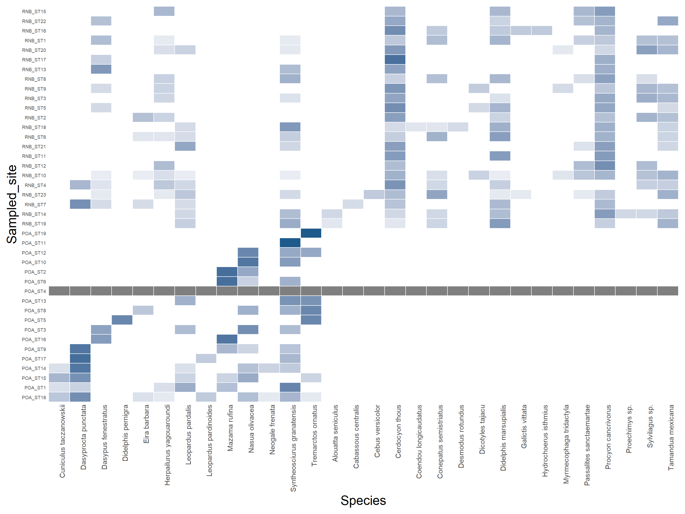](index_files/figure-html/unnamed-chunk-5-1.png)

> Observe cómo algunas cámaras no registraron ninguna especie. Aquí se muestra como la línea horizontal gis. Tal vez debamos eliminar esas cámaras.

## Rarefacción usando `vegan`

> Tenga en cuenta que los sitios son cámaras y la acumulación es de especies por cámara, no de tiempo.

La rarefacción es una técnica para evaluar la riqueza de especies esperada. La rarefacción permite calcular la riqueza de especies para un número determinado de muestras individuales, basándose en la construcción de curvas de rarefacción.

El problema que se produce al muestrear varias especies en una comunidad es que cuanto mayor sea el número de individuos muestreados, más especies se encontrarán. Las curvas de rarefacción se crean muestreando aleatoriamente el conjunto de N muestras varias veces y luego trazando el número promedio de especies encontradas en cada muestra (1,2, … N). “Por lo tanto, la rarefacción genera el número esperado de especies en una pequeña colección de n individuos (o n muestras) extraídos al azar del gran conjunto de N muestras”. Las curvas de rarefacción generalmente crecen rápidamente al principio, a medida que se encuentran las especies más comunes, pero las curvas se estabilizan a medida que solo quedan por muestrear las especies más raras.

Code

``` downlit

rarecurve(mat_vegan, col = "blue") 
```

[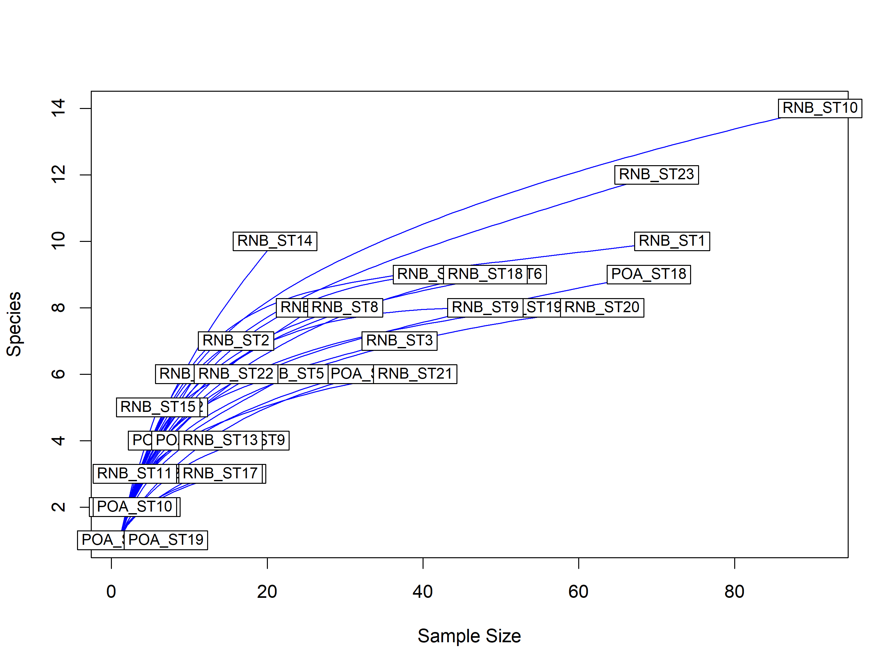](index_files/figure-html/unnamed-chunk-6-1.png)

Code

``` downlit
rarecurve(t(cesar_sp), col = "blue") 
```

[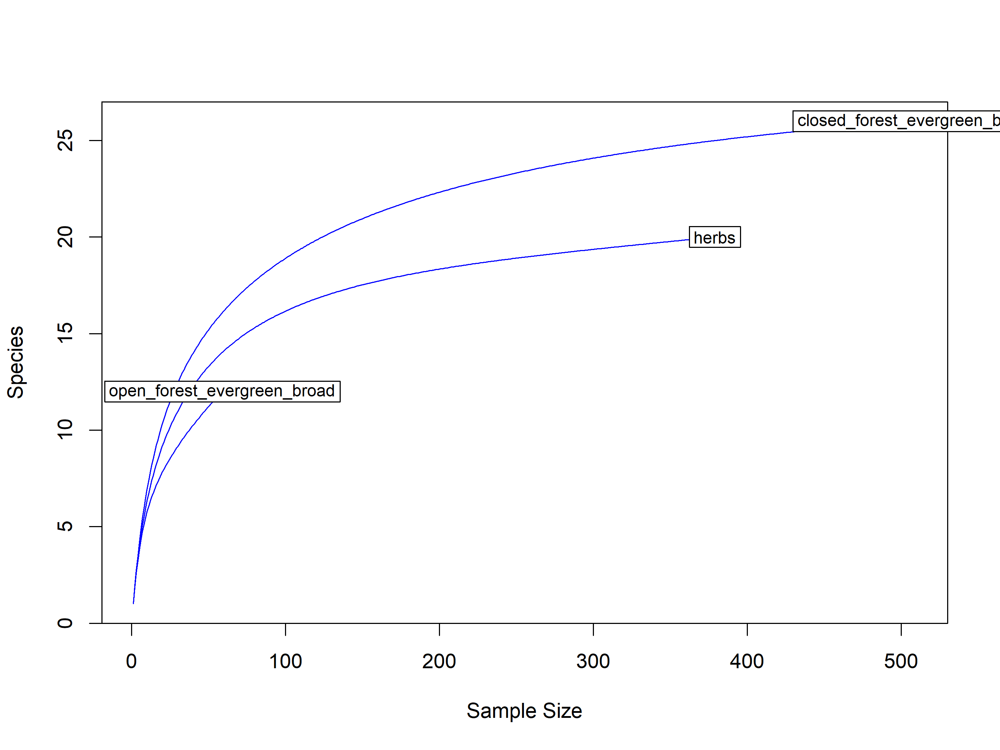](index_files/figure-html/unnamed-chunk-6-2.png)

Code

``` downlit

sp1 <- specaccum(mat_vegan)
sp2 <- specaccum(mat_vegan, "random")
# sp2
# summary(sp2)
plot(sp1, ci.type="poly", col="blue", lwd=2, ci.lty=0, ci.col="lightblue")
```

[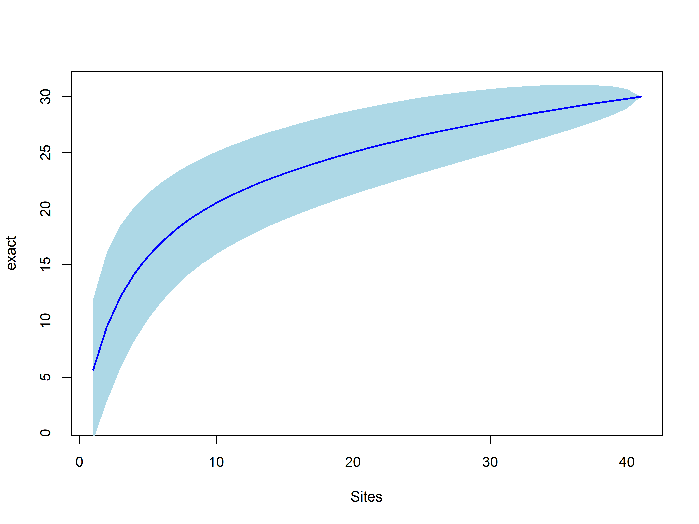](index_files/figure-html/unnamed-chunk-6-3.png)

Code

``` downlit
# boxplot(sp2, col="yellow", add=TRUE, pch="+")


mods <- fitspecaccum(sp1, "gleason")
plot(mods, col="hotpink")
boxplot(sp2, col = "yellow", border = "blue", lty=1, cex=0.3, add= TRUE)
```

[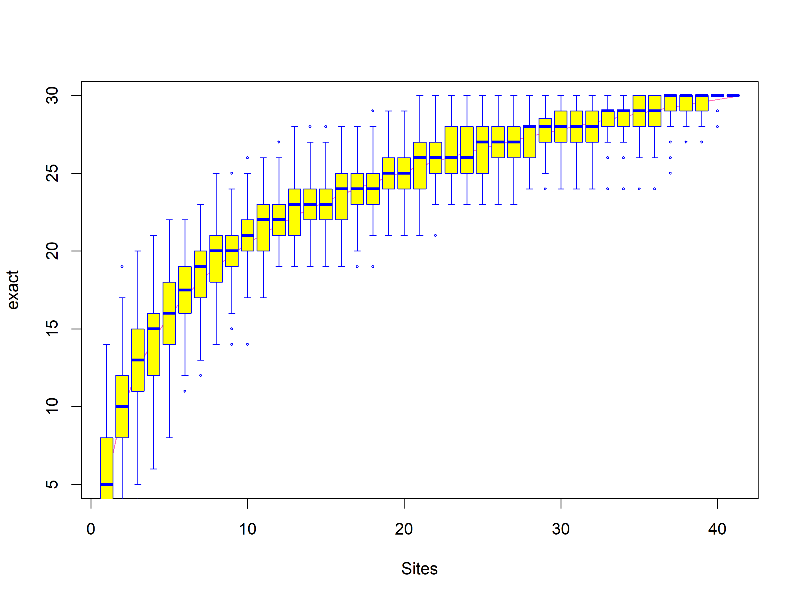](index_files/figure-html/unnamed-chunk-6-4.png)

Code

``` downlit


## Accumulation model
pool <- poolaccum(mat_vegan)
# summary(pool, display = "chao")
plot(pool)
```

[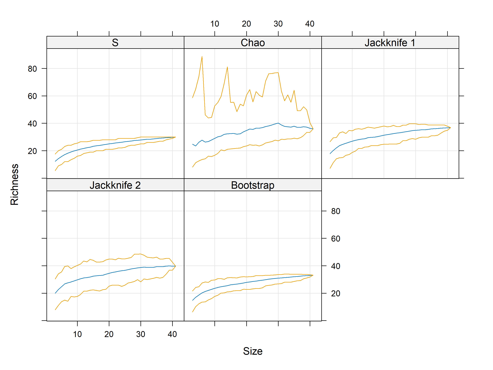](index_files/figure-html/unnamed-chunk-6-5.png)

### Rango Abundancia Dominancia

Un enfoque alternativo para la distribución de la abundancia de especies es representar gráficamente las abundancias logarítmicas en orden decreciente o en función de los rangos de especies. Estos tambien son conocidos como Whittaker plots.

Las curvas de Rango Abundancia Dominancia muestran la abundancia logarítmica de las especies en función de su orden jerárquico. Se supone que estos gráficos son eficaces para analizar los tipos de distribución de la abundancia en las comunidades.

Code

``` downlit
k <- sample(nrow(mat_vegan), 1)
# Take a subset to save time and nerves
rad <- radfit(mat_vegan[21,]) # site 21
# plot(rad)
radlattice(rad)
```

[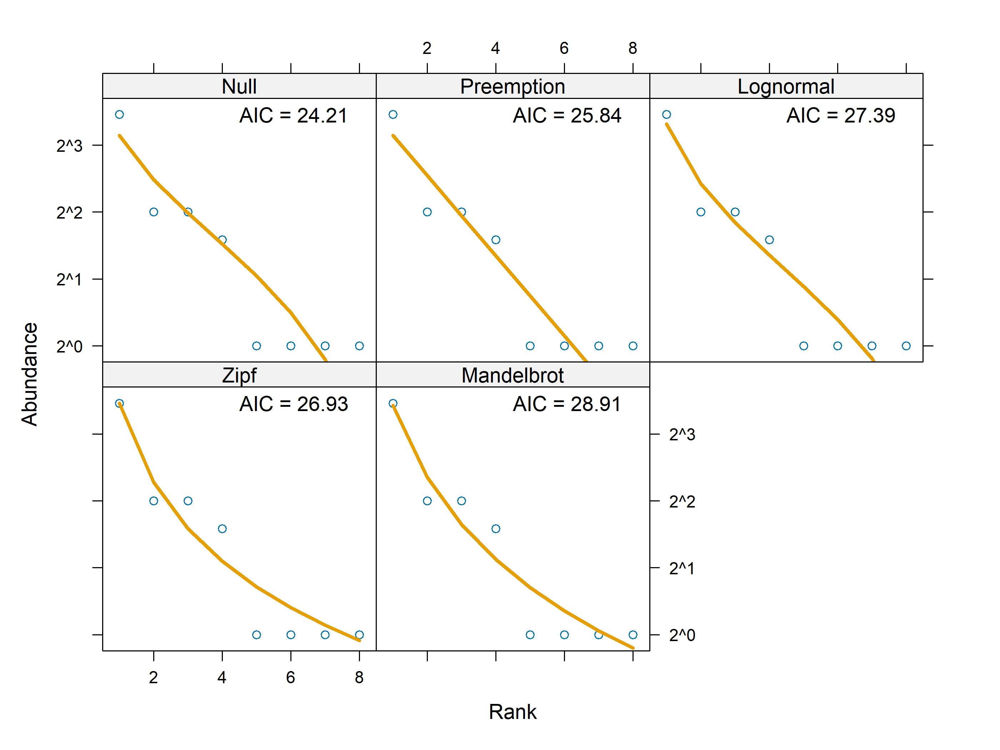](index_files/figure-html/unnamed-chunk-7-1.png)

Code

``` downlit

# Take a subset of sites 1 to 3 in mat_vegan to save time and nerves
mod <- radfit(mat_vegan[1:3,])
mod
#> 
#> Deviance for RAD models:
#> 
#>            POA_ST18 POA_ST1 POA_ST15
#> Null        6.91101 2.06787   0.8623
#> Preemption  3.45643 0.43703   0.5957
#> Lognormal   2.41147 0.38861   0.6575
#> Zipf        4.63984 0.59345   0.6836
#> Mandelbrot  2.99015 0.13371   0.4411
plot(mod)
```

[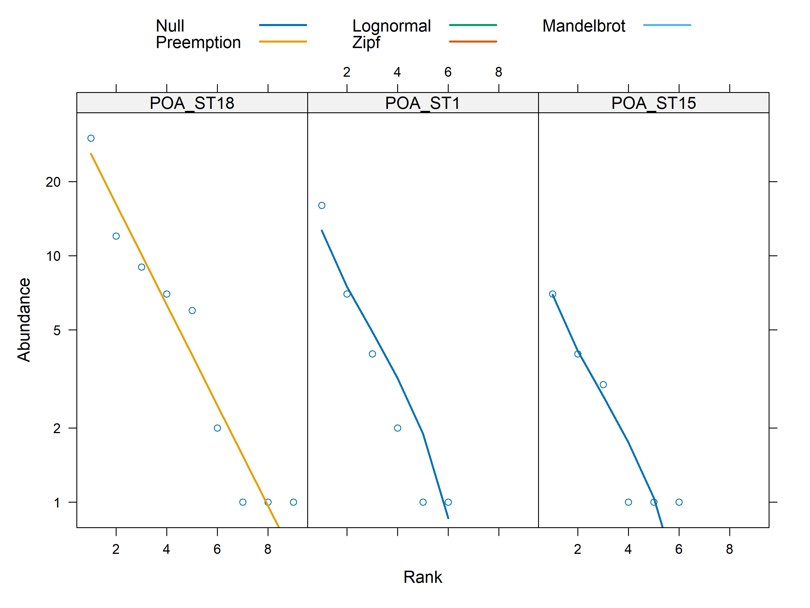](index_files/figure-html/unnamed-chunk-7-2.png)

### Diversidad de Hill usando el paquete `vegan`

La función `renyi` encuentra diversidades de Rényi en las escala del número de Hill correspondiente.

Calculemos las curvas de acumulación de especies para todos los los sitios.

Code

``` downlit
# data(BCI)
i <- sample(nrow(mat_vegan), 20)
mod2 <- renyi(mat_vegan) #selecting sites with more than one record
plot(mod2)
```

[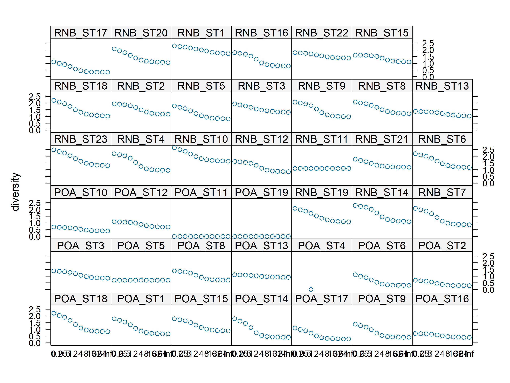](index_files/figure-html/unnamed-chunk-8-1.png)

Ahora comparemos los sitios 1 al 18 que corresponden la Paz Manaure Vs. Beccerril que son los sitios 19 al 41. Note que el sitio 12 no tiene ninguna especie, asi que debe ser eliminado.

Code

``` downlit
# sitios 19 a 41
mod3 <- renyiaccum(mat_vegan[19:41,], hill=TRUE) # sitios 19 a 41 RNB
mod4 <- renyiaccum(mat_vegan[c(1,2,3,4,5,6,7,8,9,10,
                               11,13,14,15,16,17,18),], hill=TRUE) # sitios POA

# create a new plotting window and set the plotting area into a 1*2 array
par(mfrow = c(1, 2))
plot(mod3, as.table=TRUE, col = c(1, 2, 2))
```

[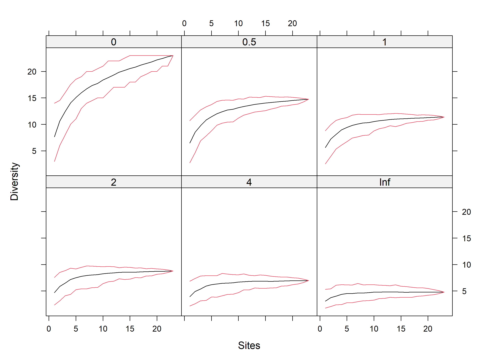](index_files/figure-html/unnamed-chunk-9-1.png)

Code

``` downlit
plot(mod4, as.table=TRUE, col = c(1, 2, 2))
```

[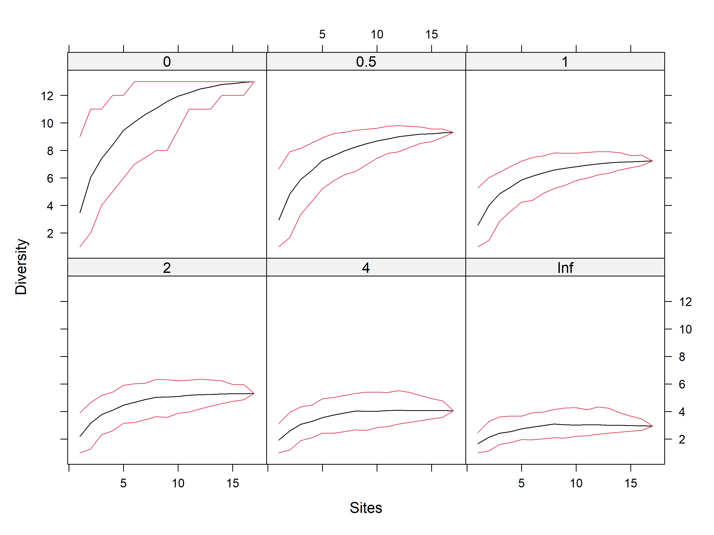](index_files/figure-html/unnamed-chunk-9-2.png)

Code

``` downlit

# persp(mod3)
```

Las graficas tambien se pueden ver en 3D

Code

``` downlit

par(mfrow = c(1, 2))
persp(mod3)
persp(mod4)
```

[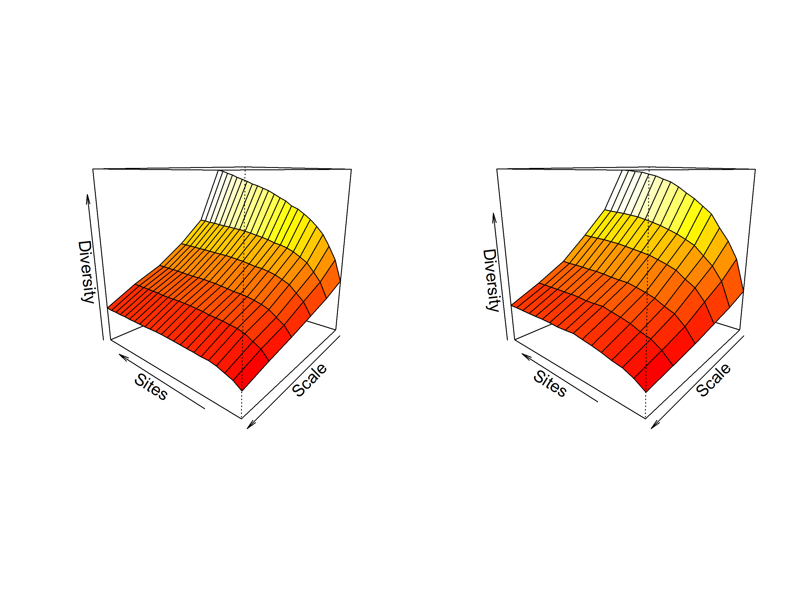](index_files/figure-html/unnamed-chunk-10-1.png)

### Número total de especies

Code

``` downlit
DT::datatable(round(specpool(mat_vegan),3))
```

### Numero de especies no vistas en cada camara

Look at S.chao1

Code

``` downlit
DT::datatable(
t(round(as.data.frame(estimateR(mat_vegan[,])),3))
)
```

Code

``` downlit

# save as dataframe
S_per_site <- as.data.frame(t(round(as.data.frame(estimateR(mat_vegan[,])),3)))
# add sites
S_per_site$Station <- rownames(S_per_site)
```

It is weird to have .5 species in some sites.

## Creemos un mapa al convertir la tabla de operación de la cámara trampa a un objeto `sf`

En este paso, convertimos la tabla de operación de la cámara trampa a un objeto `sf`. Luego agregamos la elevación con una busqueda rapida en los datos de la nube de Amazon (AWS), luego agregamos el tipo de hábitat y las especies por sitio (S.chao1), para finalmente visualizar el mapa, el cuál muestra la cantidad de especies como el tamaño del punto.

Code

``` downlit

# datos_distinct <- datos |> distinct(Longitude, Latitude, CT, Proyecto)

projlatlon <- "+proj=longlat +datum=WGS84 +no_defs +ellps=WGS84 +towgs84=0,0,0"

CToperation_sf <-  st_as_sf(x = CToperation,
                         coords = c("Lon", 
                                    "Lat"),
                         crs = projlatlon)

# write.csv(habs, "C:/CodigoR/CameraTrapCesar/data/habitats.csv")
habs <- read.csv("C:/CodigoR/CameraTrapCesar/data/habitats.csv")

CToperation_elev_sf <- get_elev_point(CToperation_sf, src = "aws") # get elevation from AWS

CToperation_elev_sf <- CToperation_elev_sf |> left_join(habs, by='Station') |> left_join(S_per_site, by='Station') |> select("Station", "elevation", "minStart.x","maxEnd.x", "Year.x", "hab_code" , "S.obs", "S.chao1")

# add habitat 
# CToperation_elev_sf$habs <- habs$hab_code
# see the map
mapview(CToperation_elev_sf, zcol="hab_code", cex = "S.chao1", alpha = 0)
```

## Mapa de contornos

Una ventaja de utilizar la estimación de densidad es que podemos sobreponerla a un mapa y usar Los suavizadores de kernel, los cuales son herramientas esenciales para el análisis de datos geograficos. Gracias a su capacidad para transmitir información estadística compleja con visualizaciones gráficas concisas, podemos vcisualizar un mapa de riqueza de especies con contornos. El suavizador de kernel más utilizado es el estimador de densidad de kernel (KDE), que se calcula con la funcion `st_kde` del paquete `eks`.

El contorno del 20 % significa que “el 20 % de las mediciones se encuentran dentro de este contorno”. La documentación de `eks` no está de acuerdo con la forma en que `stat_density_2d` del paquete `ggplot2` realiza su cálculo. No sé quién tiene razón porque el valor estimado es la especie y los resultados son similares. En todo caso usemos `eks`.

Code

``` downlit
# select chao
species <- dplyr::select(CToperation_elev_sf, "S.chao1")
# hakeoides_coord <- data.frame(sf::st_coordinates(hakeoides))
Sta_den <- eks::st_kde(species) # calculate density

# VERY conveniently, eks can generate an sf file of contour lines
contours <- eks::st_get_contour(Sta_den, cont=c( 10,20,30,40,50,60,70,80, 90)) %>% 
  mutate(value=as.numeric(levels(contlabel)))


# pal_fun <- leaflet::colorQuantile("YlOrRd", NULL, n = 5)

p_popup <- paste("Species", as.numeric(levels(contours$estimate)), "number")


tmap::tmap_mode("view") # set mode to interactive plots

tmap::tm_shape(species) + 
    tmap::tm_sf(col="black", size=0.2) +
  #   contours from eks
  tmap::tm_shape(contours) +
    tmap::tm_polygons("estimate",
                      palette="Reds",
                      alpha=0.5 )
```

Code

``` downlit


## geom_sf plot
# ## suitable smoothing matrix gives optimally smoothed contours
# gs1 <- ggplot(Sta_den) + geom_sf(data=CToperation_elev_sf, fill=NA) + ggthemes::theme_map() +
#     colorspace::scale_fill_discrete_sequential(palette="Heat2") 
# gs1 + geom_sf(data=st_get_contour(Sta_den), aes(fill=label_percent(contlabel))) +
#     coord_sf(xlim=xlim, ylim=ylim) 
```

> En términos generales, la estimación de riqueza de especies por sitio muestra que al parecer es mayor en el norte. Observe también que las estimaciones de densidad de núcleo son mayores que las de s.chao1.

## Escalamiento multidimensional no métrico (NMDS)

En la investigación ecológica, a menudo nos interesa no solo comparar descriptores univariados de comunidades, como la diversidad, sino también cómo las especies constituyentes (o la composición de especies) cambian de una comunidad a la siguiente. Una herramienta común para hacer esto es el escalamiento multidimensional no métrico, o NMDS. El objetivo del NMDS es agrupar la información de múltiples dimensiones (por ejemplo, de múltiples comunidades, sitios donde se instaló la cámara trampa, etc.) en solo unas pocas, de modo que se puedan visualizar e interpretar. A diferencia de otras técnicas de ordenación que se basan en distancias (principalmente euclidianas), como el análisis de coordenadas principales, el NMDS utiliza órdenes de rango y, por lo tanto, es una técnica extremadamente flexible que puede adaptarse a una variedad de diferentes tipos de datos.

Si el tratamiento es continuo, como un gradiente ambiental, entonces puede ser útil trazar líneas de contorno en lugar de envolturas convexas. Podemos obtener algunos datos de elevación para nuestra matriz comunitaria original y superponerlos en el gráfico NMDS usando `ordisurf`.

Code

``` downlit

example_NMDS=metaMDS(as.data.frame(mat_vegan), 
                     distance="euclidean",
                     zerodist = "ignore",
                     trymax=300,
                     k=5) # T
#> Wisconsin double standardization
#> Run 0 stress 0.07931572 
#> Run 1 stress 0.08014803 
#> Run 2 stress 0.08070119 
#> Run 3 stress 0.08095094 
#> Run 4 stress 0.08067204 
#> Run 5 stress 0.07965688 
#> ... Procrustes: rmse 0.05115095  max resid 0.1813038 
#> Run 6 stress 0.07836932 
#> ... New best solution
#> ... Procrustes: rmse 0.08636736  max resid 0.3056494 
#> Run 7 stress 0.08024195 
#> Run 8 stress 0.0810637 
#> Run 9 stress 0.07933142 
#> Run 10 stress 0.07860664 
#> ... Procrustes: rmse 0.05999152  max resid 0.2908247 
#> Run 11 stress 0.07907563 
#> Run 12 stress 0.07956862 
#> Run 13 stress 0.08108113 
#> Run 14 stress 0.0782419 
#> ... New best solution
#> ... Procrustes: rmse 0.008577372  max resid 0.02260663 
#> Run 15 stress 0.08035403 
#> Run 16 stress 0.07882269 
#> Run 17 stress 0.07963713 
#> Run 18 stress 0.0796504 
#> Run 19 stress 0.07921461 
#> Run 20 stress 0.07941604 
#> Run 21 stress 0.08057114 
#> Run 22 stress 0.0791947 
#> Run 23 stress 0.07823504 
#> ... New best solution
#> ... Procrustes: rmse 0.06187092  max resid 0.2181191 
#> Run 24 stress 0.0785212 
#> ... Procrustes: rmse 0.08184962  max resid 0.2850129 
#> Run 25 stress 0.08011924 
#> Run 26 stress 0.08020207 
#> Run 27 stress 0.07995016 
#> Run 28 stress 0.08003922 
#> Run 29 stress 0.07917266 
#> Run 30 stress 0.07850791 
#> ... Procrustes: rmse 0.06474448  max resid 0.1978589 
#> Run 31 stress 0.08010422 
#> Run 32 stress 0.07940516 
#> Run 33 stress 0.07996894 
#> Run 34 stress 0.08068725 
#> Run 35 stress 0.07837964 
#> ... Procrustes: rmse 0.01560803  max resid 0.0715659 
#> Run 36 stress 0.07851791 
#> ... Procrustes: rmse 0.08287466  max resid 0.2932717 
#> Run 37 stress 0.08022056 
#> Run 38 stress 0.07927003 
#> Run 39 stress 0.07879515 
#> Run 40 stress 0.0821534 
#> Run 41 stress 0.08129897 
#> Run 42 stress 0.07891388 
#> Run 43 stress 0.0790046 
#> Run 44 stress 0.08129301 
#> Run 45 stress 0.07902798 
#> Run 46 stress 0.07930301 
#> Run 47 stress 0.07979179 
#> Run 48 stress 0.08131694 
#> Run 49 stress 0.07822472 
#> ... New best solution
#> ... Procrustes: rmse 0.004446989  max resid 0.01620173 
#> Run 50 stress 0.07824116 
#> ... Procrustes: rmse 0.06270762  max resid 0.2238349 
#> Run 51 stress 0.08069249 
#> Run 52 stress 0.08124517 
#> Run 53 stress 0.0783833 
#> ... Procrustes: rmse 0.01272943  max resid 0.05419391 
#> Run 54 stress 0.08030711 
#> Run 55 stress 0.08144491 
#> Run 56 stress 0.08077428 
#> Run 57 stress 0.07828174 
#> ... Procrustes: rmse 0.06351221  max resid 0.2148259 
#> Run 58 stress 0.08064748 
#> Run 59 stress 0.07918459 
#> Run 60 stress 0.08222877 
#> Run 61 stress 0.08124275 
#> Run 62 stress 0.08321819 
#> Run 63 stress 0.07918741 
#> Run 64 stress 0.07893333 
#> Run 65 stress 0.07932134 
#> Run 66 stress 0.0798518 
#> Run 67 stress 0.07977442 
#> Run 68 stress 0.07931401 
#> Run 69 stress 0.07861398 
#> ... Procrustes: rmse 0.01871308  max resid 0.06740836 
#> Run 70 stress 0.07896499 
#> Run 71 stress 0.08028605 
#> Run 72 stress 0.07893628 
#> Run 73 stress 0.08069282 
#> Run 74 stress 0.07970847 
#> Run 75 stress 0.08011481 
#> Run 76 stress 0.08147157 
#> Run 77 stress 0.08101052 
#> Run 78 stress 0.07865708 
#> ... Procrustes: rmse 0.01657987  max resid 0.05652728 
#> Run 79 stress 0.07989567 
#> Run 80 stress 0.08169148 
#> Run 81 stress 0.08144408 
#> Run 82 stress 0.08194274 
#> Run 83 stress 0.08117478 
#> Run 84 stress 0.08127721 
#> Run 85 stress 0.08209545 
#> Run 86 stress 0.08027951 
#> Run 87 stress 0.07892395 
#> Run 88 stress 0.08179564 
#> Run 89 stress 0.07823115 
#> ... Procrustes: rmse 0.001911547  max resid 0.007645847 
#> ... Similar to previous best
#> *** Best solution repeated 1 times

# plot the graph
vegan::ordisurf((example_NMDS),CToperation_elev_sf$elevation,main="",col="forestgreen", trymax=100) # bubble = 2
#> 
#> Family: gaussian 
#> Link function: identity 
#> 
#> Formula:
#> y ~ s(x1, x2, k = 10, bs = "tp", fx = FALSE)
#> 
#> Estimated degrees of freedom:
#> 7.54  total = 8.54 
#> 
#> REML score: 310.7183
vegan::orditorp(example_NMDS,display="species",col="blue",air=0.1,
   cex=0.5)
```

[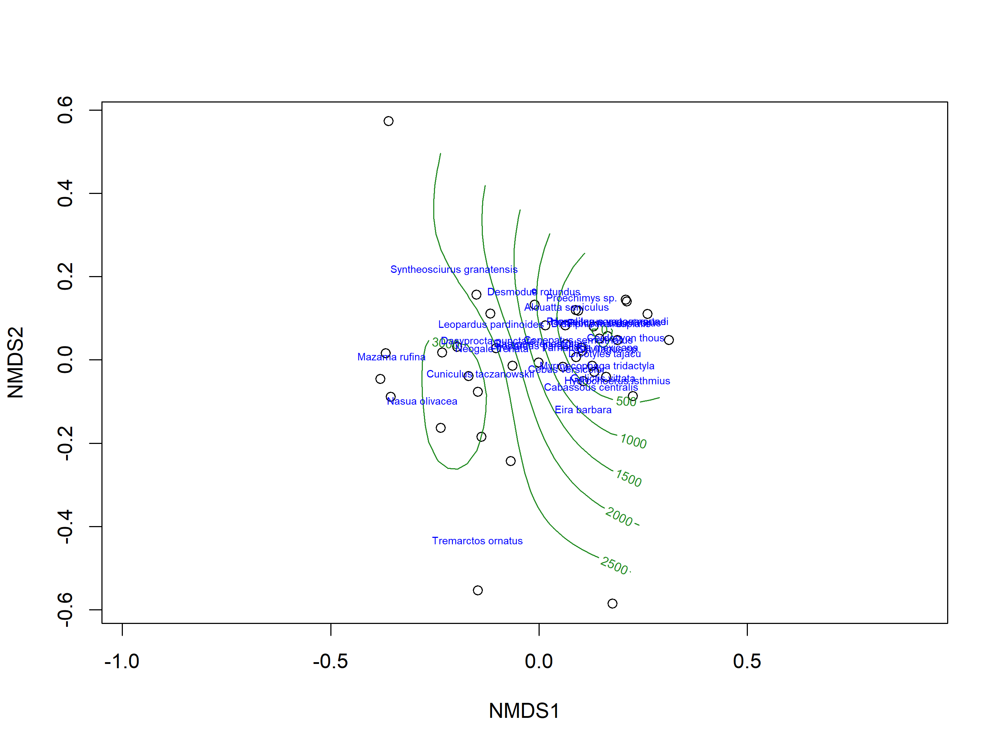](index_files/figure-html/unnamed-chunk-15-1.png)

Podemos hacer una gráfica similar usando `gg_ordisurf` del paquete `ggordiplots` pero incorporando también el tipo de hábitat.

Code

``` downlit
# ggordiplots::gg_ordisurf()
# To fit a surface with ggordiplots:

 
ordiplot <- gg_ordisurf(ord = example_NMDS, 
                        env.var = CToperation_elev_sf$elevation,
                        var.label = "Elevation",
                        pt.size = 2,
                        groups = CToperation_elev_sf$hab_code,
                        binwidth = 50)
```

[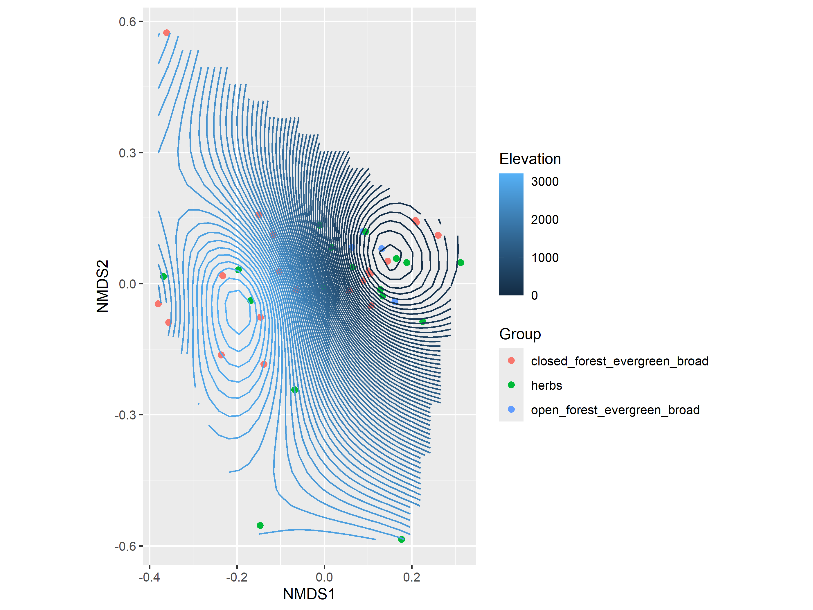](index_files/figure-html/unnamed-chunk-16-1.png)

Code

``` downlit

# ggplotly(ordiplot$plot) # see interactive

# # alternative using biodiversityR
# 
# A1.surface <- ordisurf( y=example_NMDS)
# A1.grid <- ordisurfgrid.long(A1.surface)
# # Preparing the plot
# 
# plotgg4 <- ggplot() + 
#     geom_contour_filled(data=A1.grid, 
#                         aes(x=x, y=y, z=z)) +
#     geom_vline(xintercept = c(0), color = "grey70", linetype = 2) +
#     geom_hline(yintercept = c(0), color = "grey70", linetype = 2) +  
#     xlab(axis.long2[1, "label"]) +
#     ylab(axis.long2[2, "label"]) +  
#     scale_x_continuous(sec.axis = dup_axis(labels=NULL, name=NULL)) +
#     scale_y_continuous(sec.axis = dup_axis(labels=NULL, name=NULL)) +
#     geom_point(data=sites.long2, 
#                aes(x=axis1, y=axis2, shape=Management), 
#                colour="red", size=4) +
#     BioR.theme +
#     scale_fill_viridis_d() +
#     labs(fill="A1") +
#     coord_fixed(ratio=1)
# # and seeing the plot.
# 
# plotgg4
```

Los contornos conectan especies en el espacio de ordenación que se predice que tendrán la misma elevación. Note que es una representación en el espacio multivariado, no una representación geográfica.

## Rarefaction usando `iNEXT`

Code

``` downlit


out <- iNEXT(incidence_cesar, # The data frame
             q=0,# The type of diversity estimator 
             datatype="incidence_freq",   # The type of analysis
             knots=40,                    # The number of data points 
             se=TRUE,                     # confidence intervals
             conf=0.95,                   # The level of confidence intervals
             nboot=100)                    # The number of bootstraps 

ggiNEXT(out, type=1)
```

[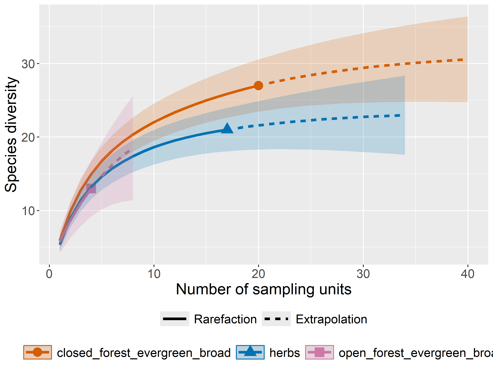](index_files/figure-html/unnamed-chunk-17-1.png)

Code

``` downlit
ggiNEXT(out, type=2)
```

[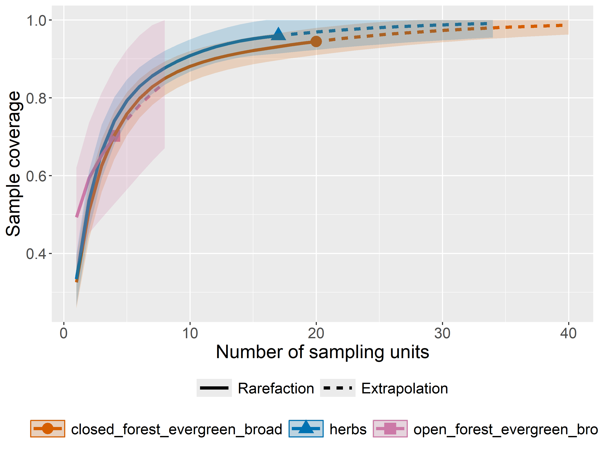](index_files/figure-html/unnamed-chunk-17-2.png)

Code

``` downlit
ggiNEXT(out, type=3)
```

[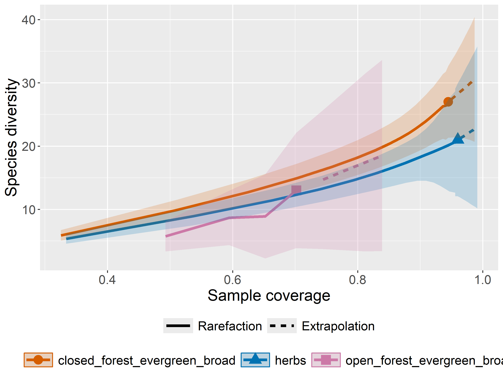](index_files/figure-html/unnamed-chunk-17-3.png)

Code

``` downlit

p1 <- ggiNEXT(out, type=1)+ theme_classic() +   #  type 1 = the diversity estimator
        labs(x = "Survey sites", y = "Richness")
  
p2 <- ggiNEXT(out, type=2)+ theme_classic() +    #  type 2 = the survey coverage
        labs(x = "Survey sites")
    
grid.arrange(p1, p2, nrow = 2)
```

[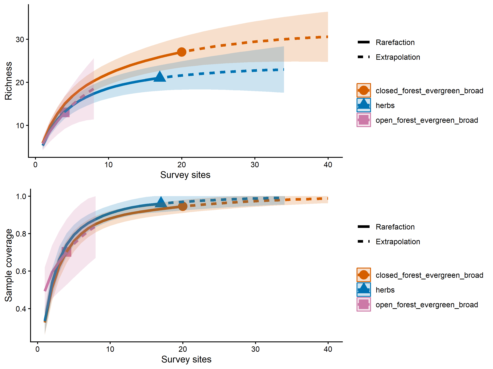](index_files/figure-html/unnamed-chunk-17-4.png)

Code

``` downlit
##############
out2 <- iNEXT(incidence_cesar, q=c(0,1,2) ,datatype="incidence_freq" )

ggiNEXT(out2, type=1, facet.var="Order.q", color.var="Assemblage") + theme_classic() 
```

[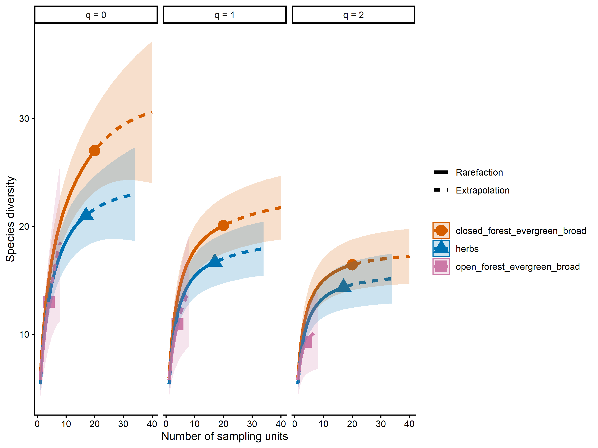](index_files/figure-html/unnamed-chunk-17-5.png)

El paquete `iNEXT` es adecuado para comparaciones de índices de diversidad mediante el uso de números de Hill, de los cuales el valor `q` representa la riqueza y los índices de diversidad tradicionales:

- La riqueza de especies es q = 0.

- El índice de Shannon es q=1

- El índice de Simpson es q=2.

> Nota: el aumento de los valores de `q` reduce la influencia de las especies raras en nuestra estimación de la diversidad de la comunidad.

Facil no?… tenga en cuenta que en los datos de fototrampeo, tal vez debamos separar en los datos aves de los de mamíferos.

[](https://media0.giphy.com/media/v1.Y2lkPTc5MGI3NjExbjcweWYycGs0aGR3b2t0YjFiYWxrYTA1NGRtN2thOXZ0ZHJ5b3J5ZCZlcD12MV9pbnRlcm5hbF9naWZfYnlfaWQmY3Q9Zw/s5lWcBn4uorLrLOLoP/giphy.gif)

## Package Citation

Code

``` downlit
pkgs <- cite_packages(output = "paragraph", out.dir = ".") #knitr::kable(pkgs)
pkgs
```

We used R v. 4.4.2 ([R Core Team 2024](#ref-base)) and the following R packages: camtrapR v. 3.0.0 ([Niedballa et al. 2016](#ref-camtrapR)), DT v. 0.34.0 ([Xie et al. 2025](#ref-DT)), eks v. 1.1.1 ([Duong 2025](#ref-eks)), elevatr v. 0.99.0 ([Hollister et al. 2023](#ref-elevatr)), ggforce v. 0.4.2 ([Pedersen 2024](#ref-ggforce)), ggordiplots v. 0.4.3 ([Quensen et al. 2024](#ref-ggordiplots)), ggvegan v. 0.1.999 ([Simpson and Oksanen 2023](#ref-ggvegan)), gridExtra v. 2.3 ([Auguie 2017](#ref-gridExtra)), iNEXT v. 3.0.1 ([Chao et al. 2014](#ref-iNEXT2014); [Hsieh et al. 2024](#ref-iNEXT2024)), kableExtra v. 1.4.0 ([Zhu 2024](#ref-kableExtra)), knitr v. 1.50 ([Xie 2014](#ref-knitr2014), [2015](#ref-knitr2015), [2025](#ref-knitr2025)), mapview v. 2.11.4 ([Appelhans et al. 2025](#ref-mapview)), MeanRarity v. 0.0.1.5 ([Roswell and Dushoff 2023](#ref-MeanRarity)), patchwork v. 1.3.2 ([Pedersen 2025](#ref-patchwork)), plotly v. 4.10.4 ([Sievert 2020](#ref-plotly)), plyr v. 1.8.9 ([Wickham 2011](#ref-plyr)), reshape2 v. 1.4.4 ([Wickham 2007](#ref-reshape2)), rmarkdown v. 2.30 ([Xie et al. 2018](#ref-rmarkdown2018), [2020](#ref-rmarkdown2020); [Allaire et al. 2025](#ref-rmarkdown2025)), scales v. 1.4.0 ([Wickham et al. 2025](#ref-scales)), sf v. 1.0.21 ([Pebesma 2018](#ref-sf2018); [Pebesma and Bivand 2023](#ref-sf2023)), SpadeR v. 0.1.1 ([Chao et al. 2016](#ref-SpadeR)), tidyverse v. 2.0.0 ([Wickham et al. 2019](#ref-tidyverse)), tmap v. 4.2 ([Tennekes 2018](#ref-tmap)), vegan v. 2.7.2 ([Oksanen et al. 2025](#ref-vegan)).

## Sesion info

> **NOTE:**
>
> Code
>
> ``` downlit
> print(sessionInfo(), locale = FALSE)
> #> R version 4.4.2 (2024-10-31 ucrt)
> #> Platform: x86_64-w64-mingw32/x64
> #> Running under: Windows 10 x64 (build 19045)
> #> 
> #> Matrix products: internal
> #> 
> #> 
> #> attached base packages:
> #> [1] grid      stats     graphics  grDevices utils     datasets  methods  
> #> [8] base     
> #> 
> #> other attached packages:
> #>  [1] scales_1.4.0          plyr_1.8.9            reshape2_1.4.4       
> #>  [4] plotly_4.10.4         ggforce_0.4.2         lubridate_1.9.4      
> #>  [7] forcats_1.0.0         stringr_1.5.2         dplyr_1.1.4          
> #> [10] purrr_1.1.0           readr_2.1.5           tidyr_1.3.1          
> #> [13] tibble_3.2.1          tidyverse_2.0.0       kableExtra_1.4.0     
> #> [16] knitr_1.50            iNEXT_3.0.1           SpadeR_0.1.1         
> #> [19] MeanRarity_0.0.1.0005 DT_0.34.0             gridExtra_2.3        
> #> [22] ggordiplots_0.4.3     glue_1.8.0            ggvegan_0.1.999      
> #> [25] ggplot2_4.0.0         vegan_2.7-2           permute_0.9-7        
> #> [28] camtrapR_3.0.0        grateful_0.3.0        eks_1.1.1            
> #> [31] tmap_4.2              mapview_2.11.4        elevatr_0.99.0       
> #> [34] sf_1.0-21             readxl_1.4.3          patchwork_1.3.2      
> #> 
> #> loaded via a namespace (and not attached):
> #>   [1] RColorBrewer_1.1-3      rstudioapi_0.17.1       jsonlite_2.0.0         
> #>   [4] wk_0.9.4                magrittr_2.0.3          farver_2.1.2           
> #>   [7] rmarkdown_2.30          vctrs_0.6.5             base64enc_0.1-3        
> #>  [10] terra_1.8-70            RcppNumerical_0.6-0     progress_1.2.3         
> #>  [13] htmltools_0.5.8.1       leafsync_0.1.0          curl_7.0.0             
> #>  [16] raster_3.6-32           cellranger_1.1.0        s2_1.1.9               
> #>  [19] sass_0.4.10             pracma_2.4.4            slippymath_0.3.1       
> #>  [22] bslib_0.9.0             KernSmooth_2.23-24      htmlwidgets_1.6.4      
> #>  [25] cachem_1.1.0            libgeos_3.11.1-3        stars_0.6-8            
> #>  [28] uuid_1.2-1              mime_0.13               lifecycle_1.0.4        
> #>  [31] pkgconfig_2.0.3         cols4all_0.8-1          Matrix_1.7-1           
> #>  [34] R6_2.6.1                fastmap_1.2.0           rbibutils_2.3          
> #>  [37] shiny_1.9.1             digest_0.6.37           colorspace_2.1-1       
> #>  [40] leafem_0.2.4            crosstalk_1.2.1         maplegend_0.2.0        
> #>  [43] labeling_0.4.3          lwgeom_0.2-14           progressr_0.15.0       
> #>  [46] spacesXYZ_1.6-0         timechange_0.3.0        httr_1.4.7             
> #>  [49] polyclip_1.10-7         abind_1.4-8             mgcv_1.9-1             
> #>  [52] compiler_4.4.2          microbenchmark_1.5.0    proxy_0.4-27           
> #>  [55] withr_3.0.2             brew_1.0-10             S7_0.2.0               
> #>  [58] DBI_1.2.3               logger_0.4.0            MASS_7.3-61            
> #>  [61] maptiles_0.10.0         tmaptools_3.3           leaflet_2.2.3          
> #>  [64] classInt_0.4-11         tools_4.4.2             units_0.8-7            
> #>  [67] leaflegend_1.2.1        httpuv_1.6.16           satellite_1.0.5        
> #>  [70] nlme_3.1-166            geos_0.2.4              promises_1.3.3         
> #>  [73] cluster_2.1.6           generics_0.1.3          isoband_0.2.7          
> #>  [76] leaflet.providers_2.0.0 gtable_0.3.6            tzdb_0.4.0             
> #>  [79] shinyBS_0.61.1          class_7.3-22            hms_1.1.3              
> #>  [82] data.table_1.17.8       xml2_1.4.0              sp_2.2-0               
> #>  [85] ggrepel_0.9.6           pillar_1.11.1           later_1.4.2            
> #>  [88] splines_4.4.2           tweenr_2.0.3            mapsf_1.0.0            
> #>  [91] lattice_0.22-6          renv_1.0.11             ks_1.15.1              
> #>  [94] tidyselect_1.2.1        svglite_2.1.3           stats4_4.4.2           
> #>  [97] xfun_0.52               shinydashboard_0.7.3    leafpop_0.1.0          
> #> [100] stringi_1.8.4           lazyeval_0.2.2          yaml_2.3.10            
> #> [103] evaluate_1.0.4          codetools_0.2-20        cli_3.6.5              
> #> [106] RcppParallel_5.1.9      systemfonts_1.1.0       xtable_1.8-4           
> #> [109] Rdpack_2.6.2            jquerylib_0.1.4         secr_5.1.0             
> #> [112] dichromat_2.0-0.1       Rcpp_1.1.0              png_0.1-8              
> #> [115] XML_3.99-0.18           parallel_4.4.2          prettyunits_1.2.0      
> #> [118] mclust_6.1.1            viridisLite_0.4.2       mvtnorm_1.3-2          
> #> [121] e1071_1.7-16            crayon_1.5.3            rlang_1.1.6
> ```

Back to top

## References

Allaire, JJ, Yihui Xie, Christophe Dervieux, et al. 2025. *rmarkdown: Dynamic Documents for r*. <https://github.com/rstudio/rmarkdown>.

Appelhans, Tim, Florian Detsch, Christoph Reudenbach, and Stefan Woellauer. 2025. *mapview: Interactive Viewing of Spatial Data in r*. <https://CRAN.R-project.org/package=mapview>.

Auguie, Baptiste. 2017. *gridExtra: Miscellaneous Functions for “Grid” Graphics*. <https://CRAN.R-project.org/package=gridExtra>.

Chao, Anne, Nicholas J. Gotelli, T. C. Hsieh, et al. 2014. “Rarefaction and Extrapolation with Hill Numbers: A Framework for Sampling and Estimation in Species Diversity Studies.” *Ecological Monographs* 84: 45–67.

Chao, Anne, K. H. Ma, T. C. Hsieh, and Chun-Huo Chiu. 2016. *SpadeR: Species-Richness Prediction and Diversity Estimation with r*. <https://CRAN.R-project.org/package=SpadeR>.

Duong, Tarn. 2025. *eks: Tidy and Geospatial Kernel Smoothing*. <https://CRAN.R-project.org/package=eks>.

Hollister, Jeffrey, Tarak Shah, Jakub Nowosad, Alec L. Robitaille, Marcus W. Beck, and Mike Johnson. 2023. *elevatr: Access Elevation Data from Various APIs*. <https://doi.org/10.5281/zenodo.8335450>.

Hsieh, T. C., K. H. Ma, and Anne Chao. 2024. *iNEXT: Interpolation and Extrapolation for Species Diversity*. <http://chao.stat.nthu.edu.tw/wordpress/software_download/>.

Niedballa, Jürgen, Rahel Sollmann, Alexandre Courtiol, and Andreas Wilting. 2016. “camtrapR: An r Package for Efficient Camera Trap Data Management.” *Methods in Ecology and Evolution* 7 (12): 1457–62. <https://doi.org/10.1111/2041-210X.12600>.

Oksanen, Jari, Gavin L. Simpson, F. Guillaume Blanchet, et al. 2025. *vegan: Community Ecology Package*. <https://CRAN.R-project.org/package=vegan>.

Pebesma, Edzer. 2018. “Simple Features for R: Standardized Support for Spatial Vector Data.” *The R Journal* 10 (1): 439–46. <https://doi.org/10.32614/RJ-2018-009>.

Pebesma, Edzer, and Roger Bivand. 2023. *Spatial Data Science: With applications in R*. Chapman and Hall/CRC. <https://doi.org/10.1201/9780429459016>.

Pedersen, Thomas Lin. 2024. *ggforce: Accelerating “ggplot2”*. <https://CRAN.R-project.org/package=ggforce>.

Pedersen, Thomas Lin. 2025. *patchwork: The Composer of Plots*. <https://CRAN.R-project.org/package=patchwork>.

Quensen, John, Gavin Simpson, and Jari Oksanen. 2024. *ggordiplots: Make “ggplot2” Versions of Vegan’s Ordiplots*. <https://CRAN.R-project.org/package=ggordiplots>.

R Core Team. 2024. *R: A Language and Environment for Statistical Computing*. R Foundation for Statistical Computing. <https://www.R-project.org/>.

Roswell, Michael, and Joanathan Dushoff. 2023. *MeanRarity: Hill Diversity Estimation and Visualization*. <https://github.com/mikeroswell/MeanRarity>.

Sievert, Carson. 2020. *Interactive Web-Based Data Visualization with r, Plotly, and Shiny*. Chapman; Hall/CRC. <https://plotly-r.com>.

Simpson, Gavin L., and Jari Oksanen. 2023. *ggvegan: “ggplot2” Plots for the “vegan” Package*. <https://github.com/gavinsimpson/ggvegan>.

Tennekes, Martijn. 2018. “tmap: Thematic Maps in R.” *Journal of Statistical Software* 84 (6): 1–39. <https://doi.org/10.18637/jss.v084.i06>.

Wickham, Hadley. 2007. “Reshaping Data with the reshape Package.” *Journal of Statistical Software* 21 (12): 1–20. <http://www.jstatsoft.org/v21/i12/>.

Wickham, Hadley. 2011. “The Split-Apply-Combine Strategy for Data Analysis.” *Journal of Statistical Software* 40 (1): 1–29. <https://www.jstatsoft.org/v40/i01/>.

Wickham, Hadley, Mara Averick, Jennifer Bryan, et al. 2019. “Welcome to the tidyverse.” *Journal of Open Source Software* 4 (43): 1686. <https://doi.org/10.21105/joss.01686>.

Wickham, Hadley, Thomas Lin Pedersen, and Dana Seidel. 2025. *scales: Scale Functions for Visualization*. <https://CRAN.R-project.org/package=scales>.

Xie, Yihui. 2014. “knitr: A Comprehensive Tool for Reproducible Research in R.” In *Implementing Reproducible Computational Research*, edited by Victoria Stodden, Friedrich Leisch, and Roger D. Peng. Chapman; Hall/CRC.

Xie, Yihui. 2015. *Dynamic Documents with R and Knitr*. 2nd ed. Chapman; Hall/CRC. <https://yihui.org/knitr/>.

Xie, Yihui. 2025. *knitr: A General-Purpose Package for Dynamic Report Generation in R*. <https://yihui.org/knitr/>.

Xie, Yihui, J. J. Allaire, and Garrett Grolemund. 2018. *R Markdown: The Definitive Guide*. Chapman; Hall/CRC. <https://bookdown.org/yihui/rmarkdown>.

Xie, Yihui, Joe Cheng, Xianying Tan, and Garrick Aden-Buie. 2025. *DT: A Wrapper of the JavaScript Library “DataTables”*. <https://CRAN.R-project.org/package=DT>.

Xie, Yihui, Christophe Dervieux, and Emily Riederer. 2020. *R Markdown Cookbook*. Chapman; Hall/CRC. <https://bookdown.org/yihui/rmarkdown-cookbook>.

Zhu, Hao. 2024. *kableExtra: Construct Complex Table with “kable” and Pipe Syntax*. <https://CRAN.R-project.org/package=kableExtra>.

## Citation

BibTeX citation:

``` quarto-appendix-bibtex
@online{j._lizcano2024,
  author = {J. Lizcano, Diego and Fernández-Rodríguez, Camilo and
    Pérez-Gómez, Katherine},
  title = {Riqueza de Especies},
  date = {2024-06-25},
  url = {https://dlizcano.github.io/cameratrap/posts/2024-12-15-riqueza/},
  langid = {en}
}
```

For attribution, please cite this work as:

J. Lizcano, Diego, Camilo Fernández-Rodríguez, and Katherine Pérez-Gómez. 2024. “Riqueza de Especies.” June 25. <https://dlizcano.github.io/cameratrap/posts/2024-12-15-riqueza/>.
