## Shoud I use a spatial model?

In principle Yes!. Specially if you are using geographical covariates, mapping the occupancy, or predicting occupancy the across the space. Imperfect detection and spatial autocorrelation are two important issues to deal with in ecological sampling.

## What is spatial autocorrelation?

Things closer together in space tend to be more similar than things farther apart. Similar to temporal autocorrelation, spatial autocorrelation is the measurement of the potential tendency for similar values to cluster based on proximity. This fact complicates statistical analyses that rely on assumptions of independence.

- Positive spatial autocorrelation: if a large value is observed at point A, large values will also be observed at the neighboring points.

- Negative spatial autocorrelation: if a large value is observed at point A, small values will be observed at the neighboring points.

[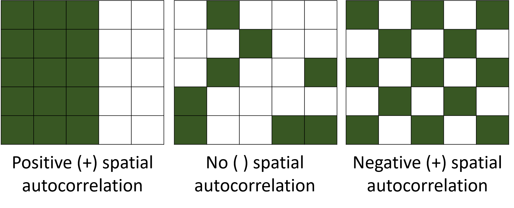](img/spatial_autocorrelation.png "Spatial Autocorrelation")

Spatial Autocorrelation

### What leads to spatial autocorrelation in species distributions?

- Environmental drivers
- Biotic factors (e.g., dispersal, conspecific attraction).
- Climatic factors (temperature-elevation)

In the past the way to incorporate spatial autocorrelation in your occupancy model was coding in `BUGS` or `JAGS`. More recently some models coded in `Stan` incorporated spatial autocorrelation [with the package `ubms`](https://cran.r-project.org/web/packages/ubms/vignettes/spatial-models.html), but in in a limited way. Building an occupancy model with spatial autocorrelation in `Stan` involves adding a spatial random effect to the occupancy submodel, often with a Conditional Autoregressive (CAR) or Gaussian Process (GP) prior. Acknowledging that nearby sites are not independent improves the accuracy of occupancy estimates and their relationship with environmental covariates. However CAR models are best for areal data, like sites organized in a grid (polygons) or counties in a state.

Recently `spOccupancy` came out, this new R package was designed for efficient fitting of single-species and multi-species spatial occupancy models using Pólya-Gamma data augmentation. It leverages Nearest Neighbor Gaussian Processes (NNGPs) for scalability with large datasets.

This code was adapted from: https://github.com/doserjef/acoustic-spOccupancy-22/blob/main/code/single-species-example.R

## Load packages

First we load some packages

Code

``` downlit
library(grateful) # Facilitate Citation of R Packages
library(patchwork) # The Composer of Plots
library(readxl) # Read Excel Files
library(sf) # Simple Features for R
library(mapview) # Interactive Viewing of Spatial Data in R
library(terra) # Spatial Data Analysis
library(elevatr) # Access Elevation Data from Various APIs
library(readr) # read csv files

library(camtrapR) # Camera Trap Data Management and Preparation of Occupancy and Spatial Capture-Recapture Analyses
library(spOccupancy)
library(MCMCvis) # Markov chains viewer
library(bayesplot) 
library(DT) # nice tables

library(kableExtra) # Construct Complex Table with 'kable' and Pipe Syntax
library(tidyverse) # Load the 'Tidyverse'
```

## Load data

The data set is [downloaded from Initiative Monitoreo Katios in Wildlife insights](https://app.wildlifeinsights.org/initiatives/2000172/Monitoreo-Katios) were we sampled with an array of 30 cameras on two consecutive years in Katios National Park in Colombia.

We use this data set just for illustrative purposes.


Initiative Monitoreo Katios

Code

``` downlit

path <- "C:/CodigoR/CameraTrapCesar/data/katios/"
cameras <- read_csv(paste(path, "cameras.csv", sep = ""))
deployment <- read_csv(paste(path, "deployments.csv", sep = ""))
images <- read_csv(paste(path, "images.csv", sep = ""))
project <- read_csv(paste(path, "projects.csv", sep = ""))

# join_by(project_id, camera_id, camera_name)`
cam_deploy <- cameras |>
  left_join(deployment) |>
  dplyr::mutate(year = lubridate::year(start_date)) #|> filter(year== 2023)
cam_deploy_image <- images |>
  left_join(cam_deploy) |>
  mutate(scientificName = paste(genus, species, sep = " ")) |>
  mutate(deployment_id_cam = paste(deployment_id, camera_id, sep = "-")) #|> 
# filter(year==2022)
```

## Convert to sf and view the map

Code

``` downlit

datos_distinct <- cam_deploy_image |>
  distinct(longitude, latitude, deployment_id, samp_year) |>
  as.data.frame()

# Fix NA camera 16
datos_distinct[16, ] <- c(
  -77.2787, 7.73855,
  "CT-K1-31-124", 2021
)

projlatlon <- "+proj=longlat +datum=WGS84 +no_defs +ellps=WGS84 +towgs84=0,0,0"

datos_sf <- st_as_sf(
  x = datos_distinct,
  coords = c(
    "longitude",
    "latitude"
  ),
  crs = projlatlon
)

mapview(st_jitter(datos_sf, 0.00075), zcol = "samp_year")
```

Notice we used the function [`st_jitter()`](https://r-spatial.github.io/sf/reference/st_jitter.html) because the points are on top of the previous year.

## Extract site covariates

Using the coordinates of the `sf` object (datos_sf) we put the cameras on top of the covaraies and with the function [`terra::extract()`](https://rspatial.github.io/terra/reference/extract.html) we get the covariate value.

In this case we used as covariates:

- Cattle distribution as number of cows per 10 square kilometer ([Gilbert et al. 2018](#ref-Gilbert2018)).
- Percent of tree cover from [MODIS product 44B](https://lpdaac.usgs.gov/products/mod44bv006/).
- Road density from ([Meijer et al. 2018](#ref-Meijer2018)).
- Land cover types from [MODIS](https://lpdaac.usgs.gov/products/mcd12q1v006/).

Code

``` downlit
# load rasters
per_tree_cov <- rast("C:/CodigoR/WCS-CameraTrap/raster/latlon/Veg_Cont_Fields_Yearly_250m_v61/Perc_TreeCov/MOD44B_Perc_TreeCov_2021_065.tif")
road_den <- rast("C:/CodigoR/WCS-CameraTrap/raster/latlon/RoadDensity/grip4_total_dens_m_km2.asc")
# elev <- rast("D:/CORREGIDAS/elevation_z7.tif")
landcov <- rast("C:/CodigoR/WCS-CameraTrap/raster/latlon/LandCover_Type_Yearly_500m_v61/LC1/MCD12Q1_LC1_2021_001.tif")
cattle <- rast("C:/CodigoR/WCS-CameraTrap/raster/latlon/Global cattle distribution/5_Ct_2010_Da.tif")
# river <- st_read("F:/WCS-CameraTrap/shp/DensidadRios/MCD12Q1_LC1_2001_001_RECLASS_MASK_GRID_3600m_DensDrenSouthAmer.shp")

# get elevation map
# elevation_detailed <- rast(get_elev_raster(sites, z = 10, clip="bbox", neg_to_na=TRUE))
# elevation_detailed <- get_elev_point (datos_sf, src="aws", overwrite=TRUE)


# extract covs using points and add to sites
# covs <- cbind(sites, terra::extract(SiteCovsRast, sites))
per_tre <- terra::extract(per_tree_cov, datos_sf)
roads <- terra::extract(road_den, datos_sf)
# eleva <- terra::extract(elevation_detailed, sites)
land_cov <- terra::extract(landcov, datos_sf)
cattle_den <- terra::extract(cattle, datos_sf)

#### drop geometry
sites <- datos_sf %>%
  mutate(
    lat = st_coordinates(.)[, 1],
    lon = st_coordinates(.)[, 2]
  ) %>%
  st_drop_geometry() |>
  as.data.frame()

# remove decimals convert to factor
sites$land_cover <- factor(land_cov$MCD12Q1_LC1_2021_001)
# sites$elevation <-  eleva$file3be898018c3
sites$per_tree_cov <- per_tre$MOD44B_Perc_TreeCov_2021_065
#  fix 200 isue
ind <- which(sites$per_tree_cov == 200)
sites$per_tree_cov[ind] <- 0

# sites$elevation <- elevation_detailed$elevation
sites$roads <- roads$grip4_total_dens_m_km2
sites$cattle <- cattle_den[, 2]


# write.csv(sites, "C:/CodigoR/CameraTrapCesar/data/katios/stacked/site_covs.csv")
```

### Selecting the first year 2021

Here we use the function [`detectionHistory()`](https://jniedballa.github.io/camtrapR/reference/detectionHistory.html) from the package `camtrapR` to generate species detection histories that can be used later in occupancy analyses, with package `unmarked` and `ubms`. [`detectionHistory()`](https://jniedballa.github.io/camtrapR/reference/detectionHistory.html) generates detection histories in different formats, with adjustable occasion length and occasion start time and effort covariates. Notice we first need to get the camera operation dates using the function [`cameraOperation()`](https://jniedballa.github.io/camtrapR/reference/cameraOperation.html).

Code

``` downlit
# filter first year and make uniques

CToperation_2021 <- cam_deploy_image |> # multi-season data
  filter(samp_year == 2021) |>
  group_by(deployment_id) |>
  mutate(minStart = min(start_date), maxEnd = max(end_date)) |>
  distinct(longitude, latitude, minStart, maxEnd, samp_year) |>
  ungroup() |>
  as.data.frame()


# Fix NA camera 16
CToperation_2021[16, ] <- c(
  "CT-K1-31-124", -77.2787, 7.73855,
  "2021-10-10", "2021-12-31", 2021
)

# make numeric sampling year
CToperation_2021$samp_year <- as.numeric(CToperation_2021$samp_year)

# camera operation matrix for _2021
# multi-season data. Season1
camop_2021 <- cameraOperation(
  CTtable = CToperation_2021, # Tabla de operación
  stationCol = "deployment_id", # Columna que define la estación
  setupCol = "minStart", # Columna fecha de colocación
  retrievalCol = "maxEnd", # Columna fecha de retiro
  sessionCol = "samp_year", # multi-season column
  # hasProblems= T, # Hubo fallos de cámaras
  dateFormat = "%Y-%m-%d"
) # , #, # Formato de las fechas
# cameraCol="CT")
# sessionCol= "samp_year")

# Generar las historias de detección ---------------------------------------
## remove plroblem species
# ind <- which(datos_PCF$Species=="Marmosa sp.")
# datos_PCF <- datos_PCF[-ind,]

# filter y1
datay_2021 <- cam_deploy_image |> filter(samp_year == 2021) # |>
# filter(samp_year==2022)

DetHist_list_2021 <- lapply(unique(datay_2021$scientificName), FUN = function(x) {
  detectionHistory(
    recordTable = datay_2021, # Tabla de registros
    camOp = camop_2021, # Matriz de operación de cámaras
    stationCol = "deployment_id",
    speciesCol = "scientificName",
    recordDateTimeCol = "timestamp",
    recordDateTimeFormat = "%Y-%m-%d %H:%M:%S",
    species = x, # la función reemplaza x por cada una de las especies
    occasionLength = 15, # Colapso de las historias a días
    day1 = "station", # inicie en la fecha de cada survey
    datesAsOccasionNames = FALSE,
    includeEffort = TRUE,
    scaleEffort = FALSE,
    unmarkedMultFrameInput = TRUE,
    timeZone = "America/Bogota"
  )
})

# names
names(DetHist_list_2021) <- unique(datay_2021$scientificName)

# Finalmente creamos una lista nueva donde estén solo las historias de detección
ylist_2021 <- lapply(DetHist_list_2021, FUN = function(x) x$detection_history)
# y el esfuerzo
effortlist_2021 <- lapply(DetHist_list_2021, FUN = function(x) x$effort)

### Danta, Jaguar
which(names(ylist_2021) == "Tapirus bairdii")
#> integer(0)
which(names(ylist_2021) == "Panthera onca")
#> [1] 5
```

## Fitting a spatial model for the Jaguar

This is a single species, single season spatial occupancy model.

### Load the data

Code

``` downlit
jaguar <- read.csv("C:/CodigoR/CameraTrapCesar/data/katios/stacked/y_jaguar_stacked.csv") |> filter(year == 2021)

# remove one NA
jaguar <- jaguar[-15, ]


projlatlon <- "+proj=longlat +datum=WGS84 +no_defs +ellps=WGS84 +towgs84=0,0,0"

datos_jaguar_sf <- st_as_sf(
  x = jaguar,
  coords = c(
    "lon",
    "lat"
  ),
  crs = projlatlon
)
```

#### Look at the data

Notice how the data was organized.

Code

``` downlit

datatable(head(jaguar))
```

Notice we collapsed the events to 15 days in the 2021 sampling season, and to 25 days in the 2022 sampling season, to end with 6 repeated observations in de matrix. In the matrix o1 to o6 are observations and e1 to e6 are sampling effort (observation-detection covariates). Land_cover, per_tree_cov and roads are site covariates (occupancy covariate).

### Load and prepare data

First we transform to UTM to get the coordinates in meters. Notice that the coordinates of the cameras are part of the data feeding the model. Next we assembled a list including the coordinates, the detection history data and the covariates.

Code

``` downlit

# 1. Data prep ------------------------------------------------------------

# transform to utm
datos_sf_2021_utm <- datos_jaguar_sf |> # filter(samp_year==2021) |>
  st_transform(crs = 21891) #|> left_join(jaguar)

jaguar_covs <- jaguar[, c(8, 9, 16:19)]
# jaguar_covs$year <- as.factor(jaguar_covs$year)


jaguar.data <- list()
jaguar.data$coords <- st_coordinates(datos_sf_2021_utm)
jaguar.data$y <- jaguar[, 2:7]
jaguar.data$occ.covs <- jaguar_covs
jaguar.data$det.covs <- list(effort = jaguar[10:15])
```

#### Notice the structure of the data

It is a list! including:

1.  coordinates
2.  species detections.
3.  occupancy covariates
4.  detection covariates.

Code

``` downlit
glimpse(jaguar.data)
#> List of 4
#>  $ coords  : num [1:31, 1:2] 2440383 2442762 2442674 2443361 2439344 ...
#>   ..- attr(*, "dimnames")=List of 2
#>   .. ..$ : NULL
#>   .. ..$ : chr [1:2] "X" "Y"
#>  $ y       :'data.frame':    31 obs. of  6 variables:
#>   ..$ o1: int [1:31] 1 1 0 0 0 0 0 1 0 0 ...
#>   ..$ o2: int [1:31] 1 0 0 0 0 0 0 0 0 0 ...
#>   ..$ o3: int [1:31] 0 1 0 0 0 0 0 0 0 0 ...
#>   ..$ o4: int [1:31] 0 0 0 0 0 0 0 0 0 0 ...
#>   ..$ o5: int [1:31] 0 0 0 0 0 0 0 0 0 0 ...
#>   ..$ o6: int [1:31] 0 0 0 0 0 0 0 0 0 0 ...
#>  $ occ.covs:'data.frame':    31 obs. of  6 variables:
#>   ..$ site        : int [1:31] 1 2 3 4 5 6 7 8 9 10 ...
#>   ..$ year        : int [1:31] 2021 2021 2021 2021 2021 2021 2021 2021 2021 2021 ...
#>   ..$ land_cover  : int [1:31] 2 2 2 2 2 2 2 2 2 2 ...
#>   ..$ per_tree_cov: int [1:31] 65 70 76 75 73 75 65 71 71 74 ...
#>   ..$ roads       : int [1:31] 152 152 152 152 152 152 152 152 152 152 ...
#>   ..$ cattle      : num [1:31] 0 0 0 0 0 0 0 0 0 0 ...
#>  $ det.covs:List of 1
#>   ..$ effort:'data.frame':   31 obs. of  6 variables:
#>   .. ..$ e1: num [1:31] 14.5 14.5 14.5 14.5 14.5 14.5 14.5 14.5 14.5 14.5 ...
#>   .. ..$ e2: int [1:31] 15 15 15 15 15 15 15 15 15 15 ...
#>   .. ..$ e3: int [1:31] 15 15 15 15 15 15 15 15 15 15 ...
#>   .. ..$ e4: int [1:31] 15 15 15 15 15 15 15 15 15 15 ...
#>   .. ..$ e5: int [1:31] 15 15 15 15 15 15 15 15 15 15 ...
#>   .. ..$ e6: int [1:31] 5 8 3 7 3 7 3 2 7 7 ...
```

with the names: coords, y, occ.covs, det.covs.

### Fit models

We are going to fit a non spatial model and a spatial one, both using effort as detection covariate.

#### Non-spatial, single-species occupancy model

Code

``` downlit
# 2. Model fitting --------------------------------------------------------
# Fit a non-spatial, single-species occupancy model.
out <- PGOcc(
  occ.formula = ~ scale(per_tree_cov) + scale(roads) +
    scale(cattle),
  det.formula = ~ scale(effort),
  data = jaguar.data,
  n.samples = 50000,
  n.thin = 2,
  n.burn = 5000,
  n.chains = 3,
  n.report = 500
)
#> ----------------------------------------
#>  Preparing to run the model
#> ----------------------------------------
#> ----------------------------------------
#>  Model description
#> ----------------------------------------
#> Occupancy model with Polya-Gamma latent
#> variable fit with 31 sites.
#> 
#> Samples per Chain: 50000 
#> Burn-in: 5000 
#> Thinning Rate: 2 
#> Number of Chains: 3 
#> Total Posterior Samples: 67500 
#> 
#> Source compiled with OpenMP support and model fit using 1 thread(s).
#> 
#> ----------------------------------------
#>  Chain 1
#> ----------------------------------------
#> Sampling ... 
#> Sampled: 500 of 50000, 1.00%
#> -------------------------------------------------
#> Sampled: 1000 of 50000, 2.00%
#> -------------------------------------------------
#> Sampled: 1500 of 50000, 3.00%
#> -------------------------------------------------
#> Sampled: 2000 of 50000, 4.00%
#> -------------------------------------------------
#> Sampled: 2500 of 50000, 5.00%
#> -------------------------------------------------
#> Sampled: 3000 of 50000, 6.00%
#> -------------------------------------------------
#> Sampled: 3500 of 50000, 7.00%
#> -------------------------------------------------
#> Sampled: 4000 of 50000, 8.00%
#> -------------------------------------------------
#> Sampled: 4500 of 50000, 9.00%
#> -------------------------------------------------
#> Sampled: 5000 of 50000, 10.00%
#> -------------------------------------------------
#> Sampled: 5500 of 50000, 11.00%
#> -------------------------------------------------
#> Sampled: 6000 of 50000, 12.00%
#> -------------------------------------------------
#> Sampled: 6500 of 50000, 13.00%
#> -------------------------------------------------
#> Sampled: 7000 of 50000, 14.00%
#> -------------------------------------------------
#> Sampled: 7500 of 50000, 15.00%
#> -------------------------------------------------
#> Sampled: 8000 of 50000, 16.00%
#> -------------------------------------------------
#> Sampled: 8500 of 50000, 17.00%
#> -------------------------------------------------
#> Sampled: 9000 of 50000, 18.00%
#> -------------------------------------------------
#> Sampled: 9500 of 50000, 19.00%
#> -------------------------------------------------
#> Sampled: 10000 of 50000, 20.00%
#> -------------------------------------------------
#> Sampled: 10500 of 50000, 21.00%
#> -------------------------------------------------
#> Sampled: 11000 of 50000, 22.00%
#> -------------------------------------------------
#> Sampled: 11500 of 50000, 23.00%
#> -------------------------------------------------
#> Sampled: 12000 of 50000, 24.00%
#> -------------------------------------------------
#> Sampled: 12500 of 50000, 25.00%
#> -------------------------------------------------
#> Sampled: 13000 of 50000, 26.00%
#> -------------------------------------------------
#> Sampled: 13500 of 50000, 27.00%
#> -------------------------------------------------
#> Sampled: 14000 of 50000, 28.00%
#> -------------------------------------------------
#> Sampled: 14500 of 50000, 29.00%
#> -------------------------------------------------
#> Sampled: 15000 of 50000, 30.00%
#> -------------------------------------------------
#> Sampled: 15500 of 50000, 31.00%
#> -------------------------------------------------
#> Sampled: 16000 of 50000, 32.00%
#> -------------------------------------------------
#> Sampled: 16500 of 50000, 33.00%
#> -------------------------------------------------
#> Sampled: 17000 of 50000, 34.00%
#> -------------------------------------------------
#> Sampled: 17500 of 50000, 35.00%
#> -------------------------------------------------
#> Sampled: 18000 of 50000, 36.00%
#> -------------------------------------------------
#> Sampled: 18500 of 50000, 37.00%
#> -------------------------------------------------
#> Sampled: 19000 of 50000, 38.00%
#> -------------------------------------------------
#> Sampled: 19500 of 50000, 39.00%
#> -------------------------------------------------
#> Sampled: 20000 of 50000, 40.00%
#> -------------------------------------------------
#> Sampled: 20500 of 50000, 41.00%
#> -------------------------------------------------
#> Sampled: 21000 of 50000, 42.00%
#> -------------------------------------------------
#> Sampled: 21500 of 50000, 43.00%
#> -------------------------------------------------
#> Sampled: 22000 of 50000, 44.00%
#> -------------------------------------------------
#> Sampled: 22500 of 50000, 45.00%
#> -------------------------------------------------
#> Sampled: 23000 of 50000, 46.00%
#> -------------------------------------------------
#> Sampled: 23500 of 50000, 47.00%
#> -------------------------------------------------
#> Sampled: 24000 of 50000, 48.00%
#> -------------------------------------------------
#> Sampled: 24500 of 50000, 49.00%
#> -------------------------------------------------
#> Sampled: 25000 of 50000, 50.00%
#> -------------------------------------------------
#> Sampled: 25500 of 50000, 51.00%
#> -------------------------------------------------
#> Sampled: 26000 of 50000, 52.00%
#> -------------------------------------------------
#> Sampled: 26500 of 50000, 53.00%
#> -------------------------------------------------
#> Sampled: 27000 of 50000, 54.00%
#> -------------------------------------------------
#> Sampled: 27500 of 50000, 55.00%
#> -------------------------------------------------
#> Sampled: 28000 of 50000, 56.00%
#> -------------------------------------------------
#> Sampled: 28500 of 50000, 57.00%
#> -------------------------------------------------
#> Sampled: 29000 of 50000, 58.00%
#> -------------------------------------------------
#> Sampled: 29500 of 50000, 59.00%
#> -------------------------------------------------
#> Sampled: 30000 of 50000, 60.00%
#> -------------------------------------------------
#> Sampled: 30500 of 50000, 61.00%
#> -------------------------------------------------
#> Sampled: 31000 of 50000, 62.00%
#> -------------------------------------------------
#> Sampled: 31500 of 50000, 63.00%
#> -------------------------------------------------
#> Sampled: 32000 of 50000, 64.00%
#> -------------------------------------------------
#> Sampled: 32500 of 50000, 65.00%
#> -------------------------------------------------
#> Sampled: 33000 of 50000, 66.00%
#> -------------------------------------------------
#> Sampled: 33500 of 50000, 67.00%
#> -------------------------------------------------
#> Sampled: 34000 of 50000, 68.00%
#> -------------------------------------------------
#> Sampled: 34500 of 50000, 69.00%
#> -------------------------------------------------
#> Sampled: 35000 of 50000, 70.00%
#> -------------------------------------------------
#> Sampled: 35500 of 50000, 71.00%
#> -------------------------------------------------
#> Sampled: 36000 of 50000, 72.00%
#> -------------------------------------------------
#> Sampled: 36500 of 50000, 73.00%
#> -------------------------------------------------
#> Sampled: 37000 of 50000, 74.00%
#> -------------------------------------------------
#> Sampled: 37500 of 50000, 75.00%
#> -------------------------------------------------
#> Sampled: 38000 of 50000, 76.00%
#> -------------------------------------------------
#> Sampled: 38500 of 50000, 77.00%
#> -------------------------------------------------
#> Sampled: 39000 of 50000, 78.00%
#> -------------------------------------------------
#> Sampled: 39500 of 50000, 79.00%
#> -------------------------------------------------
#> Sampled: 40000 of 50000, 80.00%
#> -------------------------------------------------
#> Sampled: 40500 of 50000, 81.00%
#> -------------------------------------------------
#> Sampled: 41000 of 50000, 82.00%
#> -------------------------------------------------
#> Sampled: 41500 of 50000, 83.00%
#> -------------------------------------------------
#> Sampled: 42000 of 50000, 84.00%
#> -------------------------------------------------
#> Sampled: 42500 of 50000, 85.00%
#> -------------------------------------------------
#> Sampled: 43000 of 50000, 86.00%
#> -------------------------------------------------
#> Sampled: 43500 of 50000, 87.00%
#> -------------------------------------------------
#> Sampled: 44000 of 50000, 88.00%
#> -------------------------------------------------
#> Sampled: 44500 of 50000, 89.00%
#> -------------------------------------------------
#> Sampled: 45000 of 50000, 90.00%
#> -------------------------------------------------
#> Sampled: 45500 of 50000, 91.00%
#> -------------------------------------------------
#> Sampled: 46000 of 50000, 92.00%
#> -------------------------------------------------
#> Sampled: 46500 of 50000, 93.00%
#> -------------------------------------------------
#> Sampled: 47000 of 50000, 94.00%
#> -------------------------------------------------
#> Sampled: 47500 of 50000, 95.00%
#> -------------------------------------------------
#> Sampled: 48000 of 50000, 96.00%
#> -------------------------------------------------
#> Sampled: 48500 of 50000, 97.00%
#> -------------------------------------------------
#> Sampled: 49000 of 50000, 98.00%
#> -------------------------------------------------
#> Sampled: 49500 of 50000, 99.00%
#> -------------------------------------------------
#> Sampled: 50000 of 50000, 100.00%
#> ----------------------------------------
#>  Chain 2
#> ----------------------------------------
#> Sampling ... 
#> Sampled: 500 of 50000, 1.00%
#> -------------------------------------------------
#> Sampled: 1000 of 50000, 2.00%
#> -------------------------------------------------
#> Sampled: 1500 of 50000, 3.00%
#> -------------------------------------------------
#> Sampled: 2000 of 50000, 4.00%
#> -------------------------------------------------
#> Sampled: 2500 of 50000, 5.00%
#> -------------------------------------------------
#> Sampled: 3000 of 50000, 6.00%
#> -------------------------------------------------
#> Sampled: 3500 of 50000, 7.00%
#> -------------------------------------------------
#> Sampled: 4000 of 50000, 8.00%
#> -------------------------------------------------
#> Sampled: 4500 of 50000, 9.00%
#> -------------------------------------------------
#> Sampled: 5000 of 50000, 10.00%
#> -------------------------------------------------
#> Sampled: 5500 of 50000, 11.00%
#> -------------------------------------------------
#> Sampled: 6000 of 50000, 12.00%
#> -------------------------------------------------
#> Sampled: 6500 of 50000, 13.00%
#> -------------------------------------------------
#> Sampled: 7000 of 50000, 14.00%
#> -------------------------------------------------
#> Sampled: 7500 of 50000, 15.00%
#> -------------------------------------------------
#> Sampled: 8000 of 50000, 16.00%
#> -------------------------------------------------
#> Sampled: 8500 of 50000, 17.00%
#> -------------------------------------------------
#> Sampled: 9000 of 50000, 18.00%
#> -------------------------------------------------
#> Sampled: 9500 of 50000, 19.00%
#> -------------------------------------------------
#> Sampled: 10000 of 50000, 20.00%
#> -------------------------------------------------
#> Sampled: 10500 of 50000, 21.00%
#> -------------------------------------------------
#> Sampled: 11000 of 50000, 22.00%
#> -------------------------------------------------
#> Sampled: 11500 of 50000, 23.00%
#> -------------------------------------------------
#> Sampled: 12000 of 50000, 24.00%
#> -------------------------------------------------
#> Sampled: 12500 of 50000, 25.00%
#> -------------------------------------------------
#> Sampled: 13000 of 50000, 26.00%
#> -------------------------------------------------
#> Sampled: 13500 of 50000, 27.00%
#> -------------------------------------------------
#> Sampled: 14000 of 50000, 28.00%
#> -------------------------------------------------
#> Sampled: 14500 of 50000, 29.00%
#> -------------------------------------------------
#> Sampled: 15000 of 50000, 30.00%
#> -------------------------------------------------
#> Sampled: 15500 of 50000, 31.00%
#> -------------------------------------------------
#> Sampled: 16000 of 50000, 32.00%
#> -------------------------------------------------
#> Sampled: 16500 of 50000, 33.00%
#> -------------------------------------------------
#> Sampled: 17000 of 50000, 34.00%
#> -------------------------------------------------
#> Sampled: 17500 of 50000, 35.00%
#> -------------------------------------------------
#> Sampled: 18000 of 50000, 36.00%
#> -------------------------------------------------
#> Sampled: 18500 of 50000, 37.00%
#> -------------------------------------------------
#> Sampled: 19000 of 50000, 38.00%
#> -------------------------------------------------
#> Sampled: 19500 of 50000, 39.00%
#> -------------------------------------------------
#> Sampled: 20000 of 50000, 40.00%
#> -------------------------------------------------
#> Sampled: 20500 of 50000, 41.00%
#> -------------------------------------------------
#> Sampled: 21000 of 50000, 42.00%
#> -------------------------------------------------
#> Sampled: 21500 of 50000, 43.00%
#> -------------------------------------------------
#> Sampled: 22000 of 50000, 44.00%
#> -------------------------------------------------
#> Sampled: 22500 of 50000, 45.00%
#> -------------------------------------------------
#> Sampled: 23000 of 50000, 46.00%
#> -------------------------------------------------
#> Sampled: 23500 of 50000, 47.00%
#> -------------------------------------------------
#> Sampled: 24000 of 50000, 48.00%
#> -------------------------------------------------
#> Sampled: 24500 of 50000, 49.00%
#> -------------------------------------------------
#> Sampled: 25000 of 50000, 50.00%
#> -------------------------------------------------
#> Sampled: 25500 of 50000, 51.00%
#> -------------------------------------------------
#> Sampled: 26000 of 50000, 52.00%
#> -------------------------------------------------
#> Sampled: 26500 of 50000, 53.00%
#> -------------------------------------------------
#> Sampled: 27000 of 50000, 54.00%
#> -------------------------------------------------
#> Sampled: 27500 of 50000, 55.00%
#> -------------------------------------------------
#> Sampled: 28000 of 50000, 56.00%
#> -------------------------------------------------
#> Sampled: 28500 of 50000, 57.00%
#> -------------------------------------------------
#> Sampled: 29000 of 50000, 58.00%
#> -------------------------------------------------
#> Sampled: 29500 of 50000, 59.00%
#> -------------------------------------------------
#> Sampled: 30000 of 50000, 60.00%
#> -------------------------------------------------
#> Sampled: 30500 of 50000, 61.00%
#> -------------------------------------------------
#> Sampled: 31000 of 50000, 62.00%
#> -------------------------------------------------
#> Sampled: 31500 of 50000, 63.00%
#> -------------------------------------------------
#> Sampled: 32000 of 50000, 64.00%
#> -------------------------------------------------
#> Sampled: 32500 of 50000, 65.00%
#> -------------------------------------------------
#> Sampled: 33000 of 50000, 66.00%
#> -------------------------------------------------
#> Sampled: 33500 of 50000, 67.00%
#> -------------------------------------------------
#> Sampled: 34000 of 50000, 68.00%
#> -------------------------------------------------
#> Sampled: 34500 of 50000, 69.00%
#> -------------------------------------------------
#> Sampled: 35000 of 50000, 70.00%
#> -------------------------------------------------
#> Sampled: 35500 of 50000, 71.00%
#> -------------------------------------------------
#> Sampled: 36000 of 50000, 72.00%
#> -------------------------------------------------
#> Sampled: 36500 of 50000, 73.00%
#> -------------------------------------------------
#> Sampled: 37000 of 50000, 74.00%
#> -------------------------------------------------
#> Sampled: 37500 of 50000, 75.00%
#> -------------------------------------------------
#> Sampled: 38000 of 50000, 76.00%
#> -------------------------------------------------
#> Sampled: 38500 of 50000, 77.00%
#> -------------------------------------------------
#> Sampled: 39000 of 50000, 78.00%
#> -------------------------------------------------
#> Sampled: 39500 of 50000, 79.00%
#> -------------------------------------------------
#> Sampled: 40000 of 50000, 80.00%
#> -------------------------------------------------
#> Sampled: 40500 of 50000, 81.00%
#> -------------------------------------------------
#> Sampled: 41000 of 50000, 82.00%
#> -------------------------------------------------
#> Sampled: 41500 of 50000, 83.00%
#> -------------------------------------------------
#> Sampled: 42000 of 50000, 84.00%
#> -------------------------------------------------
#> Sampled: 42500 of 50000, 85.00%
#> -------------------------------------------------
#> Sampled: 43000 of 50000, 86.00%
#> -------------------------------------------------
#> Sampled: 43500 of 50000, 87.00%
#> -------------------------------------------------
#> Sampled: 44000 of 50000, 88.00%
#> -------------------------------------------------
#> Sampled: 44500 of 50000, 89.00%
#> -------------------------------------------------
#> Sampled: 45000 of 50000, 90.00%
#> -------------------------------------------------
#> Sampled: 45500 of 50000, 91.00%
#> -------------------------------------------------
#> Sampled: 46000 of 50000, 92.00%
#> -------------------------------------------------
#> Sampled: 46500 of 50000, 93.00%
#> -------------------------------------------------
#> Sampled: 47000 of 50000, 94.00%
#> -------------------------------------------------
#> Sampled: 47500 of 50000, 95.00%
#> -------------------------------------------------
#> Sampled: 48000 of 50000, 96.00%
#> -------------------------------------------------
#> Sampled: 48500 of 50000, 97.00%
#> -------------------------------------------------
#> Sampled: 49000 of 50000, 98.00%
#> -------------------------------------------------
#> Sampled: 49500 of 50000, 99.00%
#> -------------------------------------------------
#> Sampled: 50000 of 50000, 100.00%
#> ----------------------------------------
#>  Chain 3
#> ----------------------------------------
#> Sampling ... 
#> Sampled: 500 of 50000, 1.00%
#> -------------------------------------------------
#> Sampled: 1000 of 50000, 2.00%
#> -------------------------------------------------
#> Sampled: 1500 of 50000, 3.00%
#> -------------------------------------------------
#> Sampled: 2000 of 50000, 4.00%
#> -------------------------------------------------
#> Sampled: 2500 of 50000, 5.00%
#> -------------------------------------------------
#> Sampled: 3000 of 50000, 6.00%
#> -------------------------------------------------
#> Sampled: 3500 of 50000, 7.00%
#> -------------------------------------------------
#> Sampled: 4000 of 50000, 8.00%
#> -------------------------------------------------
#> Sampled: 4500 of 50000, 9.00%
#> -------------------------------------------------
#> Sampled: 5000 of 50000, 10.00%
#> -------------------------------------------------
#> Sampled: 5500 of 50000, 11.00%
#> -------------------------------------------------
#> Sampled: 6000 of 50000, 12.00%
#> -------------------------------------------------
#> Sampled: 6500 of 50000, 13.00%
#> -------------------------------------------------
#> Sampled: 7000 of 50000, 14.00%
#> -------------------------------------------------
#> Sampled: 7500 of 50000, 15.00%
#> -------------------------------------------------
#> Sampled: 8000 of 50000, 16.00%
#> -------------------------------------------------
#> Sampled: 8500 of 50000, 17.00%
#> -------------------------------------------------
#> Sampled: 9000 of 50000, 18.00%
#> -------------------------------------------------
#> Sampled: 9500 of 50000, 19.00%
#> -------------------------------------------------
#> Sampled: 10000 of 50000, 20.00%
#> -------------------------------------------------
#> Sampled: 10500 of 50000, 21.00%
#> -------------------------------------------------
#> Sampled: 11000 of 50000, 22.00%
#> -------------------------------------------------
#> Sampled: 11500 of 50000, 23.00%
#> -------------------------------------------------
#> Sampled: 12000 of 50000, 24.00%
#> -------------------------------------------------
#> Sampled: 12500 of 50000, 25.00%
#> -------------------------------------------------
#> Sampled: 13000 of 50000, 26.00%
#> -------------------------------------------------
#> Sampled: 13500 of 50000, 27.00%
#> -------------------------------------------------
#> Sampled: 14000 of 50000, 28.00%
#> -------------------------------------------------
#> Sampled: 14500 of 50000, 29.00%
#> -------------------------------------------------
#> Sampled: 15000 of 50000, 30.00%
#> -------------------------------------------------
#> Sampled: 15500 of 50000, 31.00%
#> -------------------------------------------------
#> Sampled: 16000 of 50000, 32.00%
#> -------------------------------------------------
#> Sampled: 16500 of 50000, 33.00%
#> -------------------------------------------------
#> Sampled: 17000 of 50000, 34.00%
#> -------------------------------------------------
#> Sampled: 17500 of 50000, 35.00%
#> -------------------------------------------------
#> Sampled: 18000 of 50000, 36.00%
#> -------------------------------------------------
#> Sampled: 18500 of 50000, 37.00%
#> -------------------------------------------------
#> Sampled: 19000 of 50000, 38.00%
#> -------------------------------------------------
#> Sampled: 19500 of 50000, 39.00%
#> -------------------------------------------------
#> Sampled: 20000 of 50000, 40.00%
#> -------------------------------------------------
#> Sampled: 20500 of 50000, 41.00%
#> -------------------------------------------------
#> Sampled: 21000 of 50000, 42.00%
#> -------------------------------------------------
#> Sampled: 21500 of 50000, 43.00%
#> -------------------------------------------------
#> Sampled: 22000 of 50000, 44.00%
#> -------------------------------------------------
#> Sampled: 22500 of 50000, 45.00%
#> -------------------------------------------------
#> Sampled: 23000 of 50000, 46.00%
#> -------------------------------------------------
#> Sampled: 23500 of 50000, 47.00%
#> -------------------------------------------------
#> Sampled: 24000 of 50000, 48.00%
#> -------------------------------------------------
#> Sampled: 24500 of 50000, 49.00%
#> -------------------------------------------------
#> Sampled: 25000 of 50000, 50.00%
#> -------------------------------------------------
#> Sampled: 25500 of 50000, 51.00%
#> -------------------------------------------------
#> Sampled: 26000 of 50000, 52.00%
#> -------------------------------------------------
#> Sampled: 26500 of 50000, 53.00%
#> -------------------------------------------------
#> Sampled: 27000 of 50000, 54.00%
#> -------------------------------------------------
#> Sampled: 27500 of 50000, 55.00%
#> -------------------------------------------------
#> Sampled: 28000 of 50000, 56.00%
#> -------------------------------------------------
#> Sampled: 28500 of 50000, 57.00%
#> -------------------------------------------------
#> Sampled: 29000 of 50000, 58.00%
#> -------------------------------------------------
#> Sampled: 29500 of 50000, 59.00%
#> -------------------------------------------------
#> Sampled: 30000 of 50000, 60.00%
#> -------------------------------------------------
#> Sampled: 30500 of 50000, 61.00%
#> -------------------------------------------------
#> Sampled: 31000 of 50000, 62.00%
#> -------------------------------------------------
#> Sampled: 31500 of 50000, 63.00%
#> -------------------------------------------------
#> Sampled: 32000 of 50000, 64.00%
#> -------------------------------------------------
#> Sampled: 32500 of 50000, 65.00%
#> -------------------------------------------------
#> Sampled: 33000 of 50000, 66.00%
#> -------------------------------------------------
#> Sampled: 33500 of 50000, 67.00%
#> -------------------------------------------------
#> Sampled: 34000 of 50000, 68.00%
#> -------------------------------------------------
#> Sampled: 34500 of 50000, 69.00%
#> -------------------------------------------------
#> Sampled: 35000 of 50000, 70.00%
#> -------------------------------------------------
#> Sampled: 35500 of 50000, 71.00%
#> -------------------------------------------------
#> Sampled: 36000 of 50000, 72.00%
#> -------------------------------------------------
#> Sampled: 36500 of 50000, 73.00%
#> -------------------------------------------------
#> Sampled: 37000 of 50000, 74.00%
#> -------------------------------------------------
#> Sampled: 37500 of 50000, 75.00%
#> -------------------------------------------------
#> Sampled: 38000 of 50000, 76.00%
#> -------------------------------------------------
#> Sampled: 38500 of 50000, 77.00%
#> -------------------------------------------------
#> Sampled: 39000 of 50000, 78.00%
#> -------------------------------------------------
#> Sampled: 39500 of 50000, 79.00%
#> -------------------------------------------------
#> Sampled: 40000 of 50000, 80.00%
#> -------------------------------------------------
#> Sampled: 40500 of 50000, 81.00%
#> -------------------------------------------------
#> Sampled: 41000 of 50000, 82.00%
#> -------------------------------------------------
#> Sampled: 41500 of 50000, 83.00%
#> -------------------------------------------------
#> Sampled: 42000 of 50000, 84.00%
#> -------------------------------------------------
#> Sampled: 42500 of 50000, 85.00%
#> -------------------------------------------------
#> Sampled: 43000 of 50000, 86.00%
#> -------------------------------------------------
#> Sampled: 43500 of 50000, 87.00%
#> -------------------------------------------------
#> Sampled: 44000 of 50000, 88.00%
#> -------------------------------------------------
#> Sampled: 44500 of 50000, 89.00%
#> -------------------------------------------------
#> Sampled: 45000 of 50000, 90.00%
#> -------------------------------------------------
#> Sampled: 45500 of 50000, 91.00%
#> -------------------------------------------------
#> Sampled: 46000 of 50000, 92.00%
#> -------------------------------------------------
#> Sampled: 46500 of 50000, 93.00%
#> -------------------------------------------------
#> Sampled: 47000 of 50000, 94.00%
#> -------------------------------------------------
#> Sampled: 47500 of 50000, 95.00%
#> -------------------------------------------------
#> Sampled: 48000 of 50000, 96.00%
#> -------------------------------------------------
#> Sampled: 48500 of 50000, 97.00%
#> -------------------------------------------------
#> Sampled: 49000 of 50000, 98.00%
#> -------------------------------------------------
#> Sampled: 49500 of 50000, 99.00%
#> -------------------------------------------------
#> Sampled: 50000 of 50000, 100.00%

summary(out)
#> 
#> Call:
#> PGOcc(occ.formula = ~scale(per_tree_cov) + scale(roads) + scale(cattle), 
#>     det.formula = ~scale(effort), data = jaguar.data, n.samples = 50000, 
#>     n.report = 500, n.burn = 5000, n.thin = 2, n.chains = 3)
#> 
#> Samples per Chain: 50000
#> Burn-in: 5000
#> Thinning Rate: 2
#> Number of Chains: 3
#> Total Posterior Samples: 67500
#> Run Time (min): 0.2495
#> 
#> Occurrence (logit scale): 
#>                        Mean     SD    2.5%     50%  97.5%   Rhat   ESS
#> (Intercept)         -0.2814 1.2412 -2.2262 -0.4676 2.5504 1.0004  4864
#> scale(per_tree_cov) -0.9001 0.9651 -3.1419 -0.7699 0.7196 1.0006 11358
#> scale(roads)         0.1314 0.8416 -1.5578  0.1258 1.8904 1.0004 14593
#> scale(cattle)       -1.0808 1.2535 -3.5953 -1.0482 1.6156 1.0001 10296
#> 
#> Detection (logit scale): 
#>                  Mean     SD    2.5%     50%   97.5%   Rhat   ESS
#> (Intercept)   -2.1995 0.6168 -3.3787 -2.2150 -0.9882 1.0001  6851
#> scale(effort)  0.9347 0.6921 -0.1312  0.8343  2.5441 1.0006 15578
```

#### Spatial, single-species occupancy model

Code

``` downlit
# Fit a spatial, single-species occupancy model.
out.sp <- spPGOcc(
  occ.formula = ~ scale(per_tree_cov) + scale(roads) +
    scale(cattle),
  det.formula = ~ scale(effort),
  data = jaguar.data,
  n.neighbors = 8,
  n.batch = 1000,
  batch.length = 15,
  # n.samples = 105000,
  n.thin = 2,
  n.burn = 5000,
  n.chains = 3,
  n.report = 500
)
#> ----------------------------------------
#>  Preparing to run the model
#> ----------------------------------------
#> ----------------------------------------
#>  Building the neighbor list
#> ----------------------------------------
#> ----------------------------------------
#> Building the neighbors of neighbors list
#> ----------------------------------------
#> ----------------------------------------
#>  Model description
#> ----------------------------------------
#> NNGP Spatial Occupancy model with Polya-Gamma latent
#> variable fit with 31 sites.
#> 
#> Samples per chain: 15000 (1000 batches of length 15)
#> Burn-in: 5000 
#> Thinning Rate: 2 
#> Number of Chains: 3 
#> Total Posterior Samples: 15000 
#> 
#> Using the exponential spatial correlation model.
#> 
#> Using 8 nearest neighbors.
#> 
#> Source compiled with OpenMP support and model fit using 1 thread(s).
#> 
#> Adaptive Metropolis with target acceptance rate: 43.0
#> ----------------------------------------
#>  Chain 1
#> ----------------------------------------
#> Sampling ... 
#> Batch: 500 of 1000, 50.00%
#>  Parameter   Acceptance  Tuning
#>  phi     40.0        3.35348
#> -------------------------------------------------
#> Batch: 1000 of 1000, 100.00%
#> ----------------------------------------
#>  Chain 2
#> ----------------------------------------
#> Sampling ... 
#> Batch: 500 of 1000, 50.00%
#>  Parameter   Acceptance  Tuning
#>  phi     26.7        3.22199
#> -------------------------------------------------
#> Batch: 1000 of 1000, 100.00%
#> ----------------------------------------
#>  Chain 3
#> ----------------------------------------
#> Sampling ... 
#> Batch: 500 of 1000, 50.00%
#>  Parameter   Acceptance  Tuning
#>  phi     46.7        3.42123
#> -------------------------------------------------
#> Batch: 1000 of 1000, 100.00%

summary(out.sp)
#> 
#> Call:
#> spPGOcc(occ.formula = ~scale(per_tree_cov) + scale(roads) + scale(cattle), 
#>     det.formula = ~scale(effort), data = jaguar.data, n.neighbors = 8, 
#>     n.batch = 1000, batch.length = 15, n.report = 500, n.burn = 5000, 
#>     n.thin = 2, n.chains = 3)
#> 
#> Samples per Chain: 15000
#> Burn-in: 5000
#> Thinning Rate: 2
#> Number of Chains: 3
#> Total Posterior Samples: 15000
#> Run Time (min): 0.2235
#> 
#> Occurrence (logit scale): 
#>                        Mean     SD    2.5%     50%  97.5%   Rhat  ESS
#> (Intercept)         -0.3605 1.2701 -2.4078 -0.5275 2.4851 1.0094 1131
#> scale(per_tree_cov) -0.8977 0.9859 -3.1104 -0.7991 0.8275 1.0016 2837
#> scale(roads)         0.1647 0.8868 -1.5775  0.1603 1.9906 1.0004 3217
#> scale(cattle)       -0.9911 1.3518 -3.6884 -1.0000 1.9542 1.0021 1830
#> 
#> Detection (logit scale): 
#>                  Mean     SD    2.5%     50%   97.5%   Rhat  ESS
#> (Intercept)   -2.2030 0.6129 -3.3827 -2.2092 -1.0092 1.0033 1781
#> scale(effort)  0.9646 0.7190 -0.1318  0.8564  2.6572 1.0029 3351
#> 
#> Spatial Covariance: 
#>            Mean     SD   2.5%    50%  97.5%   Rhat  ESS
#> sigma.sq 1.2365 2.8843 0.1851 0.6466 5.8579 1.1593  684
#> phi      0.0203 0.0114 0.0015 0.0206 0.0388 1.0017 2640
```

### Model validation

We perform a posterior predictive check to assess model fit.

Code

``` downlit
# 3. Model validation -----------------------------------------------------
# Perform a posterior predictive check to assess model fit. 
ppc.out <- ppcOcc(out, fit.stat = 'freeman-tukey', group = 1)
ppc.out.sp <- ppcOcc(out.sp, fit.stat = 'freeman-tukey', group = 1)
# Calculate a Bayesian p-value as a simple measure of Goodness of Fit.
# Bayesian p-values between 0.1 and 0.9 indicate adequate model fit. 
summary(ppc.out)
#> 
#> Call:
#> ppcOcc(object = out, fit.stat = "freeman-tukey", group = 1)
#> 
#> Samples per Chain: 50000
#> Burn-in: 5000
#> Thinning Rate: 2
#> Number of Chains: 3
#> Total Posterior Samples: 67500
#> 
#> Bayesian p-value:  0.2726 
#> Fit statistic:  freeman-tukey
summary(ppc.out.sp)
#> 
#> Call:
#> ppcOcc(object = out.sp, fit.stat = "freeman-tukey", group = 1)
#> 
#> Samples per Chain: 15000
#> Burn-in: 5000
#> Thinning Rate: 2
#> Number of Chains: 3
#> Total Posterior Samples: 15000
#> 
#> Bayesian p-value:  0.2725 
#> Fit statistic:  freeman-tukey

# ## see model selection as a table
# datatable( 
#   round(modSel(mods), 3)
#   )
```

### Model comparison

Lets compare the two models, the non spatial and the spatial one.

Code

``` downlit
# 4. Model comparison -----------------------------------------------------
# Compute Widely Applicable Information Criterion (WAIC)
# Lower values indicate better model fit. 
waicOcc(out)
#>       elpd         pD       WAIC 
#> -32.500795   3.562872  72.127334
waicOcc(out.sp)
#>       elpd         pD       WAIC 
#> -31.287875   4.508033  71.591815
```

look at the Widely Applicable Information Criterion (WAIC). Lower values indicate better model fit!

> Best model is out.sp *(out.sp)* which deals with spatial autocorrelation.

### Look at the traceplots

For the spatial model.

Code

``` downlit
MCMCtrace(out.sp$beta.samples, params = c("scale(per_tree_cov)"), type = 'trace', pdf = F, Rhat = TRUE, n.eff = TRUE)
```

[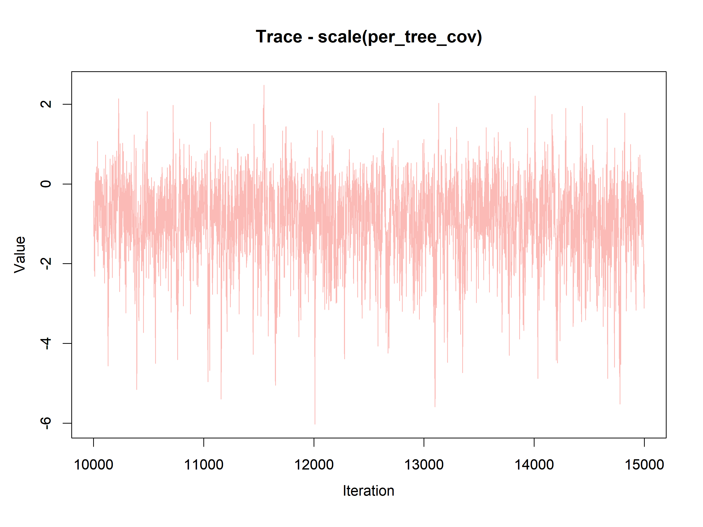](index_files/figure-html/unnamed-chunk-13-1.png)

Code

``` downlit

MCMCtrace(out.sp$beta.samples, type = 'both', pdf = F, Rhat = FALSE, n.eff = TRUE)
```

[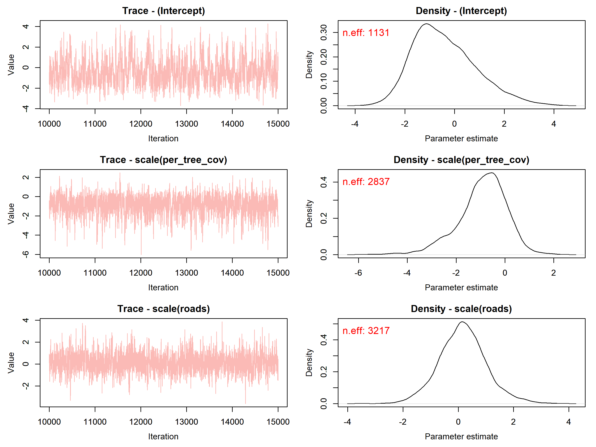](index_files/figure-html/unnamed-chunk-13-2.png)

[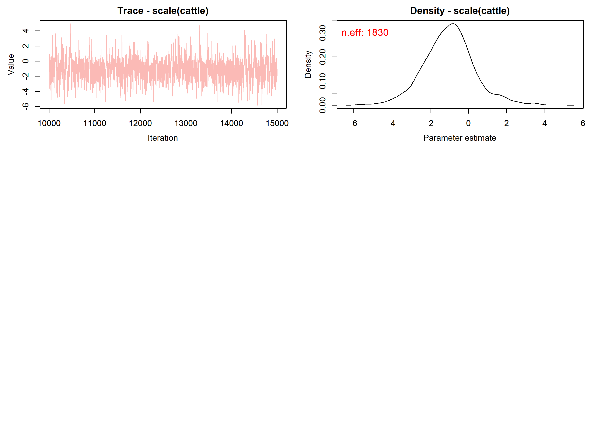](index_files/figure-html/unnamed-chunk-13-3.png)

Code

``` downlit

### density for per_tree_cov
MCMCtrace(out.sp$beta.samples, params = c("scale(per_tree_cov)"), ISB = FALSE, pdf = F, exact = TRUE, post_zm = TRUE, type = 'density', Rhat = TRUE, n.eff = TRUE, ind = TRUE)
```

[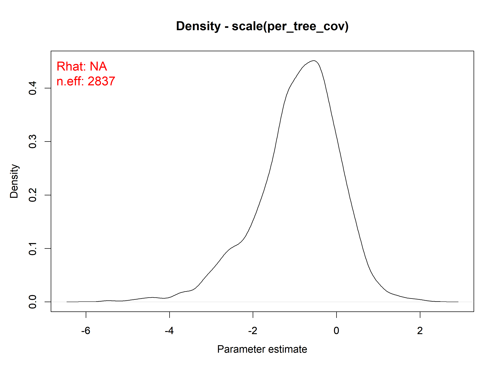](index_files/figure-html/unnamed-chunk-13-4.png)

Using bayesplot

Code

``` downlit
color_scheme_set("mix-blue-red")
mcmc_trace(out.sp$beta.samples,  
           facet_args = list(ncol = 1, strip.position = "left"))
```

[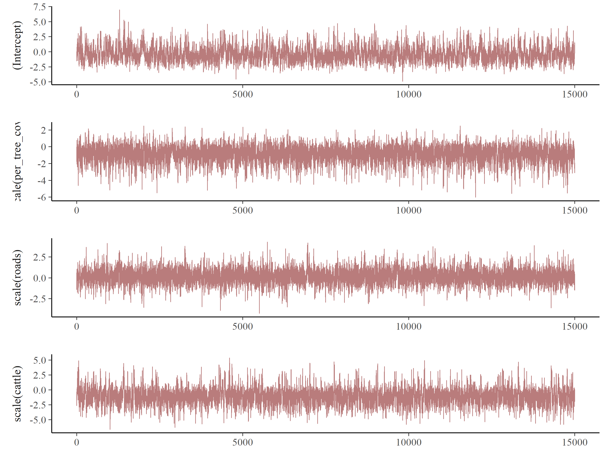](index_files/figure-html/unnamed-chunk-14-1.png)

### Posterior summaries

Code

``` downlit
# 5. Posterior summaries --------------------------------------------------
# Concise summary of main parameter estimates
summary(out.sp)
#> 
#> Call:
#> spPGOcc(occ.formula = ~scale(per_tree_cov) + scale(roads) + scale(cattle), 
#>     det.formula = ~scale(effort), data = jaguar.data, n.neighbors = 8, 
#>     n.batch = 1000, batch.length = 15, n.report = 500, n.burn = 5000, 
#>     n.thin = 2, n.chains = 3)
#> 
#> Samples per Chain: 15000
#> Burn-in: 5000
#> Thinning Rate: 2
#> Number of Chains: 3
#> Total Posterior Samples: 15000
#> Run Time (min): 0.2235
#> 
#> Occurrence (logit scale): 
#>                        Mean     SD    2.5%     50%  97.5%   Rhat  ESS
#> (Intercept)         -0.3605 1.2701 -2.4078 -0.5275 2.4851 1.0094 1131
#> scale(per_tree_cov) -0.8977 0.9859 -3.1104 -0.7991 0.8275 1.0016 2837
#> scale(roads)         0.1647 0.8868 -1.5775  0.1603 1.9906 1.0004 3217
#> scale(cattle)       -0.9911 1.3518 -3.6884 -1.0000 1.9542 1.0021 1830
#> 
#> Detection (logit scale): 
#>                  Mean     SD    2.5%     50%   97.5%   Rhat  ESS
#> (Intercept)   -2.2030 0.6129 -3.3827 -2.2092 -1.0092 1.0033 1781
#> scale(effort)  0.9646 0.7190 -0.1318  0.8564  2.6572 1.0029 3351
#> 
#> Spatial Covariance: 
#>            Mean     SD   2.5%    50%  97.5%   Rhat  ESS
#> sigma.sq 1.2365 2.8843 0.1851 0.6466 5.8579 1.1593  684
#> phi      0.0203 0.0114 0.0015 0.0206 0.0388 1.0017 2640
# Take a look at objects in resulting object
names(out.sp)
#>  [1] "rhat"           "beta.samples"   "alpha.samples"  "theta.samples" 
#>  [5] "coords"         "z.samples"      "X"              "X.re"          
#>  [9] "w.samples"      "psi.samples"    "like.samples"   "X.p"           
#> [13] "X.p.re"         "y"              "ESS"            "call"          
#> [17] "n.samples"      "n.neighbors"    "cov.model.indx" "type"          
#> [21] "n.post"         "n.thin"         "n.burn"         "n.chains"      
#> [25] "pRE"            "psiRE"          "run.time"
str(out.sp$beta.samples)
#>  'mcmc' num [1:15000, 1:4] -1.5625 -0.866 -0.226 -0.6433 0.0488 ...
#>  - attr(*, "mcpar")= num [1:3] 1 15000 1
#>  - attr(*, "dimnames")=List of 2
#>   ..$ : NULL
#>   ..$ : chr [1:4] "(Intercept)" "scale(per_tree_cov)" "scale(roads)" "scale(cattle)"
# Probability the effect of tree cover on occupancy is positive
mean(out.sp$beta.samples[, 1] > 0)
#> [1] 0.3496

# Create simple plot summaries using MCMCvis package.
# Detection covariate effects --------- 
MCMCplot(out.sp$alpha.samples, ref_ovl = TRUE, ci = c(50, 95))
```

[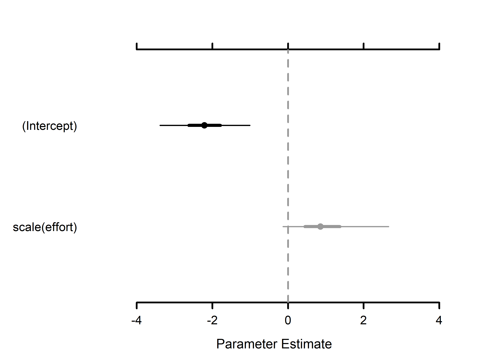](index_files/figure-html/unnamed-chunk-15-1.png)

Code

``` downlit

# Occupancy covariate effects ---------
MCMCplot(out.sp$beta.samples, ref_ovl = TRUE, ci = c(50, 95))
```

[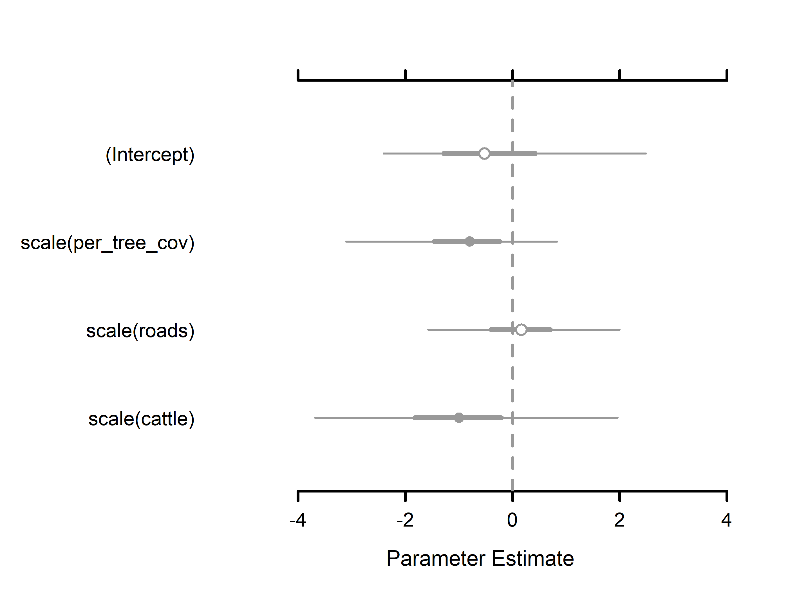](index_files/figure-html/unnamed-chunk-15-2.png)

Another way using bayesplot

Code

``` downlit
out.sp$beta.samples |>  
  mcmc_intervals()
```

[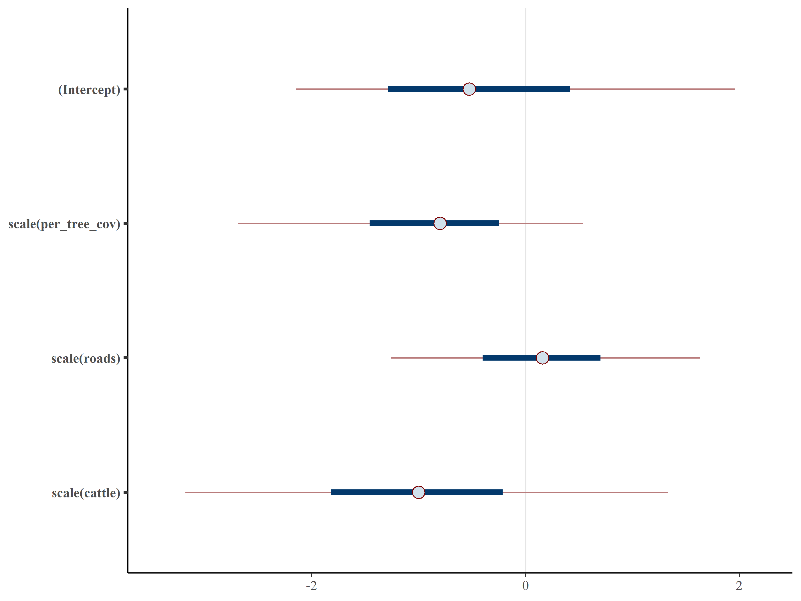](index_files/figure-html/unnamed-chunk-16-1.png)

Code

``` downlit
  yaxis_text() 
#> List of 1
#>  $ axis.text.y:List of 11
#>   ..$ family       : NULL
#>   ..$ face         : NULL
#>   ..$ colour       : NULL
#>   ..$ size         : NULL
#>   ..$ hjust        : NULL
#>   ..$ vjust        : NULL
#>   ..$ angle        : NULL
#>   ..$ lineheight   : NULL
#>   ..$ margin       : NULL
#>   ..$ debug        : NULL
#>   ..$ inherit.blank: logi FALSE
#>   ..- attr(*, "class")= chr [1:2] "element_text" "element"
#>  - attr(*, "class")= chr [1:2] "theme" "gg"
#>  - attr(*, "complete")= logi FALSE
#>  - attr(*, "validate")= logi TRUE
```

### Look at rhat

Code

``` downlit
print(out.sp$rhat)
#> $beta
#> [1] 1.009441 1.001616 1.000449 1.002143
#> 
#> $alpha
#> [1] 1.003316 1.002885
#> 
#> $theta
#> [1] 1.159255 1.001743
```

All rhat values should, in theory, be less than 1.1, if the sampler has values of or greater than 1.1, it is likely that it was not particularly efficient or effective.

#### Another way is plotting the rhats for betas

Code

``` downlit

out.sp$rhat[[1]] |>  
  mcmc_rhat() +
  yaxis_text() 
```

[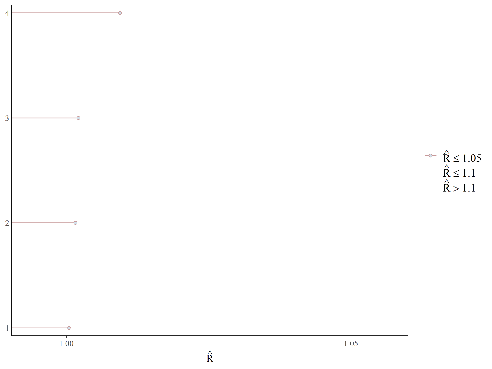](index_files/figure-html/unnamed-chunk-18-1.png)

## Prediction

Predict occupancy along a gradient of per_tree_cov. The prediction takes in to account the spatial autocorrelation.

Code

``` downlit
# 6. Prediction -----------------------------------------------------------
# Predict occupancy along a gradient of forest cover.
# Create a set of values across the range of observed forest values
forest.pred.vals <- seq(min(jaguar.data$occ.covs$per_tree_cov),
  max(jaguar.data$occ.covs$per_tree_cov),
  length.out = 100
)

# Scale predicted values by mean and standard deviation used to fit the model
forest.pred.vals.scale <- (forest.pred.vals - mean(jaguar.data$occ.covs$per_tree_cov)) / sd(jaguar.data$occ.covs$per_tree_cov)

# Predict occupancy across forest values at mean values of all other variables
pred.df <- as.matrix(data.frame(intercept = 1, forest = forest.pred.vals.scale, roads = 0, cattle = 0))

out.pred <- predict(out, pred.df)
str(out.pred)
#> List of 3
#>  $ psi.0.samples: 'mcmc' num [1:67500, 1:100] 0.195 0.951 0.997 0.996 1 ...
#>   ..- attr(*, "mcpar")= num [1:3] 1 67500 1
#>  $ z.0.samples  : 'mcmc' int [1:67500, 1:100] 0 1 1 1 1 1 1 1 1 1 ...
#>   ..- attr(*, "mcpar")= num [1:3] 1 67500 1
#>  $ call         : language predict.PGOcc(object = out, X.0 = pred.df)
#>  - attr(*, "class")= chr "predict.PGOcc"
psi.0.quants <- apply(out.pred$psi.0.samples, 2, quantile,
  prob = c(0.025, 0.5, 0.975)
)
psi.plot.dat <- data.frame(
  psi.med = psi.0.quants[2, ],
  psi.low = psi.0.quants[1, ],
  psi.high = psi.0.quants[3, ],
  forest = forest.pred.vals
)
ggplot(psi.plot.dat, aes(x = forest, y = psi.med)) +
  geom_ribbon(aes(ymin = psi.low, ymax = psi.high), fill = "grey70") +
  geom_line() +
  theme_bw() +
  scale_y_continuous(limits = c(0, 1)) +
  labs(x = "Forest (% tree cover)", y = "Occupancy Probability")
```

[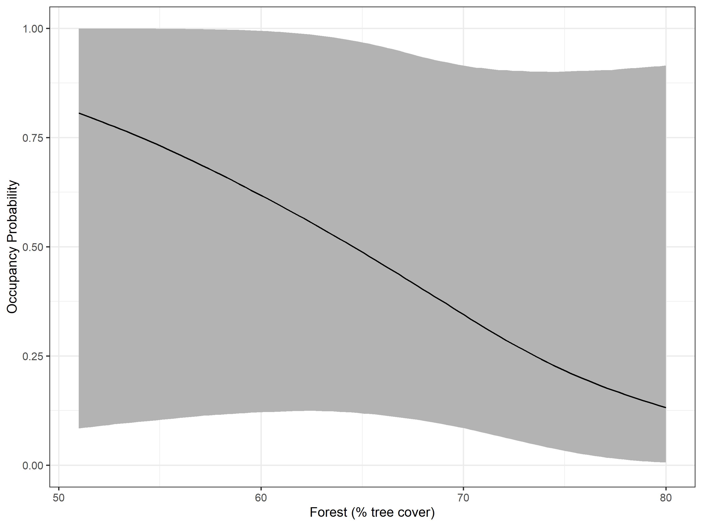](index_files/figure-html/unnamed-chunk-19-1.png)

See the huge errors…. well it is just for illustrative purposes…

[](https://media2.giphy.com/media/v1.Y2lkPTc5MGI3NjExeWxhYWNxNHdsM3J2dnJidHd4OWxsN3BmbmdkYzJocXZoc2gwM3dyNSZlcD12MV9pbnRlcm5hbF9naWZfYnlfaWQmY3Q9Zw/VreCAk831K4TeuuE3N/giphy.gif)

## Package Citation

Code

``` downlit
pkgs <- cite_packages(output = "paragraph", out.dir = ".") #knitr::kable(pkgs)
pkgs
```

We used R version 4.3.2 ([R Core Team 2023](#ref-base)) and the following R packages: bayesplot v. 1.11.1 ([Gabry et al. 2019](#ref-bayesplot2019); [Gabry and Mahr 2024](#ref-bayesplot2024)), camtrapR v. 2.3.0 ([Niedballa et al. 2016](#ref-camtrapR)), devtools v. 2.4.5 ([Wickham et al. 2022](#ref-devtools)), DT v. 0.33 ([Xie et al. 2024](#ref-DT)), elevatr v. 0.99.0 ([Hollister et al. 2023](#ref-elevatr)), kableExtra v. 1.4.0 ([Zhu 2024](#ref-kableExtra)), mapview v. 2.11.2 ([Appelhans et al. 2023](#ref-mapview)), MCMCvis v. 0.16.5 ([Youngflesh 2018](#ref-MCMCvis)), patchwork v. 1.3.0 ([Pedersen 2024](#ref-patchwork)), quarto v. 1.4.4 ([Allaire and Dervieux 2024](#ref-quarto)), rmarkdown v. 2.29 ([Xie et al. 2018](#ref-rmarkdown2018), [2020](#ref-rmarkdown2020); [Allaire et al. 2024](#ref-rmarkdown2024)), sf v. 1.0.21 ([Pebesma 2018](#ref-sf2018); [Pebesma and Bivand 2023](#ref-sf2023)), spOccupancy v. 0.8.0 ([Doser et al. 2022](#ref-spOccupancy2022), [2023](#ref-spOccupancy2023), [2024](#ref-spOccupancy2024)), styler v. 1.10.3 ([Müller and Walthert 2024](#ref-styler)), terra v. 1.8.60 ([Hijmans 2025](#ref-terra)), tidyverse v. 2.0.0 ([Wickham et al. 2019](#ref-tidyverse)).

## Session info

Session info

    #> ─ Session info ───────────────────────────────────────────────────────────────────────────────────────────────────────
    #>  setting  value
    #>  version  R version 4.3.2 (2023-10-31 ucrt)
    #>  os       Windows 10 x64 (build 19045)
    #>  system   x86_64, mingw32
    #>  ui       RTerm
    #>  language (EN)
    #>  collate  Spanish_Colombia.utf8
    #>  ctype    Spanish_Colombia.utf8
    #>  tz       America/Bogota
    #>  date     2026-04-21
    #>  pandoc   3.6.3 @ C:/Program Files/RStudio/resources/app/bin/quarto/bin/tools/ (via rmarkdown)
    #> 
    #> ─ Packages ───────────────────────────────────────────────────────────────────────────────────────────────────────────
    #>  ! package           * version  date (UTC) lib source
    #>    abind               1.4-8    2024-09-12 [1] CRAN (R 4.3.2)
    #>    archive             1.1.9    2024-09-12 [1] CRAN (R 4.3.2)
    #>    backports           1.5.0    2024-05-23 [1] CRAN (R 4.3.3)
    #>    base64enc           0.1-3    2015-07-28 [1] CRAN (R 4.3.1)
    #>    bayesplot         * 1.11.1   2024-02-15 [1] CRAN (R 4.3.3)
    #>    bit                 4.5.0    2024-09-20 [1] CRAN (R 4.3.3)
    #>    bit64               4.5.2    2024-09-22 [1] CRAN (R 4.3.3)
    #>    boot                1.3-31   2024-08-28 [2] CRAN (R 4.3.3)
    #>    brew                1.0-10   2023-12-16 [1] CRAN (R 4.3.2)
    #>    bslib               0.9.0    2025-01-30 [1] CRAN (R 4.3.3)
    #>    cachem              1.1.0    2024-05-16 [1] CRAN (R 4.3.3)
    #>    camtrapR          * 2.3.0    2024-02-26 [1] CRAN (R 4.3.3)
    #>    cellranger          1.1.0    2016-07-27 [1] CRAN (R 4.3.2)
    #>    checkmate           2.3.2    2024-07-29 [1] CRAN (R 4.3.3)
    #>    class               7.3-22   2023-05-03 [2] CRAN (R 4.3.2)
    #>    classInt            0.4-11   2025-01-08 [1] CRAN (R 4.3.3)
    #>    cli                 3.6.5    2025-04-23 [1] CRAN (R 4.3.2)
    #>    coda                0.19-4.1 2024-01-31 [1] CRAN (R 4.3.2)
    #>    codetools           0.2-20   2024-03-31 [2] CRAN (R 4.3.3)
    #>    colorspace          2.1-1    2024-07-26 [1] CRAN (R 4.3.3)
    #>    crayon              1.5.3    2024-06-20 [1] CRAN (R 4.3.3)
    #>    crosstalk           1.2.1    2023-11-23 [1] CRAN (R 4.3.2)
    #>    data.table          1.17.8   2025-07-10 [1] CRAN (R 4.3.2)
    #>    DBI                 1.2.3    2024-06-02 [1] CRAN (R 4.3.3)
    #>    devtools            2.4.5    2022-10-11 [1] CRAN (R 4.3.2)
    #>    dichromat           2.0-0.1  2022-05-02 [1] CRAN (R 4.3.1)
    #>    digest              0.6.37   2024-08-19 [1] CRAN (R 4.3.3)
    #>    distributional      0.4.0    2024-02-07 [1] CRAN (R 4.3.2)
    #>    doParallel          1.0.17   2022-02-07 [1] CRAN (R 4.3.3)
    #>    dplyr             * 1.1.4    2023-11-17 [1] CRAN (R 4.3.2)
    #>    DT                * 0.33     2024-04-04 [1] CRAN (R 4.3.3)
    #>    e1071               1.7-16   2024-09-16 [1] CRAN (R 4.3.3)
    #>    elevatr           * 0.99.0   2023-09-12 [1] CRAN (R 4.3.2)
    #>    ellipsis            0.3.2    2021-04-29 [1] CRAN (R 4.3.2)
    #>    evaluate            1.0.4    2025-06-18 [1] CRAN (R 4.3.2)
    #>    fansi               1.0.6    2023-12-08 [1] CRAN (R 4.3.2)
    #>    farver              2.1.2    2024-05-13 [1] CRAN (R 4.3.3)
    #>    fastmap             1.2.0    2024-05-15 [1] CRAN (R 4.3.3)
    #>    forcats           * 1.0.0    2023-01-29 [1] CRAN (R 4.3.2)
    #>    foreach             1.5.2    2022-02-02 [1] CRAN (R 4.3.2)
    #>    fs                  1.6.6    2025-04-12 [1] CRAN (R 4.3.2)
    #>    generics            0.1.4    2025-05-09 [1] CRAN (R 4.3.2)
    #>    ggplot2           * 3.5.1    2024-04-23 [1] CRAN (R 4.3.3)
    #>    glue                1.8.0    2024-09-30 [1] CRAN (R 4.3.3)
    #>    grateful          * 0.2.10   2024-09-04 [1] CRAN (R 4.3.3)
    #>    gtable              0.3.6    2024-10-25 [1] CRAN (R 4.3.3)
    #>    hms                 1.1.3    2023-03-21 [1] CRAN (R 4.3.2)
    #>    htmltools           0.5.8.1  2024-04-04 [1] CRAN (R 4.3.3)
    #>    htmlwidgets         1.6.4    2023-12-06 [1] CRAN (R 4.3.2)
    #>    httpuv              1.6.16   2025-04-16 [1] CRAN (R 4.3.2)
    #>    iterators           1.0.14   2022-02-05 [1] CRAN (R 4.3.2)
    #>    jquerylib           0.1.4    2021-04-26 [1] CRAN (R 4.3.2)
    #>    jsonlite            2.0.0    2025-03-27 [1] CRAN (R 4.3.3)
    #>    kableExtra        * 1.4.0    2024-01-24 [1] CRAN (R 4.3.3)
    #>    KernSmooth          2.23-24  2024-05-17 [2] CRAN (R 4.3.3)
    #>    knitr               1.50     2025-03-16 [1] CRAN (R 4.3.3)
    #>    labeling            0.4.3    2023-08-29 [1] CRAN (R 4.3.1)
    #>    later               1.4.2    2025-04-08 [1] CRAN (R 4.3.2)
    #>    lattice             0.22-6   2024-03-20 [1] CRAN (R 4.3.3)
    #>    leafem              0.2.4    2025-05-01 [1] CRAN (R 4.3.2)
    #>    leaflet             2.2.2    2024-03-26 [1] CRAN (R 4.3.3)
    #>    leaflet.providers   2.0.0    2023-10-17 [1] CRAN (R 4.3.2)
    #>    leafpop             0.1.0    2021-05-22 [1] CRAN (R 4.3.2)
    #>    lifecycle           1.0.4    2023-11-07 [1] CRAN (R 4.3.2)
    #>    lme4                1.1-35.5 2024-07-03 [1] CRAN (R 4.3.2)
    #>    lubridate         * 1.9.3    2023-09-27 [1] CRAN (R 4.3.2)
    #>    magrittr            2.0.3    2022-03-30 [1] CRAN (R 4.3.2)
    #>    mapview           * 2.11.2   2023-10-13 [1] CRAN (R 4.3.2)
    #>    MASS                7.3-60   2023-05-04 [2] CRAN (R 4.3.2)
    #>    Matrix              1.6-1.1  2023-09-18 [2] CRAN (R 4.3.2)
    #>    MCMCvis           * 0.16.5   2025-11-26 [1] CRAN (R 4.3.2)
    #>    memoise             2.0.1    2021-11-26 [1] CRAN (R 4.3.2)
    #>    mgcv                1.9-1    2023-12-21 [1] CRAN (R 4.3.3)
    #>    mime                0.13     2025-03-17 [1] CRAN (R 4.3.3)
    #>    miniUI              0.1.1.1  2018-05-18 [1] CRAN (R 4.3.2)
    #>    minqa               1.2.8    2024-08-17 [1] CRAN (R 4.3.3)
    #>    mvtnorm             1.3-1    2024-09-03 [1] CRAN (R 4.3.3)
    #>    nlme                3.1-166  2024-08-14 [2] CRAN (R 4.3.3)
    #>    nloptr              2.1.1    2024-06-25 [1] CRAN (R 4.3.3)
    #>    patchwork         * 1.3.0    2024-09-16 [1] CRAN (R 4.3.3)
    #>    pillar              1.9.0    2023-03-22 [1] CRAN (R 4.3.2)
    #>    pkgbuild            1.4.5    2024-10-28 [1] CRAN (R 4.3.3)
    #>    pkgconfig           2.0.3    2019-09-22 [1] CRAN (R 4.3.2)
    #>    pkgload             1.4.0    2024-06-28 [1] CRAN (R 4.3.3)
    #>    plyr                1.8.9    2023-10-02 [1] CRAN (R 4.3.2)
    #>    png                 0.1-8    2022-11-29 [1] CRAN (R 4.3.1)
    #>    posterior           1.6.0    2024-07-03 [1] CRAN (R 4.3.3)
    #>    processx            3.8.4    2024-03-16 [1] CRAN (R 4.3.3)
    #>    profvis             0.3.8    2023-05-02 [1] CRAN (R 4.3.2)
    #>    progressr           0.14.0   2023-08-10 [1] CRAN (R 4.3.2)
    #>    promises            1.3.3    2025-05-29 [1] CRAN (R 4.3.2)
    #>    proxy               0.4-27   2022-06-09 [1] CRAN (R 4.3.2)
    #>    ps                  1.8.0    2024-09-12 [1] CRAN (R 4.3.2)
    #>    purrr             * 1.1.0    2025-07-10 [1] CRAN (R 4.3.2)
    #>    quarto            * 1.4.4    2024-07-20 [1] CRAN (R 4.3.3)
    #>    R.cache             0.16.0   2022-07-21 [1] CRAN (R 4.3.3)
    #>    R.methodsS3         1.8.2    2022-06-13 [1] CRAN (R 4.3.3)
    #>    R.oo                1.26.0   2024-01-24 [1] CRAN (R 4.3.3)
    #>    R.utils             2.12.3   2023-11-18 [1] CRAN (R 4.3.3)
    #>    R6                  2.6.1    2025-02-15 [1] CRAN (R 4.3.3)
    #>    RANN                2.6.2    2024-08-25 [1] CRAN (R 4.3.3)
    #>    raster              3.6-32   2025-03-28 [1] CRAN (R 4.3.3)
    #>    RColorBrewer        1.1-3    2022-04-03 [1] CRAN (R 4.3.1)
    #>    Rcpp                1.1.0    2025-07-02 [1] CRAN (R 4.3.2)
    #>    RcppNumerical       0.6-0    2023-09-06 [1] CRAN (R 4.3.3)
    #>  D RcppParallel        5.1.9    2024-08-19 [1] CRAN (R 4.3.3)
    #>    readr             * 2.1.5    2024-01-10 [1] CRAN (R 4.3.2)
    #>    readxl            * 1.4.3    2023-07-06 [1] CRAN (R 4.3.2)
    #>    remotes             2.5.0    2024-03-17 [1] CRAN (R 4.3.3)
    #>    renv                1.0.7    2024-04-11 [1] CRAN (R 4.3.3)
    #>    reshape2            1.4.4    2020-04-09 [1] CRAN (R 4.3.3)
    #>    rlang               1.1.6    2025-04-11 [1] CRAN (R 4.3.2)
    #>    rmarkdown           2.29     2024-11-04 [1] CRAN (R 4.3.3)
    #>    rstudioapi          0.16.0   2024-03-24 [1] CRAN (R 4.3.3)
    #>    sass                0.4.10   2025-04-11 [1] CRAN (R 4.3.2)
    #>    satellite           1.0.5    2024-02-10 [1] CRAN (R 4.3.2)
    #>    scales              1.4.0    2025-04-24 [1] CRAN (R 4.3.2)
    #>    secr                5.0.0    2024-10-02 [1] CRAN (R 4.3.3)
    #>    sessioninfo         1.2.2    2021-12-06 [1] CRAN (R 4.3.2)
    #>    sf                * 1.0-21   2025-05-15 [1] CRAN (R 4.3.2)
    #>    shiny               1.9.1    2024-08-01 [1] CRAN (R 4.3.3)
    #>    sp                  2.2-0    2025-02-01 [1] CRAN (R 4.3.3)
    #>    spAbundance         0.2.1    2024-10-05 [1] CRAN (R 4.3.3)
    #>    spOccupancy       * 0.8.0    2024-12-14 [1] CRAN (R 4.3.3)
    #>    stringi             1.8.4    2024-05-06 [1] CRAN (R 4.3.3)
    #>    stringr           * 1.5.1    2023-11-14 [1] CRAN (R 4.3.2)
    #>    styler            * 1.10.3   2024-04-07 [1] CRAN (R 4.3.3)
    #>    svglite             2.1.3    2023-12-08 [1] CRAN (R 4.3.2)
    #>    systemfonts         1.1.0    2024-05-15 [1] CRAN (R 4.3.3)
    #>    tensorA             0.36.2.1 2023-12-13 [1] CRAN (R 4.3.2)
    #>    terra             * 1.8-60   2025-07-21 [1] CRAN (R 4.3.2)
    #>    tibble            * 3.3.0    2025-06-08 [1] CRAN (R 4.3.2)
    #>    tidyr             * 1.3.1    2024-01-24 [1] CRAN (R 4.3.2)
    #>    tidyselect          1.2.1    2024-03-11 [1] CRAN (R 4.3.3)
    #>    tidyverse         * 2.0.0    2023-02-22 [1] CRAN (R 4.3.2)
    #>    timechange          0.3.0    2024-01-18 [1] CRAN (R 4.3.2)
    #>    tzdb                0.4.0    2023-05-12 [1] CRAN (R 4.3.2)
    #>    units               0.8-7    2025-03-11 [1] CRAN (R 4.3.3)
    #>    urlchecker          1.0.1    2021-11-30 [1] CRAN (R 4.3.2)
    #>    usethis             3.0.0    2024-07-29 [1] CRAN (R 4.3.3)
    #>    utf8                1.2.4    2023-10-22 [1] CRAN (R 4.3.2)
    #>    uuid                1.2-1    2024-07-29 [1] CRAN (R 4.3.3)
    #>    vctrs               0.6.5    2023-12-01 [1] CRAN (R 4.3.2)
    #>    viridisLite         0.4.2    2023-05-02 [1] CRAN (R 4.3.2)
    #>    vroom               1.6.5    2023-12-05 [1] CRAN (R 4.3.2)
    #>    withr               3.0.2    2024-10-28 [1] CRAN (R 4.3.3)
    #>    xfun                0.52     2025-04-02 [1] CRAN (R 4.3.3)
    #>    xml2                1.3.6    2023-12-04 [1] CRAN (R 4.3.2)
    #>    xtable              1.8-4    2019-04-21 [1] CRAN (R 4.3.2)
    #>    yaml                2.3.10   2024-07-26 [1] CRAN (R 4.3.3)
    #> 
    #>  [1] C:/Users/usuario/AppData/Local/R/win-library/4.3
    #>  [2] C:/Program Files/R/R-4.3.2/library
    #> 
    #>  D ── DLL MD5 mismatch, broken installation.
    #> 
    #> ──────────────────────────────────────────────────────────────────────────────────────────────────────────────────────

Back to top

## References

Allaire, JJ, and Christophe Dervieux. 2024. *quarto: R Interface to “Quarto” Markdown Publishing System*. <https://CRAN.R-project.org/package=quarto>.

Allaire, JJ, Yihui Xie, Christophe Dervieux, et al. 2024. *rmarkdown: Dynamic Documents for r*. <https://github.com/rstudio/rmarkdown>.

Appelhans, Tim, Florian Detsch, Christoph Reudenbach, and Stefan Woellauer. 2023. *mapview: Interactive Viewing of Spatial Data in r*. <https://CRAN.R-project.org/package=mapview>.

Doser, Jeffrey W., Andrew O. Finley, and Sudipto Banerjee. 2023. “Joint Species Distribution Models with Imperfect Detection for High-Dimensional Spatial Data.” *Ecology*, e4137. <https://doi.org/10.1002/ecy.4137>.

Doser, Jeffrey W., Andrew O. Finley, Marc Kéry, and Elise F. Zipkin. 2022. “spOccupancy: An r Package for Single-Species, Multi-Species, and Integrated Spatial Occupancy Models.” *Methods in Ecology and Evolution* 13: 1670–78. <https://doi.org/10.1111/2041-210X.13897>.

Doser, Jeffrey W., Andrew O. Finley, Sarah P. Saunders, Marc Kéry, Aaron S. Weed, and Elise F. Zipkin. 2024. “Modeling Complex Species-Environment Relationships Through Spatially-Varying Coefficient Occupancy Models.” *Journal of Agricultural, Biological, and Environmental Statistics*. <https://doi.org/10.1007/s13253-023-00595-6>.

Gabry, Jonah, and Tristan Mahr. 2024. *bayesplot: Plotting for Bayesian Models*. <https://mc-stan.org/bayesplot/>.

Gabry, Jonah, Daniel Simpson, Aki Vehtari, Michael Betancourt, and Andrew Gelman. 2019. “Visualization in Bayesian Workflow.” *J. R. Stat. Soc. A* 182: 389–402. <https://doi.org/10.1111/rssa.12378>.

Gilbert, Marius, Gaëlle Nicolas, Giusepina Cinardi, et al. 2018. “Global distribution data for cattle, buffaloes, horses, sheep, goats, pigs, chickens and ducks in 2010.” *Scientific Data* 5 (1): 180227. <https://doi.org/10.1038/sdata.2018.227>.

Hijmans, Robert J. 2025. *terra: Spatial Data Analysis*. <https://CRAN.R-project.org/package=terra>.

Hollister, Jeffrey, Tarak Shah, Jakub Nowosad, Alec L. Robitaille, Marcus W. Beck, and Mike Johnson. 2023. *elevatr: Access Elevation Data from Various APIs*. <https://doi.org/10.5281/zenodo.8335450>.

Meijer, Johan R, Mark A J Huijbregts, Kees C G J Schotten, and Aafke M Schipper. 2018. “Global patterns of current and future road infrastructure.” *Environmental Research Letters* 13 (6): 64006. <https://doi.org/10.1088/1748-9326/aabd42>.

Müller, Kirill, and Lorenz Walthert. 2024. *styler: Non-Invasive Pretty Printing of r Code*. <https://CRAN.R-project.org/package=styler>.

Niedballa, Jürgen, Rahel Sollmann, Alexandre Courtiol, and Andreas Wilting. 2016. “camtrapR: An r Package for Efficient Camera Trap Data Management.” *Methods in Ecology and Evolution* 7 (12): 1457–62. <https://doi.org/10.1111/2041-210X.12600>.

Pebesma, Edzer. 2018. “Simple Features for R: Standardized Support for Spatial Vector Data.” *The R Journal* 10 (1): 439–46. <https://doi.org/10.32614/RJ-2018-009>.

Pebesma, Edzer, and Roger Bivand. 2023. *Spatial Data Science: With applications in R*. Chapman and Hall/CRC. <https://doi.org/10.1201/9780429459016>.

Pedersen, Thomas Lin. 2024. *patchwork: The Composer of Plots*. <https://CRAN.R-project.org/package=patchwork>.

R Core Team. 2023. *R: A Language and Environment for Statistical Computing*. R Foundation for Statistical Computing. <https://www.R-project.org/>.

Wickham, Hadley, Mara Averick, Jennifer Bryan, et al. 2019. “Welcome to the tidyverse.” *Journal of Open Source Software* 4 (43): 1686. <https://doi.org/10.21105/joss.01686>.

Wickham, Hadley, Jim Hester, Winston Chang, and Jennifer Bryan. 2022. *devtools: Tools to Make Developing r Packages Easier*. <https://CRAN.R-project.org/package=devtools>.

Xie, Yihui, J. J. Allaire, and Garrett Grolemund. 2018. *R Markdown: The Definitive Guide*. Chapman; Hall/CRC. <https://bookdown.org/yihui/rmarkdown>.

Xie, Yihui, Joe Cheng, and Xianying Tan. 2024. *DT: A Wrapper of the JavaScript Library “DataTables”*. <https://CRAN.R-project.org/package=DT>.

Xie, Yihui, Christophe Dervieux, and Emily Riederer. 2020. *R Markdown Cookbook*. Chapman; Hall/CRC. <https://bookdown.org/yihui/rmarkdown-cookbook>.

Youngflesh, Casey. 2018. “MCMCvis: Tools to Visualize, Manipulate, and Summarize MCMC Output.” *Journal of Open Source Software* 3 (24): 640. <https://doi.org/10.21105/joss.00640>.

Zhu, Hao. 2024. *kableExtra: Construct Complex Table with “kable” and Pipe Syntax*. <https://CRAN.R-project.org/package=kableExtra>.

## Citation

BibTeX citation:

``` quarto-appendix-bibtex
@online{j._lizcano2025,
  author = {J. Lizcano, Diego and F. González-Maya, José},
  title = {Spatial, Single-Species Occupancy Model},
  date = {2025-06-01},
  url = {https://dlizcano.github.io/cameratrap/posts/2025-06-01-spatial-single-species-occupancy/},
  langid = {en}
}
```

For attribution, please cite this work as:

J. Lizcano, Diego, and José F. González-Maya. 2025. “Spatial, Single-Species Occupancy Model.” June 1. <https://dlizcano.github.io/cameratrap/posts/2025-06-01-spatial-single-species-occupancy/>.
