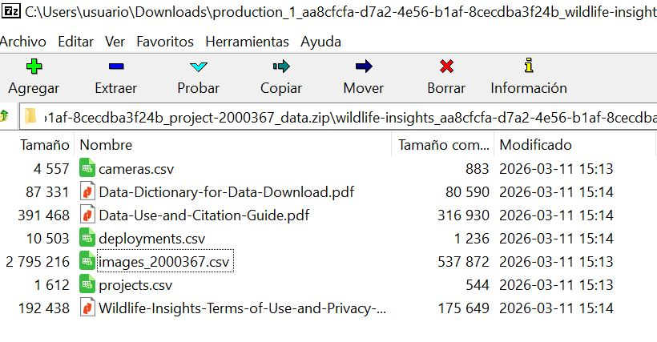
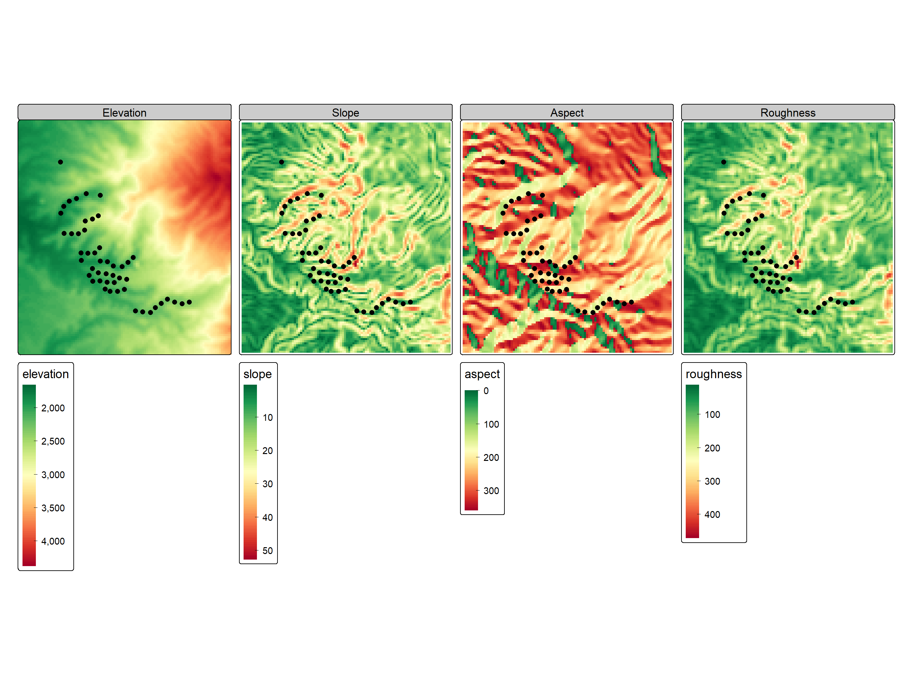
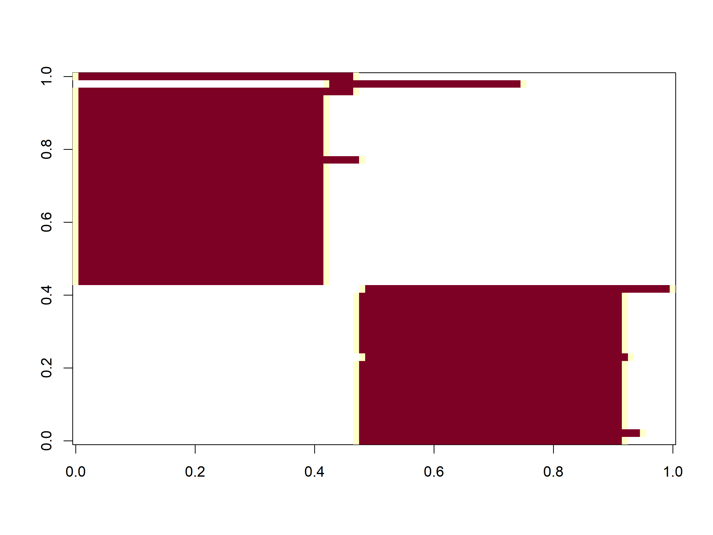
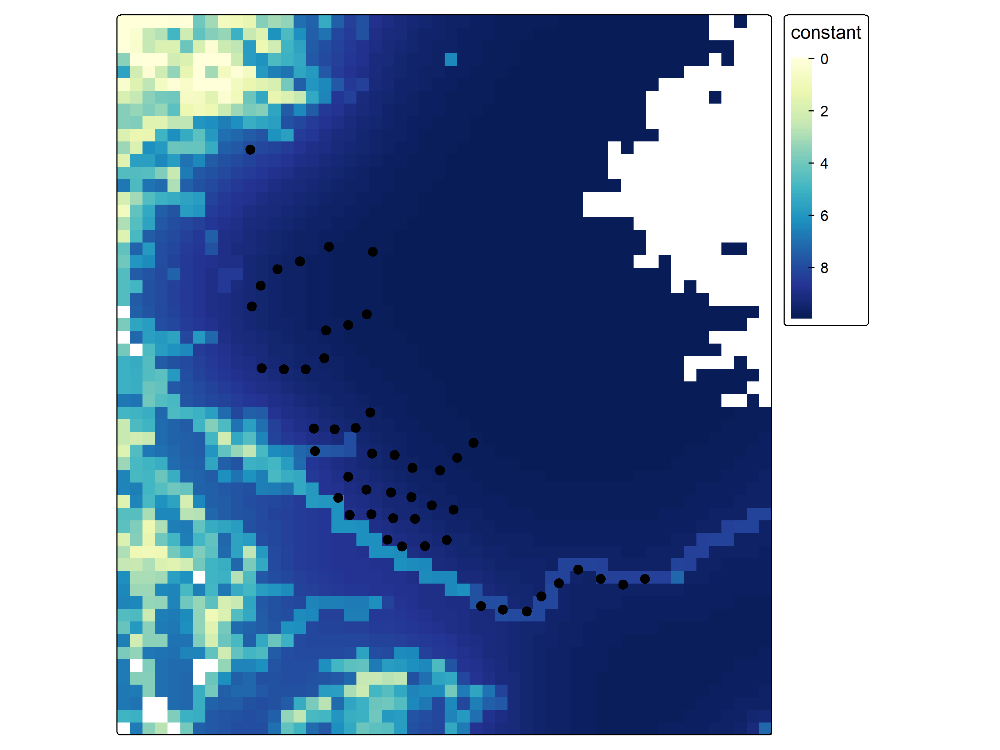
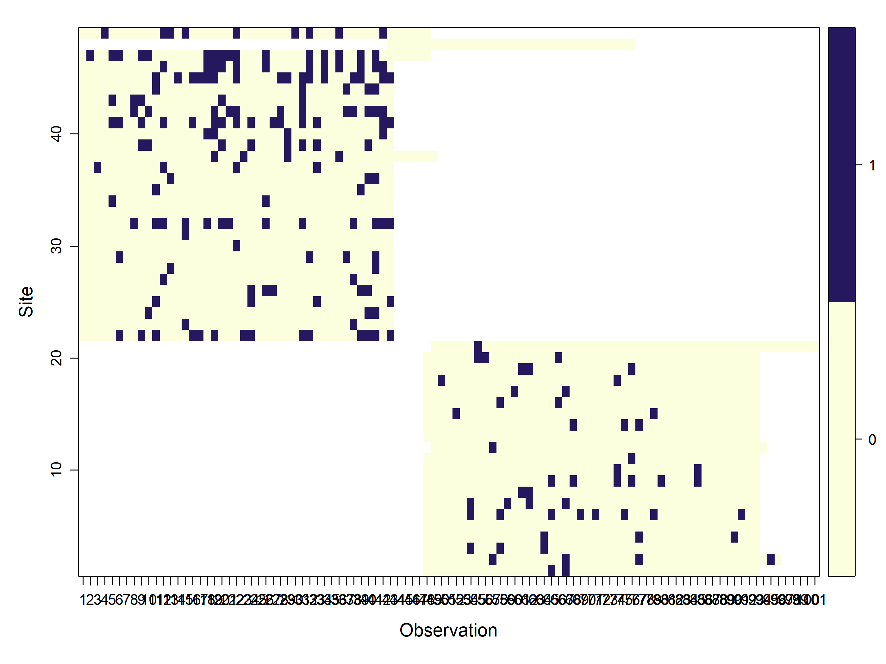
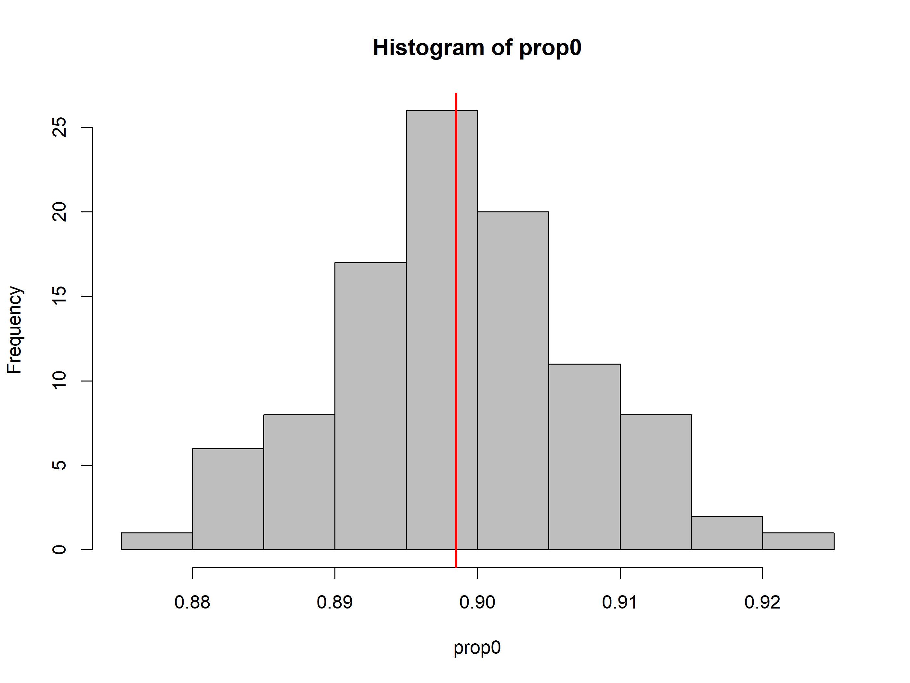
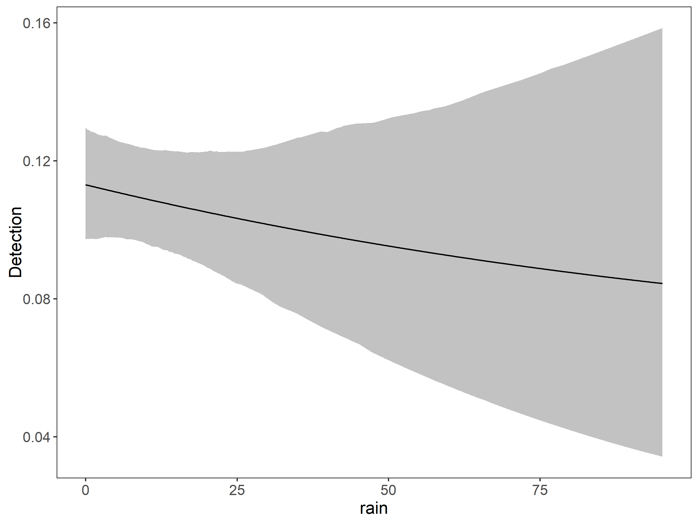
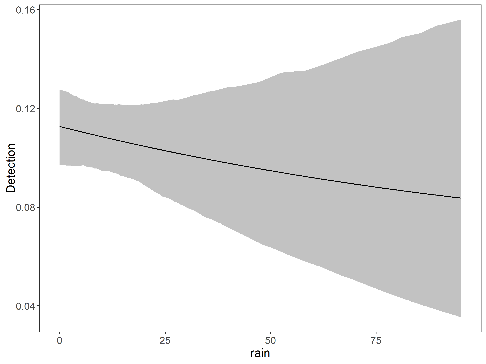
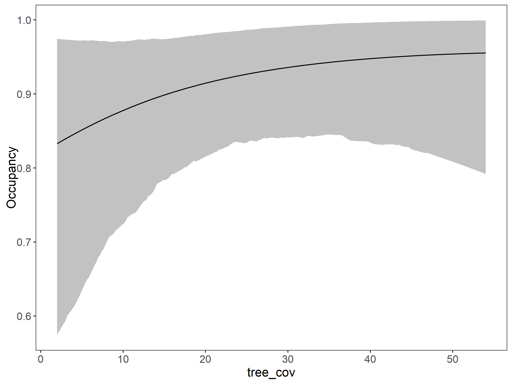

Camera trap projects often produce hundreds of thousands of images, which historically required manual classification. Reviewing picture by picture annotating metadata (location, time, hour, species etc.) in a Excel spreadsheet was the usual procedure. Thanks to [Wildlife Insights](https://www.wildlifeinsights.org/) we can reduce processing time from months to hours, enabling faster biodiversity assessments, management, and conservation decisions.

[](img/evolution_camera_trap_data.png "Image generated by AI")

Image generated by AI

Wildlife Insights is a global platform designed to help researchers manage, analyze, and share data from camera traps. It combines cloud storage, artificial intelligence, and analytics to process camera trap images efficiently.

- The platform improves traditional camera trap workflows by:

- Automatically classifies animals in images using artificial intelligence (AI), reducing manual work.

- Data management. Wildlife Insights organizes millions of images and metadata from multiple projects.

- Analytics tools: Allows users to estimate species richness, occupancy, relative abundance indices and activity patterns.

- Global collaboration. Researchers can share standardized data across projects and regions.

In this post I want to present my workflow With the hope it will be useful to somebody else.

## Load packages 📦

First we load some packages

Code

``` downlit

library(grateful) # Facilitate Citation of R Packages
library(readxl) # Read Excel Files
library(readr) 
library(sf) # Simple Features for R
library(mapview) # Interactive Viewing of Spatial Data in R
library(readr) # No used functions found
library(camtrapR) # Camera Trap Data Management and Preparation of Occupancy and Spatial Capture-Recapture Analyses 
library(unmarked) # hierarchical models of animal occurrence and abundance 
library(DT) # datatable
library(kableExtra) # Construct Complex Table with 'kable' and Pipe Syntax
library(tidyverse) # Easily Install and Load the 'Tidyverse'
library(glue)
library(terra)
library(elevatr)
library(tmap)
# source("C:/CodigoR/CameraTrapCesar/R/organiza_datos.R")
```

## Downloading the data 📡

Once you have pressed the download button in a project from wildlifeinsights, you will receive an email to get the data. Notice the link is temporary.

[](img/email.jpg "Downloading link email")

Downloading link email

The link give you a zip file with at least 7 files. Please take your time to read the PDFs.

The zip will include four key files:

● Projects.csv: metadata about project methodology and objectives, including the type of project (sequence or image) and whether count was recorded in the project.

● Cameras.csv: metadata about the devices (cameras) used in the project.

● Deployments.csv: metadata about the placement of a camera, including start date, end date, coordinates and other camera settings.

● Images.csv and (if applicable) Sequences.csv: Data about the animals detected by the camera traps are reported in one of two ways depending on how the data was recorded (denoted by project_type in the projects.csv). The download package will include both the images.csv and sequences.csv if the request includes sequence projects: The images.csv contains data about each individual image, including species identifications and timestamp.

 Unzip the files to your local data directory.

## Organize the data 🗃️

We need to link those tables and do some processing to get the detection history of our species of interest, or the detection fo all species if we are making a multispecies model. Typically, this involves using R to:

- Pivot the Wildlife Insights “images” data from long format to a wide RxJ matrix (y).

- Aggregate unique site-level information into the [`unmarked::siteCovs`](https://rdrr.io/pkg/unmarked/man/unmarkedFrame-class.html) data frame.

- Match and format observational covariates (like date/time of each image or weather) into the [`unmarked::obsCovs`](https://rdrr.io/pkg/unmarked/man/unmarkedFrame-class.html) structure.

[](img/unmarked_dataframe.png "unmarked::unmarkedFrameOccu. Image generated by AI")

[`unmarked::unmarkedFrameOccu`](https://rdrr.io/pkg/unmarked/man/unmarkedFrameOccu.html). Image generated by AI

My workflow starts with a series of custom functions and the package [`camtrapR`](https://jniedballa.github.io/camtrapR/) to format the data according to the requirement of the [`unmarked`](https://biodiverse.github.io/unmarked/) package, which have become the standard for data collected on species that may be detected imperfectly. The data should have detection, non-detection records along with the covariates on detection (ObsCovs) and occupancy (SiteCovs).

See the [`unmarked::unmarkedFrameOccu`](https://rdrr.io/pkg/unmarked/man/unmarkedFrameOccu.html) function for details typing: ?unmarkedFrameOccu in your R console after loading the `unmarked` package.

### First: Load the data 🛢️

> The data set was collected in 2016-2017 by Lizcano, D. J., Alvarez S. J., Gutierrez, D. R. , Sandoval, S., Jaimes, L., Sanchez J. P., And Gómez-Valencia B. As part of the Mountain Tapir Project - Colombia, of the IUCN/SSC Tapir Specialist Group (TSG).

Load the tables: cameras, images and deployments.

Code

``` downlit

cameras<- read_csv("C:/CodigoR/CameraTrapCesar/posts/2026-01-01-wildlifeinsights-to-detections/data/cameras.csv")

images <- read_csv("C:/CodigoR/CameraTrapCesar/posts/2026-01-01-wildlifeinsights-to-detections/data/images_2000367.csv")

deployments <- read_csv("C:/CodigoR/CameraTrapCesar/posts/2026-01-01-wildlifeinsights-to-detections/data/deployments.csv")
```

#### View the tables 📋

cameras:

Code

``` downlit
datatable(head(cameras))
```

images:

Code

``` downlit
datatable(head(images))
```

deployments:

Code

``` downlit
datatable(head(deployments))
```

### Second: Link the 3 tables 𝄜 and select the subproject Ucumari 🎯

This step is simple. Just use [`dplyr::left_join`](https://dplyr.tidyverse.org/reference/mutate-joins.html).

Code

``` downlit
data1 <-  cameras |> dplyr::left_join(deployments) # join first two tables
by <- dplyr::join_by("deployment_id") #  join by "Deployment ID"
# join by "Deployment ID" and # lets put together genus and species 
data <- dplyr::left_join(data1, images, by) |> 
  dplyr::filter(subproject_name=="Ucumari") |> 
  dplyr::mutate(binomial=paste(genus, species))
```

#### Lets make a simple map 🗺

Here we make a table with coordinates and convert it to an `sf` object.

Code

``` downlit
# make the table
datos_distinct <- data |> distinct(longitude, latitude, deployment_id, camera_name) |> as.data.frame()

# define projection
projlatlon <- "+proj=longlat +datum=WGS84 +no_defs +ellps=WGS84 +towgs84=0,0,0"

# make sf 
datos_sf <-  st_as_sf(x = datos_distinct,
                         coords = c("longitude", 
                                    "latitude"),
                         crs = projlatlon)

mapview(datos_sf)
```

Camera points

#### Lets extract some site covariates 📍🗺️

Using the coordinates of the sf object (datos_sf) we put the cameras on top of the covariates wich are raster maps, and using the function [`terra::extract()`](https://rspatial.github.io/terra/reference/extract.html) we get the covariates values and add those to a table.

In this case we use as covariates elevation, Forest integrity index and percentage of tree cover, all were cut to the area of interest. The elevation is obtained as a digital elevation model (DEM) by `get_elev_raster` and from this we calculated the derived maps slope, aspect, and roughness. Forest Integrity Index (FLII) was obtained from <https://www.forestlandscapeintegrity.com>. Percentage of tree cover was downloaded from [NASA-MODIS](https://modis.gsfc.nasa.gov/data/dataprod/mod44.php). Later we plot the maps using `tmap`.

Code

``` downlit


# let make a 3K buffer around the points
datos_sf_buff  <- st_buffer(datos_sf, 3000)
# get elevation raster from AWS using the 3K buffer
elevation_detailed <- rast(get_elev_raster(datos_sf_buff, z = 9, clip="bbox", neg_to_na=TRUE))
# fix name
names(elevation_detailed) <- "elevation"

slope_map<-terrain(elevation_detailed, v="slope", unit='degrees', neighbors=8)
aspect_map<-terrain(elevation_detailed, v="aspect", unit='degrees', neighbors=8)
roughness_map <- terrain(elevation_detailed, v = c("roughness"))


# Load forest map... it is huge!
# forest_type <- rast("C:/CodigoR/CameraTrapCesar/posts/2026-01-01-wildlifeinsights-to-detections/raster/2017_coverage_lclu.tif") 

# cut the huge forest map to 3K buffer
# forest_type_cropped <- crop(forest_type, elevation_detailed)

# lets remove the huge map from memory to save RAM
# rm(forest_type)


per_tree_cov <- rast("C:/CodigoR/WCS-CameraTrap/raster/latlon/Veg_Cont_Fields_Yearly_250m_v61/Perc_TreeCov/MOD44B_Perc_TreeCov_2017_065.tif")

# cut the huge tree cover map to 3K buffer
per_tree_cov_cropped <- crop(per_tree_cov, elevation_detailed)

# lets remove the huge map from memory to save RAM
rm(per_tree_cov)

# Forest Integrity Index
FLII2017 <- rast("C:/CodigoR/WCS_2024/FLI/raster/FLII_final/FLII_2017.tif")
# cut the huge FLII map to 3K buffer
FLII2017_cropped <- crop(FLII2017, elevation_detailed)

# lets remove the huge map from memory to save RAM
rm(FLII2017)


# extract covs using points (datos_sf) and add to sites
# covs <- cbind(sites, terra::extract(SiteCovsRast, sites))

elev <- terra::extract(elevation_detailed, datos_sf)
# forest_typ <- terra::extract(forest_type_cropped, datos_sf)
tree_cov <- terra::extract(per_tree_cov_cropped, datos_sf)
slope <- terra::extract(slope_map, datos_sf)
aspect <- terra::extract(aspect_map, datos_sf)
roughness <- terra::extract(roughness_map, datos_sf)
flii <- terra::extract(FLII2017_cropped, datos_sf)

# make a stack
terrain_covs <- c(elevation_detailed, slope_map, aspect_map, roughness_map)
# forest_covs <- c(per_tree_cov_cropped, FLII2017_cropped)

#### make a table of cameras dropping geometry
sites <- datos_sf %>%
  mutate(
    lat = st_coordinates(.)[, 1],
    lon = st_coordinates(.)[, 2]
  ) %>%
  st_drop_geometry() |>
  as.data.frame()

### Add the covariates to the table
# remove decimals convert to factor
# sites$forest_typ <- factor(forest_typ[,2])
sites$elev <-  elev[,2]
sites$tree_cov <-  tree_cov[,2]
sites$slope <-  slope[,2]
sites$aspect <-  aspect[,2]
sites$roughness <-  roughness[,2]
sites$flii <-  flii[,2]


# plot the map
tm_shape (terrain_covs) +
  tm_raster (palette = "-RdYlGn",
             style = "cont"
#             col.legend =tm_legend(
#                orientation = "landscape")
            ) + #

  tm_facets (ncol=4) + # ncol=2
  tm_layout (panel.labels = c("Elevation", 
                             "Slope",
                             "Aspect",
                             "Roughness"),
            scale = 0.7) +
 tm_shape(datos_sf) +
 tm_dots(size = 0.5)
```

[](index_files/figure-html/unnamed-chunk-7-1.png "Elevation, terrain covariates, and camera points")

Elevation, terrain covariates, and camera points

And the vegetation percent and FLII

Code

``` downlit
# plot the map
tm_shape (per_tree_cov_cropped) +
  tm_raster (palette = "YlGnBu",
             style = "cont"
#             col.legend =tm_legend(
#                orientation = "landscape")
            ) +
 tm_shape(datos_sf) +
 tm_dots(size = 0.5)


# plot the map
tm_shape (FLII2017_cropped) +
  tm_raster (palette = "YlGnBu",
             style = "cont"
#             col.legend =tm_legend(
#                orientation = "landscape")
            ) +
 tm_shape(datos_sf) +
 tm_dots(size = 0.5)
```

[](index_files/figure-html/unnamed-chunk-8-1.png "% tree cover, FLII, and camera points")

% tree cover, FLII, and camera points

[](index_files/figure-html/unnamed-chunk-8-2.png "% tree cover, FLII, and camera points")

% tree cover, FLII, and camera points

### Third: Build the detection histories 🛠️

This step involves two parts:

- A. We make a camera operation table (camop). For this step we are going to use the package `camtrapR`.

Code

``` downlit

# filter first year and make uniques to get a table of cameras and operation dates

CToperation <- data |> 
  # filter(samp_year == 2021) |> # multi-season data
  group_by(deployment_id) |>
  mutate(minStart = min(start_date), maxEnd = max(end_date)) |>
  distinct(longitude, latitude, minStart, maxEnd) |> #, samp_year) |>
  ungroup() |>
  as.data.frame()

# camera operation matrix for
# multi-season data. Season1
camop <- cameraOperation(
  CTtable = CToperation, # Tabla de operación
  stationCol = "deployment_id", # Columna que define la estación
  setupCol = "minStart", # Columna fecha de colocación
  retrievalCol = "maxEnd", # Columna fecha de retiro
  # sessionCol = "samp_year", # multi-season column
  # hasProblems= T, # Hubo fallos de cámaras
  dateFormat = "%Y-%m-%d"
 ) # , #, # Formato de las fechas
# cameraCol="CT")
# sessionCol= "samp_year")

# Plot camera operation as image
image(t(camop))
```

[](index_files/figure-html/unnamed-chunk-9-1.png "This image represents the x-axis sampling occasions (days) and the y-axis sampling stations (cameras).")

This image represents the x-axis sampling occasions (days) and the y-axis sampling stations (cameras).

camera operation can be ploted as an image depicting the sampling arrays.

- B. We build the detection history. Here we use the [`camtrapR::detectionHistory`](https://jniedballa.github.io/camtrapR/reference/detectionHistory.html) function to make a list of detection histories.

Code

``` downlit
# Generar las historias de detección ---------------------------------------
## remove plroblem species
# ind <- which(datos_PCF$Species=="Marmosa sp.")
# datos_PCF <- datos_PCF[-ind,]


DetHist_list_UCU <- lapply(unique(data$binomial), FUN = function(x) {
  detectionHistory(
    recordTable = data, # Tabla de registros
    camOp = camop, # Matriz de operación de cámaras
    stationCol = "deployment_id",
    speciesCol = "binomial",
    recordDateTimeCol = "timestamp",
    recordDateTimeFormat = "%Y-%m-%d %H:%M:%S",
    species = x, # la función reemplaza x por cada una de las especies
    occasionLength = 1, # Colapso de las historias a días
    day1 = "survey",#  "station", # inicie en la fecha de cada survey
    datesAsOccasionNames = FALSE, # pone fecha en columna
    includeEffort = TRUE,
    scaleEffort = FALSE,
    unmarkedMultFrameInput = TRUE,
    timeZone = "America/Bogota"
  )
})

# names
names(DetHist_list_UCU) <- unique(data$binomial)

# Finalmente creamos una lista nueva donde estén solo las historias de detección
ylist_UCU <- lapply(DetHist_list_UCU, FUN = function(x) x$detection_history)
# y el esfuerzo de muestreo
effortlist_UCU <- lapply(DetHist_list_UCU, FUN = function(x) x$effort)

### Danta, venado
# which(names(ylist_UCU) == "Tapirus pinchaque")
#> integer(0)
# which(names(ylist_UCU) == "Mazama rufina")
#> [1] 5
```

> **TIP:**
>
> Is a list containing the detection history for each species!

#### 📝 The list of species is:

Code

``` downlit
names(DetHist_list_UCU) # name of each list entry
#>  [1] "Bos taurus"               "NA NA"                   
#>  [3] "Aburria aburri"           "Didelphis marsupialis"   
#>  [5] "Tapirus pinchaque"        "Sciurus NA"              
#>  [7] "Grallaria NA"             "Eira barbara"            
#>  [9] "Mazama rufina"            "Puma concolor"           
#> [11] "Leopardus pardalis"       "Dasypus novemcinctus"    
#> [13] "Leopardus wiedii"         "Cuniculus taczanowskii"  
#> [15] "Nasuella olivacea"        "Penelope perspicax"      
#> [17] "Momotus aequatorialis"    "Mustela felipei"         
#> [19] "Dasyprocta leporina"      "Nothoprocta pentlandii"  
#> [21] "Herpailurus yagouaroundi" "Leptotila NA"            
#> [23] "Formicarius analis"       "Formicarius NA"          
#> [25] "Canis familiaris"         "Sciurus granatensis"     
#> [27] "Columba NA"               "Penelope montagnii"      
#> [29] "Nasua nasua"              "Odontophorus columbianus"
#> [31] "Turdus NA"                "Leptotila verreauxi"     
#> [33] "Odontophorus gujanensis"  "Aramides cajaneus"       
#> [35] "Tamandua mexicana"        "Neogale frenata"         
#> [37] "Dasyprocta fuliginosa"    "Odontophorus NA"         
#> [39] "Tinamus major"            "Bassaricyon neblina"     
#> [41] "Odontophorus hyperythrus" "Dasyprocta punctata"     
#> [43] "Tinamus NA"               "Momotus momota"          
#> [45] "Cyanocorax NA"            "Alouatta seniculus"      
#> [47] "Pyroderus scutatus"       "Didelphis virginiana"    
#> [49] "Leopardus NA"             "Tremarctos ornatus"      
#> [51] "Leopardus tigrinus"       "Didelphis albiventris"   
#> [53] "Didelphis NA"
```

#### Detection History for One Species 💥

To extract from the list one specie is very simple we just use the species name or the species number from the previous list. For this example of course we are going to use the Mountain Tapir (*Tapirus pinchaque*) as example, just because this is my favorite species!

[](img/Mountain_tapir.jpg "Mountain Tapir")

Mountain Tapir

Code

``` downlit
y_sp <- ylist_UCU$"Tapirus pinchaque"
head(y_sp)
#>             o1 o2 o3 o4 o5 o6 o7 o8 o9 o10 o11 o12 o13 o14 o15 o16 o17 o18 o19
#> CT-UC-02-24 NA NA NA NA NA NA NA NA NA  NA  NA  NA  NA  NA  NA  NA  NA  NA  NA
#> CT-UC-02-23 NA NA NA NA NA NA NA NA NA  NA  NA  NA  NA  NA  NA  NA  NA  NA  NA
#> CT-UC-02-22 NA NA NA NA NA NA NA NA NA  NA  NA  NA  NA  NA  NA  NA  NA  NA  NA
#> CT-UC-02-21 NA NA NA NA NA NA NA NA NA  NA  NA  NA  NA  NA  NA  NA  NA  NA  NA
#> CT-UC-02-18 NA NA NA NA NA NA NA NA NA  NA  NA  NA  NA  NA  NA  NA  NA  NA  NA
#> CT-UC-02-17 NA NA NA NA NA NA NA NA NA  NA  NA  NA  NA  NA  NA  NA  NA  NA  NA
#>             o20 o21 o22 o23 o24 o25 o26 o27 o28 o29 o30 o31 o32 o33 o34 o35 o36
#> CT-UC-02-24  NA  NA  NA  NA  NA  NA  NA  NA  NA  NA  NA  NA  NA  NA  NA  NA  NA
#> CT-UC-02-23  NA  NA  NA  NA  NA  NA  NA  NA  NA  NA  NA  NA  NA  NA  NA  NA  NA
#> CT-UC-02-22  NA  NA  NA  NA  NA  NA  NA  NA  NA  NA  NA  NA  NA  NA  NA  NA  NA
#> CT-UC-02-21  NA  NA  NA  NA  NA  NA  NA  NA  NA  NA  NA  NA  NA  NA  NA  NA  NA
#> CT-UC-02-18  NA  NA  NA  NA  NA  NA  NA  NA  NA  NA  NA  NA  NA  NA  NA  NA  NA
#> CT-UC-02-17  NA  NA  NA  NA  NA  NA  NA  NA  NA  NA  NA  NA  NA  NA  NA  NA  NA
#>             o37 o38 o39 o40 o41 o42 o43 o44 o45 o46 o47 o48 o49 o50 o51 o52 o53
#> CT-UC-02-24  NA  NA  NA  NA  NA  NA  NA  NA  NA  NA  NA   0   0   0   0   0   0
#> CT-UC-02-23  NA  NA  NA  NA  NA  NA  NA  NA  NA  NA  NA   0   0   0   0   0   0
#> CT-UC-02-22  NA  NA  NA  NA  NA  NA  NA  NA  NA  NA  NA   0   0   0   0   0   0
#> CT-UC-02-21  NA  NA  NA  NA  NA  NA  NA  NA  NA  NA  NA   0   0   0   0   0   0
#> CT-UC-02-18  NA  NA  NA  NA  NA  NA  NA  NA  NA  NA  NA   0   0   0   0   0   0
#> CT-UC-02-17  NA  NA  NA  NA  NA  NA  NA  NA  NA  NA  NA   0   0   0   0   0   0
#>             o54 o55 o56 o57 o58 o59 o60 o61 o62 o63 o64 o65 o66 o67 o68 o69 o70
#> CT-UC-02-24   0   0   0   0   0   0   0   0   0   0   0   1   0   1   0   0   0
#> CT-UC-02-23   0   0   0   1   0   0   0   0   0   0   0   0   0   1   0   0   0
#> CT-UC-02-22   1   0   0   0   1   0   0   0   0   0   1   0   0   0   0   0   0
#> CT-UC-02-21   0   0   0   0   0   0   0   0   0   0   1   0   0   0   0   0   0
#> CT-UC-02-18   0   0   0   0   0   0   0   0   0   0   0   0   0   0   0   0   0
#> CT-UC-02-17   1   0   0   0   1   0   0   0   0   0   0   1   0   0   0   1   0
#>             o71 o72 o73 o74 o75 o76 o77 o78 o79 o80 o81 o82 o83 o84 o85 o86 o87
#> CT-UC-02-24   0   0   0   0   0   0   0   0   0   0   0   0   0   0   0   0   0
#> CT-UC-02-23   0   0   0   0   0   0   1   0   0   0   0   0   0   0   0   0   0
#> CT-UC-02-22   0   0   0   0   0   0   0   0   0   0   0   0   0   0   0   0   0
#> CT-UC-02-21   0   0   0   0   0   0   1   0   0   0   0   0   0   0   0   0   0
#> CT-UC-02-18   0   0   0   0   0   0   0   0   0   0   0   0   0   0   0   0   0
#> CT-UC-02-17   1   0   0   0   1   0   0   0   1   0   0   0   0   0   0   0   0
#>             o88 o89 o90 o91 o92 o93 o94 o95 o96 o97 o98 o99 o100 o101
#> CT-UC-02-24   0   0   0   0   0   0  NA  NA  NA  NA  NA  NA   NA   NA
#> CT-UC-02-23   0   0   0   0   0   0   0   1   0  NA  NA  NA   NA   NA
#> CT-UC-02-22   0   0   0   0   0   0  NA  NA  NA  NA  NA  NA   NA   NA
#> CT-UC-02-21   0   0   1   0   0   0  NA  NA  NA  NA  NA  NA   NA   NA
#> CT-UC-02-18   0   0   0   0   0   0  NA  NA  NA  NA  NA  NA   NA   NA
#> CT-UC-02-17   0   0   0   1   0   0  NA  NA  NA  NA  NA  NA   NA   NA
```

In this dataframe, we have the cameras as rows and sampling days as columns.

## Lets assembly an `unmarkedFrameOccu` object for the Mountain tapir 🤔

> Remember this is the first step to make an occupancy model.

> **IMPORTANT:**
>
> - **y**: The matrix of the detection, non-detection data that is in the object `y_sp`.
>
> - **siteCovs**: The covariates that vary at the site level. We extracted those [here](http://localhost:6952/posts/2026-01-01-wildlifeinsights-to-detections/#lets-extract-some-site-covariates) and are stored in the object `sites`.
>
> - **obsCovs**: list of data.frames of covariates that vary with de detections.  

We already have data for **y** and **siteCovs**. So we need to assembly the object **obsCovs**. For this case we are going to use the rainfall from the meteorological station “Nuevo Libare” right in the middle of the study area making a matrix the same size of `y_sp` with the precipitation value of each sampling day.

Code

``` downlit
# read de precipitation data
rainfall_total <-  read_csv("C:/CodigoR/CameraTrapCesar/posts/2026-01-01-wildlifeinsights-to-detections/data/descargaDhime.csv")

sampling_start <- min(CToperation$minStart)
Sampling_end <- max(CToperation$maxEnd)

# extracts dates of start and end to match the precipitation dates
rainfall_selected <- rainfall_total |> filter(Fecha >= sampling_start, Fecha<=Sampling_end) 

# put selected precipitation values on columns an repeated 49 times in rows
rainfall_mat <- matrix(rainfall_selected$Valor,
                       nrow=49, ncol=101, byrow=TRUE)

#show table
datatable(head(y_sp))
```

With this table we have all the 3 objects to assemble the `unmarkedFrameOccu`.

Lets call this `unmarkedFrameOccu` object: umf.

Code

``` downlit
library(unmarked)
umf <- unmarkedFrameOccu(y= y_sp, 
                         siteCovs=data.frame(tree_cov=sites$tree_cov, 
                                             elev=sites$elev,
                                             slope=sites$slope,
                                             aspect=sites$aspect,
                                             roughness=sites$roughness,
                                             flii=sites$flii),
                         obsCovs=list(rain=rainfall_mat)
                        )

summary(umf)
#> unmarkedFrame Object
#> 
#> 49 sites
#> Maximum number of observations per site: 101 
#> Mean number of observations per site: 44.63 
#> Sites with at least one detection: 45 
#> 
#> Tabulation of y observations:
#>    0    1 <NA> 
#> 1965  222 2762 
#> 
#> Site-level covariates:
#>     tree_cov          elev          slope            aspect        
#>  Min.   : 2.00   Min.   :1820   Min.   : 3.792   Min.   :  0.4294  
#>  1st Qu.:11.00   1st Qu.:1998   1st Qu.: 7.663   1st Qu.:164.5982  
#>  Median :20.00   Median :2127   Median :12.657   Median :199.8469  
#>  Mean   :23.71   Mean   :2140   Mean   :13.926   Mean   :206.3143  
#>  3rd Qu.:34.00   3rd Qu.:2254   3rd Qu.:17.225   3rd Qu.:255.9186  
#>  Max.   :54.00   Max.   :2724   Max.   :32.342   Max.   :359.4761  
#>    roughness          flii      
#>  Min.   : 40.0   Min.   :6.153  
#>  1st Qu.: 75.0   1st Qu.:8.834  
#>  Median :111.0   Median :9.364  
#>  Mean   :117.4   Mean   :9.029  
#>  3rd Qu.:150.0   3rd Qu.:9.626  
#>  Max.   :235.0   Max.   :9.865  
#> 
#> Observation-level covariates:
#>       rain       
#>  Min.   : 0.000  
#>  1st Qu.: 0.000  
#>  Median : 3.300  
#>  Mean   : 8.904  
#>  3rd Qu.:11.200  
#>  Max.   :95.200
```

📈 We can plot the umf object

Code

``` downlit
plot (umf)
```

[](index_files/figure-html/unnamed-chunk-15-1.png)

From here we can make the simplest occupancy model via `unmarked` or `ubms` packages.

## One species - One Season Occupancy Model 🧩

The Package [`unmarked`](https://doi.org/10.1111/2041-210X.14123) has been for many years the reliable work-horse for many occupancy studies. So lets use it to model the occupancy of mountain tapirs. We already have the umf object, that was our step zero.

👉 For a deep immersion on the single season occupancy model [check this](https://dlizcano.github.io/IntroOccuBook/) (in Spanish). 👈

### 1️⃣ Step

Here we assembly a series of hypothesis models by varying the covariates. This is achieved using the [`unmarked::occu`](https://rdrr.io/pkg/unmarked/man/occu.html) function.

Keep in mind that during the model-building process, your model must have biological significance. Each of the models can represent an ecological hypothesis. My advice here is not to make very complex models. keep it simple and test several covariates in detection first. Once you have a good covariate explaining detection fixed it and pass to “play” whit the occupancy.

Unmarked allows model selection based on the AIC of each model. Thus, the lowest AIC is the most parsimonious model according to our data (Burnham & Anderson, 2004), becoming the best supported hypothesis. Always standardize your covariates since you are using different units, elevation in meters and precipitation in mm. For this we use the scale function.

Let’s find the best predictor for detection:

Code

``` downlit

# detection first, occupancy next
fm0 <- occu(~1 ~1, umf, starts=c(0,0)) #, starts=c(1,1)) # Null model
fm1 <- occu(~ scale(rain) ~ 1, umf, starts=c(0,0,0)) # rain explaining detection 
fm1_1 <- occu(~ scale(rain +I(rain^2)) ~ 1, umf, starts=c(0,0,0)) 

models1 <- fitList( # here we put names to the models
  'p(.)psi(.)'                        = fm0,
  'p(rain)psi(.)'                     = fm1,
  'p(rain^2)psi(.)'                   = fm1_1
  )

modSel(models1) # model selection procedure
#> Hessian is singular.
#>                 nPars     AIC delta  AICwt cumltvWt
#> p(rain)psi(.)       3 1430.90  0.00 0.9881     0.99
#> p(.)psi(.)          2 1440.36  9.46 0.0087     1.00
#> p(rain^2)psi(.)     3 1442.36 11.46 0.0032     1.00
```

🌧️ Rainfall is a good covariate to explain detection. However have the Hessian is singular problem.

### 2️⃣ Step

Now let’s try the occupancy part keeping fixed rain for detection.

Code

``` downlit

fm2 <- occu(~ scale(rain) ~ scale(elev), umf) # rain in detection and elev in occupancy
fm3 <- occu(~ scale(rain) ~ scale(elev +I(elev^2)), umf) # rain in detection and elev in occupancy as quadratic
fm4 <- occu(~ scale(rain) ~ scale(tree_cov), umf) 
fm5 <- occu(~ scale(rain) ~ scale(slope), umf) 
fm6 <- occu(~ scale(rain) ~ scale(aspect), umf) 
fm7 <- occu(~ scale(rain) ~ scale(roughness), umf) 
fm8 <- occu(~ scale(rain) ~ scale(flii), umf) 


models2 <- fitList( # here we put names to the models
    'p(rain)psi(.)'                     = fm1,
    'p(rain)psi(elev)'                  = fm2,
    'p(rain)psi(elev^2)'                = fm3,
    'p(rain)psi(tree_cov)'              = fm4,
    'p(rain)psi(slope)'                 = fm5,
    'p(rain)psi(aspect)'                = fm6,
    'p(rain)psi(roughness)'             = fm7,
    'p(rain)psi(flii)'                  = fm8
    )

modSel(models2) # model selection procedure
#>                       nPars     AIC delta AICwt cumltvWt
#> p(rain)psi(.)             3 1430.90  0.00 0.215     0.21
#> p(rain)psi(roughness)     4 1431.50  0.60 0.159     0.37
#> p(rain)psi(tree_cov)      4 1431.68  0.78 0.145     0.52
#> p(rain)psi(elev)          4 1432.23  1.34 0.110     0.63
#> p(rain)psi(slope)         4 1432.30  1.40 0.107     0.74
#> p(rain)psi(elev^2)        4 1432.36  1.46 0.104     0.84
#> p(rain)psi(aspect)        4 1432.85  1.95 0.081     0.92
#> p(rain)psi(flii)          4 1432.90  2.00 0.079     1.00
```

🥺 Sadly none of the covariates explains the occupancy for the mountain tapir. So lets check the coefficients of the model.

Code

``` downlit
plogis(coef(fm0))
#>  psi(Int)    p(Int) 
#> 1.0000000 0.1015089
```

yes… tapirs everywhere!

## Now using the package `ubms` 📦

We are going to build the same models but using Bayesian estimates using the same `umf` object we assembled before and the package `ubms`.

Code

``` downlit

library(ubms)
# detection first, occupancy next
fit_0 <- stan_occu(~1~1, data=umf, chains=3, iter=100000, cores=3)
fit_1 <- stan_occu(~scale(rain) ~ 1, data=umf, chains=3, iter=100000, cores=3)

models_bayes1 <- fitList( # here we put names to the models
  'p(.)psi(.)'                        = fit_0,
  'p(rain)psi(.)'                     = fit_1
  )

## see model selection as a table
datatable( 
  round(modSel(models_bayes1), 3)
  )
```

Instead of AIC, models are compared using leave-one-out cross-validation (LOO). Based on this cross-validation, the expected predictive accuracy (elpd) for each model is calculated. **The model with the largest elpd performed best**.

Lets run the ocupancy models to compare.

Code

``` downlit


fit_2 <- stan_occu(~ scale(rain) ~ scale(elev), 
                   umf, chains=3, iter=100000, cores=3) 
fit_3 <- stan_occu(~ scale(rain) ~ scale(elev +I(elev^2)), 
                   umf, chains=3, iter=100000, cores=3) 
fit_4 <- stan_occu(~ scale(rain) ~ scale(tree_cov), 
                   umf, chains=3, iter=100000, cores=3) 
fit_5 <- stan_occu(~ scale(rain) ~ scale(slope), 
                   umf, chains=3, iter=100000, cores=3) 
fit_6 <- stan_occu(~ scale(rain) ~ scale(aspect), 
                   umf, chains=3, iter=100000, cores=3) 
fit_7 <- stan_occu(~ scale(rain) ~ scale(roughness), 
                   umf, chains=3, iter=100000, cores=3) 
fit_8 <- stan_occu(~ scale(rain) ~ scale(flii), 
                   umf, chains=3, iter=100000, cores=3) 


models_bayes2 <- fitList( # here we put names to the models
    'p(rain)psi(.)'                     = fit_1,
    'p(rain)psi(elev)'                  = fit_2,
    'p(rain)psi(elev^2)'                = fit_3,
    'p(rain)psi(tree_cov)'              = fit_4,
    'p(rain)psi(slope)'                 = fit_5,
    'p(rain)psi(aspect)'                = fit_6,
    'p(rain)psi(roughness)'             = fit_7,
    'p(rain)psi(flii)'                  = fit_8
    )

datatable( 
  round(modSel(models_bayes2), 3)
  )
```

How good is the model?

Code

``` downlit
(fit_top_gof <- gof(fit_4, draws=100, quiet=TRUE))
#> MacKenzie-Bailey Chi-square 
#> Point estimate = 68707330892905024
#> Posterior predictive p = 0
plot(fit_top_gof)
```

[](index_files/figure-html/unnamed-chunk-21-1.png)

Posterior predictive should be near 0.5 if the model fits well. The model is not good at all. The first step to addressing this would be to run the model for more iterations to make sure that isn’t the reason.

Another way is to compare the simulation estimate to the proportion of zeros in the actual dataset.

Code

``` downlit
sim_y <- posterior_predict(fit_4, "y", draws=100)
# dim(sim_y)
prop0 <- apply(sim_y, 1, function(x) mean(x==0, na.rm=TRUE))
actual_prop0 <- mean(getY(fit_7) == 0, na.rm=TRUE)

#Compare
hist(prop0, col='gray')
abline(v=actual_prop0, col='red', lwd=2)
```

[](index_files/figure-html/unnamed-chunk-22-1.png)

Lets make the prediction:

Code

``` downlit
plot_effects(fit_4, "det")
```

[](index_files/figure-html/unnamed-chunk-23-1.png)

Code

``` downlit
plot_effects(fit_4, "state")
```

[](index_files/figure-html/unnamed-chunk-23-2.png)

[](https://media0.giphy.com/media/v1.Y2lkPTc5MGI3NjExZ2k3YmFzM3Q0YXg2cGUxbjl6dHZyanNubGF4eG5oMGtkN3U4bGt5byZlcD12MV9pbnRlcm5hbF9naWZfYnlfaWQmY3Q9Zw/aNbGyHcDYphNbhe4EE/giphy.gif "…Easy!…")

…Easy!…

## Package Citation

Code

``` downlit
pkgs <- cite_packages(output = "paragraph", out.dir = ".") #knitr::kable(pkgs)
pkgs
```

We used R version 4.3.2 ([R Core Team 2023](#ref-base)) and the following R packages: camtrapR v. 2.3.0 ([Niedballa et al. 2016](#ref-camtrapR)), devtools v. 2.4.5 ([Wickham et al. 2022](#ref-devtools)), DT v. 0.33 ([Xie et al. 2024](#ref-DT)), elevatr v. 0.99.0 ([Hollister et al. 2023](#ref-elevatr)), glue v. 1.8.0 ([Hester and Bryan 2024](#ref-glue)), kableExtra v. 1.4.0 ([Zhu 2024](#ref-kableExtra)), mapview v. 2.11.2 ([Appelhans et al. 2023](#ref-mapview)), quarto v. 1.4.4 ([Allaire and Dervieux 2024](#ref-quarto)), rmarkdown v. 2.29 ([Xie et al. 2018](#ref-rmarkdown2018), [2020](#ref-rmarkdown2020); [Allaire et al. 2024](#ref-rmarkdown2024)), sf v. 1.0.21 ([Pebesma 2018](#ref-sf2018); [Pebesma and Bivand 2023](#ref-sf2023)), styler v. 1.10.3 ([Müller and Walthert 2024](#ref-styler)), terra v. 1.8.60 ([Hijmans 2025](#ref-terra)), tidyverse v. 2.0.0 ([Wickham et al. 2019](#ref-tidyverse)), tmap v. 4.2 ([Tennekes 2018](#ref-tmap)), ubms v. 1.2.7 ([Kellner et al. 2021](#ref-ubms)), unmarked v. 1.4.3 ([Fiske and Chandler 2011](#ref-unmarked2011); [Kellner et al. 2023](#ref-unmarked2023)).

## Sesion info

Session info

    #> ─ Session info ───────────────────────────────────────────────────────────────────────────────────────────────────────
    #>  setting  value
    #>  version  R version 4.3.2 (2023-10-31 ucrt)
    #>  os       Windows 10 x64 (build 19045)
    #>  system   x86_64, mingw32
    #>  ui       RTerm
    #>  language (EN)
    #>  collate  Spanish_Colombia.utf8
    #>  ctype    Spanish_Colombia.utf8
    #>  tz       America/Bogota
    #>  date     2026-04-21
    #>  pandoc   3.6.3 @ C:/Program Files/RStudio/resources/app/bin/quarto/bin/tools/ (via rmarkdown)
    #> 
    #> ─ Packages ───────────────────────────────────────────────────────────────────────────────────────────────────────────
    #>  ! package           * version   date (UTC) lib source
    #>    abind               1.4-8     2024-09-12 [1] CRAN (R 4.3.2)
    #>    archive             1.1.9     2024-09-12 [1] CRAN (R 4.3.2)
    #>    backports           1.5.0     2024-05-23 [1] CRAN (R 4.3.3)
    #>    base64enc           0.1-3     2015-07-28 [1] CRAN (R 4.3.1)
    #>    bit                 4.5.0     2024-09-20 [1] CRAN (R 4.3.3)
    #>    bit64               4.5.2     2024-09-22 [1] CRAN (R 4.3.3)
    #>    boot                1.3-31    2024-08-28 [2] CRAN (R 4.3.3)
    #>    brew                1.0-10    2023-12-16 [1] CRAN (R 4.3.2)
    #>    bslib               0.9.0     2025-01-30 [1] CRAN (R 4.3.3)
    #>    cachem              1.1.0     2024-05-16 [1] CRAN (R 4.3.3)
    #>    camtrapR          * 2.3.0     2024-02-26 [1] CRAN (R 4.3.3)
    #>    cellranger          1.1.0     2016-07-27 [1] CRAN (R 4.3.2)
    #>    checkmate           2.3.2     2024-07-29 [1] CRAN (R 4.3.3)
    #>    class               7.3-22    2023-05-03 [2] CRAN (R 4.3.2)
    #>    classInt            0.4-11    2025-01-08 [1] CRAN (R 4.3.3)
    #>    cli                 3.6.5     2025-04-23 [1] CRAN (R 4.3.2)
    #>    codetools           0.2-20    2024-03-31 [2] CRAN (R 4.3.3)
    #>    colorspace          2.1-1     2024-07-26 [1] CRAN (R 4.3.3)
    #>    cols4all            0.8-1     2025-08-17 [1] Github (cols4all/cols4all-R@d39bcbd)
    #>    crayon              1.5.3     2024-06-20 [1] CRAN (R 4.3.3)
    #>    crosstalk           1.2.1     2023-11-23 [1] CRAN (R 4.3.2)
    #>    curl                7.0.0     2025-08-19 [1] CRAN (R 4.3.2)
    #>    data.table          1.17.8    2025-07-10 [1] CRAN (R 4.3.2)
    #>    DBI                 1.2.3     2024-06-02 [1] CRAN (R 4.3.3)
    #>    devtools            2.4.5     2022-10-11 [1] CRAN (R 4.3.2)
    #>    dichromat           2.0-0.1   2022-05-02 [1] CRAN (R 4.3.1)
    #>    digest              0.6.37    2024-08-19 [1] CRAN (R 4.3.3)
    #>    distributional      0.4.0     2024-02-07 [1] CRAN (R 4.3.2)
    #>    dplyr             * 1.1.4     2023-11-17 [1] CRAN (R 4.3.2)
    #>    DT                * 0.33      2024-04-04 [1] CRAN (R 4.3.3)
    #>    e1071               1.7-16    2024-09-16 [1] CRAN (R 4.3.3)
    #>    elevatr           * 0.99.0    2023-09-12 [1] CRAN (R 4.3.2)
    #>    ellipsis            0.3.2     2021-04-29 [1] CRAN (R 4.3.2)
    #>    evaluate            1.0.4     2025-06-18 [1] CRAN (R 4.3.2)
    #>    fansi               1.0.6     2023-12-08 [1] CRAN (R 4.3.2)
    #>    farver              2.1.2     2024-05-13 [1] CRAN (R 4.3.3)
    #>    fastmap             1.2.0     2024-05-15 [1] CRAN (R 4.3.3)
    #>    forcats           * 1.0.0     2023-01-29 [1] CRAN (R 4.3.2)
    #>    fs                  1.6.6     2025-04-12 [1] CRAN (R 4.3.2)
    #>    generics            0.1.4     2025-05-09 [1] CRAN (R 4.3.2)
    #>    ggplot2           * 3.5.1     2024-04-23 [1] CRAN (R 4.3.3)
    #>    glue              * 1.8.0     2024-09-30 [1] CRAN (R 4.3.3)
    #>    grateful          * 0.2.10    2024-09-04 [1] CRAN (R 4.3.3)
    #>    gridExtra           2.3       2017-09-09 [1] CRAN (R 4.3.2)
    #>    gtable              0.3.6     2024-10-25 [1] CRAN (R 4.3.3)
    #>    hms                 1.1.3     2023-03-21 [1] CRAN (R 4.3.2)
    #>    htmltools           0.5.8.1   2024-04-04 [1] CRAN (R 4.3.3)
    #>    htmlwidgets         1.6.4     2023-12-06 [1] CRAN (R 4.3.2)
    #>    httpuv              1.6.16    2025-04-16 [1] CRAN (R 4.3.2)
    #>    httr                1.4.7     2023-08-15 [1] CRAN (R 4.3.2)
    #>    inline              0.3.19    2021-05-31 [1] CRAN (R 4.3.2)
    #>    jquerylib           0.1.4     2021-04-26 [1] CRAN (R 4.3.2)
    #>    jsonlite            2.0.0     2025-03-27 [1] CRAN (R 4.3.3)
    #>    kableExtra        * 1.4.0     2024-01-24 [1] CRAN (R 4.3.3)
    #>    KernSmooth          2.23-24   2024-05-17 [2] CRAN (R 4.3.3)
    #>    knitr               1.50      2025-03-16 [1] CRAN (R 4.3.3)
    #>    labeling            0.4.3     2023-08-29 [1] CRAN (R 4.3.1)
    #>    later               1.4.2     2025-04-08 [1] CRAN (R 4.3.2)
    #>    lattice             0.22-6    2024-03-20 [1] CRAN (R 4.3.3)
    #>    leafem              0.2.4     2025-05-01 [1] CRAN (R 4.3.2)
    #>    leaflegend          1.2.1     2024-05-09 [1] CRAN (R 4.3.3)
    #>    leaflet             2.2.2     2024-03-26 [1] CRAN (R 4.3.3)
    #>    leaflet.providers   2.0.0     2023-10-17 [1] CRAN (R 4.3.2)
    #>    leafpop             0.1.0     2021-05-22 [1] CRAN (R 4.3.2)
    #>    leafsync            0.1.0     2019-03-05 [1] CRAN (R 4.3.2)
    #>    lifecycle           1.0.4     2023-11-07 [1] CRAN (R 4.3.2)
    #>    lme4                1.1-35.5  2024-07-03 [1] CRAN (R 4.3.2)
    #>    logger              0.4.0     2024-10-22 [1] CRAN (R 4.3.3)
    #>    loo                 2.8.0     2024-07-03 [1] CRAN (R 4.3.3)
    #>    lubridate         * 1.9.3     2023-09-27 [1] CRAN (R 4.3.2)
    #>    lwgeom              0.2-14    2024-02-21 [1] CRAN (R 4.3.3)
    #>    magrittr            2.0.3     2022-03-30 [1] CRAN (R 4.3.2)
    #>    maptiles            0.10.0    2025-05-07 [1] CRAN (R 4.3.2)
    #>    mapview           * 2.11.2    2023-10-13 [1] CRAN (R 4.3.2)
    #>    MASS                7.3-60    2023-05-04 [2] CRAN (R 4.3.2)
    #>    Matrix              1.6-1.1   2023-09-18 [2] CRAN (R 4.3.2)
    #>    matrixStats         1.4.1     2024-09-08 [1] CRAN (R 4.3.3)
    #>    memoise             2.0.1     2021-11-26 [1] CRAN (R 4.3.2)
    #>    mgcv                1.9-1     2023-12-21 [1] CRAN (R 4.3.3)
    #>    microbenchmark      1.5.0     2024-09-04 [1] CRAN (R 4.3.3)
    #>    mime                0.13      2025-03-17 [1] CRAN (R 4.3.3)
    #>    miniUI              0.1.1.1   2018-05-18 [1] CRAN (R 4.3.2)
    #>    minqa               1.2.8     2024-08-17 [1] CRAN (R 4.3.3)
    #>    mvtnorm             1.3-1     2024-09-03 [1] CRAN (R 4.3.3)
    #>    nlme                3.1-166   2024-08-14 [2] CRAN (R 4.3.3)
    #>    nloptr              2.1.1     2024-06-25 [1] CRAN (R 4.3.3)
    #>    pbapply             1.7-2     2023-06-27 [1] CRAN (R 4.3.2)
    #>    pillar              1.9.0     2023-03-22 [1] CRAN (R 4.3.2)
    #>    pkgbuild            1.4.5     2024-10-28 [1] CRAN (R 4.3.3)
    #>    pkgconfig           2.0.3     2019-09-22 [1] CRAN (R 4.3.2)
    #>    pkgload             1.4.0     2024-06-28 [1] CRAN (R 4.3.3)
    #>    png                 0.1-8     2022-11-29 [1] CRAN (R 4.3.1)
    #>    posterior           1.6.0     2024-07-03 [1] CRAN (R 4.3.3)
    #>    prettyunits         1.2.0     2023-09-24 [1] CRAN (R 4.3.2)
    #>    processx            3.8.4     2024-03-16 [1] CRAN (R 4.3.3)
    #>    profvis             0.3.8     2023-05-02 [1] CRAN (R 4.3.2)
    #>    progress            1.2.3     2023-12-06 [1] CRAN (R 4.3.3)
    #>    progressr           0.14.0    2023-08-10 [1] CRAN (R 4.3.2)
    #>    promises            1.3.3     2025-05-29 [1] CRAN (R 4.3.2)
    #>    proxy               0.4-27    2022-06-09 [1] CRAN (R 4.3.2)
    #>    ps                  1.8.0     2024-09-12 [1] CRAN (R 4.3.2)
    #>    purrr             * 1.1.0     2025-07-10 [1] CRAN (R 4.3.2)
    #>    quarto            * 1.4.4     2024-07-20 [1] CRAN (R 4.3.3)
    #>    QuickJSR            1.3.1     2024-07-14 [1] CRAN (R 4.3.3)
    #>    R.cache             0.16.0    2022-07-21 [1] CRAN (R 4.3.3)
    #>    R.methodsS3         1.8.2     2022-06-13 [1] CRAN (R 4.3.3)
    #>    R.oo                1.26.0    2024-01-24 [1] CRAN (R 4.3.3)
    #>    R.utils             2.12.3    2023-11-18 [1] CRAN (R 4.3.3)
    #>    R6                  2.6.1     2025-02-15 [1] CRAN (R 4.3.3)
    #>    raster              3.6-32    2025-03-28 [1] CRAN (R 4.3.3)
    #>    rbibutils           2.2.16    2023-10-25 [1] CRAN (R 4.3.3)
    #>    RColorBrewer        1.1-3     2022-04-03 [1] CRAN (R 4.3.1)
    #>    Rcpp                1.1.0     2025-07-02 [1] CRAN (R 4.3.2)
    #>    RcppNumerical       0.6-0     2023-09-06 [1] CRAN (R 4.3.3)
    #>  D RcppParallel        5.1.9     2024-08-19 [1] CRAN (R 4.3.3)
    #>    Rdpack              2.6.1     2024-08-06 [1] CRAN (R 4.3.3)
    #>    readr             * 2.1.5     2024-01-10 [1] CRAN (R 4.3.2)
    #>    readxl            * 1.4.3     2023-07-06 [1] CRAN (R 4.3.2)
    #>    reformulas          0.3.0     2024-06-05 [1] CRAN (R 4.3.3)
    #>    remotes             2.5.0     2024-03-17 [1] CRAN (R 4.3.3)
    #>    renv                1.0.7     2024-04-11 [1] CRAN (R 4.3.3)
    #>    rlang               1.1.6     2025-04-11 [1] CRAN (R 4.3.2)
    #>    rmarkdown           2.29      2024-11-04 [1] CRAN (R 4.3.3)
    #>    RSpectra            0.16-2    2024-07-18 [1] CRAN (R 4.3.3)
    #>    rstan               2.32.6    2024-03-05 [1] CRAN (R 4.3.3)
    #>    rstantools          2.4.0     2024-01-31 [1] CRAN (R 4.3.2)
    #>    rstudioapi          0.16.0    2024-03-24 [1] CRAN (R 4.3.3)
    #>    s2                  1.1.9     2025-05-23 [1] CRAN (R 4.3.2)
    #>    sass                0.4.10    2025-04-11 [1] CRAN (R 4.3.2)
    #>    satellite           1.0.5     2024-02-10 [1] CRAN (R 4.3.2)
    #>    scales              1.4.0     2025-04-24 [1] CRAN (R 4.3.2)
    #>    secr                5.0.0     2024-10-02 [1] CRAN (R 4.3.3)
    #>    sessioninfo         1.2.2     2021-12-06 [1] CRAN (R 4.3.2)
    #>    sf                * 1.0-21    2025-05-15 [1] CRAN (R 4.3.2)
    #>    shiny               1.9.1     2024-08-01 [1] CRAN (R 4.3.3)
    #>    slippymath          0.3.1     2019-06-28 [1] CRAN (R 4.3.2)
    #>    sp                  2.2-0     2025-02-01 [1] CRAN (R 4.3.3)
    #>    spacesXYZ           1.6-0     2025-06-06 [1] CRAN (R 4.3.2)
    #>    StanHeaders         2.32.10   2024-07-15 [1] CRAN (R 4.3.3)
    #>    stars               0.6-8     2025-02-01 [1] CRAN (R 4.3.3)
    #>    stringi             1.8.4     2024-05-06 [1] CRAN (R 4.3.3)
    #>    stringr           * 1.5.1     2023-11-14 [1] CRAN (R 4.3.2)
    #>    styler            * 1.10.3    2024-04-07 [1] CRAN (R 4.3.3)
    #>    svglite             2.1.3     2023-12-08 [1] CRAN (R 4.3.2)
    #>    systemfonts         1.1.0     2024-05-15 [1] CRAN (R 4.3.3)
    #>    tensorA             0.36.2.1  2023-12-13 [1] CRAN (R 4.3.2)
    #>    terra             * 1.8-60    2025-07-21 [1] CRAN (R 4.3.2)
    #>    tibble            * 3.3.0     2025-06-08 [1] CRAN (R 4.3.2)
    #>    tidyr             * 1.3.1     2024-01-24 [1] CRAN (R 4.3.2)
    #>    tidyselect          1.2.1     2024-03-11 [1] CRAN (R 4.3.3)
    #>    tidyverse         * 2.0.0     2023-02-22 [1] CRAN (R 4.3.2)
    #>    timechange          0.3.0     2024-01-18 [1] CRAN (R 4.3.2)
    #>    tmap              * 4.2       2025-09-10 [1] CRAN (R 4.3.2)
    #>    tmaptools           3.3       2025-08-17 [1] Github (r-tmap/tmaptools@cbab775)
    #>    tzdb                0.4.0     2023-05-12 [1] CRAN (R 4.3.2)
    #>    ubms              * 1.2.7     2024-10-01 [1] CRAN (R 4.3.3)
    #>    units               0.8-7     2025-03-11 [1] CRAN (R 4.3.3)
    #>    unmarked          * 1.4.3     2024-09-01 [1] CRAN (R 4.3.3)
    #>    urlchecker          1.0.1     2021-11-30 [1] CRAN (R 4.3.2)
    #>    usethis             3.0.0     2024-07-29 [1] CRAN (R 4.3.3)
    #>    utf8                1.2.4     2023-10-22 [1] CRAN (R 4.3.2)
    #>    uuid                1.2-1     2024-07-29 [1] CRAN (R 4.3.3)
    #>    V8                  5.0.0     2024-08-16 [1] CRAN (R 4.3.3)
    #>    vctrs               0.6.5     2023-12-01 [1] CRAN (R 4.3.2)
    #>    viridisLite         0.4.2     2023-05-02 [1] CRAN (R 4.3.2)
    #>    vroom               1.6.5     2023-12-05 [1] CRAN (R 4.3.2)
    #>    withr               3.0.2     2024-10-28 [1] CRAN (R 4.3.3)
    #>    wk                  0.9.4     2024-10-11 [1] CRAN (R 4.3.3)
    #>    xfun                0.52      2025-04-02 [1] CRAN (R 4.3.3)
    #>    XML                 3.99-0.18 2025-01-01 [1] CRAN (R 4.3.3)
    #>    xml2                1.3.6     2023-12-04 [1] CRAN (R 4.3.2)
    #>    xtable              1.8-4     2019-04-21 [1] CRAN (R 4.3.2)
    #>    yaml                2.3.10    2024-07-26 [1] CRAN (R 4.3.3)
    #> 
    #>  [1] C:/Users/usuario/AppData/Local/R/win-library/4.3
    #>  [2] C:/Program Files/R/R-4.3.2/library
    #> 
    #>  D ── DLL MD5 mismatch, broken installation.
    #> 
    #> ──────────────────────────────────────────────────────────────────────────────────────────────────────────────────────

Back to top

## References

Allaire, JJ, and Christophe Dervieux. 2024. *quarto: R Interface to “Quarto” Markdown Publishing System*. <https://CRAN.R-project.org/package=quarto>.

Allaire, JJ, Yihui Xie, Christophe Dervieux, et al. 2024. *rmarkdown: Dynamic Documents for r*. <https://github.com/rstudio/rmarkdown>.

Appelhans, Tim, Florian Detsch, Christoph Reudenbach, and Stefan Woellauer. 2023. *mapview: Interactive Viewing of Spatial Data in r*. <https://CRAN.R-project.org/package=mapview>.

Fiske, Ian, and Richard Chandler. 2011. “unmarked: An R Package for Fitting Hierarchical Models of Wildlife Occurrence and Abundance.” *Journal of Statistical Software* 43 (10): 1–23. <https://www.jstatsoft.org/v43/i10/>.

Hester, Jim, and Jennifer Bryan. 2024. *glue: Interpreted String Literals*. <https://CRAN.R-project.org/package=glue>.

Hijmans, Robert J. 2025. *terra: Spatial Data Analysis*. <https://CRAN.R-project.org/package=terra>.

Hollister, Jeffrey, Tarak Shah, Jakub Nowosad, Alec L. Robitaille, Marcus W. Beck, and Mike Johnson. 2023. *elevatr: Access Elevation Data from Various APIs*. <https://doi.org/10.5281/zenodo.8335450>.

Kellner, Kenneth F., Nicholas L. Fowler, Tyler R. Petroelje, Todd M. Kautz, Dean E. Beyer, and Jerrold L. Belant. 2021. “ubms: An R Package for Fitting Hierarchical Occupancy and n-Mixture Abundance Models in a Bayesian Framework.” *Methods in Ecology and Evolution* 13: 577–84. <https://doi.org/10.1111/2041-210X.13777>.

Kellner, Kenneth F., Adam D. Smith, J. Andrew Royle, Marc Kery, Jerrold L. Belant, and Richard B. Chandler. 2023. “The unmarked R Package: Twelve Years of Advances in Occurrence and Abundance Modelling in Ecology.” *Methods in Ecology and Evolution* 14 (6): 1408–15. <https://www.jstatsoft.org/v43/i10/>.

Müller, Kirill, and Lorenz Walthert. 2024. *styler: Non-Invasive Pretty Printing of r Code*. <https://CRAN.R-project.org/package=styler>.

Niedballa, Jürgen, Rahel Sollmann, Alexandre Courtiol, and Andreas Wilting. 2016. “camtrapR: An r Package for Efficient Camera Trap Data Management.” *Methods in Ecology and Evolution* 7 (12): 1457–62. <https://doi.org/10.1111/2041-210X.12600>.

Pebesma, Edzer. 2018. “Simple Features for R: Standardized Support for Spatial Vector Data.” *The R Journal* 10 (1): 439–46. <https://doi.org/10.32614/RJ-2018-009>.

Pebesma, Edzer, and Roger Bivand. 2023. *Spatial Data Science: With applications in R*. Chapman and Hall/CRC. <https://doi.org/10.1201/9780429459016>.

R Core Team. 2023. *R: A Language and Environment for Statistical Computing*. R Foundation for Statistical Computing. <https://www.R-project.org/>.

Tennekes, Martijn. 2018. “tmap: Thematic Maps in R.” *Journal of Statistical Software* 84 (6): 1–39. <https://doi.org/10.18637/jss.v084.i06>.

Wickham, Hadley, Mara Averick, Jennifer Bryan, et al. 2019. “Welcome to the tidyverse.” *Journal of Open Source Software* 4 (43): 1686. <https://doi.org/10.21105/joss.01686>.

Wickham, Hadley, Jim Hester, Winston Chang, and Jennifer Bryan. 2022. *devtools: Tools to Make Developing r Packages Easier*. <https://CRAN.R-project.org/package=devtools>.

Xie, Yihui, J. J. Allaire, and Garrett Grolemund. 2018. *R Markdown: The Definitive Guide*. Chapman; Hall/CRC. <https://bookdown.org/yihui/rmarkdown>.

Xie, Yihui, Joe Cheng, and Xianying Tan. 2024. *DT: A Wrapper of the JavaScript Library “DataTables”*. <https://CRAN.R-project.org/package=DT>.

Xie, Yihui, Christophe Dervieux, and Emily Riederer. 2020. *R Markdown Cookbook*. Chapman; Hall/CRC. <https://bookdown.org/yihui/rmarkdown-cookbook>.

Zhu, Hao. 2024. *kableExtra: Construct Complex Table with “kable” and Pipe Syntax*. <https://CRAN.R-project.org/package=kableExtra>.

## Citation

BibTeX citation:

``` quarto-appendix-bibtex
@online{j._lizcano2026,
  author = {J. Lizcano, Diego},
  title = {Shaping {Wildlife} {Insights} {Data}},
  date = {2026-02-01},
  url = {https://dlizcano.github.io/cameratrap/posts/2026-01-01-wildlifeinsights-to-detections/},
  langid = {en}
}
```

For attribution, please cite this work as:

J. Lizcano, Diego. 2026. “Shaping Wildlife Insights Data.” February 1. <https://dlizcano.github.io/cameratrap/posts/2026-01-01-wildlifeinsights-to-detections/>.
